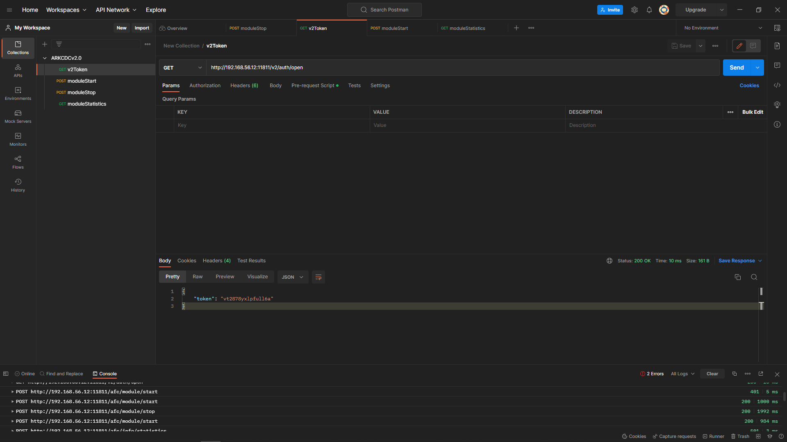

# Ark for CDC Network API v2.0.0

<aside>
📌 이 문서는 Ark for CDC 2.0.0 버전을 기준으로 작성됨

</aside>

<aside>
📖 **목차**

</aside>

# Auth

- 인증 관련 API

### `GET` /v2/auth/open

- [x]  실습



agent 인증 메시지 (Basic)

- Header Format
    - Authorization: Basic BASE64({TIMESTAMP}:{DK})
    - {TIMESTAMP} - Epoch 시간
    - {DK} - PBKDF2WithHmacSHA256({PASSWORD}, SALT={TIMESTAMP}, iterations=1024)
    - {PASSWORD} - agent password

# Command

- Command 관련 API

### `POST` /afc/command/compare/tablehash

- [ ]  실습

```json
{
	"database": "<db name>",
	"schema_name": "<schema name>",
  "table_name": "<table name>",
  "option": 1, // ?
  "post_module_name": "<post name>"
}
```

### `POST` /afc/command/compare/total

- [ ]  실습

```json
{
	"database": "<db name>",
	"target_database": "<target db name>",
	"schema_name": "<schema name>",
  "table_name": "<table name>",
	"ip": "<ip address>",
  "post_module_name": "<post name>",
	"acdsn": {
    "high": "0",
    "wrap": "0",
    "base": "1234"
  }
}
```

### `POST` /afc/command/compare/rowhash

- [ ]  실습

```json
{
	"database": "<db name>",
	"schema_name": "<schema name>",
  "table_name": "<table name>",
  "option": 1, // ?
  "post_module_name": "<post name>"
}
```

### `POST`  /afc/command/compare/rowcompareanalysis

- [ ]  실습

```json
{
	"source_hash_file": "<extract name>",
	"target_hash_file": "<post name>"
}
```

### `GET` /afc/command/getfile

- [ ]  실습

`source_path`: *경로

### `POST` /afc/command/recvfile

- [ ]  실습

```json
{
	"source_path": "<file path>",
	"dest_path": "<file path>",
	"ip": "<ip address>",
  "port": <port number>
}
```

### `POST` /afc/command/tablescan

- [ ]  실습

```json
{
  "database": "default",
  "schema_name": "cdctest",
  "table_name": "test_table",
  "column_setting": {
    "key": [
      "ID"
    ],
    "hash": [
      "NAME",
      "ADDRESS"
    ],
    "exclude": [
      "ZIPCODE"
    ]
  },
  "condition": {
    "partition": "ID > 1000 AND ID <= 2000"
  }
}
```

### `POST` /afc/command/getrowdata

- [ ]  실습

```json
{
  "database": "<db name>",
  "schema_name": "<schema name>",
  "table_name": "<table name>",
  "keys": [
    {
      "column_name": "<column name>",
      "value": "<value>"
    },
    {
      "column_name": "<column name>",
      "value": "<value>"
    }
  ]
}
```

# Config

- 설정 관련 API

### `POST` /afc/config

- [ ]  실습

### `GET` /afc/config

- [ ]  실습

### `DELETE` /afc/config

- [ ]  실습

### `POST` /afc/config/text

- [ ]  실습

### `GET` /afc/config/list

- [ ]  실습

# Conn

- DB 연결 파일 관련 API

### `GET` /afc/conn/list

- [ ]  실습

### `GET` /afc/conn

- [ ]  실습

# Info

- Process / DB / Tracing 정보 제공 API

### `GET` /afc/info/peer

- [x]  실습


파라미터 없음

### `GET` /afc/info/modules

- [x]  실습


파라미터 없음

### `GET` /afc/info/df

- [x]  실습


`type`: `[extract | send | post]`

`name`: 설정 파일 이름

### `GET` /afc/info/statistics

- [x]  실습


`type`: * 모듈 타입 `[extract | send | post]`

`name`: * 모듈 이름

### `GET` /afc/info/tracingfile/list

- [x]  실습


`alias`: * 모듈 이름

`path`: Tracing 파일 경로

### `GET` /afc/info/schemas

- [x]  실습


`extract_module_name`: *extract 모듈 이름

### `GET` /afc/info/tables

- [x]  실습


`extract_module_name`: *extract 모듈 이름

`schema_name`: *스키마 이름

### `GET` /afc/info/db

- [x]  실습


`database`: DB 이름

### `GET` /afc/info/db/schemas

추출이 불가능한 schema는 제외

- [x]  실습


`database`: db conn 이름

### `GET` /afc/info/db/tables

추출 불가능한 table 제외

- [x]  실습


`database`: db conn 이름

`schema_name`: *schema 이름

### `GET` /afc/info/db/sequences

- [x]  실습


`database`: db conn 이름

`schema_name`: *schema 이름

### `GET` /afc/info/precheck

- [x]  실습


`extract_module_name`: *extract 모듈 이름

### `GET` /afc/info/db/table

특정 Table의 column 리스트 출력

- [ ]  실습


`database`: DB conn 이름

`schema_name`: *Schema 이름

`table_name`: *Table 이름

# Job

- 작업 관련 API

### `GET` /afc/job/status

- [ ]  실습

### `POST` /afc/job/stop

- [ ]  실습

# Log

- Log 관련 API

## `GET` /afc/log/logstring

- [ ]  실습

# Map

- map 파일 관련 API

### `POST` /afc/map

- [ ]  실습

### `GET` /afc/map

- [ ]  실습

### `DELETE` /afc/map

- [ ]  실습

### `GET` /afc/map/list

- [ ]  실습

# Module

- Ark for CDC 모듈 관련 API

### `POST` /afc/module/start

- [x]  실습


```json
{
	"tpye": "*[extract | send | post]",
	"name": "*<alias>",
	"options": [
		{
			"option": "<option>",
			"value": "<value>"
		}
	]
}
```

### `POST` /afc/module/stop

- [x]  실습


```json
{
	"tpye": "*[extract | send | post]",
	"name": "*<alias>",
	"options": [
		{
			"option": "<option>",
			"value": "<value>"
		}
	]
}
```

### `GET` /afc/module/state

- [x]  실습

`tpye`: * 모듈 type 

`name`: * 모듈 이름

`data`:  데이터 포함 여부 `[none | include]`


### `POST` /afc/module/delete

- [ ]  실습

```json
{
	"tpye": "*[extract | send | post]",
	"name": "*<alias>",
	"reset_option": "[y | n]"
}
```

# Supplog

- Oracle Supplemental Logging 관련 API

### `GET` /afc/supplog/info

- [ ]  실습

### `POST` /afc/supplog/add

- [ ]  실습

### `POST` /afc/supplog/drop

- [ ]  실습

### `POST` /afc/supplog/set

- [ ]  실습

# Transfer

- 전송 관련 모듈 API

### `POST` /afc/transfer/tracingrecord

request body option

1. `tracingfile_dest`를 입력하면 입력한 위치에 tracing file 저장
(상대 경로인 경우 `$ARKCDC_HOME` 아래)
2. securitu를 `ssl`로 입력 시 구간 암호화
    - `ssl`로 입력시 `ssl_key` 추가
- [x]  실습


```json
{
	"alias": "<alias>",
	"tracingfile_dest": "<path>",
	"security": "[plain | ssl]",
	"ssl_key": "<ssl key>"
}
```

[Swagger UI](https://lab.idatabank.com/swagger/arkcdc20.html#/)