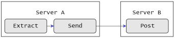

# Ark for CDC

- 
  
    [Spec Document](./Ark for CDC/Spec%20Document%20ce3e7c665208468bbecbbff07c6c66d8.md)
    
    [여러 DB로 설치해보기](./Ark for CDC/%E1%84%8B%E1%85%A7%E1%84%85%E1%85%A5%20DB%E1%84%85%E1%85%A9%20%E1%84%89%E1%85%A5%E1%86%AF%E1%84%8E%E1%85%B5%E1%84%92%E1%85%A2%E1%84%87%E1%85%A9%E1%84%80%E1%85%B5%209c8a6d6bb6c14ca78f8a01a6c75f5743.md)
    

---

- 이기종 DB 간 혼재된 데이터를 실시간으로 통합 및 이전이 가능한 Change Data Capture 솔루션

# Ark For CDC 주 기능

- 실시간 데이터 복제
- 다양한 OS와 DB 지원
- 서비스 중단 없는 데이터 이전
- 커밋된 트랜잭션만을 복제함으로써 데이터 일관성 보장 및 전송 데이터 최소화
- 쉬운 구성 및 설정
- 실시간 모니터링 및 관리
- Business Continuity Planning을 수립하고 High Availability 환경을 구현할 수 있음

# Ark For CDC 활용 방안

- 데이터 마이그레이션
- 실시간 복제
- 데이터 통합
- 분산 처리
- 부하 분산

### 구성 예시



일반적인 구성


변형 구성 1


변형 구성 2

# Ark For CDC 아키텍처

- Source Database의 변경 로그로부터 데이터를 추출해 Target Server로 전송하고 Target Database에 변경 데이터를 적용


Ark For CDC의 기본 Architecture - forceloggging 필수 아님

## 구성 요소

- Tracing File
    - Source Database의 변경 로그로부터 추출된 데이터가 저장되는 파일
    - Extract 모듈이 Tracing File을 생성해 Send 모듈이 전달하면 Recv 모듈이 수신해 Post 모듈이 Target Database에 적용하는 역할 수행
- Extract 모듈
    - Source Database의 변경 로그를 읽어 원하는 오브젝트의 데이터를 추출하는 모듈
    - 두가지 방식으로 동작
        1. 초기 데이터 추출: 복제 대상의 테이블에서 수행 시점의 테이블 구조 및 데이터를 추출
        2. 동기화를 위한 데이터 추출: 데이터 동기화를 유지하기 위해 실시간 변경 데이터 추출
- Send 모듈
    - Tracing File을 네트워크를 통해 Target Server로 전송하는 모듈
    - 전송 중 네트워크 장애로 연결이 끊길 경우 네트워크 복구가 완료된 후 전송 작업을 수행
- Recv 모듈
    - Tracing File을 수신하고 저장하는 모듈
    - Target Agent로부터 할당 받은 수신용 포트를 통해 Tracing File을 수신
- Post 모듈
    - Tracing File을 읽어 Target Database에 적용하는 모듈
    - 설정 정보를 참조해 매핑 기능을 지원

## 데이터 검증(Compare)

- Compare는 Source Database와 Target Database의 오브젝트 간 데이터 동기화를 검증하는 기능
- 테이블 오브젝트 단위로 데이터의 건수와 테이블 및 레코드 별 해시 값을 비교

## 데이터 보정(Repair)

- Repair는 데이터 검증(Compare)을 수행한 후 Source Database와 Target Database의 오브젝트 간 데이터 동기화가 맞지 않을 경우 데이터 보정을 위한 SQL문을 생성해주는 기능
- 데이터 검증(Compare) 수행 결과 파일을 참조해 Target Database에 적용할 SQL문 생성

# Ark For CDC 제약 사항

## 지원 플랫폼

- AIX 6.1(ppc64), AIX 7.1(ppc64), AIX 7.2(ppc64)
- HPUX 11.31(ia64)
- Solaris 10(sparc-64), Solaris 11(sparc-64)
- Red Hat Linux 6(x86-64), Red Hat Linux 7(x86-64), Red Hat Linux 8(x86-64)

## Source Database

- Oracle 11g Release 2 버전 이상

## Oracle 지원 에디션

- Standard Edition(SE)
- Oracle EnterPrise Edition(EE)

## Oracle 지원 옵션

- RAC
- ASM
- Multitenant

## Target Database

- Oracle 11g Release 2 버전 이상
- MySQL 5.7 버전 이상
- MariaDB 10.4
- Cubrid 9.3 버전 이상
- PostgreSQL 11 버전 이상
- EDB Postgres Advanced Server
- Tibero 6

# 지원 DML 및 DDL

### DML - 구문 지원

- Insert
- Update
- Delete
- Direct Insert
- Parallel Insert

### DML - 구문 미지원

- Supplemental logging이 설정되지 않은 테이블에 대한 Update/Delete(INSERT의 경우에도 보장하지 않음)
- PK Column Update

### DML - 구조 지원

- Regular Table
- Partitioning Table
    - Range Partitioning
    - Hash Partitioning
    - Interval Partitioning
    - Composite Partitioning
    - Reference Partitioning
    - List Partitioning
- Index Clustered Table
- Sequence Value
- Virtual Column이 포함된 Table(Partitioning Table 포함)
- Encrypted Data(TDE)

### DML - 구조 미지원

- Compressed Data
- No-Logging Data
- Hash Clustered Table
- Sorted HAsh Clustered Table
- External Table
- Nested Table
- Index-Organized Table
- System Partitioning Table
- Object Table
- Invisible Column
- Identity Column

### DDL 지원

- CREATE
    - CREATE TABLE
    - CREATE CLUSTER
    - CREATE INDEX
    - CREATE VIEW
    - CREATE MATERIALIZED VIEW
    - CREATE SEQUENCE
    - CREATE PROCEDURE
    - CREATE FUNCTION
    - CREATE PACKAGE
    - CREATE TABLE AS SELECT
- ALTER
    - ALTER TABLE
    - ALTER INDEX
    - ALTER MATERIALIZED VIEW
    - ALTER SEQUENCE
    - ALTER PROCEDURE
    - ALTER FUNCTION
    - ALTER PACKAGE
- DROP
    - DROP TABLE
    - DROP CLUSTER
    - DROP INDEX
    - DROP VIEW
    - DROP MATERIALIZED VIEW
    - DROP SEQUENCE
    - DROP PROCEDURE
    - DROP FUNCTION
    - DROP PACKAGE
- GRANT/REVOKE
    - GRANT OBJECT
    - GRANT ROLE
    - REVOKE OBJECT
    - REVOKE ROLE
- RENAME
    - RENAME TABLE
- TRUNCATE
    - TRUNCATE TABLE

### DDL 미지원

- Oracle DBMS 이외 DBMS를 타겟으로 하는 DDL
- SYS 관련 계정이 생성하거나, 소유한 OBJECT를 대상으로 하는 DDL
- ALTER
    - ALTER TABLE MOVE
    - ALTER TABLE SHRINK
    - ALTER TABLE MODIFY DEFAULT
    - ALTER TABLE MODIFY PARTITION
    - ALTER TABLE MODIFY SUBPARTITION
    - ALTER TABLE MODIFY SUBPARTITION
    - ALTER TABLE MODIFY OPAQUE
    - ALTER INDEX REBUILD
    - ALTER INDEX SHRINK
- GRANT/REVOKE
    - GRANT System privilege
    - REVOKE System privilege

### 지원 데이터 타입

### Numeric

- NUMBER(p, s)
- NUMBER(p, 0)
- DECIMAL
- BINARY_FLOAT
- BINARYDOUBLE
- FLOAT

### Character

- CHAR
- VARCHAR
- VARCHAR2
- LONG
- NCHAR
- NVARCHAR2

### Date & Timestamp

- DATE
- TIMESTAMP
- TIMESTAMP WITH TIME ZONE
- TIMESTAMP WITH LOCAL TIME ZONE
- INTERVAL YEAR TO MONTH
- INTERVAL DAY YO SECOND
- DATEINTERVAL DAY TO SECOND

### Binary

- RAW
- LONG RAW

### Large Object

- CLOB
- NCLOB
- BLOB
- BFILE
- CFILE
- SECUREFILE

### XML Object

- XML

### Spatial

- SDO_GEOMETRY

### User Defined or Abstract Types

- ROWID
- UROWID

### 미지원 데이터 타입

- EXTENDED VARCHAR2
- EXTENDED NVARCHAR2
- EXTENDED RAW
- ANYDATA
- ANYTYPE
- ANYDATASET
- SDO_GEORASTER
- SDO_TOPO_GEOMETRY
- ORDDICOM

### 지원 캐릭터셋

- AL16UTF16
- AL32UTF8
- UTF8
- ISO2022KR
- KO16KSC5601
- KO16MSWIN949
- US7ASCII
- WE8ISO8859P1

위 명시되지 않은 케릭터셋의 경우 지원하지 않음

# Ark For CDC Agent 설치

## 하드웨어 요구 사항

- CPU: 3GHz 이상 프로세서
- Memory: 4GB 또는 그 이삭
- Disk space
    - Program: 200MB
    - Log File: 최소 400MB(설정에 따라 변동)
    - Tracing File 저장 공간은 별도 필요

## 소프트웨어 요구 사항

- GNUTLS (LINUX 6/7)(DB 설치 시 요구되는 패키지 외에 추가적으로 필요)

## Agent 설치

1. 데이터베이스 설치 유저로 접속
   
    ```bash
    su - ora19c
    ```
    
2. 설치 파일 압축 해제
   
    ```bash
    tar xvf ARKCDC_2000_~.tar
    ```
    
3. Ark For CDC용 환경 변수 설정
    - Linux / SOLARIS
    
    ```bash
    vi ~/.bash_profile
    
    .../home/mariadb/app/ARKCDC
    # ArkCDC PATH & LIBRARY PATH Environment Variables #
    export ARKCDC_NAME=<DATABASE NAME> # SID
    export ARKCDC_HOME=<ARK for CDC > # ARKCDC 위치
    export PATH=$ARKCDC_HOME/bin:$PATH
    export LD_LIBRARY_PATH=$ARKCDC_HOME/lib:$LD_LIBRARY_PATH
    ```
    
    - RAC/ASM 환경 추가 설정
    
    ```bash
    export GRID_SID=<ASM Instance SID>
    export GRID_HOME=<Grid Infrastructure >
    
    # ex)
    export GRID_SID=+ASM1
    export GRID_HOME=/data/grid/product/12.2.0/grid
    ```
    
4. 라이센스 파일 입력
   
    ```bash
    cp arklicense_xxx.xml $ARKCDC_HOME/conf/arklicense.xml # 파일 이동 / 복사
    ```
    

## `$ARKCDC_HOME` 하위 디렉터리 구조

- `$ARKCDC_HOME`
    - `bin`: 실행 파일이 저장된 디렉터리
    - `cache`: CACHE_FILE_DEST 미설정시 캐시 파일이 저장되는 기본 디렉터리
    - `checkpoint`: 추출/전송/적용 시점 기록 파일이 저장되는 디렉터리
    - `conf`: 설정 파일을 포함하고 있는 디렉터리
        - `conn`: Database Connection 파일을 포함하고 있는 디렉터리
        - `extract`:  Extract 모듈의 설정 파일을 포함하고 있는 디렉터리
        - `send`: Send 모듈의 설정 파일을 포함하고 있는 디렉터리
        - `post`: Post 모듈의 설정 파일을 포함하고 있는 디렉터리
        - `mapper`: 매핑 설정 파일을 포함하고 있는 디렉터리
    - `data`: 데이터 검증의 결과 파일이 저장되는 디렉터리
    - `dump`: 코어 파일이 저장되는 디렉터리
    - `lib`: 라이브러리 파일을 포함하고 있는 디렉터리
        - `include`: 라이브러리 헤더 파일을 포함하고 있는 디렉터리
    - `locale`: 다국어 지원 파일을 포함하고 있는 디렉터리
    - `logs`: Agent 및 모듈의 로그 파일이 저장되는 디렉터리
        - `extract`: Extract 모듈의 로그 파일이 저장되는 디렉터리
        - `send`: Send 모듈의 로그 파일이 저장되는 디렉터리
        - `recv`: Recv 모듈의 로그 파일이 저장되는 디렉터리
        - `post`: Post 모듈의 로그 파일이 저장되는 디렉터리
    - `proc`: 프로세스 정보 파일이 저장되는 디렉터리
    - `script`: Ark For CDC 사용에 필요한 스크립트를 포함하고 있는 디렉터리
        - `pre_flight`: 사전 체크 스크립트를 포함하고 있는 디렉터리
        - `extract_setup`: 추출 관련 Setup 스크립트를 포함하고 있는 디렉터리
        - `supplog_setup`: Supplemental logging 관련 스크립트를 포함하고 있는 디렉터리
    - `stats`: 각 모듈의 통계 정보 파일이 저장되는 디렉터리
    - `trace`: 복제한 데이터가 기록된 Tracing File이 저장되는 디렉터리

# Source Database 사전 절차

## Archive Log Mode 설정

- Source Database의 Archive Log Mode 설정 여부를 확인

```bash
sqlplus / as sysdba
```

```sql
ARCHIVE LOG LIST
```

- 조회 결과의 Database Log Mode 값이 `No Archived Mode`일 경우 `Archive log mode` 설정

```sql
SHUTDOWN IMMEDIATE;
STARTUP MOUNT;
ALTER DATABASE ARCHIVELOG;
ALTER DATABASE OPEN;
```

## Character Set 확인

- Source Database의 캐릭터셋 확인

```sql
SELECT * FROM NLS_DATABASE_PARAMETERS WHERE PARAMETER LIKE '%CHARACTERSET';
```

- 지원 가능 캐릭터셋
    - AL16UTF16
    - AL32UTF8
    - ISO2022KR
    - KO16KSC5601
    - KO16MSWIN949
    - US7ASCII
    - WE8ISO8859P1

## Database Level Minimal Supplemental Logging 설정

- Source Database의 Minimal Supplemental Logging 활성화 여부 확인

```sql
SELECT SUPPLEMENTAL_LOG_DATA_MIN "MIN" FROM V$DATABASE;
```

- 조회 결과가 `NO`일 경우 Minimal Supplemental Logging을 활성화

```sql
ALTER DATABASE ADD SUPPLEMENTAL LOG DATA;

SELECT SUPPLEMENTAL_LOG_DATA_MIN "MIN" FROM V$DATABASE;
```

- Oracle Multitenant 환경의 경우 추가적으로 Pluggable Database의 Minimal Supplemental Logging 활성화

```sql
ALTER PLUGGABLE DATABASE ADD SUPPLEMENTAL LOG DATA;
```

## SYS.SEQ$ 테이블 Supplemental Logging 설정

- Sequence Value 복제를 위해 SYS.SEQ$ 테이블에 Supplemental Logging을 설정

```sql
ALTER TABLE SYS.SEQ$ ADD SUPPLEMENTAL LOG DATA (PRIMARY KEY) COLUMNS;

SELECT * FROM DBA_LOG_GROUPS WHERE OWNER='SYS' AND TABLE_NAME='SEQ$';
```

## Mangement 유저 생성

- Source Database의 데이터 추출을 위해 dba 권한을 가진 Mangement 유저를 생성

```sql
CREATE USER ARKMGR IDENTIFIED BY ARKMGR;

GRANT CONNECT, RESOURCE, DBA TO ARKMGR;
```

- Management 유저에 dba 권한을 부여할 수 없는 경우 필요한 권한들을 부여

```sql
GRANT CONNECT, RESOURCE TO ARKMGR;
GRANT SELECT ON NLS_SESSION_PARAMETERS TO ARKMGR;
GRANT SELECT ON DBA_PART_TABLES TO ARKMGR;
GRANT SELECT ON DBA_CONSTRAINTS TO ARKMGR;
GRANT SELECT ON DBA_CONS_COLUMNS TO ARKMGR;
GRANT SELECT ON DBA_MVIEWS TO ARKMGR;
GRANT SELECT ON DBA_USERS TO ARKMGR;
GRANT SELECT ON DBA_TABLES TO ARKMGR;
GRANT SELECT ON DBA_TAB_PRIVS TO ARKMGR;
GRANT SELECT ON DBA_SEQUENCES TO ARKMGR;
GRANT SELECT ON ALL_OBJECTS TO ARKMGR;
GRANT SELECT ON ALL_INDEXES TO ARKMGR;
GRANT SELECT ON ALL_IND_COLUMNS TO ARKMGR;
GRANT SELECT ON TABPART$ TO ARKMGR;
GRANT SELECT ON V_$TRANSACTION TO ARKMGR;
GRANT SELECT ON V_$SESSION TO ARKMGR;
GRANT SELECT ON V_$DATABASE TO ARKMGR;
GRANT SELECT ON V_$DATABASE_INCARNATION TO ARKMGR;
GRANT SELECT ON V_$INSTANCE TO ARKMGR;
GRANT SELECT ON V_$PARAMETER TO ARKMGR;
GRANT SELECT ON V_$ENCRYPTION_WALLET TO ARKMGR;
GRANT SELECT ON V_$ENCRYPTED_TABLESPACES TO ARKMGR;
GRANT SELECT ON V_$LOG TO ARKMGR;
GRANT SELECT ON V_$LOGFILE TO ARKMGR;
GRANT SELECT ON V_$ARCHIVED_LOG TO ARKMGR;
GRANT SELECT ON V_$VERSION TO ARKMGR;
GRANT SELECT ON V_$LOG_HISTORY TO ARKMGR;
GRANT SELECT ON V_$THREAD TO ARKMGR;
GRANT SELECT ON GV_$THREAD TO ARKMGR;
GRANT SELECT ON SYS.OBJ$ TO ARKMGR;
GRANT SELECT ON SYS.USER$ TO ARKMGR;
GRANT SELECT ON SYS.COL$ TO ARKMGR;
GRANT SELECT ON SYS.CCOL$ TO ARKMGR;
GRANT SELECT ON SYS.CDEF$ TO ARKMGR;
GRANT SELECT ON SYS.CON$ TO ARKMGR;
GRANT SELECT ON SYS.SUM$ TO ARKMGR;
GRANT SELECT ON SYS.TAB$ TO ARKMGR;
GRANT SELECT ON SYS.IND$ TO ARKMGR;
GRANT SELECT ON SYS.CLU$ TO ARKMGR;
GRANT SELECT ON SYS.ENC$ TO ARKMGR;
GRANT SELECT ON SYS.SEQ$ TO ARKMGR;
GRANT SELECT ON SYS.ATTRCOL$ TO ARKMGR;
GRANT SELECT ON SYS.PROPS$ TO ARKMGR;
GRANT SELECT ANY TABLE TO ARKMGR;
GRANT ALTER ANY TABLE TO ARKMGR;
GRANT FLASHBACK ANY TABLE TO ARKMGR;
GRANT SELECT ON V_$CONTAINERS TO ARKMGR; # 12c Multitenant
```

## Extract Setup Script 설치

- 데이터 추출에 필요한 테이블 및 트리거 생성을 위해 Extract Setup Script를 실행

```bash
cd $ARKCDC_HOME/scripts/extract_setup

sqlplus / as sysdba
```

```sql
 @arkcdc_extract_setup.sql

#ARK MGR name : ARKMGR
```

- Oracle Multitenant 환경의 경우$ARKCDC_HOME/scripts/extract_setup/Oracle_Multitenant/arkcdc_extract_setup.sql 스크립트 수행

## Supplemental Logging Script 설치

- Table Level Supplemental Logging 설정과 관련된 Supplemental Logging Script를 설치

```bash
cd $ARKCDC_HOME/scripts/supplog_setup

sqlplus / as sysdba
```

```sql
@arkcdc_supplog_setup.sql

#ARK MGR name : ARKMGR
```

## Table Level Supplemental Logging 설정

- Management 유저로 접속해 Table Level Supplemental Logging을 설정할 스키마 등록
- 스키마 등록 이후 해당 스키마에 신규 테이블이 추가될 때 자동으로 Supplemental Logging 설정

```bash
sqlplus ARKMGR
```

```sql
# Supplemental Logging
SELECT ARKCDC_LOGGING.ADDSUPPLEMENTAL('<SCHEMA>') FROM DUAL; #SCHEMA: ARKMGR

# Supplemental Logging
SELECT ARKCDC_LOGGING.ADDSUPPTABLE('<SCHEMA>', '<TABLE>') FROM DUAL;
```

- Supplemental Logging 설정 시 발생할 수 있는 에러 코드

| 0 | Finished to supplemental log group in shema table. |
| --- | --- |
| -1 | No schema in database. |
| -2 | No schema in Auto supplemental logging table. |
| -3 | Auto flag is false. |
| -4 | No table exists in database. |
| -5 | Unknown error. |
- 해당 테이블에 Lock이 걸린 경우 Supplemental Logging 설정이 실패하므로 Active Transaction을 정리한 후 다시 시도해야 함

### Supplemental Logging 설정 조회

```sql
# Supplemental Logging이 설정된 스키마 정보 확인
SELECT * FROM ARK_SCHEMA_SUP;

# Supplemental Logging이 설정된 테이블과 컬럼 정보 확인
SELECT * FROM ARK_SUPP_TABLES;
```

### Supplemental Logging 해제

```sql
# 자동 Supplemental Logging 설정 해제
SELECT ARKCDC_LOGGING.UNSETSUPPLEMENTAL('<SCHEMA>') FROM DUAL;

# Schema 단위 Table Level Supplemental Logging 해제
SELECT ARKCDC_LOGGING.DROPSUPPLEMENTAL('<SCHEMA>') FROM DUAL;

# Table 단위 Table Level Supplemental Logging 해제
SELECT ARKCDC_LOGGING.DROPSUPPTABLE('<SCHEMA>', '<TABLE>') FROM DUAL;
```

# Target Database 사전 절차

- Target Database가 Oracle이 아닌 타 Database인 경우 DDL 복제를 지원하지 않음

## 조건부 추출 상세

- 특정 데이터타입의 경우 Redo에서 직접 데이터를 추출하는 방식이 아닌 Commit 시점에 전체 데이터를 SELECT 쿼리로 추출하는 방식을 사용
- 추출 시점과 Commit 시점의 차이에 따라 실제 DB에 해당 타입 데이터가 존재하지 않는 경우 빈 레코드가 추출됨
    - Large Object Data Types
        - `CLOB`
        - `NCLOB`
        - `BLOB`
    - Character Data Types
        - `LONG`
    - Binary Data Types
        - `LONG RAW`
    - Date and Timestamp Data Types
        - `TIMEZONE`
        - `TIMESTAMP WITH TIMEZONE`
        - `TIMESTAMP WITH LOCAL TIMEZONE`

## ORACLE

- Management 유저 생성

```sql
CREATE USER ARKMGR IDENTIFIED BY ARKMGR;

GRANT CONNECT, RESOURCE, DBA TO ARKMGR;
```

- Oracle 12c 이상일 경우 Management 유저에 SELECT 권한이 추가적으로 필요

```sql
GRANT SELECT ON SYS.OBJ$ TO ARKMGR;
GRANT SELECT ON SYS.TAB$ TO ARKMGR;
GRANT SELECT ON SYS.COL$ TO ARKMGR;
GRANT SELECT ON SYS.USER$ TO ARKMGR;
```

- Management 유저가 dba 권한을 가지지 못할 시 필요한 권한들을 부여

```sql
GRANT CONNECT, RESOURCE TO ARKMGR;
GRANT SELECT ON DBA_CONSTRAINTS TO ARKMGR;
GRANT SELECT ON DBA_CONS_COLUMNS TO ARKMGR;
GRANT SELECT ON DBA_SEQUENCES TO ARKMGR;
GRANT SELECT ON DBA_USERS TO ARKMGR;
GRANT SELECT ON DBA_TABLES TO ARKMGR;
GRANT SELECT ON ALL_INDEXES TO ARKMGR;
GRANT SELECT ON ALL_IND_COLUMNS TO ARKMGR;
GRANT SELECT ON V_$DATABASE TO ARKMGR;
GRANT SELECT ON SYS.OBJ$ TO ARKMGR;
GRANT SELECT ON SYS.TAB$ TO ARKMGR;
GRANT SELECT ON SYS.COL$ TO ARKMGR;
GRANT SELECT ON SYS.USER$ TO ARKMGR;
GRANT SELECT ANY TABLE TO ARKMGR;
GRANT SELECT ANY SEQUENCE TO ARKMGR;
GRANT INSERT ANY TABLE TO ARKMGR;
GRANT UPDATE ANY TABLE TO ARKMGR;
GRANT DELETE ANY TABLE TO ARKMGR;
GRANT CREATE ANY TABLE TO ARKMGR;
GRANT ALTER ANY TABLE TO ARKMGR;
GRANT DROP ANY TABLE TO ARKMGR;
GRANT CREATE ANY INDEX TO ARKMGR;
GRANT ALTER ANY INDEX TO ARKMGR;
GRANT DROP ANY INDEX TO ARKMGR;
GRANT CREATE ANY VIEW TO ARKMGR;
GRANT DROP ANY VIEW TO ARKMGR;
GRANT CREATE ANY SEQUENCE TO ARKMGR;
GRANT ALTER ANY SEQUENCE TO ARKMGR;
GRANT DROP ANY SEQUENCE TO ARKMGR;
GRANT CREATE ANY CLUSTER TO ARKMGR;
GRANT ALTER ANY CLUSTER TO ARKMGR;
GRANT DROP ANY CLUSTER TO ARKMGR;
GRANT CREATE ANY MATERIALIZED VIEW TO ARKMGR;
GRANT ALTER ANY MATERIALIZED VIEW TO ARKMGR;
GRANT DROP ANY MATERIALIZED VIEW TO ARKMGR;
```

## CUBRID

```sql
CREATE USER ARKMGR PASSWORD BY 'ARKMGR' GROUPS dba;
```

## MySQL / MariaDB

```sql
CREATE USER 'ARKMGR'@'<HOST>' IDENTIFIED BY '<password>';
GRANT ALL PRIVILEGES ON *.* TO 'ARKMGR'@'<HOST>' IDENTIFIED BY '<password>';
```

## PostgreSQL

```sql
CREATE USER 'ARKMGR'
GRANT ALL PRIVILEGES ON ALL TABLES IN SCHEMA <SCHEMA> TO ARKMGR;
```

## Tibero

```sql
CREATE USER ARKMGR IDENTIFIED BY ARKMGR;
GRANT CONNECT, RESOURCE, DBA TO ARKMGR;
```

- Management 유저가 dba 권한을  가지지 못할 시 필요한 권한 부여

```sql
GRANT CONNECT, RESOURCE TO ARKMGR;
GRANT SELECT ON DBA_CONS_COLUMNS TO ARKMGR;
GRANT SELECT ON DBA_CONSTRAINTS TO ARKMGR;
GRANT SELECT ON V$VERSION TO ARKMGR;
GRANT SELECT ANY TABLE TO ARKMGR;
GRANT INSERT ANY TABLE TO ARKMGR;
GRANT UPDATE ANY TABLE TO ARKMGR;
GRANT DELETE ANY TABLE TO ARKMGR;
```

# Ark For CDC Agent 설정

- 설정 파일들은 $ARKCDC_HOME/conf 디렉터리 하위에 저장
- Ark For CDC에 동작하는 프로세스들의 설정 정보를 담고 있는 파일 목록
  
    ### Source/Target 공통 설정
    
    - DB 접속 정보 파일(conn/<alias>conn)
      
        # Connection File 설정
        
        - DB 접속 정보를 담고 있는 파일
        - $ARKCDC_HOME/conf/conn 디렉터리에 존재
        - default.conn이 기본 참조 파일
        - <alias>.conn 파일을 추가로 작성해 사용 가능
        - `IP`/`PORT`/`DBNAME` 항목을 설정할 경우 Connection String을 조합해 네트워크를 통한 접속 시도
            - 해당 항목을 설정해 Post 모듈에 한해 원격 적용(Remote Post) 작업 수행 가능
            - 해당 항목을 성정하지 않을 경우 `localhost`/`기본PORT`/`ARKCDC_NAME`를 이용해 DB 접속
        - `PASSWORD` 항목의 경우 원문이 아닌 암호화된 패스워드를 입력
        
        | 항목 | 기본값 | 설명 |
        | --- | --- | --- |
        | IP | 127.0.0.1 | 접속할 DB Host 정보(IPv4) |
        | PORT | Oracle: 1521
        Tibero: 8629
        MySQL: 3306
        MariaDB: 3306
        PostgreSQL: 5432
        CUBRID: 33000 | 접속할 DB 접속 Port
        
        허용값: 1024~65535 |
        | DBNAME | - | DB 이름
        
        허용값: A-Z, a-z, 0-9, ‘_’, ‘.’
        최소 길이: 1Byte
        최대 길이: DB마다 다름
        Oracle: 521Bytes
        Tibero: 8Bytes
        MySQL: 63Bytes
        MariaDB: 63Bytes
        PostgreSQL: 63Bytes
        CUBRID: 17Bytes |
        | USERNAME | - 필수항목 | DB 접속 유저명(Ark For CDC Management 유저)
        
        허용값: 제한없음
        최소 길이: 1Byte
        최대 길이: 128Bytes |
        | PASSWORD | - 필수항목 | DB 접속 유저 비밀번호
        
        허용값: admgr getpwd 명령을 통해 암호화한 값 |
        
        ```bash
        # $ARKCDC_HOME/conf/conn/defualt.conn
        
        # Database connection info
        IP="192.168.56.10";
        PORT="3306";
        DBNAME="";
        USERNAME="ARKMGR";
        PASSWORD="TbBREv6XLZh92xLKJA9WdQ==";
        ```
        
        ## Oracle
        
        - 로컬 접속
          
            ```bash
            # $ARKCDC_HOME/conf/conn/defualt.conn
            # Database connection info
            IP="";
            PORT=""; # Default: 1521
            DBNAME=""; # Profile ARKCDC_NAME
            USERNAME="ARKMGR"; # ARKCDC Manager Username
            PASSWORD="K0nMO7Vs+qZ0IduI+OAk1A=="; # ARKCDC Manager User Password
            ```
            
        - 원격 접속
            - 원격 접속을 통해 Ark For SCD를 실행할 때 `IP`, `PORT`, `DBNAME`의 값 입력 필수
            - Oracle Client가 설치되어 있어야 함
            - Oracle Database Name 조회
            
            ```sql
            SHOW PARAMETER DB_NAME;
            ```
            
            ```bash
            # $ARKCDC_HOME/conf/conn/default.conn
            # Database connection info
            IP="192.168.56.101"; # DB IP
            PORT="1523"; # DB Port Number , Default Port
            DBNAME="orcl"; # DB Name
            USERNAME="arkmgr"; # ArkCDC Manager Username
            PASSWORD="K0nMO7Vs+qZ0IduI+OAk1A=="; # ArkCDC Manager User Password - 'admgr getpwd'
            ```
            
        
        ### Oracle Pluggable Database - On Premise
        
        - Pluggable Database Service Name을 확인
        
        ```bash
        lsnrctl status
        
        # 예시
        LSNRCTL for Linux: Version 19.0.0.0.0 - Production on 25-FEB-2021 04:26:45
        Copyright (c) 1991, 2020, Oracle. All rights reserved.
        Connecting to (ADDRESS=(PROTOCOL=tcp)(HOST=)(PORT=1521))
        STATUS of the LISTENER
        ------------------------
        Alias LISTENER
        Version TNSLSNR for Linux: Version 19.0.0.0.0 - Production
        Start Date 03-FEB-2022 00:29:12
        Uptime 22 days 3 hr. 57 min. 33 sec
        Trace Level off
        Security ON: Local OS Authentication
        SNMP OFF
        Listener Parameter File /u01/app/19.0.0.0/grid/network/admin/listener.ora
        Listener Log File /u01/app/grid/diag/tnslsnr/arktest/listener/alert/log.xml
        Listening Endpoints Summary...
         (DESCRIPTION=(ADDRESS=(PROTOCOL=ipc)(KEY=LISTENER)))
         (DESCRIPTION=(ADDRESS=(PROTOCOL=tcp)(HOST=192.168.56.100)(PORT=1521)))
        ...
        Service "ORA12bPDB" has 1 instance(s).
         Instance "ORA12bPDB", status READY, has 2 handler(s) for this service...
        ```
        
        ```bash
        # 예시
        
        # Database connection info
        IP="";
        PORT="";
        DBNAME="ora12bpdb";
        USERNAME="arkmgr";
        PASSWORD="K0nMO7Vs+qZ0IduI+OAk1A=="
        ```
        
        ### Oracle Pluggable Database - Cloud
        
        - Cloud 환경 Pluggable Database Service Name 조회
        
        ```bash
        lsnrctl status
        
        # 예시
        LSNRCTL for Linux: Version 19.0.0.0.0 - Production on 25-FEB-2021 04:26:45
        Copyright (c) 1991, 2020, Oracle. All rights reserved.
        Connecting to (ADDRESS=(PROTOCOL=tcp)(HOST=)(PORT=1521))
        STATUS of the LISTENER
        ------------------------
        Alias LISTENER
        Version TNSLSNR for Linux: Version 19.0.0.0.0 - Production
        Start Date 03-FEB-2022 00:29:12
        Uptime 22 days 3 hr. 57 min. 33 sec
        Trace Level off
        Security ON: Local OS Authentication
        SNMP OFF
        Listener Parameter File /u01/app/19.0.0.0/grid/network/admin/listener.ora
        Listener Log File /u01/app/grid/diag/tnslsnr/arktest/listener/alert/log.xml
        Listening Endpoints Summary...
         (DESCRIPTION=(ADDRESS=(PROTOCOL=ipc)(KEY=LISTENER)))
         (DESCRIPTION=(ADDRESS=(PROTOCOL=tcp)(HOST=10.0.0.11)(PORT=1521)))
        ...
        Service "arktest_pdb1.subnet01281008.vcn01281008.oraclevcn.com" has 1 instance(s).
         Instance "arktest", status READY, has 2 handler(s) for this service...
        ```
        
        ```bash
        # 예시
        
        # Database connection info
        IP="10.0.0.3"; # Cloud IP
        PORT="1521"; # Oracle Port number
        DBNAME="arktest_pdb1.subnet01281008.vcn01281008.oraclevcn.com"; # Oracle Network Service name
        USERNAME="arkmgr";
        PASSWORD="K0nMO7Vs+qZ0IduI+OAk1A==";
        ```
        
        ## PostgreSQL
        
        - 로컬 접속
          
            ```bash
            # $ARKCDC_HOME/conf/conn/default.conn
            # Database connection info
            IP=""; 
            PORT=""; # default : 5432
            DBNAME=""; # Profile ARKCDC_NAME , profile ARKCDC_NAME dbname
            USERNAME="arktest"; # ArkCDC Username
            PASSWORD="K0nMO7Vs+qZ0IduI+OAk1A=="; # ArkCDC User Password - 'admgr getpwd'
            ```
            
        - 원격 접속
            - 원격 접속을 통해 Ark For SCD를 실행할 때 `IP`, `PORT`, `DBNAME`의 값 입력 필수
            - PostgrSQL Client가 설치되어 있어야 함
            - Database Name 조회
            
            ```sql
            cdctest=> \l
            ```
            
            ```bash
            # $ARKCDC_HOME/conf/conn/default.conn
            # Database connection info
            IP="192.168.56.101"; #
            PORT="5432"; # default : 5432
            DBNAME="arktest"; # Profile ARKCDC_NAME , profile ARKCDC_NAME dbname
            USERNAME="arktest"; # ArkCDC Username
            PASSWORD="K0nMO7Vs+qZ0IduI+OAk1A=="; # ArkCDC User Password - 'admgr getpwd'
            ```
            
            ## MySQL / MariaDB
            
            - 로컬 접속
              
                ```bash
                # $ARKCDC_HOME/conf/conn/default.conn
                # Database connection info
                IP=""; 
                PORT=""; # default : 3306
                DBNAME=""; # Profile ARKCDC_NAME , profile ARKCDC_NAME dbname
                USERNAME="arktest"; # ArkCDC Username
                PASSWORD="K0nMO7Vs+qZ0IduI+OAk1A=="; # ArkCDC User Password - 'admgr getpwd'
                ```
                
            - 원격 접속
                - 원격 접속을 통해 Ark For SCD를 실행할 때 `IP`, `PORT`, `DBNAME`의 값 입력 필수
                - MySQL / MariaDB Client가 설치되어 있어야 함
                - Database Name 조회
                
                ```sql
                SELECT DATABASE();
                ```
                
                ```bash
                # $ARKCDC_HOME/conf/conn/default.conn
                # Database connection info
                IP="192.168.56.101"; #
                PORT="3306"; # default : 3306
                DBNAME="arktest"; # Profile ARKCDC_NAME , profile ARKCDC_NAME dbname
                USERNAME="arktest"; # ArkCDC Username
                PASSWORD="K0nMO7Vs+qZ0IduI+OAk1A=="; # ArkCDC User Password - 'admgr getpwd'
                ```
                
            
            ## CUBRID
            
            - 로컬 접속
              
                ```bash
                # $ARKCDC_HOME/conf/conn/default.conn
                # Database connection info
                IP=""; 
                PORT=""; # default : 33000
                DBNAME=""; # Profile ARKCDC_NAME , profile ARKCDC_NAME dbname
                USERNAME="arktest"; # ArkCDC Username
                PASSWORD="K0nMO7Vs+qZ0IduI+OAk1A=="; # ArkCDC User Password - 'admgr getpwd'
                ```
                
            - 원격 접속
                - 원격 접속을 통해 Ark For SCD를 실행할 때 `IP`, `PORT`, `DBNAME`의 값 입력 필수
                - CUBRID Client가 설치되어 있어야 함
                - Database Name 조회
                
                ```sql
                cubrid server status
                ```
                
                ```bash
                # $ARKCDC_HOME/conf/conn/default.conn
                # Database connection info
                IP="192.168.56.101"; #
                PORT="33000"; # default : 33000
                DBNAME="arktest"; # Profile ARKCDC_NAME , profile ARKCDC_NAME dbname
                USERNAME="arktest"; # ArkCDC Username
                PASSWORD="K0nMO7Vs+qZ0IduI+OAk1A=="; # ArkCDC User Password - 'admgr getpwd'
                ```
                
        
        ## Tibero
        
        - 로컬 접속
          
            ```bash
            # $ARKCDC_HOME/conf/conn/default.conn
            # Database connection info
            IP=""; 
            PORT=""; # default : 8629
            DBNAME=""; # Profile ARKCDC_NAME , profile ARKCDC_NAME dbname
            USERNAME="arktest"; # ArkCDC Username
            PASSWORD="K0nMO7Vs+qZ0IduI+OAk1A=="; # ArkCDC User Password - 'admgr getpwd'
            ```
            
        - 원격 접속
            - 원격 접속을 통해 Ark For SCD를 실행할 때 `IP`, `PORT`, `DBNAME`의 값 입력 필수
            - Tibero Client가 설치되어 있어야 함
            - Database Name 조회
            
            ```sql
            select name from v$database;
            ```
            
            ```bash
            # $ARKCDC_HOME/conf/conn/default.conn
            # Database connection info
            IP="192.168.56.101"; #
            PORT="8629"; # default : 8629
            DBNAME="arktest"; # Profile ARKCDC_NAME , profile ARKCDC_NAME dbname
            USERNAME="arktest"; # ArkCDC Username
            PASSWORD="K0nMO7Vs+qZ0IduI+OAk1A=="; # ArkCDC User Password - 'admgr getpwd'
            ```
        
    - 모듈 공유 설정 파일(global.conf)
      
        # Global Config File 설정
        
        - Ark For CDC Agent의 모든 프로세스들이 참조하는 공통적인 설정 정보를 담고 있음
        - $ARKCDC_HOME/conf 디렉터리에 존재
        - 개별 설정 파일에 값이 설정하지 않은 항목은 global.conf의 설정값 참조
        - 개별 설정 파일에 값이 설정된 항목 중 global.conf의 항목 값과 충돌될 시 개별이 우선
        
        | 파라미터 | 기본값 | 설명 |
        | --- | --- | --- |
        | DBCONN | default | 사용할 Connection file 지정 |
        | TRACINGFILE_DEST | trace | Tracing file 저장 디렉터리 지정 |
        | TRACINGFILE_SIZE | 50MB | 하나의 Tracing file 최대 크기 지정 |
        | AUTO_DELETE | NO | Tracing file 자동 삭제 여부
        YES | NO | Y | N |
        | LARGE_TRANSACTION_SIZE | 128MB | 대용량 트랜잭션으로 판단하여 추출 시 페이징 처리를 수행하는 트랜잭션의 기준 크기 지정 |
        | CACHE_FILE_DEST | cache | Large Transaction과 Long Transaction 추출에 사용되는 Cache file과 Persist file이 저장되는 경로 지정 |
        | CACHE_MAX_SIZE | 4GB | Cache file이 생성될 수 있는 최대 크기 지정 |
        | DISK_USAGE_CAPACITY | 95 | Extract, Recv 모듈이 사용 가능한 디스크 최대 사용률 설정 |
        | SQL_LOGGING_TYPE | NO | 데이터 적용 시 SQL 로깅 여부를 지정
        NO | ERROR | ALL |
        | LOG_LEVEL | INFO | 프로세스(모듈)의 로그 레벨 지정
        TRACE | DEBUG | INFO | WARN(WARNING) | ERROR | FATAL |
        | LOG_BACKUP | ALL | 로그 파일의 백업 정책 지정
        NONE | ONE | ALL |
        | SECURITY | PLAIN | Send-Recv 데이터 송수신간 데이터 암호화 여부 지정
        PLAIN | SSL → 암호화 방식 |
        
        ```bash
        # $ARKCDC_HOME/conf/global.conf
        # Database Connection ref
        DBCONN="";
        # for Tracing files
        TRACINGFILE_DEST="";
        TRACINGFILE_SIZE="";
        AUTO_DELETE="";
        # for Large transaction (Extract)
        LARGE_TRANSACTION_SIZE="";
        CACHE_FILE_DEST="";
        CACHE_MAX_SIZE="";
        # for disk usage
        DISK_USAGE_CAPACITY="";
        # for SQL Logging (Post)
        SQL_LOGGING_TYPE="";
        # for Logging
        LOG_LEVEL="";
        LOG_BACKUP="";
        # for Security
        SECURITY="";
        ```
        
    - Agent 설정 파일(agent.conf)
      
        # Agent.conf
        
        - Ark For CDC Agent의 설정 정보를 담고 있음
        - $ARKCDC_HOME/conf 디렉터리에 존재
        
        | 항목 | 기본값 | 설명 |
        | --- | --- | --- |
        | IP | - 필수 항목 | Agent 설치 서버의 IP 주소(IPv4) |
        | PORT | 11811 | Agent용 HTTP Listening Port 번호 |
        | PROTOCOL_TYPE | HTTP | Agent간 구간 암호화 여부 설정 |
        | RECV_PORTRANGE | - | Target Server에서 데이터를 수신할 때 사용할 Port 범위 설정 |
        | DATA_PORTRANGE | - | Ark For CDC GUI Manager에서 Row Compare를 수행할 때 Agent에 접근하기 위한 Port 범위 설정 |
        | LOG_LEVEL | global.conf LOG_LEVEL(INFO) | Agent와 Pmon 프로세스의 로그 레벨을 설정
        TRACE | DEBUG | INFO | WARN(WARNING) | ERROR | FATAL |
        | LOG_BACKUP | global.conf LOG_BACKUP(ALL) | 로그 파일의 백업 정책 지정
        NONE | ONE | ALL |
        | LOG_PATH | $ARKCDC_HOME/logs/ | 로그 파일의 경로 지정 |
        | SEND_EMAIL_ALERT | NO | 모듈 장애 발생 시 경고 이메일 발송 여부 지정
        YES | NO | Y | N |
        | EMAIL_SEND_ADDRESS | - | 경고 이메일 발송 시 발신자로 작성되는 메일 주소 |
        | EMAIL_RECV_ADDRESS | - | 경고 이메일 발송 시 수신자 메일 주소 |
        | SMTP_TYPE | SMTP | 이메일 전송 시 사용하는 SMTP 프로토콜 타입 지정
        SMTP | SMTPS |
        | SMTP_SERVER | - | 이메일 전송 시 사용하는 SMTP Server 주소 지정 |
        | SMTP_ID | - | SMTP 서버에 접속하는 ID |
        | SMTP_PASSWORD | - | STMP 서버에 접속하는 사용자 계정 비밀번호 |
        | MONITORING_RESET_TIME | 5M | 모듈 정상 작동 여부를 판단하는 시간
        [1~60]S | [1~60]M |
        | h_TIMEOUT_MODULE_RESPONSE | 35 | 모듈 인터페이스 응답 대기 최대 시간
        1S ~ 600S |
        | h_RESTART_ERROR_MODULE | NO | PMON 에러로 종료된 모듈 재시작 여부 설정
        yes | no | y | n |
        
        ```bash
        # $ARKCDC_HOME/conf/agent.conf
        # HTTP Listener Info
        IP="192.168.56.100";
        PORT="11811";
        PROTOCOL_TYPE="http";
        # for receiving tracing file
        RECV_PORTRANGE="11812:11815";
        # for sending compare data
        DATA_PORTRANGE="11816:11819";
        # for Logging
        LOG_LEVEL="trace";
        LOG_BACKUP="all";
        LOG_PATH="";
        # for email alert
        SEND_EMAIL_ALERT="yes";
        EMAIL_SEND_ADDRESS="jeongin.kim@iarkdata.com";
        EMAIL_RECV_ADDRESS="jeongin.kim@iarkdata.com";
        SMTP_TYPE="SMTPS";
        SMTP_SERVER="smtps.hiworks.com";
        SMTP_PORT="465";
        SMTP_ID="jeongin.kim@iarkdata.com";
        SMTP_PASSWORD="CepNXLOD5Tz8SYRBUfkx1Q==";
        ```
        
        ## 암호화 통신
        
        ### Agent 인증
        
        - Peer 간 통신에 사용자가 허가하지 않은 연결을 배제하기 위해 Agent 인증 기능을 제공
        - Agent 인증은 $ARKCDC_HOME/conf 디렉터리에 agent.pwd 파일을 통해 수행
        - Agent 인증 설정 예시
        
        ```bash
        admgr make --pwd
        Creates an agent password file. Please enter the following items:
        Password :
        *******
        Repeat password :
        *******
        Agent password file creation complete.
        ArkCDC Mgr Process Exit
        ```
        
        - 인증 비밀번호의 원문은 10글자 이내로 가능
        - Peer 간 통신을 위해 Source와 Target의 agent.pwd 파일 인증 패스워드는 동일해야 함
        
        ### Agent 간 통신 및 API 구간 암호화
        
        - Agent 간 통신 및 API 구간 암호화 설정 여부는 Agent Config 설정의 `PROTOCOL_TYPE` 항목의 값을 따름
        - `PROTOCOL_TYPE` 항목의 기본 값은 HTTP
        - 구간 암호화 설정을 원할 경우 HTTPS로 변경
        - HTTPS 설정 시 $ARKCDC_HOME/conf 디렉터리의 다음의 두 파일 필요
            1. cdc_server.key: Server Private Key
            2. cdc_server.pem: Server Private Key로 만든 인증서
        - 생성 방법
        
        ```bash
        openssl genrsa -out cdc_server.key 1024
        openssl req -days 365 -out cdc_server.pem -new -x509 -key cdc_server.key
        ```
        
        ### Send 모듈과 Recv 모듈간의 데이터 전송 구간 암호화
        
        - Send 모듈과 Recv 모듈간의 데이터 전송 구간 암호화 설정 여부는 Global Config 설정 혹은 Send 모듈 설정의 `SECURITY`항목 값에 따름
        - `SECURITY`의 기본 값은 ‘PLAIN’이며 구간 암호화 설정을 원할 시 해당 값을 ‘SSL’로 변경
            - Recv 프로세스가 구간 암호화 옵션으로 실행된 경우 암호화 key값을 파일로 저장
            - key file은 $ARKCDC_HOME/data 디렉터리에 위치
            - 파일 이름은 recv_alias.key 포맷을 따름
            - Recv 프로세스 종료 시 삭제
        - 연결된 Agent 간 `PROTOCOL_TYPE`옵션이 동일해야 함(동일하지 않을 경우 Send-Recv 연결 불가)
    
    ### Source Agent 설정
    
    - Extract 모듈 설정 파일(extract/<alias>.conf)
      
        # Extract 모듈 설정
        
        - $ARKCDC_HOME/conf/extract 디렉터리에 존재
        
        | 항목 | 기본값 | 설명 |
        | --- | --- | --- |
        | DBCONN | global.conf
        DBCONN | 데이터베이스에 접속하기 위한 Connection File 지정 |
        | TRACINGALLAS | - 필수 항목 | https://www.notion.so/2866db19b59f4fa286b49ff6f3ca2799를 위한 Tracing File Alias 설정 |
        | TABLE | - 필수 항목 | DML을 추출할 대상 테이블 지정 |
        | SEQUENCE | - | Sequence value를 추출할 대상 시퀀스 지정 |
        | DDL | - | DDL을 추출할 대상 오브젝트 지정 |
        | TRACINGFILE_DEST | global.conf
        TRACINGFILE_DEST | Tracing File 저장 경로 지정 |
        | TRACINGFILE_SIZE | global.conf
        TRACINGFILE_SIZE | 하나의 Tracing File 최대 크기 지정 |
        | MAP | - | 데이터 추출 시 사용할 Mapper file을 지정 |
        | FAILED_FETCH_LOB_TO_EMPTY | NO | LOB 데이터 Fetch에 실패한 경우 EMPTY로 추출할 지 여부를 지정 |
        | GET_TRUNCATE | YES | DDL 설정갑과 관계없이 TRUNCATE 별도 추출 |
        | WRITE_FLUSH_RECORD_COUNT | 1000 | Extract 모듈이 Tracing File에 한번에 기록할 레코드 수 설정 |
        | WRITE_FLUSH_BUFFER_SIZE | 64k | Extract 모듈이 Tracing File에 한번에 기록할 레코드 사이즈 설정 |
        | IN_MEMORY_SIZE | 2GB | Extract 모듈이 메모리에 올릴 데이터들의 최대 사이즈 지정 |
        | IN_MEMORY_TX_SIZE | 1GB | 메모리에 올릴 트랜잭션 데이터들의 최대 사이즈 지정 |
        | LARGE_TRANSACTION_SIZE | global.conf
        LAGE_TRANSACTION_SIZE | Lage 트랜잭션으로 판단하는 트랜잭션 하나의 기준 크기 지정 |
        | CACHE_FLIE_DEST | global.conf
        CACHE_FILE_EST | Large 트랜잭션과 Long 트랜잭션 추출에 사용되는 Cache File과 Persist File이 저장되는 경로 지정 |
        | CACHE_MAX_SIZE | global.conf
        CACHE_MAX_SIZE | Cache File이 생성될 수 있는 최대 크기 지정 |
        | CONVERT_LOB_CHAR | - | LOB 데이터를 대체하여 추출할 문자열 지정 |
        | LOB_TO_NULL | NO | LOB 데이터를 NULL로 추출할지 여부 지정 |
        | ARK_TDE_FILENAME | - | Oracle TDE 환경에서 Wallet File에 접근하는 것이 아닌 별도로 생성한 Master key 정보를 저장하는 파일을 사용하는 경우 Key File 경로 지정 |
        | EXCLUDE_DML_TYPE | NONE | 추출에서 제외할 DML 유형을 지정 |
        | EXCLUDE_TAG | 0 | 특정 hex값을 태그로 가지는 트랜잭션을 추출에서 제외 |
        | EXCLUDE_TRANSACTION_NAME | 0 | 특정 트랜잭션 명을 가지는 트랜잭션을 추출에서 제외 |
        | EXCLUDE_USER_NAME | - | 데이터베이스 사용자명을 통해 트랜잭션을 필터링 |
        | FAILED_CONVERT_TO_UTF8 | STOP | 추출 데이터를 UTF-8로 변환 실패 시 Extract 동작을 제어 |
        | ARCHIVE_ONLY | NO | Online Redo Log가 아닌 Archived Log에서만 데이터 추출 활성화 여부 지정 |
        | ARCHIVE_DEST | - | Archived Log가 저장된 경로 지정
        ARCHIVE_ONLY= “YES”인 경우 사용 |
        | DISK_USAGE_CAPACITY | 95 | Extract 모듈이 사용 가능한 디스크 최대 사용률 설정 |
        | CHECKPOINT_SECONDS | 10 | Checpoint 파일 갱신 간격 설정 |
        | TRANSACTION_CHECK_INTERVAL | 5S | Commit 된 트랜잭션 사이즈 체크 간격 |
        | LONG_TRANSACTION_CHECK_INTERVAL | 5M | Commit 되지 않은 Long 트랜잭션 체크 간격 |
        | LONG_TRANSACTION_TIMEOUT | 1H | Long 트랜잭션으로 판단하는 시간 기준 설정 |
        | PERSISTENCE_MODE | LOGSWITCH | Persist File을 작성하는 기준 설정 |
        | PERSISTENCE_INTERVAL | 6H | Persist File작성 간격 설정 |
        | INITIAL_COPY_THREADS | 4 | 초기 복제 시 사용할 Thread 개수 설정 |
        | INITIAL_COPY_SPLIT_TRANSACTION | 100000 | 초기 복제 트랜잭션의 최대 레코드 개수 설정 |
        | INITIAL_COPY_SPLIT_SIZE | LARGE_TRANSACTION_SIZE | 초기 복제 트랜잭션의 최대 크기 설정 |
        | INITIAL_COPY_PARALLELISM_DEGREE | 4 | 초기 복제 쿼리 수행 병렬도 설정 |
        | INITIAL_COPY_SCN_ASCENDING | on | 초기 복제 쿼리 scn_ascending 힌트 사용 여부 |
        | LOG_LEVEL | global.conf
        LOG_LEVEL | Extract Module의 로그 레벨 지정 |
        | LOG_BACKUP | global.conf
        LOG_BACKUP | 로그 파일의 백업 설정 지정 |
        | h_CHARSET_ENCODING | - | 캐릭터 셋 변환 |
        | h_XML_ALLOW_LOB_CONFIG | NO | xml 타입이 LOB 관련 config 설정 따를지 여부 |
        | h_INVALID_COLUMN_FETCH | NO | 추출이 올바르지 않을 경우(before 또는 after data가 없는 케이스) FETCH로 추출할 지 여부 |
        | h_INVALID_FETCH_FLASHBACK_SCN | 1 | Delete 추출이 올바르지 않을 경우(before data가 없는 케이스), FETCH로 추출할지 여부
        FETCH시 Commit SCN을 기준으로 FETCH하기에 DELETE문의 경우 Before Image가 존재하는 SCN까지 앞당길 필요가 있음 |
        | h_CHECK_NUM_MANTISSA | 40 | 숫자 데이터 타입 NUMBER의 MANTISSA 사이즈 설정 |
        | h_SKIP_OVER_NUM_MANTISSA | NO | NUMBER의 MANTISSA 사이즈 초과 시, Extract 동작 설정 |
        - Extract 모듈 설정 예시
        
        ```bash
        # Extract module config
        # Database Connection ref
        DBCONN="default";
        #### Writers group start ####
        TRACINGALIAS="ext01_1";
        # Extraction target (Duplication allowed)
        TABLE="TESTUSER.*";
        SEQUENCE="TESTUSER.*";
        DDL="INCLUDE TESTUSER.*;OBJTYPE=TABLE;OPERATION=ALL";
        # for Tracing files
        TRACINGFILE_DEST="trace";
        TRACINGFILE_SIZE="50MB";
        # for fetch LOB
        FAILED_FETCH_LOB_TO_EMPTY="";
        # for Mapping
        MAP="map01";
        # for truncate
        GET_TRUNCATE="yes";
        # for write count
        WRITE_FLUSH_RECORD_COUNT="";
        WRITE_FLUSH_BUFFER_SIZE="";
        #### Writers group end ####
        # for extract memory size
        IN_MEMORY_SIZE="";
        # for transaction cache (Extract)
        IN_MEMORY_TX_SIZE="";
        LARGE_TRANSACTION_SIZE="";
        CACHE_FILE_DEST="";
        CACHE_MAX_SIZE="";
        # for LOB
        CONVERT_LOB_TO_CHAR="";
        LOB_TO_NULL="";
        # for store Oracle Wallet info to file
        ARK_TDE_FILENAME="";
        # for active to active
        EXCLUDE_TAG="74657378";
        EXCLUDE_TRANSACTION_NAME="";
        EXCLUDE_USER_NAME="";
        # for convert data
        FAILED_CONVERT_TO_UTF8="";
        # exclude dml type
        EXCLUDE_DML_TYPE="";
        # Extraction log
        ARCHIVE_ONLY="";
        ARCHIVE_DEST="";
        DISK_USAGE_CAPACITY="";
        # for checkpoint file write
        CHECKPOINT_SECONDS="";
        # for commit transaction
        TRANSACTION_CHECK_INTERVAL="";
        # for long transaction
        LONG_TRANSACTION_CHECK_INTERVAL="";
        LONG_TRANSACTION_TIMEOUT="";
        # for persistence
        PERSISTENCE_MODE=""
        PERSISTENCE_INTERVAL=""
        # for initial copy
        INITIAL_COPY_THREADS="";
        INITIAL_COPY_SPLIT_TRANSACTION="";
        INITIAL_COPY_SPLIT_SIZE="";
        INITIAL_COPY_PARALLELISM_DEGREE="";
        INITIAL_COPY_SCN_ASCENDING="";
        # for Logging
        LOG_LEVEL="INFO";
        LOG_BACKUP="ALL";
        ```
        
        # Multi Write
        
        - 하나의 Extract 모듈로 다른 Alias를 가진 여러 Tracing File에 추출 데이터를 기록 가능
        - Multi-write를 구성하기 위해 Extract 모듈의 `TRACINGALIAS` config를 여러개 설정
            - `TRACINGALIAS` 설정 값 = Tracing 파일의 Alias가 됨
        - 하나의 Multi-write 세트는 다음 Extract  모듈 config들로 이뤄짐
            - `TRACINGALIAS`
                - `TABLE`
                - `SEQUENCE`
                - `DDL`
                - `TRACINGFILE_DEST`
                - `TRACINGFILE_SIZE`
                - `FAILED_FETCH_LOB_TO_EMPTY`
                - `MAP`
                - `GET_TRUNCATE`
                - `WRITE_RECORD_GROUP`
        - Multi-write 세트는 최대 5개까지 설정 가능
        - 각 세트별 설정은 다른 `TRACINGALIAS` 세트 설정에 영향을 받지 않음
        - Multi-write Extract 설정 예시
        
        ```bash
        TRACINGALIAS="ext01_1";
        TABLE = "CDCTEST.TEST1";
        SEQUENCE = "";
        DDL = "";
        TRACINGFILE_SIZE="";
        TRACINGFILE_DEST="";
        MAP="map1";
        FAILED_FETCH_LOB_TO_EMPTY=""
        GET_TRUNCATE="yes";
        WRITE_FLUSH_RECORD_COUNT="";
        WRITE_FLUSH_BUFFER_SIZE="";
        TRACINGALIAS="ext01_2";
        TABLE = "CDCTEST.TEST2";
        SEQUENCE = "";
        DDL = "include CDCTEST.TEST2";
        TRACINGFILE_SIZE="";
        TRACINGFILE_DEST="";
        MAP="";
        FAILED_FETCH_LOB_TO_EMPTY=""
        GET_TRUNCATE="no";
        WRITE_FLUSH_RECORD_COUNT="";
        WRITE_FLUSH_BUFFER_SIZE="";
        ```
        
    - Send 모듈 설정 파일(send/<alias>.conf)
      
        # Send 모듈 설정
        
        | 항목 | 기본 값 | 설명 |
        | --- | --- | --- |
        | TARGET_IP | - (필수 항목) | Tracing File을 전송할 Target Agent의 Host IP (IPv4) |
        | TARGET_PORT | - (필수 항목) | Target Agent의 HTTP 수신 포트 (Target Agent의 agent.conf PORT) |
        | SOURCE_TRACINGFILE | - (필수 항목) | 전송할 Tracing File의 Alias |
        | SOURCE_TRACINGFILE_DEST | global.conf
        TRACINGFILE_DEST | 전송할 Tracing File이 위치한 경로 지정 |
        | TARGET_TRACINGFILE | - (필수 항목) | 수신한 데이터를 저장할 Tracing File의 Alias |
        | TARGET_TRACINGFILE_DEST | global.conf
        TRACINGFILE_DEST | 수신한 데이터를 저장할 Tracing File의 경로 지정 |
        | TRANSMISSION_UNIT | 8M | 한번에 전송하는 데이터의 크기 지정 |
        | AUTO_DELETE | no | 전송 완료한 Tracing File을 자동으로 삭제할 지 여부 |
        | SECURITY | plain | Send-Recv 데이터 송수신 간 데이터 암호화 여부 |
        | DISK_USAGE_CAPACITY | 95 | Recv 모듈이 사용 가능한 최대 디스크 사용률 설절 |
        | LOG_LEVEL | global.conf
        LOG_LEVEL | Send 모듈의 로그 레벨 지정 |
        | LOG_BACKUP | global.conf
        LOG_BACKUP | 로그 파일의 백업 정책 지정 |
        | TRANSFER_TIMEOUT | 10S | Send-Recv 모듈 간 응답 대기 시간 설정 |
        | TRACINGFILE_CHECK_INTERVAL | 100ms | Tracing File이 없거나 크기가 0일 경우 Tracing File 체크 간격 설정 |
        | h_DISCONNECT_STATUS | RUNNING | 네트워크 단절 시 저장할 상태 지정 |
        
        ```bash
        # Send module config
        # Target agent info
        TARGET_IP="192.168.56.101";
        TARGET_PORT="11811";
        # to transfer
        SOURCE_TRACINGFILE="ext01_1";
        SOURCE_TRACINGFILE_DEST="";
        # destination
        TARGET_TRACINGFILE="post01";
        TARGET_TRACINGFILE_DEST="";
        # send unit
        TRANSMISSION_UNIT="";
        # Auto delete option
        AUTO_DELETE="";
        # for Security
        SECURITY="";
        DISK_USAGE_CAPACITY="";
        # for Logging
        LOG_LEVEL="trace";
        LOG_BACKUP="all";
        # time setting
        TRANSFER_TIMEOUT="";
        TRACINGFILE_CHECK_INTERVAL="";
        ```
        
    
    ### Target Agent 설정
    
    - Post 모듈 설정 파일(post/<alias>.conf)
      
        # Post 모듈 설정
        
        | 항목 | 기본 값 | 설명 |
        | --- | --- | --- |
        | DBCONN | global.conf
        DBCONN | 데이터베이스에 접속하기 위한 Connection File 지정 |
        | TRACINGFILE | <Post module Alias> | 적용할 Tracing File Alias 지정 |
        | TRACINGFILE_DEST | global.conf
        TRACINGFILE_DEST | Tracing File이 위치한 경로 지정 |
        | TRACINGFILE_CHECK_INTERVAL | 100ms | Tracing File이 없거나 크기가 0일 경우 Tracing File 체크 간격 |
        | AUTO_DELETE | no | 적용 완료한 Tracing File을 자동으로 삭제할 지 여부 |
        | MAP | - | 데이터 적용 시 사용할 Mapper File 지정 |
        | TABLE | - | 데이터를 적용할 테이블을 지정 |
        | IGNORE_DDL | no | Tracing File의 DDL 레코드 적용 여부 설정 |
        | IGNORE_TRUNCATE | no | OP Type이 TRUNCATE로 추출된 레코드 적용을 무시할 지 여부 |
        | EXCLUDE_DML_TYPE | NONE | 특정 DML 타입을 적용에서 제외하도록 설정 |
        | USE_UNIQUE_INDEX | no | 키가 없는 테이블에 Unique Index가 있다면 키로 활용하도록 설정 |
        | ADJUST_COLLISIONS | no | 데이터 충돌 발생 시 쿼리를 변환해 적용하는 기능 사용 여부 |
        | IGNORE_DB_ERROR | no | 데이터 적용 시 데이터베이스 오류 무시하고 적용 진행 여부 |
        | IGNORE_DB_ERROR_CODE | - | 특정 데이터베이스 에러 코드를 무시하고 적용하도록 지정 |
        | SQL_LOGGING_TYPE | no | 데이터 적용 시 SQL문 로깅 타입 설정 |
        | SQL_LOGGING_PATH | $ARKCDC_HOME/logs/post/ | SQL문 로깅을 별도 파일에 저장할 경우 파일 경로 지정 |
        | LOG_LEVEL | global.conf
        LOG_LEVEL | Post 모듈의 log level 지정 |
        | LOG_BACKUP | global.conf
        LOG_BACKUP | 로그 파일의 백업 정책 지정 |
        | PARALLELISM | no | 데이터를 병렬로 적용할 지 여부 |
        | APPLIER_COUNT | 2 | Parallel Mode 적용 시 사용할 Applier 개수 |
        | BATCH_MODE | yes | 유사 SQL문끼리 재정렬해 Bulk로 적용하는 Batch 모드 활성화 여부 |
        | BATCH_PER_QUEUE | 50 | 하나의 Queue가 포함할 수 있는 최대 Batch 개수 지정 |
        | BYTES_PER_QUEUE | 20000000 | 하나의 Queue가 포함할 수 있는 최대 Byte 지정 |
        | RECS_PER_BATCH | 1200 | 하나의 Batch가 포함할 수 있는 최대 작업 개수 지정 |
        | RECS_PER_QUEUE | 1200 | 하나의 Queue가 포함할 수 있는 최대 Row 개수 지정 |
        | GROUP_TRANSACTION | 1000 | 트랜잭션 그룹화 기능 사용 여부 및 적용 단위 지정 |
        | SPLIT_TRANSACTION_RECORD_COUNT | 100000 | 대량 트랜잭션 발생 시 분할 단위 |
        | DELAY | 0 | 실시간 적용이 아닌 지연된 데이터 적용을 사용할 경우, 지연 시간을 지정해 트랜잭션 단위로 지연 적용 |
        | LAST_DSN | - | 특정 DSN까지 레코드를 지정하도록 지정 |
        | LAST_TIMESTAMP | - | 특정 Timestamp까지 레코드를 적용하도록 지정 |
        | SET_TAG | 0 | 적용하는 레코드에 대해 특정 hex 값을 태그로 설정 |
        | SET_TRANSACTION_NAME | 0 | 적용하는 레코드에 대해 특정 트랜잭션 명 설정 |
        | COMMIT_NOWAIT | yes | Async Commit NOWAIT 사용 여부 설정 |
        | DB_CONNECT_RETRY_COUNT | 0 | 동작 중 DB 연결이 끊기는 경우 재연결 시도 횟수 |
        | DB_CONNECT_RETRY_INTERVAL | 0 (sec) | 동작 중 DB 연결이 끊기는 경우 재연결 대기 시간 |
        | h_USE_DEF_FROM_SEQ | 0 | 프로세스 실행 시 Definition record 읽기 시도할 Tracing File Seqeuence |
        | h_WRITE_DISCARD_TRC | yes | 데이터베이스 에러를 무시할 경우 Discard Tracing 작성 유뮤 |
        | h_ADJUST_COLLISION_IGNORE_DB_ERROR_CODE | - | Adjust Collision으로 적용 시 특정 데이터베이스 에러 코드 무시 |
        | h_MAX_LOADED_TRACING_QUEUE | 10 | Loader에서 로드한 레코드 큐 개수 제한 |
        | h_MAX_MANIPULATED_RECORD_QUEUE | 20 | Manipulation에서 변환한 레코드 큐 개수 제한 |
        | h_MAX_ON_MEMORY_PLAIN_WORKSET | 20 | Record Workset에서 생성한 Workset 개수 제한 |
        | h_MAX_ON_MEMORY_BATCHED_WORKSET | 20 | Batch Creation에서 배치 작업이 완료된 Workset 개수 제한 |
        | h_MAX_ON_MEMORY_ALLOCATED_WORKSET | 20 | Parallelism split에서 배치한 Workset 개수 제한 |
        | h_MAX_ON_MEMORY_WAIT_TIME | 50 (ms) | 후속 스레드 작업 지연으로 대기하는 최대 시간 |
        | h_LOADER_WAIT_TIME | 10 (ms) | Tracing 레코드 대기 시간 |
        | h_DDL_EXECUTE_WAIT_TIME | 10 (ms) | DDL 레코드 적용 대기 시간 |
        | h_MANIPULATION_WAIT_TIME | 10 (ms) | Load된 Tracing 레코드 대기 시간 |
        | h_RECORDWORKSET_WAIT_TIME | 10 (ms) | 변환된 레코드 큐 대기 시간 |
        | h_BATCHCREATION_WAIT_TIME | 10 (ms) | Workset List 대기 시간 |
        | h_PARALLELISMSPLIT_WAIT_TIME | 10 (ms) | 배치 작업이 완료된 Workset List 대기 시간 |
        | h_APPLIER_WAIT_TIME | 10 (ms) | 적용할 Workset List 대기 시간 |
        | h_REMOVE_DELETED_DATA | error code | 지정한 에러코드 발생 시 op_type이 DELETE 또는 TRUNCATE인 Row를 삭제 후 에러를 발생 시킨 ALTER를 재수행 |
        | h_V14_STATS_SUPPORT | no | v1.4 버전의 통걔 파일 작성 기능 제공 |
        | h_DEADLOCK_WAIT_TIME | 500 (ms) | Deadlock 에러 발생 시 재시도 대기 시간 |
        | h_DEADLOCK_RETRY_COUNT | 10 | Deadlock 에러 발생 시 재시도 횟수 |
        | h_IGNORE_BLANK_UPDATE | all | UPDATE 레코드 변환 시 SET절에 포함된 컬럼이 없는 경우 해당 레코드를 무시하고 진행 |
        | h_IGNORE_CHANGED_ROW_ZERO_UPDATE | no | UPDATE 구문이 Change Row 0로 실패하는 경우
        yes: 해당 레코드 적용 무시
        no: 오류로 모듈 종료 |
        
        ```bash
        # Post module config
        # Database Connection ref
        DBCONN="";
        # for Tracing files
        TRACINGFILE_DEST="";
        TRACINGFILE="";
        TRACINGFILE_CHECK_INTERVAL="";
        AUTO_DELETE="";
        # for Mapping, Filtering
        MAP="map01";
        TABLE="";
        IGNORE_DDL="";
        IGNORE_TRUNCATE="";
        EXCLUDE_DML_TYPE="";
        USE_UNIQUE_INDEX="";
        # for DB Error
        ADJUST_COLLISIONS="yes";
        IGNORE_DB_ERROR ="";
        IGNORE_DB_ERROR_CODE ="";
        # for Logging
        SQL_LOGGING_TYPE="ALL";
        SQL_LOGGING_PATH="";
        LOG_LEVEL="INFO";
        LOG_BACKUP="ALL";
        # for Apply
        PARALLELISM="yes";
        APPLIER_COUNT="2";
        BATCH_MODE="";
        BATCH_PER_QUEUE ="";
        BYTES_PER_QUEUE="";
        RECS_PER_BATCH="";
        RECS_PER_QUEUE="";
        GROUP_TRANSACTION="";
        SPLIT_TRANSACTION_RECORD_COUNT="100000";
        # execution option
        DELAY="";
        LAST_DSN ="";
        LAST_TIMESTAMP = "";
        # session setting
        SET_TAG="74657374";
        SET_TRANSACTION_NAME="";
        COMMIT_NOWAIT="";
        ```
        
    - Mapping 모듈 설정 파일(mapper/<alias>.map)
        - 스키마, 테이블, 컬럼 단위의 매핑 기능을 지원
        - `ARKCDC_HOME/conf/mapper` 디렉토리 하위에 `<alias>.map` 파일을 생성
        
        ```bash
        source CDCTEST.TAB1 to CDCTEST.TAB1 prefix object (T1)S1_ suffix object _A1
        exclude source CDCTEST.TAB2
        exclude prefix index
        schema(*).object(*) {
         EXCLUDE_DML (I, DELETE);
         KEY_COLS ( col1, col2 );
         INSERT_TO_UPDATE,
         DELETE_TO_INSERT;
         ONCREATE ( col_optype = varchar2(100) );
         COLMAP (
         DEFAULT,
         col10 = @SYSDATE,
         where ( ONUPDATE (col_date > @GETTRC(committimestamp, DATE))
         );
        };
        ```
        

- 오류
  
    띄워쓰기 시 에러발생
    
    Post mapper schema(*).object(*) 형식이 예제와 달리 *.*
    
    Extract mapper는 CREATE와 같은 DDL은 지원하지 않음
    → 파싱의 어려움으로 Post mapper에서는 Create 지원
    
    DML은 정상적.