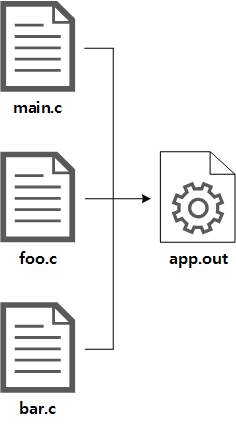

# CMake

# CMake

- Makefile은 source file안 header file이 어떤 것이 포함되어 있는지 조사하지 않음
- Makefile에 의존성 정보가 잘못 기술되어 있을 시 변경 사항이 반영되지 않음
- CMake는 source file 내부의 header file을 분석해 의존성 정보를 스스로 파악
- CMake에서는 Build 중간 생성물을 명시하지 않고 최종 Build 결과물과 Build를 위한 source file만 명시해주면 됨
- CMake로 Project 관리 시 CLion이나 Eclipse와 같은 범용 IDE에서 Project 설정 파일로 사용할 수 있다는 장점이 있어 협업 Project에서 체계적으로 관리하며 여러 IDE에서 작업할 수 있음



- 3개의 source file로부터 하나의 execute file을 만드는 예제

## Makefile VS CMakeList.txt

```bash
OBJS=main.o foo.o bar.o
TARGET=app.out
 
all: $(TARGET)
  
clean:
    rm -f *.o
    rm -f $(TARGET)
 
$(TARGET): $(OBJS)
    $(CC) -o $@ $(OBJS)
  
main.o: foo.h bar.h main.c
foo.o: foo.h foo.c
bar.o: bar.h bar.c
```

```bash
ADD_EXECUTABLE( app.out main.c foo.c bar.c )
```

- `cmake CMakeList.txt` → `make`로 Build 가능
- `make all`, `make clean`과 같은 매크로 정의 되어 있음
- `cmake CMakeLists.txt`명령은 자동 생성된 Makefile을 삭제하지 않는 이상 최초 한 번만 실행하면 됨

## CMake 내부 동작


- 흐릿한 부분은 CMake 내부적으로 처리되어 Build Script에 명시하지 않아도 되는 부분
- header file(`*.h`)
    - build할 대상은 아니나 source file에 포함되어 해당 Object file과 내재적 의존 관계를 만듬
    - CMake는 각 Object file을 생성하기 전 source file을 분석해 변경여부를 검사해 필요시 다시 Compile 수행
- Object file(`*.o`)
    - CMake 내부적으로 Build를 수행할 때 자동 생성되는 CMakeFiles Directory에 생성
    - Build 후 source file과 Object file이 섞이지 않아 Project Directory를 깔끔히 유지할 수 있음
- CMake 실행 시 자동 생성되는 file과 directory
    - Makefile
    - CMakeCache.txt
    - cmake_install.cmake
    - [CMakeFiles]

# Commands & Variables

## Project 전반 관련

### SET()

- Variable 정의하는 Command

```bash
## Variable Define ##
SET ( <Variable Name> <Value> )

## List Variable Define ##
SET ( <List Variable Name> <List Item> <List Item> <List Item> ... )

## Variable Reference ##
$<Variable Name>
${<Variable Name>}
# example SET() #
SET ( SRC_FILES main.c foo.c bar.c )
ADD_EXECUTABLE ( app.out ${SRC_FILES} )
# equal #
ADD_EXECUTABLE ( app.out main.c foo.c bar.c )

## Reverved Variable ##
# CMake에 내장되어 있는 예약 변수들은 전체 Build 흐름에 중요한 역할을 함
# SET() 명령으로 값 변경 가능
# CMake에서 제공하는 명령들이 모든 예약 변수를 커버하지 않기에 SET()으로 지정해야 함
```

### CMAKE_MINIMUM_REQUIRED()

- 필요한 CMake 최소 버전을 명시함

```bash
CMAKE_MINIMUM_REQUIRED ( VERSION <version> )
# example $
CMAKE_MINIMUM_REQUIRED ( VERSION 3.17 )
```

- `<version>`: x.y.z.w 형식 x는 반드시 명시해야 하고 나머지는 생략 가능

### PROJECT()

- 프로젝트 이름 설정
- 공백 포함 시 `"`로 감쌈

```bash
PROJECT ( <PROJECT_NAME> )
```

### CMAKE_PROJECT_NAME

- PROJECT() 명령으로 설정한 Project name이 CMAKE_PROJECT_NAME에 저장됨

```bash
MESSAGE ( ${CMAKE_PROJECT_NAME} )
```

### CMAKE_BUILD_TYPE

- CMake Build System에서도 Build Configuration 지정 가능
- Build 목적에 따라 서로 다른 Option으로 지정해 빌드하는 것
- 기본적인 Build Configuration
    - `Debug`: Debugging 목적 Build
    - `Release`: Release 목적 Build
    - `RelWithDebInfo`: Release 목적 Build이나 Debugging 정보 포함
    - `MinSizeRel`: 최소 크기로 최적화 한 Release 목적 Build
- CMAKE_BUILD_TYPE 지정 시 Makefile을 작성할 때 Build Configuration에 따라 서로 다른 Build Option(Flag)를 삽입함

### MESSAGE()

- Console에 Message 출력

```bash
MESSAGE ( [<TYPE>] <MESSAGE> )
```

- TYPE
    - `STATUS`: Status Message 출력(Message 앞 `--`가 추가되어 출력)
    - `WARNING`: Warning Message를 출력하고 계속 진행
    - `AUTHOR_WARNING`: Project Developer용 Warning Message를 출력하고 계속 진행
    - `SEND_ERROR`: Error Message를 출력하고 계속 진행하나 Makefile 생성하지 않음
    - `FATAL_ERROR`: Error Message를 출력하고 작업 즉시 중단

### CMAKE_VERBOSE_MAKEFILE

- Switch Variable로 값을 true나 1로 지정 시 Build detail 과정을 모두 출력하는 Makefile 생성

```bash
SET ( CMAKE_VERBOSE_MAKEFILE true )
```

- Build 과정에서 CMake가 실제 실행하는 build 명령을 모두 볼 수 있어 Build Script 작성 시 이 Option 키는 것이 좋음
- PROJECT() 명령 만날 시 `false`로 초기화되므로 PROJECT() 명령보다 뒤에 위치해야 함

## Target 관련

### ADD_ECECUTABLE()

- Build Target Binary 추가

```bash
ADD_EXECUTABLE ( <OUT FILE NAME> <SOURCE FILE> <SOURCE FILE> <SOURCE FILE> ... )
# example #
ADD_EXECUTABLE ( app.out main.c foo.c bar.c )
```

- `<OUT FILE NAME>`: 생성할 Binary File Name
- `<SOURCE FILE>`: Execute File을 생성하는 데 필요한 source file

### ADD_LIBRARY()

- Build Target Library 추가

```bash
ADD_LIBRARY ( <LIBRARY NAME> [ STATIC | SHARED | MODULE ] <SOURCE FILE> <SOURCE FILE> ... )
# example #
ADD_LIBRARY ( app STATIC foo.c barr.c )
```

- `<LIBRARY NAME>`: 생성할 Library Name
- `[ STATIC | SHARED | MODULE ]`: Library 종류(Default: `STATIC`)
- `<SOURCE FILE>`: Library를 생성하는 데 필요한 source file

### ADD_CUSTOM_TARGET()

- 사용자 정의 Target 추가
- 통상적인 Build 절차로 생성할 수 없는 Target 생성
- make 매크로 정의할 때 사용
- Target의 Recipe를 직접 지정해야 할 경우 활용
- ADD_CUSTOM_TARGET으로 정의한 Target은 출력 file을 생성하지 않아도 무방
- 항상 `Outdated`로 간주되어 매 Build마다 COMMAND Ruotine이 실행됨
- 의존성에 따라 실행 여부를 선택하려면 ADD_COSTOM_COMMAND() 명령 사용해야 함

```bash
ADD_CUSTOM_TARGET (
	<NAME> [ALL]
	[COMMENT <MESSAGE>]
	[DEPENDS <LIST OF DEPENDENCIES>]
	[WORKING_DIRECTORY <WORK DIRECTORY>]
	COMMAND <COMMAND>
	[COMMAND <COMMAND>]
	[VERBATIM]
	...
)
# example #
ADD_CUSTOM_TARGET (
	flash
	COMMENT "Flashing binary"
	WORKING_DIRECTORY ${CMAKE_RUNTIME_OUTPUT_DIRECTORY}
	COMMAND python esptool.py write_flash app.bin
	DEPENDS app.out
)
```

- `<NAME>`: Target Name
- `[ALL]`: make(make all) command에서 default build target 대상에 포함할 지 여부
- `<MESSAGE>`: Command Execute 전 Console에 출력할 Message
- `<LIST OF DEPENDENCIES>`: 이 Target이 의존하는 대상 List( ``으로 구분(공백))
- `<WORK DIRECTORY>`: command를 실행할 path
- `<COMMAND>`: Target을 생성하기 위한 Command(Recipe)
- `[VERBATIM]`: `<COMMAND>`를 Escape하지 않고 그대로 사용하려는 경우 추가(Variable,  ``, `.` 등)

### ADD_DEPENDENCIES()

- Top-level Target 간 의존성 정의
    - Top-level Target: ADD_EXECUTABLE(), ADD_LIBRARY(), ADD_CUSTOM_TARGET() command로 정의한 Target
    - Target을 Build할 때 이 command로 define한 list of dependencies가 `Outdated`인 경우 Build 먼저 수행

```bash
ADD_DEPENDENCIES( <TARGET NAME> <DEPENDENCY TARGET> <DEPENDENCY TARGET> ... )
# example #
ADD_DEPENDENCIES( flash app.out )
```

- `<DEPENDENCY TARGET>`: 이 Target이 의존하는 Target

### INSTALL()

- `make install` 정의
- Makefile에서 관용적으로 Install용 Target으로 사용되는 install target의 동작 방식 정의
- [추가 정보](https://cmake.org/cmake/help/v2.8.12/cmake.html#command:install)

```bash
INSTALL ( TARGETS <TARGET LIST>
	RUNTIME DESTINATION <BINARY INSTALL PATH>
	LIBRARY DESTINATION <LIBRARY INSTALL PATH>
	ARCHIVE DESTINATION <ARCHIVE INSTALL PATH>
	)
# if all INSTALL PATHs are the same -> contraction #
INSTALL ( TARGETS <TARGET LIST> DESTINATION <INSTALL PATH> )
# example #
INSTALL ( TARGETS app.out app
	RUNTIME_DESTINATION /usr/local/bin
	ARCHIVE_DESTINATION /usr/local/lib
	)
```

### CMAKE_INSTALL_PREFIX

- `make install`에서 Execute Binary와 Library 등의 최종 생성물을 복사할 Install Directory 지정
- INSTALL() 명령에서 상대 경로를 사용하면 이 variable에 지정한 directory가 Base directory가 됨

```bash
SET ( CMAKE_INSTALL_PREFIX /usr/bin )
```

- Default: `/usr/local`

## Global Build Setting 관련

- 유의 사항: 선언 이후 define한 Target들에게만 적용됨
- CMakeLists.txt의 상단에 위치시켜야 함

### CMAKE_C_COMPILER

- C Compile 및 link 과정에서 사용할 Compiler의 경로 지정

### ADD_COMPILE_OPTIONS()

- Compile Option 추가
- Source File을 Compile해 Object File을 생성할 때 Compiler에게 전달할 Option(Flag) 추가

```bash
ADD_COMPILE_OPTIONS ( <OPTION> <OPTION> <OPTION> <OPTION> ... )
# example #
ADD_COMPILE_OPTIONS ( -g -Wall )
```

### CMAKE_C_FLAGS_<BUILD CONFIGURATION>

- Build Configuration 별 사용할 Compile Option(Flag) 지정

```bash
SET ( CMAKE_C_FLAGS_RELEASE "-DCONFIG_RELEASE -03" )
```

- 주의: 위 예시와 같이 목록이 아닌 `"`로 감싸 하나의 문자열로 정의해야 함
    - 하지 않을 시 공백 문자가 `;`으로 구분되어 Compile Command로 입력되어 Error 발생

### ADD_DEFINITIONS()

- 전처리기 매크로 추가(`-D`)

```bash
ADD_DEFINITIONS ( -D<MACRO> -D<MACRO> -D<MACRO>=<VALUE> ... )
# example #
ADD_DEIFINITIONS ( -DICACHE_FLASH -DMY_DEBUG=1 )
```

### INCLUDE_DIRECTORIES()

- Header Directory 추가(`-l`)
- 각 Source File에서 `#include` 구문으로 포함시킨 Header File을 찾을 Directory List 추가

```bash
INCLUDE_DIRECTORIES ( <DIRECTORY> <DIRECTORY> <DIRECTORY> ... )
# example #
INCLUDE_DIRECTORIES ( include driver/include )
```

### LINK_DIRECTORIES()

- Library Directory 추가(`-L`)
- Link 시 포함할 Library List 지정
- Library File Name의 Prefix 및 Postfix는 제외하고 Library Name만 입력
    - e.g. `libxxx.a`에서 `xxx`만 입력

```bash
LINK_LIBRARIES ( <LIBRARY> <LIBRARY> <LIBRARY> ... )
# example #
LINK_LIBRARIES ( uart wifi -static )
```

- 이 command로 Link Option도 함께 지정 가능
- `<LIBRARY>` 값이 `-`으로 시작되는 경우 Link command에 그대로 포함됨
그렇지 않을 경우 앞에 `-l`이 자동으로 추가됨

### CMAKE_EXE_LINKER_FLAGS_<BUILD CONFIGURATION>

- Build Configuration별 Link Option(Flag) 지정

```bash
SET ( CMAKE_EXE_LINKER_FLAGS_DEBUG "-DCONFIG_DEBUG -Wl,-whole-archive" )
```

- Option이 여러 개인 경우 `"`로 감쌈

### RUNTIME_OUTPUT_DIRECTORY

- Execute Binary를 저장할 Directory 지정

```bash
SET ( RUNTIME_OUTPUT_DIRECTORY output/bin )
```

### LIBRARY_OUTPUT_DIRECTORY

- Build 완료 한 Library를 저장할 Directory 지정

```bash
SET ( LIBRARY_OUTPUT_DIRECTORY output/lib )
```

### ARCHIVE_OUTPUT_DIRECTORY

- Build 완료한 Archive(Static Library)를 저장할 Directory 지정

```bash
SET ( ARCHIVE_OUTPUT_DIRECTORY output/lib/static )
```

## 특정 Target 한정 Build Setting 관련

### TARGET_COMPILE_OPTIONS()

- Target Compile Option(Flag) 추가

```bash
TARGET_COMPILE_OPTIONS ( <TARGET NAME> [ PUBLIC | INTERFACE | COMPILE ] <OPTION> ... )
# example #
TARGET_COMPILE_OPTIONS ( app.out PUBLIC -g -Wall )
```

- `<TARGET NAME>`: Target Name
- `[PUBLIC | INTERFACE | COMPILE ]`: Global Compile Option Variable(`COMPILE_OPTIONS`)와 Interface Compile Option Variable(`INTERFACE_COMPILE_OPTIONS`)를 확장
  보통 `PUBLIC`으로 사용
    - [참조](https://cmake.org/cmake/help/v2.8.12/cmake.html#command:target_compile_options)
- `<OPTION>`: Compile Option

### TARGET_COMPILE_DEFINITIONS()

- Target의 Source File을 Compile하여 Object File을 생성 시 전처리기에 전달할 매크로 정의(`-D`)

```bash
TARGET_COMPILE_DEFINITIONS ( <TARGET_NAME> PUBLIC <MACRO> <MACRO>=<VALUE> ... )
# example #
TARGET_COMPILE_DEFINITIONS ( app.out PUBLIC UART_BUFFERD -DICACHE DEBUG=1 )
```

- ADD_DEFINITIONS()와 달리 `<MACRO>`를 지정할 때 `-D` 생략 가능

### TARGET_INCLUDE_DIRECTORIES()

- Target에 포함된 Source File에서 `#include` 구문으로 포함시킨 Header File을 찾을 Directory List 추가(`-l`)

```bash
TARGET_INCLUDE_DIRECTORIES ( <TARGET NAME> PUBLIC <DIRECTORY> <DIRECTORY> ... )
# example #
TARGET_INCLUDE_DIRECTORIES ( include driver/include )
```

### TARGET_LINK_LIBRARIES()

- Target Link 시 포함할 Library List를 지정
- Library File Name의 Prefix 및 Postfix는 제외하고 라이브러리 이름만 입력(`-l`)

```bash
TARGET_LINK_LIBRARIES ( <TARGET NAME> <LIBRARY> <LIBRARY> ... )
# example #
TARGET_LINK_LIBRARIES ( app.out uart wifi -static )
```

## Build Step 관련

### CONFIGURE_FILE()

- Template File로 부터 File 자동 생성
- Build 시작 전에 Tamplate File 내용 중 Build Script에 정의된 Variable를 치환해 출력 File로 작성
- Compiler를 실행하기 전 수행하는 전 전처리 과정

```bash
CONFIGURE_FILE ( <TEMPLATE FILE NAME> <OUTPUT FILE NAME> )
```

```bash
# example #
SET ( PRIJECT_VERSION_MAJOR 9 )
SET ( PRIJECT_VERSION_MINOR 9 )
SET ( PRIJECT_VERSION_PATCH 5 )
SET ( PRIJECT_VERSION_TWEAK 2 )
CONFIGURE_FILE( version.h.in version.h )
```

```c
#define VERSION "${PRIJECT_VERSION_MAJOR}.${PRIJECT_VERSION_MINOR}.${PRIJECT_VERSION_PATCH}.${PRIJECT_VERSION_TWEAK}"
```

```c
#define VERSION "9.9.5.2"
```

### ADD_CUSTOM_COMMAND(OUTPUT)

- 사용자 정의 출력 File 추가
- 통상적인 Build 절차로 생성할 수 없는 출력 File 추가
- 출력 File의 Recipe를 직접 지정해야 하는 경우 사용
- ADD_CUSTOM_TARGET()과 차이점
    - 생성하는 출력 File들이 최신인지 여부를 검사해  Recipe를 실행할 지 여부 결정
        - 사용자 정의 출력 파일을 생성하는 데 많은 시간이 걸릴 경우 사용
    - Recipe를 실행했을 때 최소 한 개 이상의 출력 File이 있어야 함
        - `Outdated`판정을 위해 출력 파일을 `OUPPUT` Prameter로 명시해야 함

```bash
ADD_CUSTOM_COMMAND (
	OUTPUT <OUTPUT FILE LIST>
	[COMMENT <MESSAGE>]
	[DEPENDS <LIST OF DEPENDENCIES>]
	[WORKING_DIRECTORY <WORK DIRECTORY>]
	COMMAND <COMMAND>
	[COMMAND <COMMAND>]
	[VERBATIM]
	...
)
# example #
ADD_CUSTOM_COMMAND (
	OUTPUT app.bin
	COMMENT "Generating binary from executable"
	DEPENDS app.out
	COMMAND python tools/elf2bin.py app.out app.bin
)
```

### ADD_CUSTOM_COMMAND(TARGET)

- 특정 Target의 Pre-build / Pre-link / Post-build에 수행할 command 추가
- ELF File로부터 Embedded Process에 Flashing 하기 위한 BIN File을 생성하는 것과 같이 통상적인 Build 과정에서 수행되는 command로 처리할 수 없는 동작을 Build Target물에 수행해줘야 할 필요가 있는 경우 사용

```bash
ADD_CUSTOM_COMMAND (
	TARGET <TARGET NAME>
	<PRE_BUILD|PRE_LINK|POST_BUILD> # 명령 실행 시점 ( 전 / 중 / 후 )
	[COMMENT <MESSAGE>]
	[WORKING_DIRECTORY <WORK DIRECTORY>]
	COMMAND <COMMAND>
	[COMMAND <COMMAND>]
	[VERBATIM]
	...
)
# example #
ADD_CUSTOM_COMMAND (
	TARGET app.out
	POST_BUILD
	COMMENT "Generating binary from executable"
	COMMAND python tools/elf2bin.py app.out app.bin
)
```

- ADD_CUSTOM_COMMAND(OUTPUT)에서 제시한 예시는 OUTPUT에 지정한 File들이 Outdated인 경우에만 실행되나 ADD_CUSTOM_COMMAND(TARGET)의 경우 최신 여부에 관계 없이 TARGET에 지정한 Target이 Build 되는 경우에만 실행됨

# CMakeLists.txt 기본 패턴

```bash
# 요구 CMake 최소 버전
CMAKE_MINIMUM_REQUIRED ( VERSION <VERSION> )
 
# 프로젝트 이름 및 버전
PROJECT ( "<PROJECT NAME>" )
SET ( PROJECT_VERSION_MAJOR <MAJOR VERSION> )
SET ( PROJECT_VERSION_MINOR <MINOR VERSION> )
 
# 빌드 형상(Configuration) 및 주절주절 Makefile 생성 여부
SET ( CMAKE_BUILD_TYPE <Debug|Release> )
SET ( CMAKE_VERBOSE_MAKEFILE <true|false> )
 
# 빌드 대상 바이너리 파일명 및 소스파일 목록
SET ( OUTPUT_ELF
        "${CMAKE_PROJECT_NAME}-${PROJECT_VERSION_MAJOR}.${PROJECT_VERSION_MINOR}.out"
        )
SET ( SRC_FILES
        <SOURCE FILE>
        <SOURCE FILE>
        ...
        )
 
# 공통 컴파일러
SET ( CMAKE_C_COMPILER "<COMPILER>" )
 
# 공통 헤더 파일 Include 디렉토리 (-I)
INCLUDE_DIRECTORIES ( <DIRECTORY> <DIRECTORY> ... )
 
# 공통 컴파일 옵션, 링크 옵션
ADD_COMPILE_OPTIONS ( <COMPILE OPTION> <COMPILE OPTION> ... )
SET ( CMAKE_EXE_LINKER_FLAGS "<LINK OPTION> <LINK OPTION> ..." )
 
# 공통 링크 라이브러리 (-l)
LINK_LIBRARIES( <LIBRARY> <LIBRARY> ... )
 
# 공통 링크 라이브러리 디렉토리 (-L)
LINK_DIRECTORIES ( <DIRECTORY> <DIRECTORY> ... )
 
# "Debug" 형상 한정 컴파일 옵션, 링크 옵션
SET ( CMAKE_C_FLAGS_DEBUG "<COMPILE OPTION> <COMPILE OPTION> ..." )
SET ( CMAKE_EXE_LINKER_FLAGS_DEBUG "<LINK OPTION> <LINK OPTION> ..." )
 
# "Release" 형상 한정 컴파일 옵션, 링크 옵션
SET ( CMAKE_C_FLAGS_RELEASE "<COMPILE OPTION> <COMPILE OPTION> ..." )
SET ( CMAKE_EXE_LINKER_FLAGS_RELEASE "<LINK OPTION> <LINK OPTION> ..." )
 
# 출력 디렉토리
SET ( CMAKE_RUNTIME_OUTPUT_DIRECTORY ${CMAKE_BUILD_TYPE} )
SET ( CMAKE_LIBRARY_OUTPUT_DIRECTORY ${CMAKE_BUILD_TYPE}/lib )
SET ( CMAKE_ARCHIVE_OUTPUT_DIRECTORY ${CMAKE_BUILD_TYPE}/lib )
 
# 빌드 대상 바이너리 추가
ADD_EXECUTABLE( ${OUTPUT_ELF} ${SRC_FILES} )
```

- example
  
    ```bash
    # 요구 CMake 최소 버전
    CMAKE_MINIMUM_REQUIRED ( VERSION 2.8 )
     
    # 프로젝트 이름 및 버전
    PROJECT ( "andromeda" )
    SET ( PROJECT_VERSION_MAJOR 0 )
    SET ( PROJECT_VERSION_MINOR 1 )
     
    # 빌드 형상(Configuration) 및 주절주절 Makefile 생성 여부
    SET ( CMAKE_BUILD_TYPE Debug )
    SET ( CMAKE_VERBOSE_MAKEFILE true )
     
    # 빌드 대상 바이너리 파일명 및 소스 파일 목록
    SET ( OUTPUT_ELF
            "${CMAKE_PROJECT_NAME}-${PROJECT_VERSION_MAJOR}.${PROJECT_VERSION_MINOR}.out"
            )
    SET ( SRC_FILES
            bar.c
            foo.c
            main.c
            )
     
    # 공통 컴파일러
    SET ( CMAKE_C_COMPILER "gcc" )
     
    # 공통 헤더 파일 Include 디렉토리 (-I)
    INCLUDE_DIRECTORIES ( include driver/include )
     
    # 공통 컴파일 옵션, 링크 옵션
    ADD_COMPILE_OPTIONS ( -g -Wall )
    SET ( CMAKE_EXE_LINKER_FLAGS "-static -Wl,--gc-sections" )
     
    # 공통 링크 라이브러리 (-l)
    LINK_LIBRARIES( uart andromeda )
     
    # 공통 링크 라이브러리 디렉토리 (-L)
    LINK_DIRECTORIES ( /usr/lib )
     
    # "Debug" 형상 한정 컴파일 옵션, 링크 옵션
    SET ( CMAKE_C_FLAGS_DEBUG "-DDEBUG -DC_FLAGS" )
    SET ( CMAKE_EXE_LINKER_FLAGS_DEBUG "-DDEBUG -DLINKER_FLAGS" )
     
    # "Release" 형상 한정 컴파일 옵션, 링크 옵션
    SET ( CMAKE_C_FLAGS_RELEASE "-DRELEASE -DC_FLAGS" )
    SET ( CMAKE_EXE_LINKER_FLAGS_RELEASE "-DRELEASE -DLINKER_FLAGS" )
     
    # 출력 디렉토리
    SET ( CMAKE_RUNTIME_OUTPUT_DIRECTORY ${CMAKE_BUILD_TYPE} )
    SET ( CMAKE_LIBRARY_OUTPUT_DIRECTORY ${CMAKE_BUILD_TYPE}/lib )
    SET ( CMAKE_ARCHIVE_OUTPUT_DIRECTORY ${CMAKE_BUILD_TYPE}/lib )
     
    # 빌드 대상 바이너리 추가
    ADD_EXECUTABLE( ${OUTPUT_ELF} ${SRC_FILES} )
    ```
    

# CMake Variables

- Regular Variables, Cache Variables, Environment Variables

## Regular Variables

- 위 SET() command 사용
- Regular Variable은 선언된 Scope 내에서만 존재
- Variable을 찾을 때 current scope에서 Regular Variable을 먼저 찾고 그 다음 Cache에서 찾음
- SET() command → current scope에 정의된 variable 덮어쓰기 가능
- UNSET() command → current scope에 정의된 variable 삭제

### Example

- Variable은 항상 String Type이나 다른 Type처럼 사용 가능(Boolean, Path, Target Name 등)

```bash
CMAKE_MINIMUM_REQUIRED ( VERSION 3.17 )
PROJECT ( foo NONE )

SET ( condition_a "TRUE" )
SET ( condition_b "NO" )

IF ( condition_a )
	MESSAGE ( "condition_a" )
ELSE ()
	MESSAGE ( "Not condition_a" )
ENDIF ()

IF ( condition_b )
	MESSAGE ( "condition_b" )
ELSE ()
	MESSAGE ( "Not condition_b" )
ENDIF ()
```

### Dereferencing(재참조)

```bash
CMAKE_MINIMUM_REQUIRED ( VERSION 3.17 )
PROJECT ( foo NONE )

SET ( a "JungIn" )
SET ( b "${a}_Kim" )
SET ( ${a}${b} "ArkData" )
SET ( WhereIs${a}${b} "Daegu" )
```

## Cache Variables

- Global Variables(scope 없음)

```bash
# Top-level CMakeLists.txt
CMAKE_MINIMUM_REQUIRED ( VERSION 3.17 )
PROJECT ( foo NONE )

ADD_SUBDIRECTORY ( boo )

MESSAGE ( "A: ${A}" )
```

```bash
# CMakeLists.txt from 'boo' directory
SET ( A "990520" CACHE STRING "" )
```

```bash
cmake -Hcache-no-scope -B_builds
```

- 기본적으로 덮어 쓰이지 않음(덮어 쓰고 싶을 때 `force` 옵션으로 덮어씀)

```bash
SET ( A "990" CACHE STRING "" )
SET ( A "520" CACHE STRING "" )
MESSAGE ( "Variable from cache: ${A}" )
# Variable from cache: 990
```

### Option `-D`

- Cache Variable은 Regular Vairable과 달리 `-D` Option을 통해 값 전달이 가능
    - 원래 정의된 variable은 Default로 사용됨

```bash
cmake -Dabc=990520 -Hdouble-set -B_builds
# Variable from cache: 990520
```

### Cache Type

- 모든 Variables는 String type이나 Variable의 사용될 방법에 대한 힌트 제공 가능
    - 실제 CMake GUI에서는 이를 참조함

```bash
SET ( A "YES" CACHE BOOL "Variable A" )
SET ( B "home/ark053/info.txt" CACHE FILEPATH "Variable B" )
SET ( C "home/ark053/" CACHE PATH "Variable C" )
SET ( D "JunginKim" CACHE STRING "Variable D" )
```

### OPTION()

- OPTION()은 boolean type의 cache를 정의하는 명령어

```bash
CMAKE_MINIMUM_REQUIRED ( VERSION 3.17 )
PROJECT ( foo NONE )

OPTION ( FOO_A "Option A" OFF )
OPTION ( FOO_B "Option B" ON )

MESSAGE ( "FOO_A:  ${FOO_A}" )
MESSAGE ( "FOO_B:  ${FOO_B}" )
```

### UNSET()

- Cache Variables로 선언된 Variable을 해지하기 위해 사용

```bash
SET ( X "123" CACHE STRING "X VARIABLE")

UNSET ( X ) # Regular Variable Delete <- 삭제 안됨
UNSET ( X CACHE )
```

## Environment Variables

### 읽기

```bash
CMAKE_MINIMUM_REQUIRED ( VERSION 3.17 )
PROJECT ( foo NONE )

MESSAGE ( "USERNAME: $ENV{USERNAME}" )
```

- `$ENV{…}`를 통해 환경 변수를 읽을 수 있음
- CMake 안에서 사용되는 환경 변수는 Tracking 기능이 없음
- OS 환경에서 존재하는 환경 변수 이름을 변경하면 CMake 안의 환경 변수도 수정해야 함

---

[CMake Reference Documentation - CMake 3.25.0-rc2 Documentation](https://cmake.org/cmake/help/latest/)