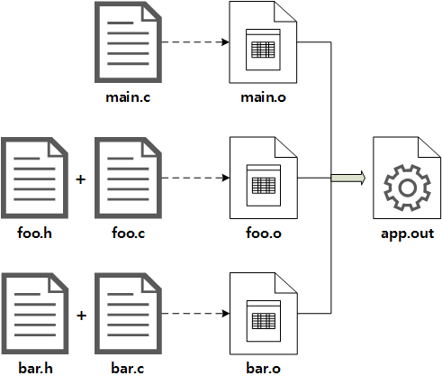

# Makefile

# Makefile

- Makefile은 `make`를 통해 build해주는 것



- 3개의 source file을 compile해 Object file(*.o)를 생성해 link 과정으로 실행 파일을 생성(app.out)
- foo와 bar에 정의된 function을 main에서 호출하는 의존성 존재

## `make`를 활용하지 않고 Build

```bash
gcc -c -o main.o main.c
gcc -c -o foo.o foo.c
gcc -c -o bar.o bar.c

```

```bash
gcc -o app.out main.o foo.o bar.o
```

## Incremental Build

- 반복적인 build 과정에서 변경된 source code에 의존성 있는 대상들만 추려 다시 biuld하는 과정

## `make`를 활용해 Build

```bash
app.out: main.o foo.o bar.o
	gcc -o app.out main.o foo.o bar.o

main.o: foo.h bar.h main.c
	gcc -c -o main.o main.c

foo.o: foo.h foo.c
	gcc -c -o foo.o foo.c

bar.o: bar.h bar.c
	gcc -c -o bar.o bar.c
```

- `make`명령을 통해 실행 파일을 만들어 낼 수 있음
- 중간 과정의 Object file들도 함께 생성
- `make`명령 뒤 target 명시 시 해당 target만 build
    - ex) `make foo.o`

### Build Rule Block

```bash
<Target>: <Dependencies>
	<Recipe>
```

- `Target`: build 대상 이름
- `Dependencies`: build 대상의 의존하는 Target이나 File 목록
나열된 대상들을 먼저 만든 후 build 대상을 생성
- `Recipe`: build 대상을 생성하는 명령
여러 줄 작성 가능
각 줄 시작에 반드시 `Tab`으로 된 Indent가 있어야 함

### Built-in Rule

```bash
app.out: main.o foo.o bar.o
	gcc -o app.out main.o foo.o bar.o

main.o: foo.h bar.h main.c
	foo.o: foo.h foo.c
	bar.o: bar.h bar.c
```

- Make에서는 자주 사용되는 빌드 규칙들은 내장해 기술하지 않아도 자동으로 처리함
    - Source File(*.c)를 Compile하여 Object File(*.o)로 만들어주는 규칙
- 밑 main.o~를 작성하지 않으면 Incremental Build를 위한 의존성 검사에서 Header File의 변경을 감지하지 못함
- 해당 Source File에 Header File을 추가(#include)할 때마다 이 부분을 업데이트 해야 함

### Use Variables

```bash
CC=gcc
CFLAGS=-g -Wall
OBJS=main.o foo.o bar.o
TARGET=app.out
 
$(TARGET): $(OBJS)
	$(CC) -o $@ $(OBJS)
 
main.o: foo.h bar.h main.c
foo.o: foo.h foo.c
bar.o: bar.h bar.c
```

- 변수를 사용하면 Makefile을 간단하고 확장성 있게 작성 가능
- 변수 선언 및 사용법은 Bash Shell Script와 동일
- 변수들 중 Make 내부에서도 함께 사용하는 내장 변수나 확장성에 용이한 자동변수도 존재
    - `CC`: Compiler, Make 내장 변수
    - `CFLAGS`: Compile Option
    - `OBJS`: 중간 산물 Obejct File List
    - `TARGET`: Build 대상(실행 파일) 이름
    - `LDFLAGS`: Linker Option
    - `LDLIBS`: Link Library

### Automatic Variables

- 위 `$@`와 같이 맥락에 맞도록 치환되는 자동 변수
- 자주 사용하는 리스트
    - `$@`: 현재 Target 이름
    - `$^`: 현재 Target이 의존하는 대상들의 전체 목록
    - `$?`: 현재 Target이 의존하는 대상들 중 변경된 것들의 목록
    - [ETC](https://www.gnu.org/software/make/manual/html_node/Automatic-Variables.html)

### Clean Rule

```bash
clean:
	rm -f *.o
	rm -f $(TARGET)
```

- Clean Build는 잘못된 의존성 검사로 인해 변경사항이 반영되지 않을 때 수행
- `make clean; make` 이런 식으로 활용

### Makefile 기본 패턴

```bash
CC=<compiler>
CFLAGS=<compile option>
LDFLAGS=<link option>
LDLIBS=<link library list>
OBJS=<object file list>
TARGET=<build target name>
 
all: $(TARGET)
 
clean:
	rm -f *.o
	rm -f $(TARGET)
 
$(TARGET): $(OBJS)
$(CC) -o $@ $(OBJS)
```