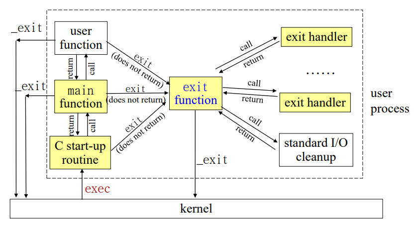
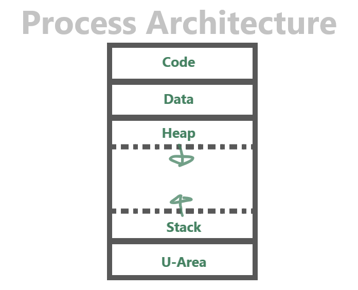

# Process

# 핵심 정리

- Process: 실행중인 Program
- Shell: User와 OS간 창구 역할을 하는 SW, Command를 받아 이를 처리하는 Command 처리기
- Program이 실행되면 Program의 Start-up Routine에게 Command Line Parameter와 Environment Variable가 전달됨
- `exit()`는 정리 후 Process 종료, `_exit()`는 정리 없이 즉시 Process 종료
- 각 Process는 Process ID를 가짐
- 각 Process는 Parent Process가 있음
- 각 Process는 실제 User ID와 유효 User ID를 가지며 실제 Group ID 와 유효 Group ID를 가짐
- Process Image는 Text(Code), Data, Heap, Stack등으로 구성됨

# Shell & Process

## Shell

- User와 OS 사이 창구 역할 하는 SW
- Command 처리기
- 실행 절차
    1. 시작 file을 읽고 실행
    2. Prompt를 출력하고 User Command 대기
    3. User Command 실행(2로 돌아감)
    4. (`Ctrl` + `D`)종료

## 복합 Command

### Command Line

```bash
date; who; pwd
```

### Command Group

```bash
date; who; pwd > out1.txt # date, who는 출력, pwd는 out1.txt에 저장
(date; who; pwd) > out2.txt #date, who, pwd out2.txt에 저장
```

## 전면처리 & 후면처리

### 전면처리

- Input Command → Command가 전면에서 실행되며 Command 실행 끝날 때 까지 Shell 대기

### 후면 처리

- Command를 후면에서 처리하고 전면에서 다른 작업 수행 가능(동시에 여러 작업 수행 가능)

```bash
<Command> &
# example #
(sleep 100; echo done) &
find . -name test.c -print &
jobs

# fg %jobnum: jobnum의 Command 출력
```

## Process

- 실행중인 Program
- 각 Process는 유일한 PID를 가짐
- `ps` command로 내 Process들을 볼 수 있음

```bash
ps # 현재 존재하는 Process들의 Execute Status를 요약해 출력

ps -aux # BSD Unix
#	-a: 모든 User의 Process 출력
#	-u: Process에 대한 자세한 정보 출력
#	-x: Control Terminal을 갖지 않은 Process들도 출력

ps -ef # System V
#	-e: 모든 User의 Process 출력
#	-f: Process에 대한 자세한 정보 출력
```

### sleep command

- 지정된 시간만큼 실행 중지

```bash
 sleep <sec>
```

### kill command

- 해당 Process 강제 종료

```bash
kill <process num>
```

### wait command

- 해당 Process num을 갖는 Child가 종료될 때 까지 대기
- Process 번호가 없을 시 모든 Child를 기다림

```bash
 wait <process num>
```

### exit command

- Shell을 종료하고 종료 코드를 Parent Process에게 전달

```bash
exit <exit code>
```

# Program Start

## Program Execute Start

- `exec()` System Call
    1. C Start-up Routine에 Command Line과 Environment Variable Send
    2. Program Execute
    - C Start-up Routine
        - main function을 Call하며 Command Line, Environment Variable Send
        - Execute가 끝나면 return value를 받아 exit

## Command Line Parameter / Environment Variable

```c
int main(int argc, char *argv[]);
// argc: Command Line Parameter의 개수
// argv: Command Line Parameter List를 나타내는 Pointer Array
```

```c
#include <stdio.h>
int main(int argc, char *argv[]) {
	for(int i = 0;i < argc; i++) {
		printf("argv[%d]: %s\n", i, argv[i]);
	}
	exit(0);
}
```

```c
#include <stdio.h>
int main(int argc, char *argv[]) {
	char **ptr;
	extern char **environ;
	for(ptr = environ; *ptr != 0; ptr++) {
		printf("%s\n", *ptr);
	}
	exit(0);
}
```

## Environment Variable Access

- `_getenv()` System Call을 사용해 Environment Variable을 하나씩 Access 가능

```c
#include <stdlib.h>
char *getenv(const char *name);
// Environment Variable name의 Value를 return, 해당 Variable이 없으면 return NULL
```

```c
#include <stdio.h>
#include <stdlib.h>
int main(int argc, char *argv[]) {
	char *ptr;
	ptr = getenv("HOME");
	printf("HOME = %s\n", ptr);
	ptr = getenv("SHELL");
	printf("SHELL = %s\n", ptr);
	ptr = getenv("HOME");
	printf("PATH = %s\n", ptr);
	exit(0);
}
```

## Setting Environment Varialbe

- `putenv()`, `setenv()`,를 사용해 특정 Environment Variable 설정

```c
#include <stdlib.h>
int putenv(const char *name);
// name=value 형태의 String을 받아 이를 Env Variable List에 넣음, name 존재 시 대체
int setenv(const char *name, const char *value, int rewrite);
// Env Variable name의 value 설정 name 존재 시 rewrite value가 0이면 유지, 아닐 시 대체
int unsetenv(const char *name);
// Env Variable name의 value delete
```

# Program Exit

- 정상 종료
    - `main()` 실행을 마치고 return하면 C Start-up Routine은 이 return value 가지고 `exit()` Call
    - Program 내에서 직접 `exit()` Call
    - Program 내에서 직접 `_exit()` Call
    
    | exit() | fclose, fflush등 뒷정리 후 Process를 정상적으로 종료 |
    | --- | --- |
    | _exit() | 뒷정리 없이 Process를 즉시 종료 |
- 비정상 종료(Signal에 의한 종료)
    - `abort()`
        - Process에 SIGABRT Signal을 보내 Process를 비정상적으로 종료

## `atexit()`

- exit 처리기 등록 / Process 당 32개 까지 가능
- func
    - exit 처리기
        - Function Pointer(name)
    - `exit()`는 exit handler들을 등록된 역순으로 Call

```c
#include <stdlib.h>
void atexit(void (*func)(void));
```



```c
#include <stdio.h>
#include <stdlib.h>
static void exit_handler1(void) {
	printf("First Exit Handler\n");
}
static void exit_handler2(void) {
	printf("Second Exit Handler\n");
}
int main() {
	if(atexit(exit_handler1) != 0){
		perror("Can't Regist exit_handler1!\n");
	}
	if(atexit(exit_handler2) != 0){
		perror("Can't Regist exit_handler2!\n");
	}
	printf("main end\n");
	exit(0);
}
```

# Process ID

- 각 Process는 Process를 구별하는 Process ID를 가짐
- 각 Process는 자신을 생성해 준 Parent Process가 있음

```c
#include <unistd.h>
int getpid(); // Process ID Return
int getppid(); // Process Parent Process ID Return
```

```c
#include <stdio.h>
#include <unistd.h>
int main() {
	int pid;
	printf("My PID is %d, My Parent PID is %d", getpid(), getppid());
	return 0;
}
```

## Process의 User ID

- Process는 Process ID 외에 Process의 User ID와 Group ID를 가짐

### Process의 User ID

- Process를 실행한 원래 User의 User ID로 설정

### Process의 유효 User ID

- 현재 유효한 User ID로 새로 file을 만들거나 접근 권한을 검사할 때 주로 사용

### Return Process ID Function

```c
#include <sys/type.h>
#include <unistd.h>
uid_t getuid(); // Process의 실제 User ID return
uid_t geteuid(); // Process의 유효 User ID return
uid_t getgid(); // Process의 실제 Group ID return
uid_t getegid(); // Process의 유효 Group ID return
```

```c
#include <stdio.h>
#include <pwd.h>
#include <grp.h>
#include <unistd.h>
int main() {
	int pid;
	printf("Real User ID: %d(%s), Effective User ID: %d(%s)\n", getuid(),
		getpwuid(getuid()) -> pw_name, geteuid(), getpwuid(geteuid()) -> pw_name);
	printf("Real Group ID: %d(%s), Effective Group ID: %d(%s)\n", getgid(),
		getgrgid(getgid()) -> gr_name, getegid(), getgrgid(getegid()) -> gr_name);
	return 0;
}
```

### Change Process ID Function

```c
#include <sys/type.h>
#include <unistd.h>
int setuid(uid_t uid); // Process의 실제 User ID를 uid로 변경
int seteuid(uid_t uid); // Process의 유효 User ID를 uid로 변경
int setgid(gid_t gid); // Process의 실제 Group ID를 gid로 변경
int setegid(gid_t gid); // Process의 유효 Group ID를 gid로 변경
```

## set-user-id Executable File

- set-user-id 설정된 Executable File 실행 시 Process의 유효 User ID는 Owner로 바뀜
    - Process가 실행되는 동안 Executable File의 Owner 권한을 가짐

## Process Architecture

- Process는 Execute중인 Program
- Program 실행을 위해 Program의 Code, Data, Stack, Heap, U-Area등이 필요
- Process Image는 Memory 내의 Process Layout
- Program 자체는 Process가 아님



- Code(Text)
    - Process가 실행하는 executable code를 저장하는 영역
- Data
    - Global Variable 및 Static Variable을 위한 Memory 영역
- Heap
    - Dynamic Memory Allocation을 위한 영역
    - C의 `malloc()` Call 시 이 영역에서 Dynamic으로 Memory 할당
- Stack(Stack Area)
    - Function Call을 구현하기 위한 Runtime Stack을 위한 영역
    - Activation Record(활성 레코드)가 저장됨
- U-Area(User Area)
    - Open File Descriptor, 현재 Work Directory등과 같은 Process의 정보 저장 영역

# `fork()`

## Add Process

- `fork()`를 통해 Parent Process를 똑같이 복제해 새로운 Child Process 생성

```c
#include <stdio.h>
#include <unistd.h>
int main() {
	int pid;
	printf("%d Process Start \n", getpid());
	pid = fork();
	printf("%d Process: Return Value %d\n", getpid(), pid);
	return 0;
}
```

## Parent Process와 Child Process 구분

- `fork()` 호출 후 return value가 다른 것을 이용해 구분

```c
#include <stdlib.h>
#include <stdio.h>
#include <unistd.h>
int main() {
	int pid;
	pid = fork();
	if(pid == 0) {
		printf("Child Process: pid = %d\n", getpid());
	} else {
		printf("Parent Process: pid = %d\n", getpid());
	}
	return 0;
}
```

```c
#include <stdlib.h>
#include <stdio.h>
int main() {
	int pid1, pid2;
	pid1 = fork();
	if (pid1 == 0) {
		printf("Child 1 Process: pid = %d\n", getpid());
		exit(0);
	}
	pid2 = fork();
	if (pid2 == 0) {
		printf("Child 2 Process: pid = %d\n", getpid());
		exit(0);
	}
	return 0;
}
```

## `fork()` 이후 File Share

- Child는 Parent의 fd Table을 복사
    - Parent와 Child가 같은 [File discriptor](./Process/File%20Discriptor%2082c785aec43249da95eed8d786133a35.md)를 공유
        - 같은 File Offset 공유
        - Parent와 Child로부터 Output이 서로 섞이게 됨
- Child에게 상속되지 않는 성질
    - return value of `fork()`
    - Process ID
    - File Lock
    - 설정한 Alarm & Signal

# `wait()`

## Wait Child Process

- Child Process 중 하나가 끝날 때까지 대기
- 끝난 Child Process의 종료 코드가 status에 저장되며 끝난 자식 Process 번호를 return

```c
#include <unistd.h>
#include <stdio.h>
#include <stdlib.h>
#include <sys/wait.h>
int main() {
	int pid, child, status;
	printf("%d Parent Process Start\n", getpid());
	pid = fork();
	if(pid == 0) {
		printf("%d Child Process Start\n", getpid());
		exit(1);
	}
	child = wait(&status);
	printf("%d Child Process Stop\n", getpid(), child);
	printf("\t Stop Code %d\n", status >> 8);
```

# `exec()`

## Execute Program

- `fork()` 이후 Child Process는 Parent Process와 똑같은 code 실행
- Child Process에게 새 Program 실행
    - _exec() Use System Call
    - Process 내 Program을 새 Program으로 대치
- 보통 `fork()` 후 `exec()`
- Process가 `exec()` 호출
    - 그 Process 내 Program은 완전히 새로운 Program으로 대치(자기 대치)
    - 


- `exec()` Call이 성공하면 return할 곳이 없어짐
    - 성공한 `exec()` Call은 절대 return하지 않으며 Child Process는 새로운 Program을 실행하고 Parent Process는 계속해서 다음 code 실행
    - 실패 시 -1 return

```c
#include <stdio.h>
#include <unistd.h>
#include <stdlib.h>
int main() {
    printf("Parent Process Start\n");
    if(fork() == 0) {
        execl("/bin/echo", "echo", "hello", NULL);
        fprintf(stderr, "First Fail");
        exit(1);
    }
    printf("Parent Process Stop\n");
    return 0;
}
```

```c
#include <stdio.h>
#include <unistd.h>
#include <stdlib.h>
int main() {
    printf("Parent Process Start\n");
    if(fork() == 0) {
        execl("/bin/echo", "echo", "hello", NULL);
        fprintf(stderr, "First Fail");
        exit(1);
    }
		if(fork() == 0) {
        execl("/bin/date", "date", NULL);
        fprintf(stderr, "Second Fail");
        exit(2);
    }
			if(fork() == 0) {
        execl("/bin/ls", "ls", "-l", NULL);
        fprintf(stderr, "Third Fail");
        exit(3);
    }
    printf("Parent Process Stop\n");
    return 0;
}
```

```c
#include <stdio.h>
#include <unistd.h>
#include <stdlib.h>
#include <wait.h>
int main(int argc, char* argv[]) {
		int child, pid, status;
		pid = fork();
    if(pid == 0) {
			execv(argv[1], &argv[1]);
			fprintf(stderr, "%s: Execute Fail\n", argv[1]);
    } else {
			child = wait(&status);
	    printf("%d Child Process %d Stop\n", getpid(), pid);
			printf("\tStop Code %d\n", status >> 8);
		}
    return 0;
}
```

# `system()`

## Execute Program

```c
#include <stdlib.h>
int system(const char *cmdstring);
```

- Child Process를 생성하고 /bin/sh로 지정된 command 실행
- `system()` Function 구현
    - `fork()`, `exec()`, `waitpid()` System Call 이용
- Return Value
    - Command의 종료 코드: 성공
    - 127: `exec()` 실패
    - -1: 다른 오류

```c
#include <sys/types.h>
#include <sys/wait.h>
#include <errno.h>
#include <unistd.h>
int system(const char *cmdstring) {
	pid_t pid;
	int status;
	if(cmdstring == NULL) {
		return(1);
	}
	if((pid = fork()) < 0){
		status = -1;
	} else if(pid == 0){
		execl("/bin/sh", "sh", "-c", cmdstring, (char *) 0);
		_exit(127); //execl Fail
	} else {
		while(waitpid(pid, &status, 0) < 0){
			if(errno != EINTR) {
				status = -1;
				break;
			}
		}
	}
	return(status);
}
```