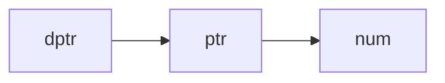

# 굴복하고 다시 공부하는 C

# Variable

## Global & Local

### Global Variable의 특징

- Program 시작과 동시에 Memory 공간에 할당되어 종료시까지 존재
- 별도의 값으로 초기화하지 않으면 0으로 초기화
- Program 전체 영역에서 접근 가능
- Global Variable이 증가할수록 Program이 복잡해 지므로 지양해야 함

### Global Variable과 동일한 이름의 Local Variable 생성

- 해당 Scope 내에서는 Local Variable로의 접근이 이뤄짐
- 해당 상황을 만드는 것 부터 복잡성이 올라가므로 지양하는 것이 좋음

## Static Variable

- 선언된 Function 내에서만 접근 가능
- 해당 Function Return 시 소멸
- Global Stativ Variable은 선언된 Function에서만 접근이 가능하며
딱 1회 초기화되고 Program 종료 시까지 Memort 공간에 존재함
- Local Static Variable은 Global Variable과 동일한 시기에 할당되고 소멸됨
- Local Static Variable은 Global Variable보다 안정성이 높아 대체 가능하다면 대체하는 것이 좋음

## Register Variable

- CPU 내 Register라는 Memory 공단에 저장될 확률이 높아지는 선언
- 접근과 연산 속도가 빠름
- Register 선언을 한다고 무조건 Register에 할당되지 않음
- Register 선언을 하지 않아도 Register에 할당될 수 있음
- Global Variable은 Register 선언을 추가할 수 없음(의미 없음)

# Recursive Function

```c
void Recursive(int count) {
	if(count <= 0) {
		return;
	}
	printf("Before Call : %d\n", count);
	Recursive(count - 1);
	printf("After Return : %d\n", count);
}
int main() {
	Recursive(5);
	return 0;
}
```

- 원본 Function으로 복사본 Function을 만든다고 생각하는 것이 편한 방법

```c
int Factorial(int n) {
	if(n == 0) {
		return 1;
	} else {
		return n * Factorial(n-1);
	}
}
int main() {
	Factorial(5);
}
```

# Pointer

## Pointer Variable

- Pointer Variable를 이용해 Memory에 직접 접근 가능

```c
int n;
int * point;
point = &n;
```

- Pointer Variable의 형은 Memory 공간을 참조하는 기준이 됨
- NULL Pointer는 `0` 또는 `NULL`로 정의

```c
int arr[5]={1, 2, 3, 4, 5};
int * ptr = arr;
arr[0] = *ptr;
arr[1] = *(ptr+1);
```

- `arr[1]`은 `*(arr+1)`로도 나타낼 수 있음

```c
char str1[] = "String";
char * str2 = "String";
```

- `str1`은 항상 같은 위치를 가리키나 Pointer Variable인 `str2`는 다른 위치를 가리킬 수 있음

## Const Pointer Variable

```c
const int * ptr = &num;
const * int ptr = &num;
```

- `num`값은 바뀔 수 있으나 `ptr`이 참조하는 위치값은 바꿀 수 없음

## Pointer Array VS Array Pointer

### Pointer Array

```c
int * arr[5];
```

### Array Pointer

```c
int (*arr)[5];
```

## Call-By-Value VS Call-By-Reference

### Call-By-Value

- 값 자체를 전달해 원본이 바뀌지 않음

### Call-By-Reference

- 원본 주로를 전달해 원본 그 자체임

## Double Pointer Variable


