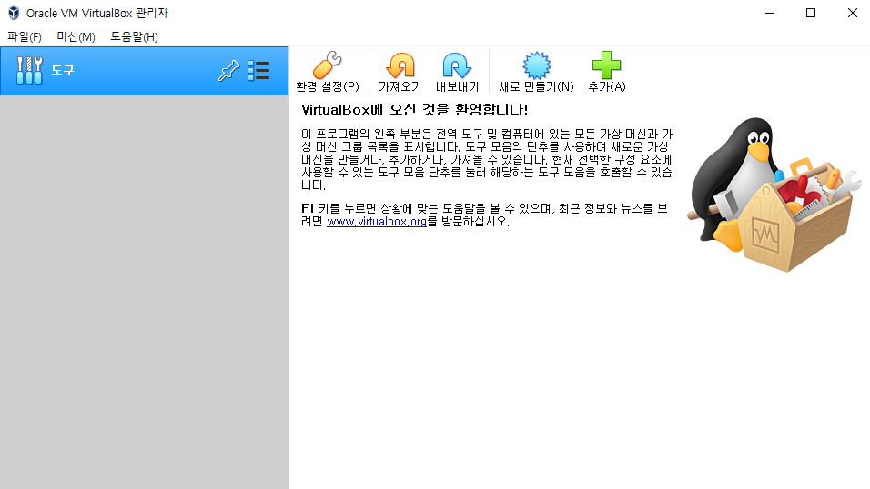

# CentOS 7 설치

# VirtualBox

1. 홈페이지([https://virtualbox.org/](https://virtualbox.org/)) 접속
2. VirtualBox 다운로드
    1. 좌측 Downloads 클릭
    2. OS에 맞게 선택(Windows → Windows hosts)
    3. 다운로드 진행
3. 설치 파일 실행 및 진행
    1. `Next` → `Next` → `Yes` → `Install` → `Yes` → `Finish`
4. 정상 설치 시 화면
   
    
    
5. Centos iso 파일 다운로드
    1. Centos 다운로드 페이지([https://www.centos.org/download/](https://www.centos.org/download/)) 접속
    2. 원하는 버전의 mirrors 클릭해 원하는 iso 파일 다운로드
6. 새로 만들기를 눌러 가상머신 생성
    1. 가상머신 운영 체제 설정시 종류와 버전을 Linux / Red Hat(64-bit)로 설정
    (이름을 CentOS 7로 설정 시 자동 설정)
    2. 가상머신 메모리 크기 설정(4096MB)
    3. 하드 디스크 설정(새 가상 하드 디스크 만들기)
    4. 디스크 파일 종류 설정(VDI)
    5. 물리적 하드 드라이브 저장 방식 설정(동적 할당)
    6. 위치 및 크기 설정(60GB)
7. 설정 버튼을 눌러 생성을 위한 설정 진행
    1. 저장소 → 컨트롤러 : IDE → 비어 있음 → Choose a disk file… →  CentOS iso 파일
    2. 네트워크 → 어댑터 1,2 → 네트워크 어댑터 사용하기 → NAT / 호스트 전용 어댑터 → 무작위 모드 모두 허용
8. Install CentOS 7 → 하단 이미지와 같이 소프트웨어 선택
   
    
    
9. 이더넷(enp0s3) 켜기
10. root와 사용자 생성 → 설치 완료 → 재부팅
11. 라이센스 동의 → 설정 완료 → 끝