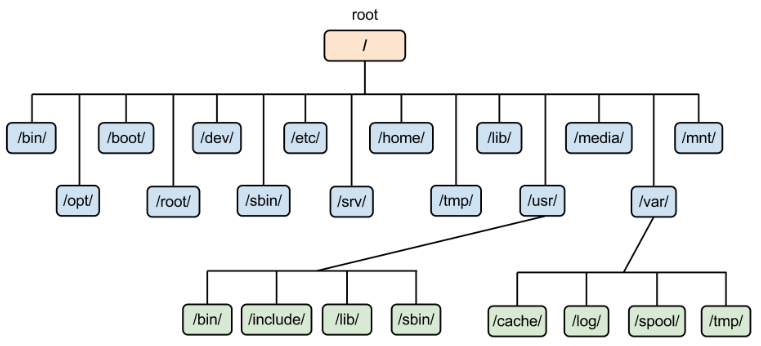

# 리눅스 파일과 디렉터리 종류

# 파일의 종류

## 일반 파일

- 데이터 저장에 주로 사용
- 텍스트, 실행, 이미지 파일 등 리눅스에서 사용하는 대부분의 파일
- 실행파일이나 이미지 파일의 경우 데이터가 바이너리 형태로 저장됨
    - 바아니러 파일이라고도 부름

## 디렉터리

- 디렉터리 파일에는 해당 디렉터리에 저장된 파일이나 하위 디렉터리에 대한 정보가 저장

## 심벌릭 링크

- 원본 파일을 대신하도록 원본 파일을 다른 이름으로 지정한 것으로 바로가기와 비슷

## 장치 파일

- 리눅스에서는 장치들도 파일 취급
- 장치를 관리하기 위해 해당 장치 파일에 접근해야함
- 장치 파일은 /dev 디렉터리 아래에 위치

# 디렉터리 구조

디렉터리 구조에 대한 그림

- 트리 구조
- 최상위 디렉터리를 루트 디렉터리라고 부름

| 디렉터리 명 | 설명 |
| --- | --- |
| home | 사용자 홈 디렉터리가 생성되는 곳 |
| media | CD_ROM이나 USB같은 외부 장치를 연결하는 디렉터리 |
| opt | 추가 패키지가 설치되는 디렉터리 |
| dev | 장치파일들이 저장되어 있는 디렉 |
| root | root계정의 홈 디렉터리입니다. (/ 디렉터리와는 다름) |
| sys | 리눅스 커널관련 정보가 있는 디렉터리 |
| usr | 기본 실행파일과 라이브러리 파일, 헤더 파일등의 파일이 저장되어있는 디렉터리 |
| boot | 부팅에 필요한 정보를 가진 파일들이 있는 디렉터리 |
| var | 시스템 운영중에 발생한 데이터와 로그가 저장되는 디렉터리 |
| tmp | 시스템 사용중에 발생한 임시데이터가 저장(부팅 시 초기화) |
| srv | FTP나 Web등 시스템에서 제공하는 서비스의 데이터가 저장되는 디렉터리 |
| run | 실행중인 서비스와 관련된 파일이 저장되는 디렉터리 |
| proc | 프로세스 정보 등 커널 관련 정보가 저장되는 디렉터리 |
| mnt | 파일 시스템을 임시로 연결하는 디렉터리 |
| etc | 리눅스 설정을 위한 각종 파일들을 가지고 있는 디렉터리 |