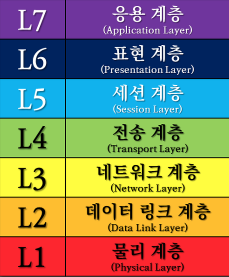

# Network 기초

- 
  
    [TCP & UDP](./Network 기초/TCP%20&%20UDP%206b8835b5d8b649f8be44c06ade2690ca.md)

---

: 서버와 클라이언트의 정보가 오가는 다리 역할을 하는 기술의 총칭
컴퓨터 네트워크는 데이터를 케이블에 실어 나르는 것을 의미

## LAN(Local Area Network)

- 비교적 좁은 범위 안에 존재하는 컴퓨터 네트워크를 의미
- LAN 케이블을 이용해 데이터를 전송하는 유선 LAN과 전파를 이용하여 데이터를 전송하는 무선 LAN으로 구분

## 네트워크 작동 원리

- 네트워크는 OSI 참조 모델을 바탕으로 작동

### OSI 7계층

1. 물리 계층
    - 네트워크 케이블의 재질이나 커넥터의 혀익, 핀의 나열 방법 등 물리적 요소를 규정
2. 데이터 링크 계층
    - 직접 연결된 기기 사이에 논리적인 전송로를 확립하는 방법을 규정
3. 네트워크 계층
    - 동일 또는 다른 네트워크의 기기와 연결하기 위한 주소와 경로의 선택 방법을 규정
4. 전송 계층
    - 데이터를 통신할 상대에게 확실하게 전달하는 방법을 규정
5. 세션 계층
    - 데이터를 흘려보내는 논리적인 통신로의 확립과 연결 끊기에 대해 규정
6. 표현 계층
    - 애플리케이션 데이터를 통신에 적합한 형태로 변환하는 방법을 규정
7. 응용 계층
    - 애플리케이션 별로 서비스를 제공하는 방법을 규정

| OSI 참조 모델 | 프로토콜 |
| --- | --- |
| 응용 계층 | 애플리케이션 프로토콜(HTTP 등) |
| 표현 계층 | 애플리케이션 프로토콜(HTTP 등) |
| 세션 계층 | 애플리케이션 프로토콜(HTTP 등) |
| 전송 계층 | TCP / UDP |
| 네트워크 계층 | IP / ICMP / ARP |
| 데이터링크 계층 | 이더넷 |
| 물리 계층 | 이더넷 |

### TCP / IP 4계층

1. 네트워크 엑세스 계층(Network Access Layer or Network Interface Layer)
    - OSI 7 계층의 물리와 데이터링크 계층에 해당함
    - 물리적인 주소로 MAC을 사용
    - LAN, 패킷망 등에 사용
2. 인터넷 계층(Internet Layer)
    - OSI 7계층의 네트워크 계층에 해당
    - 통신 노드 간 IP 패킷을 전송하는 기능과 라우팅 기능을 담당
    - 프로토콜: IP, ARP, RARP
3. 전송 계층(Transport Layer)
    - OSI 7계층의 전송 계층에 해당
    - 통신 노드간의 연결제어와 신뢰성 있는 데이터 전송 담당
    - 프로토콜: TCP, UDP
4. 응용 계층(Application Layer)
    - OSI 7계층의 세션 계층, 표현 계층, 응용 계층에 해당
    - TCP / UDP 기반의 응용 프로그램을 구현할 때 사용
    - 프로토콜: FTP, HTTP, SSH

## 프로토콜

: 네트워크 통신을 위한 규칙을 의미
역할로는 데이터의 캡슐화와 캡슐 해제화
계층을 넘어설 때마다 데이터를 캡슐에 넣거나 꺼냄

프로토콜 캡슐화 / 캡슐 해제화

### 이더넷

- OSI 제 1계층과 제 2계층의 기술 규격
- 유선 네트워크의 경우 거의 대부분 이더넷 사용
- 이더넷은 네트워크 계층으로부터 받은 데이터(패킷)에 프레임의 처음을 나타내는 프리앰블(preamble)과 목적지(수신자)와 출발지(송신자)를 나타내는 헤더, 비트 오류체크에 사용하는 FCS(Frame Check Sequence)를 추가하여 프레임을 생성
- 이더넷은 MAC 주소라는 48비트로 된 식별자를 이용하여 컴퓨터를 식별

프레임 구조

### MAC 주소

- 데이터링크 계층에서 통신을 위해 사용되는 48비트로 된 식별자
- 8비트마다 `-`이나 `:`을 통해 구분하여 1진수로 표기
- 상위 24비트는 제조업체 별 할당한 제조업체 코드, 하위 24비트는 제조업체가 기기별로 할당한 고유한 코드
- NIC에 할당된 MAC 주소는 전 세계에 하나밖에 없는 고유한 값

### NIC

- Network Interface Controller는 PC를 네트워크에 연결해 통신을 위해 사용하는 하드웨어 장치
- 흔히 네트워크 카드, 랜 카드 등으로 부름

### 스위칭

- 네트워크 스위치가 데이터 패킷 내 포함된 주소 정보에 따라 해당 입력 패킷을 해당 출력 포트에 빠르게 접속 시키는 기능을 스위칭이라고 함(네트워크 스위치가 수행하는 프레임 전송)

### IP

- 전송 계층으로부터 받은 데이터(세그먼트)에 IP 헤더를 붙여 패킷으로 만드는 역할
- IP 헤더에는 여러 필드 값(버전, 헤더 길이, 프로토콜 등), 출발지 IP 주소, 도착지 IP 주소가 들어감

패킷 구조

- IP는 IP 주소라는 32비트로 된 식별 번호를 사용해 컴퓨터를 식별함
- IP 주소는 8비트마다 `.`으로 구분하고 10진수로 표기
- IP 주소는 네트워크 분리 및 구분을 위해 서브넷 마스크라는 32비트로 된 값과 세트로 사용
- IP 주소는 서브넷 마스크로 분할된 네트워크부와 호스트부로 구성되어 있음
- 네트워크 부는 네트워크 자체를 나타냄, 호스트는 해당 네트워크에 연결되어 있는 단말을 나타냄
- 서브넷 마스크는 연속된 1의 값이나 연속된 0의 값만 가질 수 있음 1이 네트워크, 0이 호스트부

## 라우팅

- 라우터가 네트워크에서 패킷을 목적지까지 최적의 경로로 선택하는 과정
- 라우터는 라우팅 테이블을 이용해 패킷을 전송
- 라우팅 테이블은 목적지 네트워크와 목적지 네트워크로 가기 위해 보내야 할 곳의 IP 주소(next hop)으로 구성
- next hop이란 패킷이 목적지 네트워크까지 가기 위해 도달하는 다음 라우터를 의미
- 패킷이 목적지까지 가는데 거치는 라우터 개수를 hop count라 함
- 라우터는 패킷을 받으면 해당 패킷의 목적지 IP 주소와 라우팅 테이블의 목적지 네트워크를 대조해 해당 IP 주소가 있으면 패킷을 전송하고 없다면 폐기
- 라우팅에는 정적과 동적 라우팅으로 존재

### 정적 라우팅

- 수동으로 라우팅 테이블을 만드는 방법
- 목적지 네트워크와 넥스트 홉을 하나하나 설정
- 정적 라우팅은 네트워크를 구성하는 모든 라우터에 대해 라우팅 설정이 필요
- 설정을 알기 쉽고 관리하기 쉽기에 소규모 네트워크 환경에서 주로 사용

### 동적 라우팅

- 인접하는 라우터들이 라우팅 정보를 서로 교환하며 라우팅 테이블을 자동으로 만드는 방법
- 라우팅 정보를 교환하기 위한 프로토콜을 라우팅 프로토콜이라고 함
- 네트워크 환경의 변화 대응과 장애 내구성 향상이 가능하기에 중간부터 대규모 네트워크 환경에 주로 사용

## ARP

- Address Resolution Protocol로 MAC 주소와 IP 주소를 대응 시키는 역할
- 네트워크 통신을 위해 제 3계층으로 부터 받은 패킷을 프레임으로 만들어 케이블로 흘려보내야 하는데 이때 출발지 MAC 주소는 자기 자신의 NIC에 쓰여 있는 MAC 주소를 알 수 있으나 목적지 MAC 주소는 알 수 없음 → ARP를 이용해 IP 주소로 부터 MAC 주소를 구할 수 있음
- 과정은 ARP request → ARP reply → ARP 테이블 등록 순
- IP 주소는 목적지가 바뀌지 않으나 MAC 주소는 NIC를 경유할 때 마다 바뀜

## TCP / UDP

### [TCP](https://www.notion.so/a477e229943548908906aa1cc4928774)

- Transmission Control Protocol은 전송 제어 프로토콜로 IP와 함께 TCP / IP로 불리며 제 4계층에서 사용되는 프로토콜
- TCP는 데이터를 송신할 때마다 확인 응답을 주고 받는 절차가 있어 통신의 신뢰성을 높임
- 웹이나 메일, 파일 공유 등 데이터를 누락시키고 싶지 않은 서비스에 주로 사용

### [UPD](https://www.notion.so/a477e229943548908906aa1cc4928774)

- User Datagram Protocol은 TCP와 함께 데이터 그램으로 알려진 단문 메세지를 교환하기 위해 사용하는 프로토콜
- 데이터만 보내고 확인 응답과 같은 절체를 생략 가능해 통신의 신속성을 높임
- 주로 DNS VoIP 등에 사용

### TCP와 UDP

- 모두 포트번호로 서비스를 식별
- 두 프로토콜을 구분하는 주요한 차이는 통신의 신속성인지 신뢰성인지
- 애플리케이션 데이터에 TCP 또는 UDP 헤드를 추가해 TCP 세그먼트나 UDP 세그먼트가 만들어짐

### 포트 번호

- 컴퓨터 안에서 작동하는 애플리케이션을 식별하기 위해 사용되는 숫자
    - Well-known port(0~1023): 웹 서버나 메일 서버 등 일반적인 서버 소프트웨어가 서비스 요청을 대기할 때 사용
    - Registered port(1024~49151): 그 제조업체의 독자적인 서버 소프트웨어가 클라이언트 서버 대기 요청을 대기할 때 사용
    - Dynamic port(49152~65535): 서버가 클라이언트를 식별하기 위해 사용
    (클라이언트에서 서버에 대해 요청을 보낼 때 출발지 포트로 랜덤 지정해 보냄)

## NAT와 NAPT

- NAT와 NAPT는 기업이나 가정의 LAN에서 사용하는 프라이빗 IP 주소를 인터넷에서 사용하는 글로벌 IP 주소로 변환하는 기술

### NAT

- Network Address Translation이란 프라이빗 IP 주소와 글로벌 IP 주소를 1:1로 연결해 변환
- 서버를 인터넷에 공개할 때 사용
- LAN에서 인터넷으로 연결할 때 출발지 IP 주소를 변환, 인터넷에서 LAN으로 연결할 때에는 목적지 IP 주소를 변환

### NAPT

- Network Address Port Translation이란 프라이빗 IP 주소와 글로벌 IP 주소를 n:1로 연결해 변환
- NAPT는 LAN에서 인터넷에 엑세스 할 때 출발지 IP 주소 뿐만 아니라 출발지 포트 번호도 같이 반환함으로써 n:1 반환함
- 하나의 IP 포트가 여러개이기 때문에 n:1이 가능

# Gateway

- 한 네트워크(segment)에서 다른 네트워크로 이동하기 위하여 거쳐야 하는 지점
- 서로 다른 네트워크(이기종 네트워크)를 연결
- 서로 다른 네트워크의 프로토콜이 다를 경우에 중재 역할
- 하위게층(1 ~ 3 layer)에서 주로 라우터가 이러한 역할을 함
- 상위계층(4 ~ 7 layer)에서 상이한 프로토콜들 간의 특수한 변환을 담당하는 복잡한 S/W를 수행하는 서버를 의미하기도 함

# Route

- 라우팅 경로를 확인하고 설정하는 유틸리티
    - 라우팅 경로: 라우팅 테이블, 현재 시스템이 자기 자신 또는 외부 네트워크와 통신하기 위한 각 개별 이더넷들의 데이터 통신 경로(쉽게 외부 통신 경로)

## 할 수 있는 작업들

- 시스템 라우팅 경로 확인 작업
    - route
- 시스템 라우팅 경로 추가 작업
    - route add -net <networkaddress> netmask <netmaskvalue> dev [interfacename]
- 시스템 라우팅경로 제거 작업
    - route del -net <networkaddress> netmask <netmaskvalue>[dev <interfacename>]
- 기본 게이트웨이 추가 작업
    - route add default gw <defaultgatewayaddress> dev <interfacename>
- 기본 게이트웨이 제거 작업
    - route del default gw <defaultgatewayaddress> [dev <interfacename>]
- loop back interface 추가 작업
    - ifconfig lo <address>
    route add -net <address>

[목록으로](https://www.notion.so/1st-Seminar-721684f8950748038283aab89169f310)