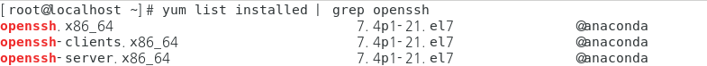

# Putty

# 준비 사항

1. 리눅스 머신에서 sshd 데몬 실행 상태 확인
2. 리눅스 머신에서 ssh 포트 방화벽 허용 확인
3. 리눅스 머신에서 호스트 allow 설정
4. 가상머신 포트 포워딩 설정
5. 윈도우 PC에서 PuTTY 프로그램 준비

SSH 원격 접속을 위해 해당 리눅스 머신에 sshd 데몬이 실행중이고 방화벽이 허용 상태여야 함

# SSH

- 보호된 원격 로그인, 원격 데이터 통신에 사용되는 프로토콜
- 패킷을 암호화해 전송하기에 도청, 위변조 차단 가능
- 서버 / 클라이언트 구조로 동작하며 보통 TCP 포트 22번 사용
- SSH를 사용하기 위해 SSH 지원도구가 서버와 클라이언트 모두 필요
    - SSH 서버 프로그램: sshd
    - SSH 클라이언트 프로그램: ssh, sftp, scp 등 사용 목적에 따라 다양

# OpenSSH Package

- SSH 프로토콜을 사용하는 공개 소스 프로그램 패키지
- 서버 프로그램인 sshd와 클라이언트 프로그램들을 모두 포함
- 대부분의 리눅스 배포판에서는 OpenSSH가 포함되어 있어 별도 설치가 필요하지 않음

## 설치 및 업데이트

<aside>
 **설치 확인 방법**

```bash
yum list installed | grep openssh
```



yum list installed | grep openssh 스크린샷

위 스크린샷과 유사한 결과가 나오면 패키지가 설치된 것

**설치와 업데이트**

```bash
yum -y install openssh #OpenSSH 패키지 설치
yum -y update openssh #OpenSSH 패키지 업데이트
```

</aside>

## SSH 서버 실행

- 가상 머신의 리눅스로 원격 접속하기 위해 SSH 서버 프로그램인 sshd 데몬이 실행중이여야 함
- sshd 실행 상태는 service sshd status 명령으로 확인 가능
- OpenSSH 패키지가 이미 설치되어 있다면 기본적으로 부팅 시 자동 실행

<aside>
 **sshd 데몬 실행 확인**

```bash
service sshd status
```


service sshd status 스크린샷

**실행과 자동 실행 설정**

```bash
service sshd start #sshd 실행
chkconfig sshd on #부팅 시 sshd 자동 실행
```

</aside>

## 방화벽 설정

- SSH가 사용하는 22번 포트를 허용하도록 방화벽 설정이 되어있어야 함
- iptables -nL 명령을 입력하여 INPUT 체인에 tcp 목적지 포트 22가 허용 설정이 되어 있는지 확인

<aside>
 **INPUT 체인에 tcp 목적지 포트 22번이 허용인지 확인**

```bash
iptables -nL
```


iptables -nL 스크린샷


체인 확인 스크린샷

**INPUT 체인 허용 설정 및 저장**

```bash
iptables -A INPUT -p tcp -m tcp --dport 22 -j ACCEPT #INPUT 체인 허용
service iptables save #iptables 변경사항 저장
```

</aside>

## Host allow 설정

- 리눅스 머신의 TCP / IP 서비스를 이용할 수 있는 호스트를 설정
    1. VirtualBox의 파일 → 호스트 네트워크 관리자 클릭
       
        
        
        VirtualBox 설정 스크린샷
        
    2. VirtualBox Host-Only Ehternet Adapter의 IP 주소 확인
       
        
        
        호스트 네트워크 관리자 스크린샷
        
    3. /ect/hosts.allow 파일을 편집
       
        ```bash
        vi /etc/hosts.allow
        ```
        
        
        
        vi /etc/hosts.allow 스크린샷
        
        ```bash
        sshd: [IP ADDRESS]
        ```
        
        
        
        /etc/hosts.allow 변경 스크린샷
        

# PuTTY

- PuTTY는 윈도우에서 사용할 수 있는 SSH 클라이언트 프로그램([다운로드](https://www.chiark.greenend.org.uk/~sgtatham/putty/latest.html))

## 접속하기

- 접속을 위해 리눅스 머신의 IP 주소를 알아야 하므로 ifconfig 명령으로 확인

<aside>
 **IP 주소 확인**

```bash
ifconfig
```


ifconfig 스크린샷 enp0s3 → enp0s8, 19 → 192

</aside>

- VirtualBox에서 포트 포워딩
    1. 대상 머신을 선택한 후 설정 클릭
       
        
        
    2. 네트워크 메뉴 → 고급 → 포트 포워딩 클릭
       
        
        
    3. `+` 클릭
       
        
        
    4. 값 설정
       
        
        
    5. PuTTY 실행 후 Host Name에 VirtualBox Host-Only Ehternet Adapter IP, Port는 22로 Open
       
        