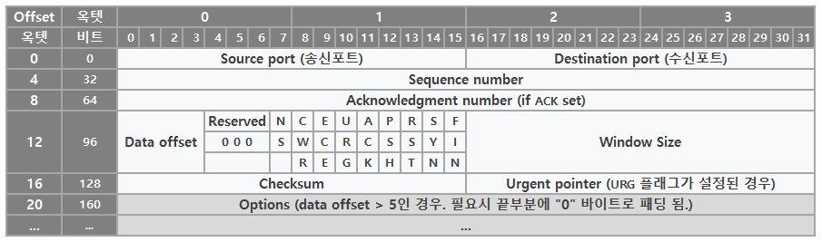

# TCP Segment Structure

# Segment Structure

- TCP는 Data Stream으로부터 데이터를 받아 들여 이것을 일정 단위로 분할한 뒤 TCP Header를 덧붙여 TCP segment를 생성
- TCP segment는 IP Datagram에 캡슐화되어 상대방과 주고 받음
    - IP Datagram: IP에서 사용하는 Packet을 말함
        - Packet: Packet 방식의 컴퓨터 네트워크가 전달하는 데이터의 형식화된 block
- TCP Packet이라는 용어가 종종 사용되나 정확한 표현은 아님
- Segment가 TCP Protocol Data Unit(PDU)을 의미하는 정확한 표현
    - Datagram은 IP PDU를 Frame은 데이터링크 계층 PDU를 의미
- Process는 TCP를 통해 data buffer를 인수로 넘겨줘 데이터를 전송
- TCP들은 data buffer를 묶어 Segment를 생성해 인터넷 모듈(IP 등)을 통해 목적지의 TCP로 각각의 Segment들을 전송

<aside>
 **TCP Segment = Segment Header(TCP Header) + Data**

</aside>

- TCP Header는 10개의 필수 필드 및 옵션 확장 필드들을 포함
- Header 뒤에 Data Section이 따라옴
    - Data Section의 내용은 application의 Payload Data
        - Payload: 전송의 근본적 목적이 되는 데이터의 일부분
        그 데이터와 함께 전송되는 Header와 Metadata와 같은 data는 제외
- Data Section의 길이는 TCP Segment Header에서 결정되지 않으며 전체 IP Datagram의 길이에서 TCP Header와 캡슐화된 IP Header의 길이를 뺀 값으로 계산함
⇒ Data Section의 길이는 IP Header를 통해 결정

# TCP Header 구조

TCP Header

## Source Port(16 bit)

- 송신측의 포트 번호

## Destination Port(16 bit)

- 수신측의 포트 번호

## Sequence Number(32 bit)

- TCP Segment 안의 데이터의 송신 바이트 흐름의 위치를 가리킴
- 다른 호스트로 전달되는 패킷은 여러 개의 서로 다른 경로를 거치면서 전달되어 패킷의 순서가 뒤바뀔 수 있어 수신측은 재조립해야 할 필요가 있는데 이때 이용
    - SYN Flag가 1로 설정된 경우, 이것은 초기 시퀀스 번호
    - SYN Flage가 0으로 해제된 경우, 이것은 현재 session의 Segment Data의 누적 시퀀스 번호

## Acknowledgment Number(32 bit)

- ACK Flag가 설정된 경우 이 필드의 값은 수신자가 예상하는 다음 시퀀스 번호
- 한쪽이 보낸 최초의 ACK는 반대쪽 초기 시퀀스 번호 자체에 대한 확인응답이 되며 데이터에 대한 응답은 포함되지 않음

## Data Offset(4 bit)

- 32-bit word 단위로 나타낸 TCP 헤더 크기 값
- 헤더의 최소 크기는 5 word(TCP Option이 없을 때) 최대 크기는 15 word이다
- 최솟값은