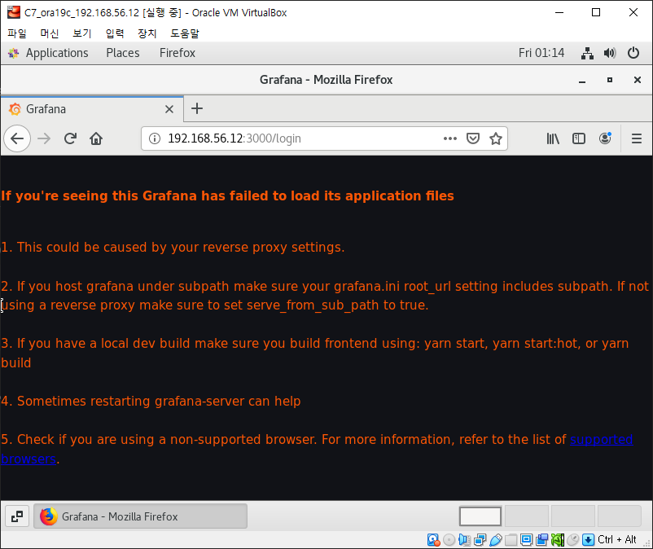

# Grafana

# Grafana

- 시계열 매트릭 데이터를 시각화하는데 최적화된 대시보드를 제공해주는 오픈소스 툴킷
- 다양한 DB를 연결해 DB의 데이터로 간단히 시각화 가능
- Server Resource의 매트릭 정보나 Log같은 데이터를 시각화하기 위해 주로 쓰임
- 특정 수치에 트리거를 걸어 알림을 전달받는 기능도 제공
- 대시보드를 import해서 사용하거나 커스터마이징 할 수 있음

## Install Grafana

### Enterprise

- 기본 및 권장 에디션
- OSS 에디션의 모든 기능이 포함

### Ubuntu & Debian

```bash
sudo apt-get install -y adduser libfontconfig1
wget https://dl.grafana.com/enterprise/release/grafana-enterprise_9.3.1_amd64.deb
sudo dpkg -i grafana-enterprise_9.3.1_amd64.deb
```

### Standoalone Linux Binaries

```bash
wget https://dl.grafana.com/enterprise/release/grafana-enterprise-9.3.1.linux-amd64.tar.gz
tar -zxvf grafana-enterprise-9.3.1.linux-amd64.tar.gz
```

### ReadHat, CentOS, RHEL, Fedora

```bash
wget https://dl.grafana.com/enterprise/release/grafana-enterprise-9.3.1-1.x86_64.rpm
sudo yum install grafana-enterprise-9.3.1-1.x86_64.rpm
```

### OpenSUSE & SUSE

```bash
wget https://dl.grafana.com/enterprise/release/grafana-enterprise-9.3.1-1.x86_64.rpm
sudo rpm -i --nodeps grafana-enterprise-9.3.1-1.x86_64.rpm
```

## OSS

### Ubuntu & Debian

```bash
sudo apt-get install -y adduser libfontconfig1
wget https://dl.grafana.com/oss/release/grafana_9.3.1_amd64.deb
sudo dpkg -i grafana_9.3.1_amd64.deb
```

### Standoalone Linux Binaries

```bash
wget https://dl.grafana.com/oss/release/grafana-9.3.1.linux-amd64.tar.gz
tar -zxvf grafana-9.3.1.linux-amd64.tar.gz
```

### ReadHat, CentOS, RHEL, Fedora

```bash
wget https://dl.grafana.com/oss/release/grafana-9.3.1-1.x86_64.rpm
sudo yum install grafana-9.3.1-1.x86_64.rpm
```

### OpenSUSE & SUSE

```bash
wget https://dl.grafana.com/oss/release/grafana-9.3.1-1.x86_64.rpm
sudo rpm -i --nodeps grafana-9.3.1-1.x86_64.rpm
```

# Grafana 실행

```bash
# 새로운 Daemon Reload
sudo systemctl daemon-reload

# Grafana-server 시작
sudo systemctl start grafana-server

# Grafana-server가 잘 시작되는지 확인
sudo systemctl status grafana-server

# 부팅 후 자동 실행 설정
sudo systemctl enable grafana-server.service
```



firefox가 구형일 경후 위와 같은 문제가 뜰 수 있음


yum -y update firefox 후 해결

# Prometheus

## Install Prometheus

```bash
$ sudo useradd -m -s /bin/bash prometheus
$ su - prometheus
$ wget https://github.com/prometheus/prometheus/releases/download/v2.21.0/prometheus-2.21.0.linux-amd64.tar.gz
$ tar -xzvf prometheus-2.21.0.linux-amd64.tar.gz
$ mv prometheus-2.21.0.linux-amd64/ prometheus
$ exit
```

## Prometheus Service 작성

```bash
[Unit]
Description=Prometheus Server
Documentation=https://prometheus.io/docs/introduction/overview/
After=network-online.target

[Service]
User=prometheus
Restart=on-failure
ExecStart=/home/prometheus/prometheus/prometheus \
  --config.file=/home/prometheus/prometheus/prometheus.yml \
  --storage.tsdb.path=/home/prometheus/prometheus/data

[Install]
WantedBy=multi-user.target
```

## Start Prometheus Service

```bash
$ sudo systemctl daemon-reload
$ sudo systemctl start prometheus
$ sudo systemctl status prometheus

# 재부팅시 Prometheus 서비스 자동 실행 설정
$ sudo systemctl enable prometheus
```


# node_exporter

```bash
wget https://github.com/prometheus/node_exporter/releases/download/v1.2.2/node_exporter-1.2.2.linux-amd64.tar.gz

tar xzvf node_exporter-1.2.2.linux-amd64.tar.gz

mv node_exporter-1.2.2.linux-amd64 node_exporter
```

[](https://computingforgeeks.com/forward-logs-to-grafana-loki-using-promtail/)

[Troubleshooting | Grafana Loki documentation](https://grafana.com/docs/loki/latest/operations/troubleshooting/)