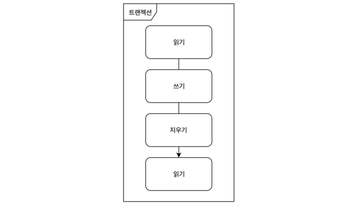

# RDBMS

# DB

- 컴퓨터에 저장되는 데이터 집합
  
    = 일반적으로 컴퓨터 시스템에 전자적으로 저장되는 구조화된 정보
    
    = 데이터의 조직화된 모음
    
- 데이터들은 쉽게 접근 및 사용을 위해 구조화된 형태로 존재
    - Tables, key-value 등등

# DBMS

- DataBase Management System은 DB를 관리하는 시스템
- DB와 유저, 프로그램 사이의 인터페이스 역할 수행
- 유저가 정보를 생성, 검색, 수정, 삭제 등의 작업을 관리할 수 있게 함
- SQL 튜닝, 데이터 백업, 복구 모니터링 가능(SQL 기반 DBMS)

# Relational Database

- DB의 유형 중 하나로 관계형 데이터베이스라 불림
- 구조화
    - 데이터베이스 안에서 데이터들 사이의 관계성을 가지는 데이터를 다룸
    - 테이블 형태로 데이터를 저장
        - 하나의 테이블에는 다수의 데이터(tuple, record, 행)를 저장
            - 데이터는 다수의 속성(attributes, 열)dmf rkwla

# RDBMS

- Relational DataBase Management System으로 관계형 DB 관리 시스템

## RDBMS 특징

### 2차원 구조 모델

- 속성과 데이터를 기반으로한 수평적 구조
- 테이블 형태로 데이터 저장
- 구조화된 데이터를 저장하기 위해 엄격한 구조 제공

### Transaction

- 여러 작업들을 하나로 묶은 단위
- 한 덩어리의 작업들은 모두 실행되거나 아예 실행되지 않음(All-Or-Nothing)

Transaction은 작업을 묶은 하나의 단위

wal, force logging***

### ACID

- Atomicity, Consistency, Isolation, Durability의 약자
    - Atomicity: 원자성
        - 트랜잭션과 관련된 작업들이 하나의 원자 단위로 수행되는 것을 보장
        - 처음부터 끝까지 완전하게 실행되며 실패하는 일이 없도록 함
    - Consistency: 일관성
        - 트랜잭션이 완료될 때 언제나 일관된 DB 상태를 유지해 줌
    - Isolation: 독립성
        - 트랜잭션을 수행할 때 다른 트랜잭션의 연산 작업이 끼어들지 못하도록 보장
        - 다른 트랜잭션의 연산이 중간 단계의 데이터를 볼 수 없음
    - Durability: 지속성 → 오라클에 연관이 많음
        - 성공적인 트랜잭션이 영원히 반영됨
        - 시스템 에러, DB 일관성 체크 등을 하여도 유지
        - 트랜잭션은 로그에 모든 것이 저장된 후에만 Commit 상태로 간주 됨

### SQL 사용

- Structed Query Language로 데이터를 접근하며 CRUD 조작이 가능함

### 여러 OS 사용 가능

- Android, iOS, Solaris, Linux, Window, VxWorks, Unix 등 여러 OS에서 사용 가능

### 사용자가 테이블을 분할 및 복제

- 데이터베이스 사용자가 테이블과 인덱스를 만들어 데이터 관리 가능
- 분할(Partitioning) 및 복제 기능들은 비즈니스 요구 사항을 충족하며 전반적 성능 개선을 도출함

## RDBMS 종류와 특징

### Oracle

- 관계형 모델에서 객체-관계형 DB로 확장
- 개발자가 스스로 데이터형과 메서드를 자유롭게 정의해 DB를 개발할 수 있음
    - 사용자 정의 유형, 상속 및 다형성과 같은 객체 지행 기능 구현 가능
- 대량의 데이터 처리에 용이함
- 비공개 코드 소스와 폐쇄적인 운영, 고비용으로 접근성이 떨어짐

### MySQL

- 임베디드 시스템에서도 동작 가능
- 웹 기반 애플리케이션과 잘 맞음
- 프로시저를 통해 데이터 레코드 삽입, 삭제를 하나로 묶어서 사용 가능
- 이벤트식으로 동작하는 트리거 존재
- 5천건 이하의 데이터 다루는데 적합
- 속도, 안정성, 확장 가능성을 추구함

### MS-SQL(Microsoft SQL Server)

- 리눅스 버전은 오픈소스이나 비공개 소스이며 폐쇄적 운용중
- 높은 보안성, 신뢰성, 생산성, 지능적 특징

### PostgreSQL

- 오픈소스 객체-관계형 DBMS(ORDBMS)
- 데이터 무결성, 신뢰성, 정확성, 다양한 기능, 확장성, 오픈소스 커뮤니티 등 다양한 장점

### SQLite

- 임베디드에 사용될 목적으로 계발, 적은 메모리상에서 DBMS를 구현하는데 사용
- 용량이 작음, 빠름, 독립형, 서버리스, 제로 구성, 트랜잭셔널 SQL DB 엔진 구현

### Microsoft Access

- 소규모 DB에서 주로 사용
- 컴퓨터 활용 능력 1급에서 필기, 실습 시험이 존재

### MariaDB

- MySQL의 불확실한 라이선스 문제를 해결하기 위해 나온 RDBMS
- 빠른 확장과 여러 기능들이 포함
- MySQL과 비교해 애플리케이션 부분 속도가 약 5천배 빠름