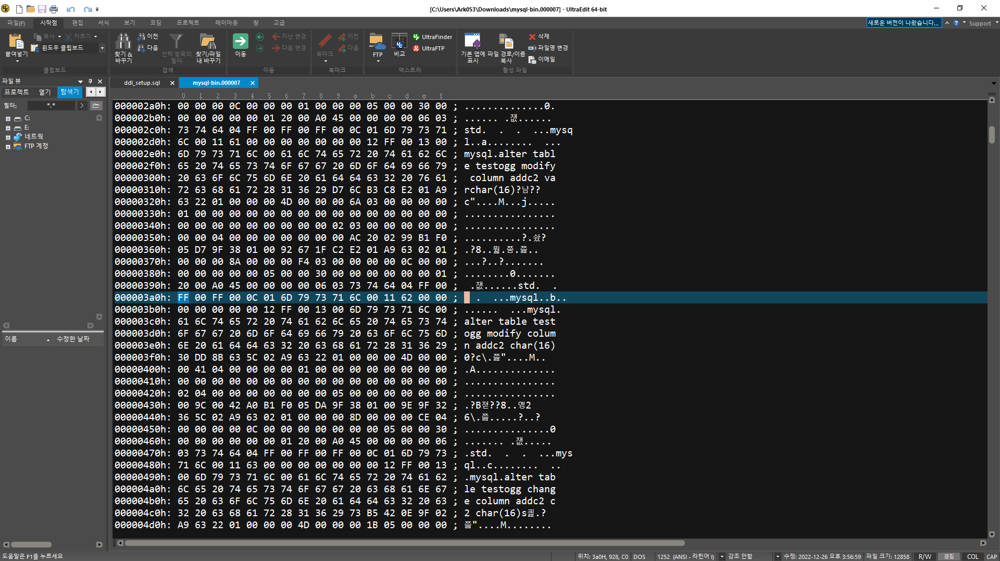

# OGG for MySQL TEST

<aside>
📖 **OGG for MySQL TEST 목차**

</aside>

# 예시

```
EXTRACT ext01

setenv(MYSQL_HOME="/var/lib/mysql")
setenv(MYSQL_UNIX_PORT="/var/lib/mysql/mysql.sock")
SOURCEDB mysql@localhost:3306 USERID ogg PASSWORD KimjiKimji0@@
tranlogoptions altlogdest "/var/lib/mysql/mysql-bin.index"
EXTTRAIL ./dirdat/bb
GETTRUNCATES
DDL INCLUDE OBJNAME test.*;
table test.*;
```

# Metadata

```
Logdump 354 >n
TokenID x47 'G' Record Header    Info x01  Length  132
TokenID x48 'H' GHDR             Info x00  Length   35
 4500 0041 5100 aa01 6ccf ab5a e816 f302 0700 0000 | E..AQ...l..Z........
 0000 0000 0100 0000 0352 0000 0001 00             | .........R.....
TokenID x44 'D' Data             Info x00  Length   81
TokenID x5a 'Z' Record Trailer   Info x01  Length  132
___________________________________________________________________
Hdr-Ind    :     E  (x45)     Partition  :     .  (x00)
UndoFlag   :     .  (x00)     BeforeAfter:     A  (x41)
RecLength  :    81  (x0051)   IO Time    : 2022/12/26 15:03:45.978.220
IOType     :   170  (xaa)     OrigNode   :     1  (x01)
TransInd   :     .  (x03)     FormatType :     R  (x52)
SyskeyLen  :     0  (x00)     Incomplete :     .  (x00)
DDR/TDR index:   (001, 000)     AuditPos   : 7
Continued  :     N  (x00)     RecCount   :     1  (x01)

2022/12/26 15:03:45.978.220 Metadata             Len 81 RBA 6237
Database Name:
*
DDR Version: 1
Database type: MYSQL
Character set ID: UTF-8
National character set ID: UTF-16BE
Locale: en_US
Case sensitivity: 11 11 11 22 22 11 11 11 11 11 11 11 11 11 11 11
TimeZone: GMT+09:00
*
Logdump 355 >n
TokenID x47 'G' Record Header    Info x01  Length  202
TokenID x48 'H' GHDR             Info x00  Length   48
 4500 0041 8a00 aa02 6dcf ab5a e816 f302 0700 0000 | E..A....m..Z........
 0000 0000 0100 0100 0352 0000 0001 0000 0000 0000 | .........R..........
 0000 0000 0000 0000                               | ........
TokenID x44 'D' Data             Info x00  Length  138
TokenID x5a 'Z' Record Trailer   Info x01  Length  202
___________________________________________________________________
Hdr-Ind    :     E  (x45)     Partition  :     .  (x00)
UndoFlag   :     .  (x00)     BeforeAfter:     A  (x41)
RecLength  :   138  (x008a)   IO Time    : 2022/12/26 15:03:45.978.221
IOType     :   170  (xaa)     OrigNode   :     2  (x02)
TransInd   :     .  (x03)     FormatType :     R  (x52)
SyskeyLen  :     0  (x00)     Incomplete :     .  (x00)
DDR/TDR index:   (001, 001)     AuditPos   : 7
Continued  :     N  (x00)     RecCount   :     1  (x01)

2022/12/26 15:03:45.978.221 Metadata             Len 138 RBA 6369
Table Name: test.ogg_test
*
 1)Name          2)Data Type        3)External Length  4)Fetch Offset      5)Scale         6)Level
 7)Null          8)Bump if Odd      9)Internal Length 10)Binary Length    11)Table Length 12)Most Sig DT
13)Least Sig DT 14)High Precision  15)Low Precision   16)Elementary Item  17)Occurs       18)Key Column
19)Sub DataType 20)Native DataType 21)Character Set   22)Character Length 23)LOB Type     24)Partial Type
25)Remarks
*
TDR version: 11
Definition for table test.ogg_test
Record Length: 132
Columns: 2
c1  132     11        0  0  0 0 0      4      4      4 0 0 0 0 1    0 1   0    3       -1      0 0 0
c2   64    120        7  0  0 1 0    120    120      0 0 0 0 0 1    0 0   0  253        0      0 0 0
End of definition
```

# DML

## INSERT

```sql
mysql> insert into ogg_test values (1, 'insert');
```

```
Logdump 356 >n
TokenID x47 'G' Record Header    Info x01  Length  162
TokenID x48 'H' GHDR             Info x00  Length   36
 450c 0041 1800 05ff 00a0 8d5a e816 f302 0700 0000 | E..A.......Z........
 0000 0000 ea2e 0000 0352 0000 0001 0000           | .........R......
TokenID x44 'D' Data             Info x00  Length   24
TokenID x54 'T' GGS Tokens       Info x00  Length   82
TokenID x5a 'Z' Record Trailer   Info x01  Length  162
___________________________________________________________________
Hdr-Ind    :     E  (x45)     Partition  :     .  (x0c)
UndoFlag   :     .  (x00)     BeforeAfter:     A  (x41)
RecLength  :    24  (x0018)   IO Time    : 2022/12/26 15:03:44.000.000
IOType     :     5  (x05)     OrigNode   :   255  (xff)
TransInd   :     .  (x03)     FormatType :     R  (x52)
SyskeyLen  :     0  (x00)     Incomplete :     .  (x00)
AuditRBA   :      12010       AuditPos   : 7
Continued  :     N  (x00)     RecCount   :     1  (x01)

2022/12/26 15:03:44.000.000 Insert               Len    24 RBA 6571
Name: test.ogg_test  (TDR Index: 1)
After  Image:                                             Partition x0c   G  s
 0000 0600 0000 0000 0001 0100 0a00 0000 0600 696e | ..................in
 7365 7274                                         | sert
Column 0 (0x0000), Length 6 (0x0006).
 0000 0000 0001                                    | ......
Column 1 (0x0001), Length 10 (0x000a).
 0000 0600 696e 7365 7274                          | ....insert

GGS tokens:
TokenID x4c 'L' LOGCSN           Info x00  Length   37
 3030 3030 3030 3030 3030 3030 3030 3030 3030 3030 | 00000000000000000000
 373a 3030 3030 3030 3030 3030 3132 3034 31        | 7:000000000012041
TokenID x36 '6' TRANID           Info x00  Length   37
 3030 3030 3030 3030 3030 3030 3030 3030 3030 3030 | 00000000000000000000
 373a 3030 3030 3030 3030 3030 3131 3838 37        | 7:000000000011887
```

## UPDATE

```sql
mysql> update ogg_test set c2='update';
```

```
Logdump 359 >n
TokenID x47 'G' Record Header    Info x01  Length  162
TokenID x48 'H' GHDR             Info x00  Length   36
 450c 0041 1800 0fff 8001 4f67 e816 f302 0700 0000 | E..A......Og........
 0000 0000 3430 0000 0352 0000 0001 0000           | ....40...R......
TokenID x44 'D' Data             Info x00  Length   24
TokenID x54 'T' GGS Tokens       Info x00  Length   82
TokenID x5a 'Z' Record Trailer   Info x01  Length  162
___________________________________________________________________
Hdr-Ind    :     E  (x45)     Partition  :     .  (x0c)
UndoFlag   :     .  (x00)     BeforeAfter:     A  (x41)
RecLength  :    24  (x0018)   IO Time    : 2022/12/26 15:07:18.000.000
IOType     :    15  (x0f)     OrigNode   :   255  (xff)
TransInd   :     .  (x03)     FormatType :     R  (x52)
SyskeyLen  :     0  (x00)     Incomplete :     .  (x00)
AuditRBA   :      12340       AuditPos   : 7
Continued  :     N  (x00)     RecCount   :     1  (x01)

2022/12/26 15:07:18.000.000 FieldComp            Len    24 RBA 6733
Name: test.ogg_test  (TDR Index: 1)
After  Image:                                             Partition x0c   G  s
 0000 0600 0000 0000 0001 0100 0a00 0000 0600 7570 | ..................up
 6461 7465                                         | date
Column 0 (0x0000), Length 6 (0x0006).
 0000 0000 0001                                    | ......
Column 1 (0x0001), Length 10 (0x000a).
 0000 0600 7570 6461 7465                          | ....update

GGS tokens:
TokenID x4c 'L' LOGCSN           Info x00  Length   37
 3030 3030 3030 3030 3030 3030 3030 3030 3030 3030 | 00000000000000000000
 373a 3030 3030 3030 3030 3030 3132 3337 31        | 7:000000000012371
TokenID x36 '6' TRANID           Info x00  Length   37
 3030 3030 3030 3030 3030 3030 3030 3030 3030 3030 | 00000000000000000000
 373a 3030 3030 3030 3030 3030 3132 3230 34        | 7:000000000012204
```

## DELETE

```sql
mysql> delete from ogg_test where c1=1;
```

```
Logdump 360 >n
TokenID x47 'G' Record Header    Info x01  Length  148
TokenID x48 'H' GHDR             Info x00  Length   36
 450c 0042 0a00 03ff 80c7 8d6c e816 f302 0700 0000 | E..B.......l........
 0000 0000 6831 0000 0352 0000 0001 0000           | ....h1...R......
TokenID x44 'D' Data             Info x00  Length   10
TokenID x54 'T' GGS Tokens       Info x00  Length   82
TokenID x5a 'Z' Record Trailer   Info x01  Length  148
___________________________________________________________________
Hdr-Ind    :     E  (x45)     Partition  :     .  (x0c)
UndoFlag   :     .  (x00)     BeforeAfter:     B  (x42)
RecLength  :    10  (x000a)   IO Time    : 2022/12/26 15:08:46.000.000
IOType     :     3  (x03)     OrigNode   :   255  (xff)
TransInd   :     .  (x03)     FormatType :     R  (x52)
SyskeyLen  :     0  (x00)     Incomplete :     .  (x00)
AuditRBA   :      12648       AuditPos   : 7
Continued  :     N  (x00)     RecCount   :     1  (x01)

2022/12/26 15:08:46.000.000 Delete               Len    10 RBA 6895
Name: test.ogg_test  (TDR Index: 1)
Before Image:                                             Partition x0c   G  s
 0000 0600 0000 0000 0001                          | ..........
Column 0 (0x0000), Length 6 (0x0006).
 0000 0000 0001                                    | ......

GGS tokens:
TokenID x4c 'L' LOGCSN           Info x00  Length   37
 3030 3030 3030 3030 3030 3030 3030 3030 3030 3030 | 00000000000000000000
 373a 3030 3030 3030 3030 3030 3132 3637 39        | 7:000000000012679
TokenID x36 '6' TRANID           Info x00  Length   37
 3030 3030 3030 3030 3030 3030 3030 3030 3030 3030 | 00000000000000000000
 373a 3030 3030 3030 3030 3030 3132 3532 35        | 7:000000000012525
```

# DDL

## CREATE TABLE

```sql
mysql> create table ogg_test(c1 int primary key);
```

```
Logdump 339 >n
TokenID x47 'G' Record Header    Info x01  Length  682
TokenID x48 'H' GHDR             Info x00  Length   35
 4500 0041 9401 a000 c051 7c31 e816 f302 0000 0000 | E..A.....Q|1........
 0000 0000 0000 0000 0352 0000 0001 00             | .........R.....
TokenID x44 'D' Data             Info x00  Length  404
TokenID x54 'T' GGS Tokens       Info x00  Length  223
TokenID x5a 'Z' Record Trailer   Info x01  Length  682
___________________________________________________________________
Hdr-Ind    :     E  (x45)     Partition  :     .  (x00)
UndoFlag   :     .  (x00)     BeforeAfter:     A  (x41)
RecLength  :   404  (x0194)   IO Time    : 2022/12/26 14:52:15.000.000
IOType     :   160  (xa0)     OrigNode   :     0  (x00)
TransInd   :     .  (x03)     FormatType :     R  (x52)
SyskeyLen  :     0  (x00)     Incomplete :     .  (x00)
AuditRBA   :          0       AuditPos   : 0
Continued  :     N  (x00)     RecCount   :     1  (x01)

2022/12/26 14:52:15.000.000 DDLOP                Len   404 RBA 1423
Name:
After  Image:                                             Partition x00   G  s
 2c43 353d 2730 3030 3030 3030 3030 3030 3030 3030 | ,C5='000000000000000
 3030 3030 3037 3a30 3030 3030 3030 3030 3031 3034 | 000007:0000000000104
 3434 272c 2c42 373d 2727 2c2c 4232 3d27 3027 2c2c | 44',,B7='',,B2='0',,
 4332 313d 2727 2c2c 4233 3d27 7465 7374 272c 2c42 | C21='',,B3='test',,B
 343d 276f 6767 5f74 6573 7427 2c2c 4331 323d 2727 | 4='ogg_test',,C12=''
 2c2c 4331 333d 2727 2c2c 4235 3d27 5441 424c 4527 | ,,C13='',,B5='TABLE'
 2c2c 4236 3d27 4352 4541 5445 272c 2c42 383d 2747 | ,,B6='CREATE',,B8='G

GGS tokens:
TokenID x36 '6' TRANID           Info x00  Length   37
 3030 3030 3030 3030 3030 3030 3030 3030 3030 3030 | 00000000000000000000
 373a 3030 3030 3030 3030 3030 3130 3434 34        | 7:000000000010444
TokenID x4c 'L' LOGCSN           Info x00  Length   37
 3030 3030 3030 3030 3030 3030 3030 3030 3030 3030 | 00000000000000000000
 373a 3030 3030 3030 3030 3030 3130 3434 34        | 7:000000000010444
TokenID x44 'D' DDL              Info x00  Length   51
 7465 7374 006f 6767 5f74 6573 7400 554e 4b4e 4f57 | test.ogg_test.UNKNOW
 4e56 4552 5349 4f4e 0055 4e4b 4e4f 574e 5645 5253 | NVERSION.UNKNOWNVERS
 494f 4e43 4f4d 5041 5400 4e                       | IONCOMPAT.N
TokenID x74 't' ORATAG           Info x01  Length    0
TokenID x4c 'L' LOGCSN           Info x00  Length   37
 3030 3030 3030 3030 3030 3030 3030 3030 3030 3030 | 00000000000000000000
 373a 3030 3030 3030 3030 3030 3130 3434 34        | 7:000000000010444
TokenID x36 '6' TRANID           Info x00  Length   37
 3030 3030 3030 3030 3030 3030 3030 3030 3030 3030 | 00000000000000000000
 373a 3030 3030 3030 3030 3030 3130 3434 34        | 7:000000000010444
```

## ALTER TABLE

### ADD COLUMN

```sql
mysql> alter table ogg_test add column add_c2 varchar(32);
```

```
2022/12/26 14:57:04.000.000 DDLOP                Len   412 RBA 2105
Name:
After  Image:                                             Partition x00   G  s
 2c43 353d 2730 3030 3030 3030 3030 3030 3030 3030 | ,C5='000000000000000
 3030 3030 3037 3a30 3030 3030 3030 3030 3031 3036 | 000007:0000000000106
 3539 272c 2c42 373d 2727 2c2c 4232 3d27 3027 2c2c | 59',,B7='',,B2='0',,
 4332 313d 2727 2c2c 4233 3d27 7465 7374 272c 2c42 | C21='',,B3='test',,B
 343d 276f 6767 5f74 6573 7427 2c2c 4331 323d 2727 | 4='ogg_test',,C12=''
 2c2c 4331 333d 2727 2c2c 4235 3d27 5441 424c 4527 | ,,C13='',,B5='TABLE'
 2c2c 4236 3d27 414c 5445 5227 2c2c 4238 3d27 4747 | ,,B6='ALTER',,B8='GG

GGS tokens:
TokenID x36 '6' TRANID           Info x00  Length   37
 3030 3030 3030 3030 3030 3030 3030 3030 3030 3030 | 00000000000000000000
 373a 3030 3030 3030 3030 3030 3130 3635 39        | 7:000000000010659
TokenID x4c 'L' LOGCSN           Info x00  Length   37
 3030 3030 3030 3030 3030 3030 3030 3030 3030 3030 | 00000000000000000000
 373a 3030 3030 3030 3030 3030 3130 3635 39        | 7:000000000010659
TokenID x44 'D' DDL              Info x00  Length   51
 7465 7374 006f 6767 5f74 6573 7400 554e 4b4e 4f57 | test.ogg_test.UNKNOW
 4e56 4552 5349 4f4e 0055 4e4b 4e4f 574e 5645 5253 | NVERSION.UNKNOWNVERS
 494f 4e43 4f4d 5041 5400 4e                       | IONCOMPAT.N
TokenID x74 't' ORATAG           Info x01  Length    0
TokenID x4c 'L' LOGCSN           Info x00  Length   37
 3030 3030 3030 3030 3030 3030 3030 3030 3030 3030 | 00000000000000000000
 373a 3030 3030 3030 3030 3030 3130 3635 39        | 7:000000000010659
TokenID x36 '6' TRANID           Info x00  Length   37
 3030 3030 3030 3030 3030 3030 3030 3030 3030 3030 | 00000000000000000000
 373a 3030 3030 3030 3030 3030 3130 3635 39        | 7:000000000010659
```

### MODIFY COLUMN

```sql
mysql> alter table ogg_test modify column add_c2 varchar(20);
```

```
Logdump 343 >n
TokenID x47 'G' Record Header    Info x01  Length  693
TokenID x48 'H' GHDR             Info x00  Length   35
 4500 0041 9f01 a000 8015 ee45 e816 f302 0000 0000 | E..A.......E........
 0000 0000 0000 0000 0352 0000 0001 00             | .........R.....
TokenID x44 'D' Data             Info x00  Length  415
TokenID x54 'T' GGS Tokens       Info x00  Length  223
TokenID x5a 'Z' Record Trailer   Info x01  Length  693
___________________________________________________________________
Hdr-Ind    :     E  (x45)     Partition  :     .  (x00)
UndoFlag   :     .  (x00)     BeforeAfter:     A  (x41)
RecLength  :   415  (x019f)   IO Time    : 2022/12/26 14:57:58.000.000
IOType     :   160  (xa0)     OrigNode   :     0  (x00)
TransInd   :     .  (x03)     FormatType :     R  (x52)
SyskeyLen  :     0  (x00)     Incomplete :     .  (x00)
AuditRBA   :          0       AuditPos   : 0
Continued  :     N  (x00)     RecCount   :     1  (x01)

2022/12/26 14:57:58.000.000 DDLOP                Len   415 RBA 2795
Name:
After  Image:                                             Partition x00   G  s
 2c43 353d 2730 3030 3030 3030 3030 3030 3030 3030 | ,C5='000000000000000
 3030 3030 3037 3a30 3030 3030 3030 3030 3031 3038 | 000007:0000000000108
 3737 272c 2c42 373d 2727 2c2c 4232 3d27 3027 2c2c | 77',,B7='',,B2='0',,
 4332 313d 2727 2c2c 4233 3d27 7465 7374 272c 2c42 | C21='',,B3='test',,B
 343d 276f 6767 5f74 6573 7427 2c2c 4331 323d 2727 | 4='ogg_test',,C12=''
 2c2c 4331 333d 2727 2c2c 4235 3d27 5441 424c 4527 | ,,C13='',,B5='TABLE'
 2c2c 4236 3d27 414c 5445 5227 2c2c 4238 3d27 4747 | ,,B6='ALTER',,B8='GG

GGS tokens:
TokenID x36 '6' TRANID           Info x00  Length   37
 3030 3030 3030 3030 3030 3030 3030 3030 3030 3030 | 00000000000000000000
 373a 3030 3030 3030 3030 3030 3130 3837 37        | 7:000000000010877
TokenID x4c 'L' LOGCSN           Info x00  Length   37
 3030 3030 3030 3030 3030 3030 3030 3030 3030 3030 | 00000000000000000000
 373a 3030 3030 3030 3030 3030 3130 3837 37        | 7:000000000010877
TokenID x44 'D' DDL              Info x00  Length   51
 7465 7374 006f 6767 5f74 6573 7400 554e 4b4e 4f57 | test.ogg_test.UNKNOW
 4e56 4552 5349 4f4e 0055 4e4b 4e4f 574e 5645 5253 | NVERSION.UNKNOWNVERS
 494f 4e43 4f4d 5041 5400 4e                       | IONCOMPAT.N
TokenID x74 't' ORATAG           Info x01  Length    0
TokenID x4c 'L' LOGCSN           Info x00  Length   37
 3030 3030 3030 3030 3030 3030 3030 3030 3030 3030 | 00000000000000000000
 373a 3030 3030 3030 3030 3030 3130 3837 37        | 7:000000000010877
TokenID x36 '6' TRANID           Info x00  Length   37
 3030 3030 3030 3030 3030 3030 3030 3030 3030 3030 | 00000000000000000000
 373a 3030 3030 3030 3030 3030 3130 3837 37        | 7:000000000010877
```

### CHANGE COLUMN

```sql
mysql> alter table ogg_test change column add_c2 c2 varchar(30);
```

```
2022/12/26 14:59:11.000.000 DDLOP                Len   418 RBA 3488
Name:
After  Image:                                             Partition x00   G  s
 2c43 353d 2730 3030 3030 3030 3030 3030 3030 3030 | ,C5='000000000000000
 3030 3030 3037 3a30 3030 3030 3030 3030 3031 3130 | 000007:0000000000110
 3938 272c 2c42 373d 2727 2c2c 4232 3d27 3027 2c2c | 98',,B7='',,B2='0',,
 4332 313d 2727 2c2c 4233 3d27 7465 7374 272c 2c42 | C21='',,B3='test',,B
 343d 276f 6767 5f74 6573 7427 2c2c 4331 323d 2727 | 4='ogg_test',,C12=''
 2c2c 4331 333d 2727 2c2c 4235 3d27 5441 424c 4527 | ,,C13='',,B5='TABLE'
 2c2c 4236 3d27 414c 5445 5227 2c2c 4238 3d27 4747 | ,,B6='ALTER',,B8='GG

GGS tokens:
TokenID x36 '6' TRANID           Info x00  Length   37
 3030 3030 3030 3030 3030 3030 3030 3030 3030 3030 | 00000000000000000000
 373a 3030 3030 3030 3030 3030 3131 3039 38        | 7:000000000011098
TokenID x4c 'L' LOGCSN           Info x00  Length   37
 3030 3030 3030 3030 3030 3030 3030 3030 3030 3030 | 00000000000000000000
 373a 3030 3030 3030 3030 3030 3131 3039 38        | 7:000000000011098
TokenID x44 'D' DDL              Info x00  Length   51
 7465 7374 006f 6767 5f74 6573 7400 554e 4b4e 4f57 | test.ogg_test.UNKNOW
 4e56 4552 5349 4f4e 0055 4e4b 4e4f 574e 5645 5253 | NVERSION.UNKNOWNVERS
 494f 4e43 4f4d 5041 5400 4e                       | IONCOMPAT.N
TokenID x74 't' ORATAG           Info x01  Length    0
TokenID x4c 'L' LOGCSN           Info x00  Length   37
 3030 3030 3030 3030 3030 3030 3030 3030 3030 3030 | 00000000000000000000
 373a 3030 3030 3030 3030 3030 3131 3039 38        | 7:000000000011098
TokenID x36 '6' TRANID           Info x00  Length   37
 3030 3030 3030 3030 3030 3030 3030 3030 3030 3030 | 00000000000000000000
 373a 3030 3030 3030 3030 3030 3131 3039 38        | 7:000000000011098
```

### DROP COLUMN

```sql
mysql> alter table ogg_test drop column delete_exam;
```

```
2022/12/26 15:00:47.000.000 DDLOP                Len   406 RBA 4879
Name:
After  Image:                                             Partition x00   G  s
 2c43 353d 2730 3030 3030 3030 3030 3030 3030 3030 | ,C5='000000000000000
 3030 3030 3037 3a30 3030 3030 3030 3030 3031 3135 | 000007:0000000000115
 3237 272c 2c42 373d 2727 2c2c 4232 3d27 3027 2c2c | 27',,B7='',,B2='0',,
 4332 313d 2727 2c2c 4233 3d27 7465 7374 272c 2c42 | C21='',,B3='test',,B
 343d 276f 6767 5f74 6573 7427 2c2c 4331 323d 2727 | 4='ogg_test',,C12=''
 2c2c 4331 333d 2727 2c2c 4235 3d27 5441 424c 4527 | ,,C13='',,B5='TABLE'
 2c2c 4236 3d27 414c 5445 5227 2c2c 4238 3d27 4747 | ,,B6='ALTER',,B8='GG

GGS tokens:
TokenID x36 '6' TRANID           Info x00  Length   37
 3030 3030 3030 3030 3030 3030 3030 3030 3030 3030 | 00000000000000000000
 373a 3030 3030 3030 3030 3030 3131 3532 37        | 7:000000000011527
TokenID x4c 'L' LOGCSN           Info x00  Length   37
 3030 3030 3030 3030 3030 3030 3030 3030 3030 3030 | 00000000000000000000
 373a 3030 3030 3030 3030 3030 3131 3532 37        | 7:000000000011527
TokenID x44 'D' DDL              Info x00  Length   51
 7465 7374 006f 6767 5f74 6573 7400 554e 4b4e 4f57 | test.ogg_test.UNKNOW
 4e56 4552 5349 4f4e 0055 4e4b 4e4f 574e 5645 5253 | NVERSION.UNKNOWNVERS
 494f 4e43 4f4d 5041 5400 4e                       | IONCOMPAT.N
TokenID x74 't' ORATAG           Info x01  Length    0
TokenID x4c 'L' LOGCSN           Info x00  Length   37
 3030 3030 3030 3030 3030 3030 3030 3030 3030 3030 | 00000000000000000000
 373a 3030 3030 3030 3030 3030 3131 3532 37        | 7:000000000011527
TokenID x36 '6' TRANID           Info x00  Length   37
 3030 3030 3030 3030 3030 3030 3030 3030 3030 3030 | 00000000000000000000
 373a 3030 3030 3030 3030 3030 3131 3532 37        | 7:000000000011527
```

### RENAME은 불가

## DROP TABLE

```sql
mysql> drop table test;
```

```
Logdump 352 >n
TokenID x47 'G' Record Header    Info x01  Length  674
TokenID x48 'H' GHDR             Info x00  Length   35
 4500 0041 9001 a000 c06a 0e54 e816 f302 0000 0000 | E..A.....j.T........
 0000 0000 0000 0000 0352 0000 0001 00             | .........R.....
TokenID x44 'D' Data             Info x00  Length  400
TokenID x54 'T' GGS Tokens       Info x00  Length  219
TokenID x5a 'Z' Record Trailer   Info x01  Length  674
___________________________________________________________________
Hdr-Ind    :     E  (x45)     Partition  :     .  (x00)
UndoFlag   :     .  (x00)     BeforeAfter:     A  (x41)
RecLength  :   400  (x0190)   IO Time    : 2022/12/26 15:01:55.000.000
IOType     :   160  (xa0)     OrigNode   :     0  (x00)
TransInd   :     .  (x03)     FormatType :     R  (x52)
SyskeyLen  :     0  (x00)     Incomplete :     .  (x00)
AuditRBA   :          0       AuditPos   : 0
Continued  :     N  (x00)     RecCount   :     1  (x01)

2022/12/26 15:01:55.000.000 DDLOP                Len   400 RBA 5563
Name:
After  Image:                                             Partition x00   G  s
 2c43 353d 2730 3030 3030 3030 3030 3030 3030 3030 | ,C5='000000000000000
 3030 3030 3037 3a30 3030 3030 3030 3030 3031 3137 | 000007:0000000000117
 3333 272c 2c42 373d 2727 2c2c 4232 3d27 3027 2c2c | 33',,B7='',,B2='0',,
 4332 313d 2727 2c2c 4233 3d27 7465 7374 272c 2c42 | C21='',,B3='test',,B
 343d 2774 6573 7427 2c2c 4331 323d 2727 2c2c 4331 | 4='test',,C12='',,C1
 333d 2727 2c2c 4235 3d27 5441 424c 4527 2c2c 4236 | 3='',,B5='TABLE',,B6
 3d27 4452 4f50 272c 2c42 383d 2747 4753 5553 4552 | ='DROP',,B8='GGSUSER

GGS tokens:
TokenID x36 '6' TRANID           Info x00  Length   37
 3030 3030 3030 3030 3030 3030 3030 3030 3030 3030 | 00000000000000000000
 373a 3030 3030 3030 3030 3030 3131 3733 33        | 7:000000000011733
TokenID x4c 'L' LOGCSN           Info x00  Length   37
 3030 3030 3030 3030 3030 3030 3030 3030 3030 3030 | 00000000000000000000
 373a 3030 3030 3030 3030 3030 3131 3733 33        | 7:000000000011733
TokenID x44 'D' DDL              Info x00  Length   47
 7465 7374 0074 6573 7400 554e 4b4e 4f57 4e56 4552 | test.test.UNKNOWNVER
 5349 4f4e 0055 4e4b 4e4f 574e 5645 5253 494f 4e43 | SION.UNKNOWNVERSIONC
 4f4d 5041 5400 4e                                 | OMPAT.N
TokenID x74 't' ORATAG           Info x01  Length    0
TokenID x4c 'L' LOGCSN           Info x00  Length   37
 3030 3030 3030 3030 3030 3030 3030 3030 3030 3030 | 00000000000000000000
 373a 3030 3030 3030 3030 3030 3131 3733 33        | 7:000000000011733
TokenID x36 '6' TRANID           Info x00  Length   37
 3030 3030 3030 3030 3030 3030 3030 3030 3030 3030 | 00000000000000000000
 373a 3030 3030 3030 3030 3030 3131 3733 33        | 7:000000000011733
```

## TRUNCATE

```sql
mysql> truncate table ogg_test;
```

```
Logdump 361 >n
TokenID x47 'G' Record Header    Info x01  Length  134
TokenID x48 'H' GHDR             Info x00  Length   36
 450c 0041 0000 64ff 802a 2d6f e816 f302 0700 0000 | E..A..d..*-o........
 0000 0000 3a32 0000 0352 0000 0001 0000           | ....:2...R......
TokenID x54 'T' GGS Tokens       Info x00  Length   82
TokenID x5a 'Z' Record Trailer   Info x01  Length  134
___________________________________________________________________
Hdr-Ind    :     E  (x45)     Partition  :     .  (x0c)
UndoFlag   :     .  (x00)     BeforeAfter:     A  (x41)
RecLength  :     0  (x0000)   IO Time    : 2022/12/26 15:09:30.000.000
IOType     :   100  (x64)     OrigNode   :   255  (xff)
TransInd   :     .  (x03)     FormatType :     R  (x52)
SyskeyLen  :     0  (x00)     Incomplete :     .  (x00)
AuditRBA   :      12858       AuditPos   : 7
Continued  :     N  (x00)     RecCount   :     1  (x01)

2022/12/26 15:09:30.000.000 GGSPurgedata         Len     0 RBA 7043
Name: test.ogg_test  (TDR Index: 1)
After  Image:                                             Partition x0c   G  s

GGS tokens:
TokenID x4c 'L' LOGCSN           Info x00  Length   37
 3030 3030 3030 3030 3030 3030 3030 3030 3030 3030 | 00000000000000000000
 373a 3030 3030 3030 3030 3030 3132 3835 38        | 7:000000000012858
TokenID x36 '6' TRANID           Info x00  Length   37
 3030 3030 3030 3030 3030 3030 3030 3030 3030 3030 | 00000000000000000000
 373a 3030 3030 3030 3030 3030 3132 3835 38        | 7:000000000012858
```

