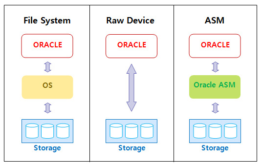

# ASM

# 개념

# Automatic Storage Management

- Oracle 10g부터 지원되는 Logical Volume Manager와 File System의 통합체
- Oracle Database File을 위해 특별히 구현된 Disk 관리 시스템으로 Disk간 Balance가 유지될 수 있도록 분산 저장 및 Mirroring을 지원
- File System
    - OS가 파티션이나 Disk에 File들이 연속되게 하기 위해 사용하는 방법이자 자료구조
    - Disk상에서 File들이 구성되는 방식
    - File System은 Mount란 단계를 거쳐 특정 Block Device를 사용할 수 있게 해줌
    - Disk Drive
      
      
        | Partition | Partition | Partition |
        | --- | --- | --- |
    - File System
      
      
        | Boot Block | Super Block | Inode List | Data Block |
        | --- | --- | --- | --- |
        - Boot Block: OS가 초기화 또는 부팅될 때 필요한 Bootstrap 코드 포함
        - Super Block: File System에 대한 중요한 정보를 저장하는 곳
        크기, 자유 저장공간 찾는 위치 등의 다양한 정보 포함
        - Inode(Index NODE) List: 항목 자체의 이름을 제외하고 다른 모든 파일 시스템을 저장함
        파일 이름은 디렉터리에 저장되며 이는 Inode의 포인터로 사용됨
        모든 파일이나 디렉터리는 단 하나의 Inode에 의해 표현됨
        - Data Block:  파일 데이터와 관리 데이터를 저장하고 있는 부분
        한번에 단지 하나의 파일에만 할당됨
- Raw Device
    - File System이 Set Up 되지 않은 Disk Drive
    - Raw Device는 DB와 같이 Caching System을 갖고 있는 겅우 Service Program에서 많이 사용
    - OS의 Caching System은 DB등의 자체 Caching을 하기에 두번의 Caching으로 인해 부하가 생길 수 있음 → OS가 지원하는 부분을 사용하지 않게 하기 위해 Raw Device 사용
    - 두 대 이상의 Machine과 공유하고 있는 Disk로 구성되는 OPS의 경우 Shared Disk를 OS File System으로 구성하면 한쪽에서만 이를 볼 수 있으며 동시 Access가 불가능
    
    ### 장점
    
    1. Raw Device는 OS에 Mount 되지 않은 Disk이므로 OS Kernel에 의해 Buffering 되지 않고 User Buffer와 Device간 직접 Data가 전송되므로 Disk I/O 성능이 향상되고 CPU Overhead가 감소
    2. OS File System의 Overhead를 피할 수 있음
    3. OS Buffer Size를 줄일 수 있음
    
    ### 단점
    
    1. Setup하기 어렵고 Backup절차가 File System보다 복잡함
    2. Raw Device와 OS File을 혼합해 사용 시 OS File은 Ulimit Parameter의 크기보다 작아야 함
    Ulimit을 초과하는 Table들은 Raw device를 사용하여야 함
    3. OS는 Cylinder 0을 보호하지 못하기에 Cylinder 0에서 시작 불가

## Disk

- 실제 물리적인 디스크
- 일반적으로 디스크 업체에서 I/O 분산을 해서 제공

## Logical Volume Manager

- 물리적인 디스크에 대해 Volume Group과 Logical Volume을 구성하는 부분

## File System

- Lvol을 File System으로 mount하여 해당 File System에 datafile 생성
- Lvol을 생성한 이후 File System으로 mount 하지 않고 사용하는 경우 RAW Device라 함

## Database

- File System 또는 RAW Device에 해당 데이터베이스의 datafile을 생성해 DB 구성

# ASM 장점

## Disk I/O의 효과적인 분산

- Storage 추가 시 이전 Storage 안에 있던 자료들이 자동으로 [Rebalance](./ASM/Rebalance.md)되어 자료 분산 됨
- 특정 Disk에 Load가 집중되는 현상 최소화 → 성능 향상

## VLDB 지원(Very Large DB)

## 편리한 관리

- ASM이 관리하는 영역에서 새로운 Disk를 추가 / 삭제할 경우 기존 Data들에 대해 재구성 작업이 자동으로 발생해 Disk Load Balancing 유지 가능
    - 매일 처리해야만 하는 Disk 관리 항목 감소
    - 새로운 Datafile에 의미 있는 이름을 자동 부여
    - 구성이 변경될 경우 자동으로 Data 분배
    - 실수로 인한 Datafile 삭제 가능성 감소
    - Cluster File System이므로 하나 이상의 Node에 있는 다른 Database에 대해서 통합 가능

## 안정성

- ASM은 특정 Data에 대한 복사본을 자기 자신의 Disk에 유지 가능
- Software Mirroring(Data 중복 저장) 효과 기대 가능

## 비용 절감

- 고가의 RAID 장비나 별도의 HW, SW없이 오라클에서 Software적으로 관리 가능

## RAC 지원

# ASM 구조

Oracle Server처럼 Instance 와 Disk Group으로 구성되어 있음

ASM Instance가 작동하지 않으면 Database Instance가 작동해도 데이터의 조회나 변경이 불가능

### **ASMB Process**

- ASM Instance와 Database Instance 사이에서 정보를 교환해 주는 역할

### **ASM Instance**

- 디스크 그룹에 대한 정보를 수집해 Database Instance에 제공
- 디스크 관리를 위한 instance
- 디스크에 있는 데이터에 대한 데이터(metadata)를 가지고 있음
- DB Buffer Cahce 같은 개념
- 디스트 안에 있는 내용을 Caching 해놓음으로서 최대한 디스크에 안가고 바로 작업할 수 있게 함

### **RBAL Process**

- 디스크가 추가, 삭제되었을 경우 디스크 그룹에 대한 Rebalance를 담당
- ASM Instance의 요청이 있을 경우 디스크를 열고 닫는 프로세스

### **ARBn(ARB1 ~ ARB9)**

- RBAL의 요청을 받아 실질적으로 작업을 수행하는 Process

<aside>
⭐ **Single Instance ASM**: 단일 인스턴스로 구성되어 있는 여러 개의 데이터베이스들이

ASM Instance를 통해 Storage에 접속해서 데이터를 관리

**RAC ASM**: 각 노드별로 ASM 인스턴스를 구성해서 Storage에 접근하는 방식

</aside>

# ASM Diskgroup

## ASM Diskgroup의 특징

- ASM에 의해 관리되는 최상위 객체
- 논리적 단위로 관리되는 ASM Disk의 집합체
- 각각의 Diskgroup 내에 meta data 정보 저장
- 하나의 Diskgroup이 여러 개의 database에 의해 공유 가능
- 하나의 DB가 여러 개의 diskgroup 사용 가능
- 데이터가 들어올 때 AU라는 단위로 나눠 각 Diskgroup별로 분산해서 저장
    - AU(Allocation Unit)
        1. COARSE grained 방식: 1MB 단위 기록, 주로 Data, Archive Log File에 사용
        2. FINE grained 방식: 128KB 단위로 기록, 주로 Redo, Control, Flashback Log File에 사용
        - 11g ASM부터 AU의 종류가 1,2,4,8,16,32,64MB로 다양하게 지원해 성능 개선 가능

## ASM Disk Mirroring

- ASM은 Data의 안정성을 높이기 위해 Data를 중복 저장하는 Mirroring 사용

| Diskgroup Type | Mirroring Level | 내용 |
| --- | --- | --- |
| External Redundancy | 비보호 | 어떤 Mirroring도 하지 않음
ASM이 장애 발생시 복구 보장하지 않음
어떠한 Failure Group도 정의할 필요 없음 |
| Normal Redundancy | 2-way Mirroring | 기본적으로 양방향 Mirroring 제공
모든 파일이 미러링되므로 모든 범위의 복사본이 2개가 됨 |
| High Redundancy | 3-way Mirroring | 기본적으로 3-way Mirroring 제공
서로 다른 장애 Group에서 2 개의 Oracle ASM Disk가
손실되어도 자동 복구 수행 |