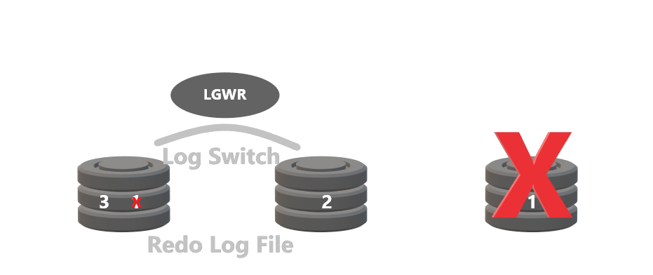
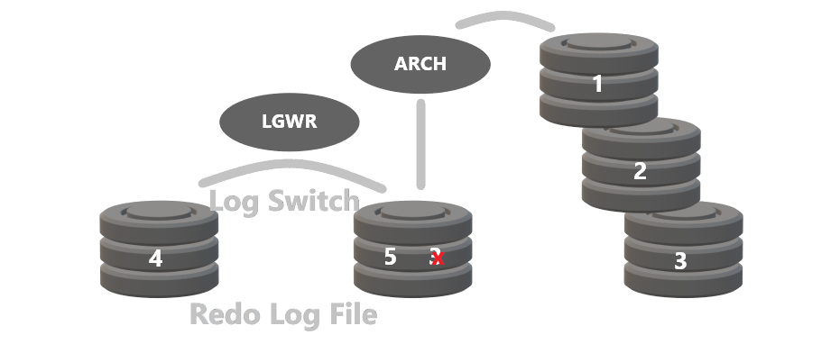
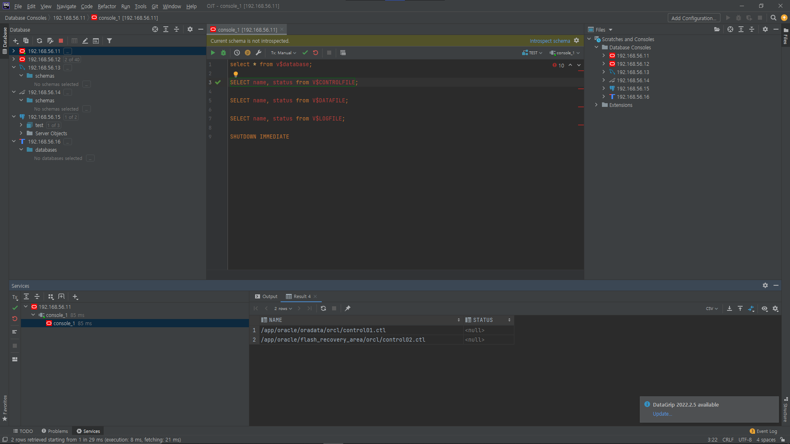

# Backup & Recovery

# Backup & Recovery의 기본 개념

- Backup: DB의 복사본
- Recovery: 장애가 나기 전 시점으로 복구
    - RESTORE + Archive Log File 적용
        - RESTORE: DB에 장애가 발생하기 전 Backup본을 이용하는 방법

## Oracle Database Backup 대상

- 모든 Data File
- Control File
- Redo Log File
- Parameter File
- Password File

## Database Mode

### NOARCHIVELOG MODE

- DB를 설치하면 설정되는 기본 모드
- Checkpoint 발생 후 즉시 Redo Log File을 재사용 할 수 있음
- Redo Log가 겹쳐 쓰여지며 변경 정보가 없어지므로 마지막 전체 Backup에 대해 복구 가능
- DB가 동기화 된 채로 종료(`NORMAL`, `IMMEDIATE`, `TRANSACTION`)되어 있을 때 Backup본 생성 가능
- Backup할 때 마다 전체 Data File 및 Control File을 Backup해야 함
    - NOARCHIVELOG MODE의 DB는 동기화 중이므로 반드시 Online Log File을 Backup해야 하지 않음
- Redo Log Group에 Log Switch가 발생해 다른 Group을 사용할 때 이 복사본을 생성하지 않고 재사용하는 방법



### ARCHIVELOG MOD

- 다 쓰여진 Redo Log File은 Log Switch가 일어나기 전 Checkpoint가 발생하고 ARCn Process에 의해 Redo Log File을 Backup할 때 까지(Archive Log File 생성) Redo Log File은 재사용 불가
- Media 장애 발생 시 DB가 Data 손실이 일어나지 않도록 보호
- Hot Backup이 가능해짐
- Redo Log Group에 Log Switch가 발생해 다른 Group을 사용하기 전 복사본을 생성하는 방법
  
    
    

## Database 동기화

- Oracle Database를 같은 시점으로 맞춰 주는 것
- 동기화 정보가 다르면 Database는 Open되지 않고 Recovery를 수행
    - Data File, Redo Log File, Control File의 시점이 맞아야 DB Open 가능
- 각 Data File과 Control File Header에 Checkpoint 정보를 부여해 동기화 시킴
- DB의 동기화 정보가 맞지 않아 DB가 Open되지 않았을 때 CKPT가 발생한 이 후부터 복구 시작
- CKPT가 발생했다는 것은 Memory 내 변경된 정보가 Data File에 쓰여졌다는 것이 보장된다는 뜻
→ Checkpoint 이후로 복구하도록 DB가 요청함

# Backup의 종류

## Physical Backup

- DB 구성 File들을 그대로 복사하는 방법
- DB가 손상시 최소한의 피해로 Database를 Recovery하는 방법

### Offline Backup(Cold Backup)

- Oracle이 Shutdown일 때 OS의 copy 명령어를 통해 복사하는 방법
- NOARCHIVELOG MODE와 ARCHIVELOG MODE 둘 다 가능
- 모든 Data File, Control File, Redo Log File이 대상
- 초기화 Parameter File은 변경되었을 경우 Backup
- 개념적으로 단순해 백업 및 복구 방법이 용이
- NOARCHIVELOG MODE일 경우 Backup 받은 시점 이후 Data 보장하지 않음
    - 장애 발생 시 변경 사항 수동으로 입력해야 함
- 방법
    1. Data File, Control File, Redo Log File의 위치와 이름 확인
        1. sqlplus 를 sysdba 권한으로 접속
           
            ```sql
            sqlplus / as sysdba
            ```
            
        2. Control File의 위치 및 이름 확인
           
            ```sql
            SELECT name, status from V$CONTROLFILE;
            ```
            
            
            
        3. Data File들의 위치 및 이름 확인
           
            ```sql
            SELECT name, status from V$DATAFILE;
            ```
            
            
            
        4. Redo Log File들의 위치 및 이름 확인
           
            ```sql
            SELECT member, status from V$LOGFILE;
            ```
            
            
        
    2. DB SHUTDOWN
       
        ```sql
        SHUTDOWN IMMEDIATE
        ```
        
        
        
    3. 대상 File Backup(copy)
       
        ```sql
        host copy <files_directory> <backup_directory>
        ```
        
        
        
    4. DB OPEN
       
        ```sql
        STARTUP
        ```
        
        
        

### Online Backup(Hot Backup)

- DB OPEN에서 Backup하는 방법
- Data File을 Online Backup하고 있을 때 Data File에 저장되어야 할 사항이 Redo Log File에 저장
- Tablespace의 모든 Data File 또는 하나의 Data File을 Backup 할 수 있음
- Oracle이 Open일 때 OS의 copy 명령어를 통해 복사하는 방법
- ARCHIVELOG MODE일 때 가능
- 방법
    1. Data File, Control File, Redo Log File의 위치와 이름 확인
        1. sqlplus 를 sysdba 권한으로 접속
           
            ```sql
            sqlplus / as sysdba
            ```
            
            
            
        2. Control File의 위치 및 이름 확인
           
            ```sql
            SELECT name, status from V$CONTROLFILE;
            ```
            
            
            
        3. Data File들의 위치 및 이름 확인
           
            ```sql
            SELECT name, status from V$DATAFILE;
            ```
            
            
            
        4. Redo Log File들의 위치 및 이름 확인
           
            ```sql
            SELECT member, status from V$LOGFILE;
            ```
            
            
        
    2. SYSTEM Tablespace를 OPEN Backup 수행
       
        ```sql
        -- 테이블 스페이스를 open 백업 수행
        ALTER TABLESPACE SYSTEM BEGIN BACKUP;
        
        -- SYSTEM TABLESPACE에 속하는 데이터 파일을 백업함(E:\BACKUP\HOT\백업)
        -- HOST는 SQL 프롬프트에서 OS명령어를 수행하기 위한 명령어
        HOST COPY <files_directory> <backup_directory>
        ```
        
        
        
    3. 현재 Backup중인 Data File의 정보 확인
       
        ```sql
        SELECT * FROM V$BACKUP;
        ```
        
        
        
    4. Online Backup 종료
       
        ```sql
        ALTER TABLESPACE SYSTEM END BACKUP;
        ```
        
        
        
    5. Data File의 정보 확인
       
        ```sql
        SELECT * FROM V$BACKUP;
        ```
        
        
        
    6. Control File의 백업이 필요한 경우 Control File Backup 수행
        - 백업 받아야 하는 경우
            - CREATE TABLESPACE
            - ALTER DATABASE LOGFILE
            - ALTER DATABASE LOGFILE MEMBER
            - ALTER DATABASE LOGFILE GROUP
            - ALTER DATABASE RENAME FILE
            - ALTER DATABASE DATAFILE
            - DROP TABLESPACE
        
        ```sql
        -- 현재의 CONTROL FILE을 Image Copy 하는 방법
        -- 파일 경로를 생략할 경우 윈도우의 경우는 %ORACLE_HOME%/database,
        -- 유닉스 계열에서는 $ORACLE_HOME/dbs에 존재
        ALTER DATABASE BACKUP CONTROLFILE TO <file_path>;
        
        -- CONTROL FILE을 재생성 할 수 있도록 Script를 생성하는 방법
        -- 저장 위치는 USER_DUP_DEST에 현재 Session의 Process번호로 생성됨
        ALTER DATABASE BACKUP CONTROLFILE TO TRACE;
        ```
        
        
        
        
        

## Logical Backup

- Export Utility $ORACLE_HOME/bin/exp 명령어를 통해 Backup하는 방식
- DB의 논리적인 정보(Schema 구조, Data ETC)를 저장하는 방식
- Backup본 이후 변경 사항은 수동으로 입력해야 함
- EXPORT의 PARAMETER 설명
    - buffer : 데이터 행들을 가져오는데 사용되는 버퍼의 크기
    - file : 생성되는 파일의 이름
    - Rows : 행을 포함하는지 여부(Y/N).
    - Full : 전체 데이터베이스를 EXPORT할지 여부(Y/N)
    - Owner : EXPORT할 소유자의 이름
    - Table : EXPORT할 테이블
    - Tablespaces : EXPORT할 테이블스페이스 이름
    - Log : 로그 파일을 저장할 이름
- 방법
    1. Table 모드
        - 지정된 테이블만 EXPORT 하는 방법
        
        ```sql
        exp scott/tiger tables=(emp, dept) rows=y file=ep_dept.dmp
        ```
        
    2. User 모드
        - 해당 유저에 속하는 모든 객체들을 백업하는 방법
        
        ```sql
        exp system/manager owner=scott rows=y file=scott.dmp
        ```
        
    3. Tablespace 모드
        - 지정한 테이블 스페이스 내의 모든 객체를 백업하는 방법
        
        ```sql
        exp system/manager tablespaces=(users) file=ts.dmp
        ```
        
    4. 전체 데이터베이스 모드
        - 데이터베이스 내의 모든 객체를 백업하는 방법
        
        ```sql
        exp system/manager file=full.dmp full=y
        ```
        

# Recovery의 종류

## Media Recovery

- Disk나 매체 등의 장애로 인한 Recovery

### Physical Backup → Complete Recovery

- 장애 시점까지 Recovery하는 방법
- 변경된 정보를 저장하고 있는 Redo Log File들이 재사용 되기 전 저장되어 지는 Archive Log File이 필요하므로 ARCHIVELOG MODE에서만 가능
- NOARCHIVELOG MODE에서 Backup본 이후 Redo Log File이 재사용(Archive Log File이 없을 때) 이전의 Backup본으로만 DB를 복구 가능
  
    ```sql
    -- MOUNT단계에서 사용되는 명령어로 DATABASE 전체를 RECOVERY할 때 사용
    -- AUTOMATIC 옵션은 자동으로 필요한 ARCHIVE를 적용하고 싶을 때 사용
    RECOVER [AUTOMATIC] DATABASE;
    
    -- 특정 데이터 파일만 RECOVERY할 때 사용하는 명령어로 MOUNT와 OPEN단계 둘 다 사용
    RECOVER DATAFILE FILE_NAME;
    
    --OPEN된 상태에서만 사용가능 하며 특정 TABLESPACE에 대해 복구 할 때 사용
    RECOVER TABLESPACE TABLESPACE_NAME
    
    -- Database를 명시된 시점으로 Recovery 할 때 사용하는 명령어로 MOUNT 단계에서 사용
    RECOVER DATABASE UNTIL TIME; -- SCN도 가능? -> 찾아보기
    
    --특정 아카이브 까지만 복구 하는 명령어로 MOUNT 단계에서 사용
    RECOVER DATABASE UNTIL CANCEL;
    ```
    

### Physical Backup → Incomplete Recovery

- Backup본을 Restore 한 이후 변경된 작업이 들어있는 Achive Log File을 찾을 수 없거나 DB를 특정 시점으로 돌리는 방법
    - system01.dbf 복구 순서
        1. Database OPEN (MOUNT 단계까지만 수행)
        2. system01.dbf 유실된 것을 확인하고 모든 Data File을 RESTORE 함
        3. Database OPEN
        4. 변경 사항 적용

### Logical Backup → Export Utility

- Export Utility $ORACLE_HOME/bin/imp 명령어를 통해 복구하는 방식
- Data File이 손상된 경우 DB를 다시 설치한 후 또는 Data File을 재 생성한 이후 IMP로 복구 가능

## Instance Recovery

- 비정상 종료(`SHUTDOWN ABORT`, 정전, CPU 고장, Memory 손실과 같은 장애)로 Oracle Instance가 Error를 일으켜 Instance가 실패한 경우 발생
1. 비정상 종료 후 비동기화 되어 있는 상태에서 `STARTUP OPEN`
2. Roll Foward(`MOUNT`): 마지막 CKPT 이후의 Redo Log File에 기록된 모든 변경사항(Commit된 Data & Commit 되지 않은 Data)를 DBWR에 의해 Data File에 기록
3. Database Open
4. Roll Back: 모든 Data File에서 Commit 되지 않은 Data 를 Roll Back하는 단계
5. 동기화 되어 DB 운영
- 비동기화 되어 있는 상태에서 롤백한 이후에 DB를 OPEN할 경우 Down Time이 길어짐
- Roll Foward 단계를 거쳐 DB OPEN 이후 Roll Back하는 과정을 Warm-Start라고 부름

## User Error Recovery

- 사용자의 실수로 인한 Transaction으로 인해 원하지 않는 결과가 발생한 경우(`TRUNCATE`, `DROP`) 다시 복원하는 방식
- 대부분 IMP를 이용

# 기본적인 Backup 정책

## Backup 정책의 Guideline

- 정기적 Cold Backup을 받음
- DB 구조적 변화가 생기기 전 반드시 Cold Backup 받음
- DB에 장애가 발생하지 않도록 운영
- 장애 시 Recovery까지의 시간이 최소한이 되도록 Backup 정책을 세워야 함

## 기본적인 Backup 규칙

- Log File을 Disk에 Achive한 후 추후 다른 Disk나 Tape등에 다시 복사
- Data File의 Backup은 실제 Data File과 다른 Disk에 유지
- Control File은 다중화 해 여러 개 유지
- Log File이나 Data File을 추가, Rename, 삭제 하는 등 DB 구조가 변경된 경우 Control File Backup

# EXPORT, IMPORT

1. exp/imp 와 expdb/impdp
    1. Export / Import 하려는 오라클 버전이 같고, TABLESPACE도 같으면 exp/imp 명령을 사용한다.
    2. Export / Import 하려는 오라클 버전이 같지 않거나, TABLESPACE가 같지 않으면 expdp/impdp를 사용한다.
    3. exp/imp/expdb/impdp 모두 USERID는 명령어 첫번째 매개변수에 있어야 한다.
- Logical Backup / Recovery에 해당

## Full Level

- Oracle DB 전체 Backup(모든 Tablespace, User, Object, Data)
- DB에 Import 시 Export 당시와 동일한 SID를 가지는 DB가 존재해야 함

### Export

```sql
exp userid=system/password statistics=none file='./full.dmp' full=y
```


### Import

```sql
imp userid=system/password statistics=none file='./full.dmp' full=y
```


## User Level

- User가 소유하고 있는 Object, Data
- 이관하려는 Server나 DB에 동일한 사용자 계정이 생성 되어 있어야 하며 Tablespace가 있어야 함
    - SID는 달라도 가능
- Import 절차
    - CREATE DB
    - CREATE Tablespace
    - CREATE USER, Tablespace 접근 권한 추가
    - imp 명령어를 통한 Data Import

### Export

```sql
exp userid=scott/tiger statistics=none file='./scott.dmp'
```


### Import

```sql
imp userid=system/manager owner=scott statistics=none file='./scott.dump'
```

