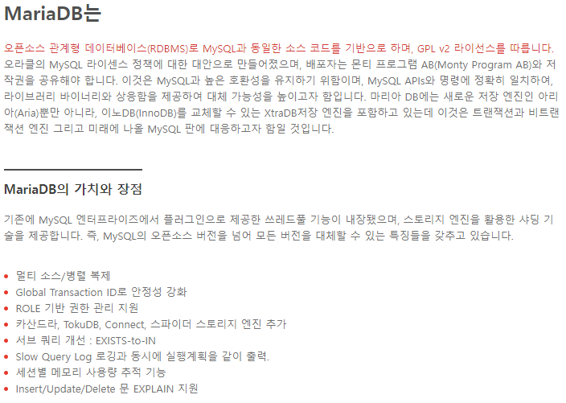

# DBMS별 차이

# DBMS별 Schema와 Database의 차이

## Oracle

- Schema는 USER가 생성한 모든 Object(Table, Index, Procedure 등)를 의미
    - Schema와 USER는 다름
    - Schema에 각각의 사용자에게 선택적 권한을 줌
- Database는 실제 물리적인 데이터베이스를 의미

## MySQL / MariaDB

- Database와 Schema가 같은 의미로 Table등의 Object 집합

## PostgreSQL

- MySQL / MariaDB의 Database가 PostgreSQL의 Schema
- Database는 Schema의 상위 개념
- PostgreSQL은 MySQL과 다르게 Database가 다르면 완전히 물리적 분리로 봄
- DB link가 아닌 일반적으로 다른 Database의 Table을 조회할 수 없음
    - 다른 Schema는 가능

# DBMS별 특징

## Oracle

- 관계형 모델에서 객체-관계형 DB로 확장
- 개발자가 스스로 데이터형과 메서드를 자유롭게 정의해 DB를 개발할 수 있음
    - 사용자 정의 유형, 상속 및 다형성과 같은 객체 지행 기능 구현 가능
- 대량의 데이터 처리에 용이함
- 비공개 코드 소스와 폐쇄적인 운영, 고비용으로 접근성이 떨어짐

## MySQL

- 임베디드 시스템에서도 동작 가능
- 웹 기반 애플리케이션과 잘 맞음
    - 오라클사에서 제출한 문서
      
        [WP_NextGenApps_1013_final_ko.pdf](./DBMS별 차이/WP_NextGenApps_1013_final_ko.pdf)
    
- 프로시저를 통해 데이터 레코드 삽입, 삭제를 하나로 묶어서 사용 가능
- 이벤트식으로 동작하는 트리거 존재
- 속도, 안정성, 확장 가능성을 추구함

## MariaDB

- MySQL의 불확실한 라이선스 문제를 해결하기 위해 나온 RDBMS
- 빠른 확장과 여러 기능들이 포함
  
    
    
- Synchronous 방식으로 노드 간 데이터 복제
- Active-Active 방식의 다중 마스터 구성
    - 모든 노드에서 읽기/쓰기가 가능
- 클러스터 내 노드 자동 컨트롤 → 특정 노드 장애 시 자동으로 해당 노드 제거
- 자동으로 신규 노드 추가
- 완벽한 병렬적으로 데이터를 행단위로 복제
- 기존의 MySQL 클라이언트 방식으로 동작 이와 같은 특징에서 전통적인 Asynchronous 방식의 리플리케이션이 가지는 한계점이 해결됨
- 마스터/슬레이브간 데이터 동기화 지연 없음
- 노드 간 유실되는 트랜잭션이 없음
- 읽기/쓰기 모두 확장이 가능
- 클라이언트의 대기 시간이 줄어듬→데이터는 로컬 노드에 존재

## PostgreSQL

- 오픈소스 객체-관계형 DBMS(ORDBMS)
- 기업용(Postgres Plus Advanced Server)과 커뮤니티용의 큰 차이
    - 오라클 문법 및 타입 대부분을 지원하고, PL/SQL 프로시져 언어들도 그대로 사용 가능
    - 힌트 및 시스템 딕셔너리 뷰를 지원
    - 쿼리 성능을 분석하는 SQL Profiler 기능과 오라클의 AWR 기능과 유사한 DRITA 기능 제공
    - 업무상 프로시져의 암호화를 위해 edbwrapper 도구 제공
    - 대용량의 bulk insert 를 위한 edb-loader 도구 제공
    
    ### **PPAS만의 특장점 상세**
    
    - **DynaTune**
        - PPAS에 대해 낯설거나 익숙하지 않은 사용자들을 위해서 Configuration parameter 값을 DB에 맞게 자동으로 조절해 주는 기능
            - 사용자가 두 가지의 설정 값만 수정을 하면, PPAS가 그 것을 토대로 하여 알고리즘을 생성해 Postgres의 parameter를 설정해 줌
    - **Query Optimizer Hints**
        - SQL Optimizer가 선택한 실행계획에 응용프로그램 개발자가 영향력을 행사할 수 있도록 허용함
        - PostgreSQL이 실행계획을 세웠을 때는 특정 쿼리가 맨 처음 실행되었던 시기라서 차후에 실행되는 경우의 대부분은 최적이 아닐 수 있기에 빈번하게 작업이 발생하여 테이블 크기가 커질 경우에 Query Optimizer Hint를 적용하여 Postgres의 기본 실행계획을 재정의 할 수 있음
    - **EDB*Loader**
        - EDB*Loader는 로드 오류가 발생하면 계속 처리할 수 있도록 파일을 폐기하고, 잘못된 레코드를 이동시키는 기능
            - 사용자는 별도로 폐기된 파일을 검사하고, 대량 로드 프로세스가 완료되면 특정 데이터 로드 문제를 해결할 수 있음
        - EDB*Loader 의 가장 대표적인 성능 향상 기능은 경로 로드를 직접 할 수 있음
            - 데이터 구조를 데이터 블록형식으로 직접 변환하여 훨씬 더 빠른 시간에 데이터 디렉토리에 직접 기록됨
    - **SQL Profiler**
        - 선택한 데이터베이스의 활동을 검사하고 해당 데이터베이스에 대하여 실행된 SQL 명령에 대한 보고서를 생성함
        - SQL Profiler에 의한 보고서는 long run하는 SQL 명령을 향상 시킬 수 있도록 추적하거나, 자주 사용되는 SQL명령을 추적하기 위해 사용됨
    - **Postgres Enterprise Manager (PEM)**
        - 설치 된 PPAS 및 PostgreSQL의 모든 크기를 관리하기 위해 설계됨
        - 모니터링 에이전트를 호스팅하는 데이터베이스에 대한 통계는 여러 GUI콘솔에서 액세스 할 수 있는 중앙 서버에 전송함
        - 간단하게 콘솔을 클릭하여 간편하게 차트 및 전체 데이터베이스의 인프라 상태를 반영하여 통계를 보여줌
        - 참고 사진
          
            
        
    - **DRITA**
        - DB시스템에 영향을 미치는 대기상태의 이벤트들을 모니터링하는 카탈로그 뷰를 제공
        - 이벤트의 발생 횟수나 대기에 소요된 시간을 기록하여 어떤 이벤트가 성능에 영향을 주는지 알아보고 조치를 취할 수 있도록 도와줌
    - **Infinite Cache**
        - 모든 데이터가 Shared buffer Cache를 사용하고 있을 때, Infinite Cache는 네트워크에 있는 다른 컴퓨터 메모리 캐시에 액세스하여 사용 가능
    - **Open Client Library (OCL)**
        - OCL은 Oracle의 OCI와의 응용프로그램 상호 운용성을 지원
        - 이 전에는 변경할 수 없었던 응용프로그램이 이제는 코트 변경을최소로 하여 PPAS와 Oracle 환경 둘 다 사용이 가능
        - OCL의 PPAS구현은 C로 작성됨
        - OCI 및 OCL의 스택을 비교 다이어그램
          
            
            

## 요약 정리

| DBMS | update후 정렬순서 보장 | Online DDL | Hint 사용 | 기본 Isolation Level | Index Null 저장 |
| --- | --- | --- | --- | --- | --- |
| Oracle | 보장 | 지원(12C→) | 가능 | Read Committed | X |
| MySQL | 보장 | 지원(5.6→) | 가능 | Repeatable Read | O |
| PostreSQL | 보장 안함 | 미지원 | 불가능(PG_HINT_PLAN 사용) | Read Committed | X |

# DBMS 별 Architecture

## MySQL

MySQL General Architecture

MySQL Cluster Architecture

MySQL Cluster는 애플리케이션에 대한 서비스를 제공하는 3가지 노드 유형으로 구성되어 있음

### **데이터 노드 (Data Node)**

- 스토리지를 관리하고 데이터에 액세스함
- 테이블은 자동으로 데이터 노드 전반에 걸쳐 샤딩(sharded)되며 투명하게 로드 밸런싱, 리플리케이션, 페일 오버가 가능

### **어플리케이션 노드 (Application Node)**

- 애플리케이션 로직에서 데이터 노드로의 연결 제공
- MySQL은 웹 개발 언어와 프레임워크에 대한 연결을 비롯해 표준 SQL 인터페이스 제공
- Memcached, C++ (NDB-API), Java, JPA, REST/HTTP 등 모든 범위의 NoSQL 인터페이스 포함

### **관리 노드(Management Node)**

- 클러스터를 구성하고 네트워크 파티션 시 중재 서비스를 제공하는 데 사용됨

## MariaDB

위 MySQL General Architecture와 동일

MariaDB Galera Cluster

### **MariaDB Galera Cluster**

- MariaDB/Galera는 MariaDB의 Synchronous 방식 으로 동작하는 multi-master Cluster
- MariaDB/Galera Cluster은 Galera 라이브러리를 사용하여 노드 간 데이터 복제를 수행함

## PostgreSQL

PostgreSQL Architecture