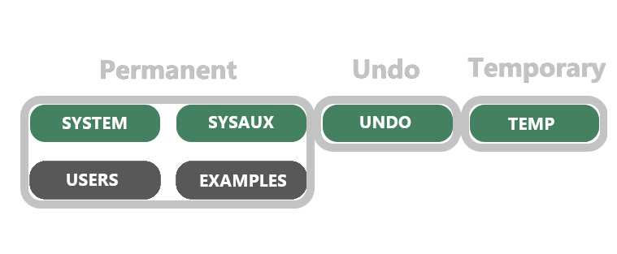
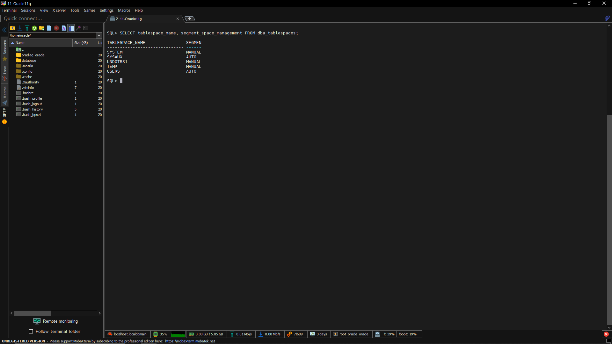

# Oracle Admin

# 기동, 중지(Startup / Shutdown)

## Startup

### DB StartUp 문법

```sql
STARTUP [FORCE] [RESTRICT] [PFILE=filename] [ OPEN [RECOVER] [database] | MOUNT | NOMOUNT ]
```

- `FORCE`: Oracle DB가 시작된 상태에서 다시 재시작할 때만 사용
- `RESTRICT`: DBA 권한을 가진 USER만이 connect하여 Oracle DB를 이용할 수 있음
- `PFILE`: Oracle이 기본으로 제공되는 파라미터 파일인 INIT.ORA파일이 아닌 관리자가 생성한
  파라미터 파일을 사용하여 오라클 서버를 시작할 때 사용
    - `PFILE`
      
        # PFILE
        
        - Parameter FILE은 오라클을 시작하는데 필수적인 파라미터들이 정의되어 있음
        - 기본 설정 파일
        - text file로 되어 있으며 운영체제 Editor에서 수정 가능
        - PFILE 수정 후 변경된 내용 적용을 위해 DB를 재시작해야함
        - 일반적으로 initSID.ora파일로 저장
        
        ```sql
        -- 파라미터 하나의 값을 볼 때 show parameter 명령어 사용
        SHOW PARAMETER shared_pool_size;
        -- 파라미터의 정보를 보고 싶을 때 V$PARAMETER를 이용
        SELECT name, value
        FROM V$PARAMETER
        WHERE UPPER(name) LIKE '%DB%'
        ```
        
        # SPFILE(Server Parameter FILE)
        
        - Oracle 9i 버전부터 spfileSID.orark 추가되었음
        - SPFILE을 사용하게 되며 ALTER SYSTEM 명령을 통해 데이터베이스가 운영 중에도 파라미터를 수정할 수 있으며 서버를 재시작하지 않아도 반영됨
        - SPFILE은 바이너리 파일이고 디폴트 저장위치는 PFILE과 동일
        - SPFILE은 Editor로 변경하면 안됨(vi 등)
        
        ```sql
        -- 변경 예제
        ALTER SYSTEM SET large_pool_size=16M SCOPE=[MEMORY | SPFILE | BOTH]
        ```
        
        ## ALTER SYSTEM 명령의 scope
        
        - `MEMORY`: 변경이 현재만 영향 끼쳐 DB가 다음 STARTUP될 때 변경 이전값으로 돌아감
        - `SPFILE`: 변경 내용을 SPFILE에만 저장하고 현재 상태에 영향 끼치지 않음
        Static Parameter의 경우 이 scope만 지정 가능
        `SPFILE`을 사용해도 Static Parameter는 재시작 없이 반영 불가능
        - `BOTH`: 변경 내용을 현재 상태와 SPFILE에도 반영시켜 이후 rebooting에도 영향을 끼침
        
        # CREATE PFILE/SPFILE
        
        - SPFILE을 사용하다 그 파일을 initSID.ora에 BACKUP용으로 반영시킬 때 생성 가능
        - SPFILE 대신 initSID.ora를 사용하고자 하는 경우 생성 가능
        - initSID.ora를 참조해 spfileSID.ora를 생성하고 하는 경우 생성 가능
        
        ```sql
        -- SYSDBA 권한으로 접속 후 --
        -- PFILE 생성
        CREATE PFILE='D:\oracle\ora92\database\INITORACLE.ORA'
        FROM SPFILE='D:\oracle\ora92\database\SPFILEORACLE.ORA'
        
        -- SFILE 생성
        CREATE SPFILE='D:\oracle\ora92\database\SPFILEORACLE02.ORA'
        FROM PFILE='D:\oracle\ora92\database\INITORACLE.ORA'
        ```
  
- `NOMOUNT`: 인스턴스만 시작된 상태, 주로 Oracle DB를 생성할 때 사용
- `MOUNT`: 인스턴스에 대한 control file을 open
일반 USER는 접속 불가능, SYSDBA 권한만 가능
- `OPEN`: 인스턴스에 대한 모든 파일을 오픈하고 모든 USER가 데이터베이스를 사용
- `RECOVER`: Oracle 복구 시 사용하는 옵션

### DB의 시작단계(정방향, 역방향 시 SHUTDOWN)

1. SHUTDOWN
    - Oracle Instance가 정지된 상태
    - Database에 Access 할 수 없음
2. NOMOUNT
    - 초기화 Parameter File을 읽음
        - Instance 구성(SGA, Background Process, Shared Pool, Database Buffers, Redo Buffers)
        - alertSID.log 및 추적파일을 엶
    - Oracle의 인스턴스만 시작된 단계로 보통 Oracle DB 생성에 사용
    
    ```sql
    STARTUP NOMOUNT pfile=/app/oracle/admin/orcl/pfil/init.ora
    ```
    
3. MOUNT
    - Control File을 읽고 난 뒤 Redo Log File과 Data File을 확인
    
    ```sql
    STARTUP MOUNT;
    ```
    
4. OPEN
    - Data File과 Redo Log File이 제대로 확인된 상태
    - 정상적인 Access 가능
    
    ```sql
    ALTER DATABASE OPEN
    ```
    

### ALERT DATABASE

- STARTUP MOUNT 단계에서 MOUNT 단계로, 또는 MOUNT 단계에서 OPEN 단계로 DB를 열기 위해 ALTER DATABASE 명령을 사용

```sql
ALTER DATABASE db_name OPEN [READ WRITE|READ ONLY]
```

- `READ WRITE`: 리두로그 정보를 생성할 수 있도록 DB를 읽기-쓰기 모드로 OPEN
- `READ ONLY`: 읽기 전용 트랜잭션으로 DB를 OPEN, 리두로그 정보를 생성하지 않음

## SHUTDOWN

```sql
SHUTDOWN [NORMAL | TRANSACTIONAL | IMMEDIATE | ABORT]
```

- `NORMAL`: 새로운 DB connection을 허락하지 않음
현재 USER들이 맺고 있는 connection은 그 사용자들이 DISCONNECT할 때까지 기다림
다른 처리 중인 트랜잭션이 있다면, 그 트랜잭션이 끝날 때까지 기다린 후 서버 종료
다음 DATABASE STARTUP시 어떤 INSTANCE RECOVERY 절차도 필요하지 않음
- `TRANSACTIONAL`: 모든 클라이언트가 특정 인스턴스에서 새로운 트랜잭션을 시작할 수 없음
클라이언트의 진행중인 트랜잭션을 모두 끝마치면 서버 종료
모든 트랜잭션이 끝나는 즉시 종료되며 이후 시작 시 인스턴스 복구가 필요 없음
- `IMMEDIATE`: 현재 처리중인 SQL Statement가 있을 시 모두 STOP시킴
UNCOMMITTED TRANSACTIONS가 있다면 다 ROLLBACK시킴
USER들이 DISCONNECT 할 때까지 안 기다리고 DB를 CLOSE & DISMOUNT 하여 Oracle 인스턴스를 깨끗이 SHUTDOWN 시킴
- `ABORT`: 현재 처리중인 SQL Statements를 모두 ABORT 시키고 ROLLBACK 안시키며 USER들을 다 끊고, CLOSE & DISMOUNT도 안함
    - Database가 비정상 종료 된 후 다음 Oracle 시작 때 SMON에 의해 인스턴스가 자동 복구됨

# Tablespace 및 Data File 관리

## Tablespace & Data File

- Tablespace
    - 하나의 DB 안에 가장 큰 논리적 저장 공간
    - 업무의 단위나 사용 용도에 따라 여러개의 Tablespace로 분리되어 관리
    - Segment(Object)라는 논리적 저장 공간의 집합
- Data File
    - Tablespace의 물리적 파일 형태
    - 하나 이상의 Data File이 모여 Tablespace라는 논리적 저장 공간을 형성

### Tablespace의 종류



종류는 3개, 필수 Tablespace는 4개가 있음

- Permanent Tablespace
  : 영구 테이블스페이스, 가장 일반적인 테이블 스페이스로 데이터 축적 용도로 사용
  임의로 USERS나 EXAMPLES처럼 이름을 지정하여 원하는 데이터를 저장할 수 있음
    - SYSTEM
        - 데이터베이스의 기본 정보를 담고있는 Data Dictionary Table이 저장되는 공간
        - 일반 사용자들의 오브젝트들을 저장하지 않는 것을 권장
            - 사용자들의 오브젝트에 문제가 생겨 DB가 종료되면 완벽한 복구가 불가능해짐
    - SYSAUX
        - SYSTEM Tablespace의 보조
        - SYSAUX Tablespace에 문제가 생기면 시스템 상 문제가 없으나 SYSAUX Tablespace에 저장되어 있는 요소들의 기능들은 사용 불가능
- Undo Tablespace
    - 읽기 일관성을 유지하기 위해 사용
    - Rollback하게 되는 경우를 대비해 DML 발생때 수정 이전 값을 UNDO Segment에 저장
- Temporary Tablespace
    - 사용자 쿼리 요청으로 정렬하는 작업이 필요할 때 메모리에 부담을 덜어줌

### Create Permanent Tablespace

```sql
CREATE [BIGFILE | SMALLFILE(Default)] TABLESPACE TABLESPACENAME
DATAFILE 'PATH' SIZE SIZE
[EXTENT MANAGEMENT [DICTIONARY | LOCAL(Default) [AUTOALLOCATE(Default) | UNIFORM SIZE SIZE]]]
[SEGMENT SPACE MANAGEMENT [AUTO(Default) | MANUAL]];
```

```sql
-- ex)
CREATE TABLESPACE <TABLESPACENAME> DATAFILE '/opt/oracle/dbf/abc.dbf' SIZE 100M;

SELECT tablespace_name, contents, extent_management, allocation_type,
segment_space_management, bigfile FROM dba_tablespaces
WHERE tablespace_name = '<TABLESPACENAME>';
```

### `BIGFILE` vs `SMALLFILE`

- 데이터 파일의 개수와 크기
- `BIGFILE`
    - Data File을 하나만 사용 가능
    - ASM이 생기며 만들어짐
- `SMALLFILE`
    - 여러개의 디스크에 균등하게 수동으로 Data File을 생성
    - ASM을 사용할 수 있으면 자동으로 균등하게 디스크 별 공간을 할당해주기에 여러개의 Data File을 관리할 필요 없어 하나의 파일을 사용하고 ASM으로 공간을 할당해 `BIGFILE` 선호

## `EXTENT MANAGEMENT`

- Tablespace의 공간 할당은 Extent 단위로 진행
- DML 작업이 반복되며 Extent의 할당과 반환이 발생하는데 어느 Extent를 사용해도 되는지에 대한 정보 관리가 필요
- `DICTIONARY`와 `LOCAL` 방법이 있음

### `DICTIONARY`(구식) vs `LOCAL`

- `DICTIONARY`
    - 사용가능한 Extent에 대한 정보를 Data Dictionary에서 관리하는 방법
    - Segment마다 다른 Extent 크기를 설정할 수 있음
    - Data Dictionary에 대한 경합 발생 가능성이 높아 사용되지 않는 방식
- `LOCAL`
    - Data File의 헤더에 비트맵을 통해 Extent의 사용 유무를 관리
    - Resource의 사용량이 높아지나 중요한 오브젝트의 경합을 줄이는 것이 더 중요
    - `AUTOALLOCATE` 방식을 사용하면 자동으로 Extent의 크기를 정하도록 위임 가능
    - `UNIFORM` 옵션을 사용하면 모든 Extent의 크기를 동일하게 설정 가능

## `SEGMENT SPACE MANAGEMENT`

- Segment의 공간 관리에 대한 옵션
- Tablespace의 공간 관리를 어떻게 할 것인가를 묻는 옵션
- SELECT tablespace_name, segment_space_management FROM dba_tablespaces;
  
    
    

### `MANUAL`(구식) vs `AUTO`

- `MANUAL`
    - Freelist를 사용해 Insert가 가능한 블럭을 확인 가능
    - Free List Management라 함
        - `PCTUSED`: 일정 백분위 이하로 사이즈가 줄어들면 Freelist에 블럭 등록
        - `PCTFREE`: 일정 백분위로 데이터 변경에 대비해 확보해 놓은 Block Size
        
        
        
        PCTFREE가 넘어갈 경우 Freelist에서 사용가능한 다음 블럭을 사용
        PCTUSED가 다 넘어가 Freelist에서 사용 가능한 블럭이 없어 새로운 Extent를 할당해야 함
        
    - Free Block: INSERT 작업을 위해 사용 가능한 여유 Block을 의미
        - Extent가 추가로 할당되는 과정에서 생긴 HWM 아래 존재하는 사용되지 않은 Block
        - INSERT문에 의해 Row가 추가됐으나 `PCTFREE`로 지정된 영역을 다 사용하지 않은 Block
        - `PCTFREE`로 지정된 영역을 다 소모한 후 DELETE나 UPDATE로 `PCTUSED`로 지정된 영역만큼 사용량이 낮아진 Block
    - Free List: Free Block을 List 형태로 관리, Segment Header Block에 Free List의 Header와 Tail값을 가지고 있음(Free Block의 DBA(Data Block Address)값)
      각 Free Block은 Next Free Block의 DBA 값을 가지고 있음
      → Free List = Segment Header의 {Header/Tail}{Free Block}{Free Block}…
        - MFL(Master Free List): Segment당 하나씩 존재하는 Main Free List를 의미
          모든 Free Block은 MFL에 의해 관리, Extent 할당이나 HWM 이동에 의해 새롭게 할당된 Free Block들은 MFL에 우선 속함
        - PFL(Process Free List): Segment 생성 시 `FREELISTS`에 의해 부여되는 Free List를 의미
          `FREELISTS`가 10이라면 총 10개의 PFL이 생성됨, Segment를 사용하는 Server Process들은 PFL중 하나를 사용하게 되며 각 PFL은 MFL로 부터 필요한 만큼의 Free Block을 할당 받아 Process에게 분배
        - TFL(Transaction Free List): Transaction을 수행하는 도중 Free Block으로 변한 Block들의 목록을 관리, Transaction 내에서 특정 Block에서 Row를 DELETE한 후 이 Block의 상태가 Free Block으로 변했을 때 MFL로 반환하는 대신 Transaction 기간 동안 TFL 내의 자신만의 Free Block으로 사용하게 됨
- `AUTO`
    - bitmap을 이용해 비어있는 블럭을 확인
    - 4개의 등급으로 나누고 총 6가지 상태를 나타내는 bitmap 블럭을 사용하여 segment 관리
    - ASSM(Automatic Space Segment Management)라고 부름
        - Full INSERT X
        - FS1 0 ~ 25%의 여유 공간이 Block에 존재
        - FS2 25 ~ 50%의 여유 공간이 Block에 존재
        - FS3 50 ~ 75%의 여유 공간이 Block에 존재
        - FS4 75 ~ 100%의 여유 공간이 Block에 존재
        - Never Used O
    - ASSM은 Free List를 대신 3단계  Bitmap Block을 이용해 효율적으로 Segment 공간 관리 가능
        - L1BMB(Level 1 BitMap Block): 각 block의 FS(Freeness Status)를 관리하는 역할
        Segment의 크기에 따라 16~1024개의 block 상태 관리
        - L2BMB: L1BMB의 목록을 관리(하나의 L2BMB가 여러 L1BMB를 관리) 아래 정보를 관리
            - L1BMB DBA
            - L1BMB가 관리하는 Block들의 MF(Maximum Freeness)
                - `1`=Full, `2`=FS1, `3`=FS2, `4`=FS3, `5`=FS4를 의미
                - Oracle은 공간 효율성을 높이기 위해 가장 MF가 높은 L1BMB를 먼저 사용
            - Owning Instance
                - RAC 환경에서 해당 L1BMB를 소유한 Instance의 번호를 의미
                - RAC 환경에서 이 정보를 이용해 Instance간 Free Block을 둘러싼 경합 최소화
                - FLM의 Freelist Group을 대체
        - L3BMB: L2BMB의 목록을 관리, 대부분 별도의 물리적인 Block으로 존재하지 않고 Segment Header Block 내부에 존재, Segment 크기가 커서 하나의 L3BMB로 관리 불가능 할 때 별도의 L3BMB가 물리적으로 분리됨

## Create Temporary Tablespace

```sql
CREATE
[BIGFILE | SMALLFILE(Default)] TEMPORARY TABLESPACE <TABLESPACENAME>
TEMPFILE '<PATH>' SIZE <SIZE> [EXTENT MANAGEMENT [DICTIONARY | LOCAL(Default) [UNIFORM SIZE <SIZE>(Default 1M)]]]];
```

- Temporary Tablespace는 기본적으로 `LOCAL` `UNIFORM` `SIZE` 1M
- `SEGMENT SPACE MANAGEMENT`는 `AUTO` 사용 불가

## Default Temporary Tablespace 변경

```sql
ALTER DATABASE DEFAULT TEMPORARY TABLES=<TABLESPACENAME>
```

## Create Undo Tablespace

```sql
CREATE [BIGFILE | SMALLFILE(Default)]
UNDO TABLESPACE <TABLESPACENAME> DATAFILE '<PATH>' SIZE <SIZE>
[EXTENT MANAGEMENT [DICTIONARY | LOCAL(Default) [AUTOALLOCATE(Default)]]];
```

- Undo Tablespace는 `UNIFORM` `SIZE`를 지정할 수 없음
- `SEGMENT SPACE MANAGEMENT`는 `MANUAL`만 가능

## Default Undo Tablespace 변경

```sql
ALTER SYSTEM SET UNDO_TABLESPACE=<TABLESPACENAME>
```

## Tablespace Data File 추가 / 삭제

### 추가

```sql
ALTER TABLESPACE <TABLESPACENAME> ADD DATAFILE '<PATH>' SIZE <SIZE>
```

### 삭제

```sql
SELECT tablespace_name, file_id, file_name FROM dba_data_files WHERE tablespace_name = '<TABLESPACENAME>';

ALTER TABLESPACE <TABLESPACENAME> DROP DATAFILE <FILE_ID>
```

## Tablespace 삭제

```sql
DROP TABLESPACE <TABLESPACENAME> INCLUDING CONTENTS AND DATAFILES;
```

- `CONTENTS`: 모든 Segment를 삭제
- `DATAFILES`: 모든 Data File까지 삭제

# USER 생성 / 삭제

## 생성

1. `sysdba`로 접속
   
    ```sql
    sqlplus / as sysdba
    ```
    
2. USER 생성 및 권한 부여
   
    ```sql
    CREATE USER <id> identified BY <pw>; -- USER 생성
    GRANT <권한> TO <id>; -- 권한 부여
    REVOKE <권한> FROM <id>; -- 권한 회수
    
    -- ex)
    CREATE USER JIK identified FROM JIK;
    GRANT CONNECT, RESOURCE, DBA TO JIK;
    REVOKE dba FROM JIK;
    ```
    
3. 변경 사항 적용 및 계정 생성 확인
   
    ```sql
    COMMIT; -- 커밋
    SELECT * FROM all_users; -- 계정 목록 확인
    ```
    

### `GRANT`의 System Privileges

```sql
-- 권한 부여
GRANT <System Privileges> [, <System Privileges> ... | <role>]
TO <USER> [, <USER>... | <ROLE> ... |PUBLIC | [WITH ADMIN OPTION];

-- 권한 회수
REVOKE <System Privileges> FROM <USER>;
```

- `System Privileges`: 부여할 시스템 권한
    - `CREATE SESSION`: DB를 연결할 수 있는 권한
    - `CREATE TABLE`: TABLE을 생성할 수 있는 권한
    - `CREATE SEQUENCE`: SEQUENCE를 생성할 수 있는 권한
    - `CREATE VIEW`: VIEW를 생성할 수 있는 권한
    - `CREATE PROCEDURE`: PROCEDURE를 생성할 수 있는 권한
    - `CREATE ROLE`: Oracle DB ROLE을 생성할 수 있는 권한
    - `ALTER USER`: 생성한 USER의 정의를 변경할 수 있는 권한
    - `DROP USER`: 생성한 USER를 삭제시키     권한
- `ROLE`: 권한을 부여 받을 롤
- `USER`: 권한을 부여 받을 USER 이름
- `PUBLIC`: 시스템 권한, 데이터베이스 역할을 모든 사용자에게 부여할 수 있음
- `WITH ADMIN OPTION`: 권한을 부여받은 사용자도 부여받은 권한을 다른 USER와 ROLE에 부여 가능

### `GRANT`의 Object Privileges

- 객체 권한은 사용자가 소유한 특정 객체를 다른 사용자들이 접근하거나 조작할 수 있게 함
    - TABLE, CIEW, SEQENCE, PROCEDURE, FUNCTION, PACKAGE 중 지정된 한 객체에 특별한 작업을 수행 가능
    - 객체 소유자는 다른 사용자에게 특정 객체 권한을 부여 가능
    - `PUBLIC`으로 권한을 부여하면 회수할 때도 `PUBLIC`으로 해야 함
    - 기본적으로 소유한 객체에 대해 모든 권한이 자동적으로 획득
    - `WITH GRANT OPTION` 옵션은 ROLE에 권한을 부여할 때 사용 불가

```sql
-- 권한 부여
GRANT <Object Privileges> <COLUMN> ON <Object>
TO {USER | ROLE | PUBLIC} [WITH GRANT OPTION]

-- 권환 회수
REVOKE {<Privileges NAME> [, <Privileges NAME>...] ALL} ON <Object Privileges>
FROM {USER [, USER...] | ROLE | PUBLIC} [CASCADE CONSTRAINTS]
```

- `Object Privileges`: 객체에 사용 가능한 권한
- `COLUMN`: 만약 ON 절의 Object가 TABLE이나 VIEW일 경우
- `ON` `<Object>`: 위 항목
- `TO {USER | ROLE | PUBLIC}`: 일일이 나열 가능
- `WITH GRANT OPTION`: TO 절의 대상도 자신이 받은 권한을 다른 유저에게 부야할 수 있음
- `CASCADE CONSTRAINTS`: 참조 객체 권한에서 사용된 참조 무결성 제한을 같이 삭제 가능

### `ROLE`: 권한들의 집합

- `CREATE ROLE`권한이 있는 USER에 의해 생성
- 한 USER는 여러 ROLE에 접근 가능, 한 ROLE은 여러 USER에게 부여 가능
1. `ROLE` 생성
   
    ```sql
    -- ex)
    CREATE ROLE SALESMAN;
    ```
    
2. `ROLE`에 권한 부여
   
    ```sql
    -- ex)
    GRANT CREATE SESSION, CREATE SELECT TO SALESMAN;
    ```
    
3. `ROLE`을 `USER` 또는 `ROLE`에게 부여
   
    ```sql
    -- ex)
    GRANT SALESMAN TO martine, allen.turner, ward;
    ```
    

## 삭제

```sql
DROP USER <id> CASCADE;
```

# TABLE 생성 / 삭제 및 DML

## TABLE 생성

```sql
CREATE TABLE <TABLENAME>(
	<COLUMNNAME> <DATATYPE> <CONSTRAINT>,
	<COLUMNNAME> <DATATYPE> <CONSTRAINT>,
	<COLUMNNAME> <DATATYPE> <CONSTRAINT>,
	...
);
```

## TABLE 삭제

```sql
-- 테이블과 데이터 삭제
DROP TABLE <TABLENAME>;

-- 테이블과 데이터, 제약조건까지 삭제
DROP TABLE <TABLENAME> CASCADE CONSTRAINTS;

-- 테이블과 데이터를 휴지통에 넣지 않고 삭제
DROP TABLE <TABLENAME> PURGE;

-- 테이블, 데이터, 제약조건 바로 삭제
DROP TABLE <TABLENAME> CASCADE CONSTRAINTS PURGE;
```

## TABLE 변경

### TABLE 이름 변경

```sql
ALTER TABLE <BEFORENAME> RENAME TO <AFTERNAME>;
```

### COLUMN 이름 변경

```sql
ALTER TABLE <TABLENAME> RENAME COLUMN <BEFORECOLUMN> TO <AFTERCOLUMN>;
```

### COLUMN DATA TYPE 변경

```sql
ALTER TABLE <TABLENAME> MODIFY <COLUMNNAME> TO <DATATYPE>;
```

### COLUMN 추가

- COLUMN은 맨 뒤에 추가되므로 사이에 추가하고 싶을 시 컬럼 추가 후 테이블 복사를 이용

```sql
ALTER TABLE <TABLENAME> ADD <COLUMNNAME> <DATATYPE>;
```

### COLUMN 삭제

```sql
ALTER TABLE <TABLENAME> DROP COLUMN <COLUMNNAME>;
```

### 제약조건 추가

- COLUMN 한 개 대상이라도 괄호로 감싸야 함

```sql
ALTER TABLE <TABLENAME> ADD CONSTRAINTS <CONSTRAINTNAME> <CONSTRAINT> (<COLUMN>,<COLUMN>,...);
```

### 제약조건 삭제

- 제약조건 이름 검색
- ORACLE의 경우 USER_CONSTRAINTS에 제약조건 정보를 저장
- 조회 조건의 테이블명은 반드시 UPPER CASE

```sql
-- 조회
SELECT * FROM USER_CONSTRAINTS WHERE TABLE_NAME = '<TABLENAME>';

-- 삭제
ALTER TABLE <TABLENAME> DROP CONSTRAINTS <CONSTRAINTNAME>;
```

## TABLE 복사(CTAS)

- TABLE 구조 변경 전 테스트를 위해 복사하거나 백업용도

```sql
-- TABLE 구조와 데이터 모두 복사
CREATE TABLE <CREATETABLENAME> AS SELECT <COLUMN>, <COLUMN>,... FROM <COPIEDTABLE>;

-- TABLE 구조를 변경할 때 TABLE을 복사하고 기존 테이블을 삭제한 뒤
-- 복사한 테이블의 이름을 기존 테이블 이름으로 변경

-- 1. TABLE 구조와 데이터 모두 복사
CREATE TABLE <CREATETABLENAME> AS SELECT <COLUMN>, <COLUMN>,... FROM <COPIEDTABLE>;
-- 2. 기존 TABLE 삭제
DROP TABLE <COPIEDTABLE> CASCADE CONSTRAINTS;
-- 3. 복사한 TABLE의 이름 변경
ALTER TABLE <CREATETABLENAME> RENAME TO <COPIEDTABLE>;
```

## SQL 종류

### DML(Data Manipulation Language)

- `SELECT`: DB에 들어있는 Data를 조회하거나 검색하기 위한 명령어, RETRIEVE라고도 함
- `INSERT`, `UPDATE`, `DELETE`: DB TABLE에 들어있는 Data에 변형을 가하는 종류
    - DML
      
        ### `INSERT`
        
        ```sql
        INSERT INTO <TABLENAME> (<COLUMN>, <COLUMN>, ...) VALUES (<VALUE>, <VALUE>, ...);
        ```
        
        ### `SELECT`
        
        ```sql
        -- 모든 COLUMN, ROW 조회
        SELECT * FROM <TABLENAME>;
        
        -- 특정한 조건의 ROW만 조회
        SELECT * FROM <TABLENAME> WHERE <COLUMN> = <VALUE>;
        
        -- 특정 COLUMN만 조회
        SELECT <COLUMN>, <COLUMN> FROM <TABLENAME>;
        ```
        
        ### `UPDATE`
        
        ```sql
        -- COLUMN2의 값이 VALUE2인 COLUMN1의 값을 VALUE1으로 변경
        UPDATE <TABLENAME> SET <COLUMN1> = <VALUE1> WHERE <COLUMN2> = <VALUE2> 
        ```
        
        ### `DELETE`
        
        ```sql
        -- COLUMN의 값이 VALUE인 데이터 삭제
        DELETE <TABLENAME> WHERE <COLUMN> = <VALUE>
        ```
        

### DDL(Data Definition Language)

- `CREATE`, `ALTER`, `DROP`, `RENAME`, `TRUNCATE`: TABLE과 같은 Data Struct와 관련된 명령어

### DCL(Data Control Language)

- `GRANT`, `REVOKE`: DB에 접근하고 Object들을 사용하도록 권한을 주고 회수하는 명령어

### TCL(Transaction Control Language)

- `COMMIT`, `ROLLBACK`, `SAVEPOINT`: 논리적인 단위를 묶어 DML에 의해 조작된 결과를 Transaction 별로 제어하는 명령어