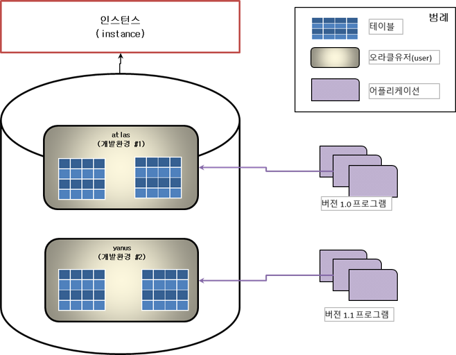

# Oracle CDB, PDB

# 용어

- Multi-Tenant DB: 복수의 DB
    - 여러 DB가 들어올 수 있는 DB
- CDB: Container DB
    - 하나의 DB를 Container로 보고 그 Container를 담을 수 있는 DB
- PDB: Pluggable DB
    - CDB에 끼워 넣을 수 있는 DB, CDB 안에 있는 DB
- 비CDB: !CDB
    - PDB를 만들 수 없는 DB, 1개의 instance + 1개의 DB

# 11g 까지의 복수의 환경 구현 방법

## 인스턴스를 2개 이상 운영할 수 없는 환경

- Memory나 Disk등 하드웨어적 제한 사항으로 인해 복수의 인스턴스를 운영할 수 없는 경우
    - 스키마 유저로 나눠 구현하는 방법

- 버전 별로 나눈 후 개발자들은 각각의 환경에 접속할 때 유저명을 구별해 접속

## 하나의 DB로 개발환경 구축이 힘든 환경

- Public Synonym등을 사용해 기능을 구현한 환경
- 성능 실험을 위한 전용 환경을 만들어야 하는 경우

- 개발환경을 따로 구축해 접속 시 DB명 혹은 TNS명을 구별해 접속

# 12c 이후 CDB 구현 방법

- Multi-Tenant 개념으로 복수의 환경 구축 가능

- 하나의 instance 밑에 복수의 DB를 만들 수 있고 복수의 DB는 서로 다른 DB의 개념
    - 공유하는 것이 별로 없음
- 각각의 PDB는 CDB를 공유