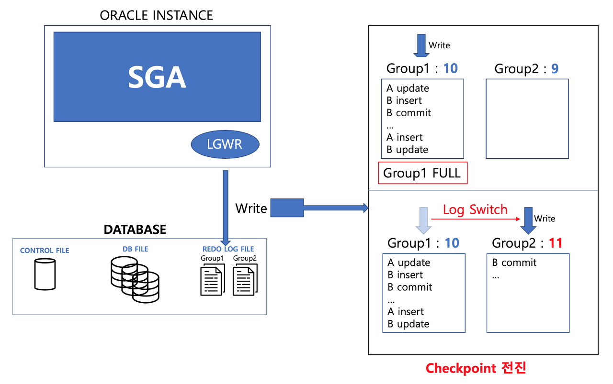

# Oracle Redolog 서버 내부적 Log Switch 작동 원리

# Redo.log

- ORACLE_BASE 아래 oradata/db명 디렉터리에 redo.log 파일들이 존재
- Recovery 작업을 위해 Oracle의 Background Process인 LGWR가 수시로 입력함

# Oracle Database Architecture

## Control File

- DB의 물리적 구조에 대한 정보를 가짐

## DB File

- 실제 Table의 데이터를 가짐

## Redo Log File

- Redo Log Buffer가 기록하는 모든 DB의 변경사항을 파일로 저장한 것

# LGWR

- LGWR은 Log Buffer에 저장되는 DB의 변경사항을 Log File로 기록
- DB Server마다 개수 다르게 설정 가능하나 기본적으로 2개 이상 필요
- 파일 하나하나를 Group이라고 함

## Log Sequence Number

- 각 Group의 순차적인 번호
- LGWR Process가 낮은 번호의 Group을 사용하기 위해 사용
- DB Buffer Cache에 변경된 내용이 얼마나 DB File에 적용되었는지 확인에 사용
→ 비정상적인 종료나 문제가 생겼을 경우 Recovery의 용도로 사용

## Log Switch Event

참고자료 1

- 참고자료 1처럼 Group1에 계속 기록하면 공간이 부족해짐
- 해결을 위해 Log Switch Event 발생
    - Log Switch: 다른 Group으로 대상을 변경하여 기록
- Log Switch Event 발생 시 Checkpoint Event 발생
- Checkpoint Event 발생하며 사용하게 되는 Group의 Log Sequence Number를 이전 Group보다 1 높게 변경

## Checkpoint Event

- DB Buffer Cache의 메모리의 변경된 정보를 실제 물리 DB File에 적용하는 Event
- Checkpoint Event가 완료 시 Redo Log File은 필요없어짐(비활성 상태로 전환)

## Log File Full

참고 자료 2

1. Checkpoint의 전진으로 더이상 필요없어진 Group1을 Log Switch하여 Group2를 사용
2. Group2도 다 차서 기록할 공간이 없어짐
3. Checkpoint Event가 발생해 Log Switch Event가 다시 발생
4. 더 이상 필요없는 내용인 Group1에 Overwrite하여 기록함
- 만약 Log Switch를 하려 할 때 Checkpoint Event가 끝나지 않았을 경우 대기

## Checkpoint Flow

1. Log Switch 발생
2. Checkpoint Event
    - DB Buffer Cache Memory의 변경 내용을 DB File에 적용하고 작업이 끝나면 CKPT에게 종료 신호를 전달
3. Control File 기록
    - Control File에  Checkpoint SCN 기록
4. DB File Header에 기록
    - 모든 DB File Header에 Checkpoint SCN 정보를 기록
- 위 과정이 계속 반복
    - 만약 2번의 작업이 끝나지 않아도 Log Switch가 발생했고 빈 Group이 없을 때는 이전 Checkpoint 작업이 끝날때까지 대기함