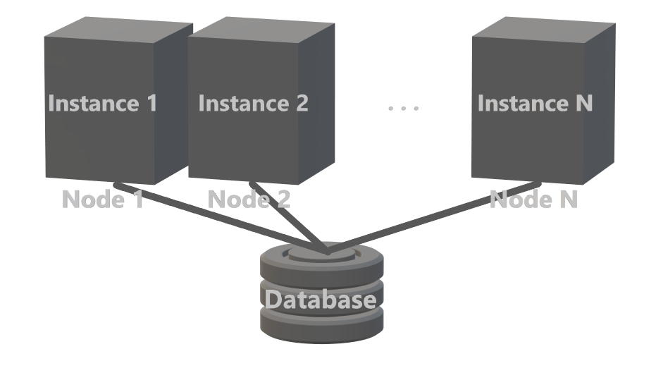
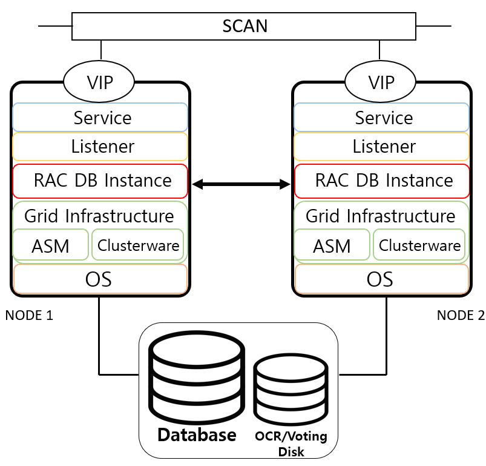

# RAC

# 개념



- Oracle Real Application Cluster
- Oracle RAC는 여러 개의 Instance가 하나의 DB를 Access 할 수 있음
- Application에서 접속할 수 있는 통로는 여러개이며 DB는 하나인 형태
- Oracle RAC = N개의 Instance + 1개의 DB
- RAC로 연결된 N개의 Instance에서 동일한 Datafile을 공유해 Access
- DB 작업에 사용할 수 있는 Resource(CPU, Memory)는 공유하지 않으며 해당 Node의 것만 이용

# Cluster

- 두 개 이상의 독립된 서버들과 Disk를 하나로 연결하는 기법
- 사용자가 Cluster로 구성된 서버들 중 어느 서버에 접속해도 동일한 Disk를 Access
- Oracle RAC는 Oracle Clusterware를 사용해 어느 Instance에 접속해도 사용자에게 동일한 Data를 실시간으로 조회, 변경할 수 있는 기능 제공
- Oracle Clusterware를 사용하면 높은 처리량과 고가용성 보장 가능

# Oracle RAC Instance

- Oracle RAC 환경의 각 Instance에는 각자의 SGA와 Background Process들이 존재
- 모든 Datafile과 Control File은 모든 Instance에 동일하게 Access할 수 있어야 하므로 공유 Storage에 위치
- 각 Instance에는 고유한 Online Redo Log File 존재
- Online Redo Log File은 자신이 속한 Instance에 의해서만 기록 가능
- Online Redo Log File도 Instance 복구 시 다른 Instance에 Access할 수 있어야 하므로 공유 Storage에 저장됨
    - Redo Log Group을 공유하나 Redo Log File에 쓰는 것은 개별적

|  | 단일 Instance | Oracle RAC |
| --- | --- | --- |
| Instance | 1 | N |
| Database | 1 | 1 |
| Control File | 하나의 Instance에 존재 | 공유 Storage에 존재 |
| SGA + Background Process | 하나의 Instance에 존재 | 각각의 Instance별로 존재 |
| Redo Log File | 하나의 Instance에 존재 | 각각의 Instance별로 존재 |
| UNDO Tablespace | 하나의 Instance에 존재 | 각각의 Instance별로 존재 |
| TEMP Tablespace | 하나의 Instance에 존재 | Database에 하나만 존재 |
| SYSTEM Tablespace | 하나의 Instance에 존재 | Database에 하나만 존재 |
| ETC Tablespace | 하나의 Instance에 존재 | Database에 하나만 존재 |
- Data 정합성
    - Oracle RAC 환경의 Instance는 여러 Instance에서 동시에 동일한 data를 Access하는 구조로 Data 공유
    - 동일한 Data를 여러 Instance가 읽어도 문제 없으나 여러 Instance가 동시에 수정, 삽입 등을 하는 경우 Data 무결성에 문제 발생
    - Cache Lock과 Cache Fusion등을 사용해 이를 보장

# Oracle RAC 구성요소

## Oracle Grid Infrastructure



- Oracle RAC는 Grid Infrastructure에서 제공하는 Oracle Clusterware의 기반 하 여러 DB Server를 묶어 하나의 System처럼 동작하도록 지원
    - Grid Infrastructure(GI): Oracle Clusterware 및 ASM으로 구성되며 OS와 긴밀히 통합된 Software Layer
    - Clusterware 설치: RAC 구성을 위해 필요한 Software이며 Oracle 설치 계정 이외 별도의 계정을 생성하여 설치하는 것을 권장
    - Clusterware의 OS 계정: 일반적으로 GI와 ASM을 소유하는 전용 OS 계정인 grid 계정 사용

## 공유 Storage

- 각 Instance는 공유 Storage를 통해 물리적인 Data를 공유하며 DB에서 사용하는 ASM및 CFS(Cluster File System)을 구성
- 공유 Storage에서 Database File은 모든 Node에 동등하게 동시에 엑세스 할 수 있어야 함
- Storage에서 생성된 Disk는 공유 모드가 활성되어야 함

## Oracle RAC Network 구성 요소

### Public IP

- 각 Node에 대한 고유한 IP
- 서버 주소와 동일
- Node 관리 목적으로 사용

### Service IP

- Client에서 DB Server의 Public IP를 사용하여 접속할 경우 장애가 발생한 Node에서 세션을 다른 Node로 옮기는 데 많은 시간이 걸림
- VIP(Virtual IP)를 사용해 Client가 Node에 장애가 발생했다는 것을 신속하게 인식하게 함
- 다른 Node로 재연결 시간 향상

### SCAN(Single Client Access Name)

- GNS 및 DNS를 사용하여 정의 가능
- SCAN을 이용할 경우 Cluster 내 서버 수에 관계 없이 Load Balancing 및 HA를 고려해 3개의 IP Address 권장

### Private IP(Cluster Interconnect)

- Cluster Node 별 통신을 위한 IP
- Resource 동기화를 위해 Cluster에서 Heartbeat Process를 위해 사용하는 통신 경로
- Instance에서 다른 Instance로 Data를 전송(Cache Fusion)하는 용도로 사용

# Oracle RAC Cache Fusion


- OPS(Oracle Parallel Server)의 Block Transformation의 문제를 극복하기 위해 나타난 Architecture
    - Block Transformation
        - 특정 Instance에 존재하는 Block을 다른 Instance에서 Access하기 위해 해당 Block을 공유 Storage에 write한 후 그 Block을 호출한 Instance의 DB Buffer Cache로 Caching하여 Data Block을 다른 Node로 이동시키는 방식
        - 각각의 Instance에서 많은 작업이수행되어 이동하는 Block이 많으면 성능 저하가 발생


1. Instance 2에 접속한 A Process는 Instance 1에 존재하는 1번 Block을 Access하기 위해 호출
2. Instance 1에 존재하는 1번 Block은 Instance 2의 호출에 응답하기 위해 Instance 2의 SGA의 DB Buffer Cache로 이동, 이동을 위해서 공유 Storage의 DB를 이용하지 않고 Instance 사이의 Interconnect를 이용
3. Interconnect를 이용해 Instance 2로 Caching된 1번 Block을 A Process가 Access할 수 있게 됨

## 목적

- Block이 특정 Node의 DB Buffer Cache에 Load되어 있다면 Disk I/O가 발생하지 않아 Block 이동이 빠르게 처리되어 Oracle RAC 성능 향상에 가장 중요한 Architecture

## 구성요소(Oracle Kernel) → 깊이있게 하는 것 보다 담백하게

- GRD(Global Resource Directory)
    - RAC에서 Global Resource 관리
    - Cluster의 동기화를 위해 Cluster 내의 Recource 정보(Resource Master, Resource Holder)들을 저장
        - Resource Master: 특정 Global Resource는 반드시 하나의 GRD에서 최신정보 관리
        - Resource Holder: 특정 Resource의 최정 버전을 가지고 있는 Node
- GCS(Global Cache Service)
    - Data의 일관성 및 무결성을 유지하는 Service
    - DB Buffer Cache 동기화에 대한 Global 정보를 저장
    - Block에 대한 Lock 정보 관리
- GES(Global Enqueue Service)
    - DB Lock에 대한 정보를 관리하는 Service
    - Block 이외의 Lock 정보 저장 및 관리
        - Enqueue Lock, Library Cache Lock, Row Cache Lock

## Cache Fussion Access

- Session이 요청한 것을 응답받는 방법
- 크게 Local Access, Remote Access, Disk Access가 있음

### Local Access

- 요청한 Block의 최신 Block이 Local Instance에 존재할 경우 Instance간 동기화 없이 Access


- Block을 Access하는 Session 위치 = 필요한 Block 위치 = Master Node의 위치 → Local Access

### Remote Access

- 요청한 Block이 다른 Instance에 의해 수정되어 Remote instance에 존재할 경우 Interconnect를 통해 Block을 복제하여 가져온 후 Data에 Access

### 2-way Access


1. Instance 2에 접속한 Session에서 1번 Block을 Access하는데 Instance 2에 1번 Block이 없음
2. Instance 2는 1번 Block을 Master Node인 Instance 3에게 요청
3. Master Node는 GRD를 확인해 1번 Block의 Holder Node가 Instance 3인 것을 확인 후 Block 요청 전달
4. Instance 3은 Master Node의 요청을 받고 1번 Block의 Image를 Instance 2에 전송
5. Block을 전송받은 Instance 2는 Session의 요청에 대한 응답 수행
- Blcok을 요청하는 Session의 위치 ≠ Block의 위치 = Master Node의 위치 → 2-way Access

### 3-way Access


1. Instance 2에 접속한 Session에서 1번 Block을 Access하는데 Instance 2에 1번 Block이 없음
2. Instance 2는 1번 Block을 Master Node인 Instance 3에게 요청
3. Master Node는 GRD를 확인해 1번 Block의 Holder Node가 Instance 1인 것을 확인 후 Block 요청 전달
4. Instance 1은 Master Node의 요청을 받고 1번 Block의 Image를 Instance 2에 전송
5. Block을 전송받은 Instance 2는 Session의 요청에 대한 응답 수행
- Block을 요청하는 Session의 위치 ≠ Block의 위치 ≠ Master Node의 위치 → 3-way Access

### Disk Access


1. Instance 2에 접속한 Session에서 1번 Block을 Access하는데 Instance 2에 1번 Block이 없음
2. Instance 2는 1번 Block을 Master Node인 Instance 3에게 요청
3. Master Node는 GRD를 확인해 어느 Instance에도 존재하지 않음 확인하고 Instance 2에게 전달
4. Instance 2은 Master Node에게 전달 받고 Disk의 해당 Block을 Instance 2의 DB Buffer Cache에 Caching
5. 1번 Block이 Caching되어 Instance 2는 Session의 요청에 대한 응답 수행
- 어느 Instance에도 요청한 Block이 존재하지 않음 → Disk Access

# RAC Grid Infrastructure 설치 시 유의사항

## Server 간 Passwordless SSH 접속 설정

```bash
cd ~
mkdir .ssh
chmod 0700 .ssh
cd .ssh
ssh-keygen -t rsa
ssh-keygen -t dsa
ssh-copy-id racdb1
ssh-copy-id racdb2
ssh racdb1 date
ssh racdb2 datez
```

swap 메모리는 보통 2~3배 가능하면 1:1 이상으로 맞추기

ntp 관련 모조리 정지 및 conf 삭제

양쪽 다 grid infrastructure 설치 전 설정을 해줘야 함

nslookup에서 잡혀야 함 ping은 잡혀도 에러가 뜸

](./RAC/Untitled%207.png)

[https://positivemh.tistory.com/526](https://positivemh.tistory.com/526)


[https://fliedcat.tistory.com/213?category=741352](https://fliedcat.tistory.com/213?category=741352)


```
   - 전체 : crsctl stop has   - 시작 : crsctl start crs   - 종료 : crsctl stop crs   - 체크 : crsctl check crs   - 상태 : crsctl stat res -t             crs_stat -t             crs_stat -p
   - ocr : ocrcheck            crsctl query css votedisk
```

```
2. rac db 관련 명령어
   - 인스턴스     시작 : srvctl start instance -d 인스턴스명  -n node명     종료 : srvctl stop instance -d 인스턴스명  -n node명     상태 : srvctl status instance -d 인스턴스명  -n node명

   - 리스너
     시작 : srvctl start  listener -n 노드명
     종료 : srvctl stop listener -n 노드명
     상태 : srvctl status listener -n 노드명

```

출처:

[https://semode.tistory.com/201](https://semode.tistory.com/201)

[세모데:티스토리]

[https://dbkwon.tistory.com/19](https://dbkwon.tistory.com/19)