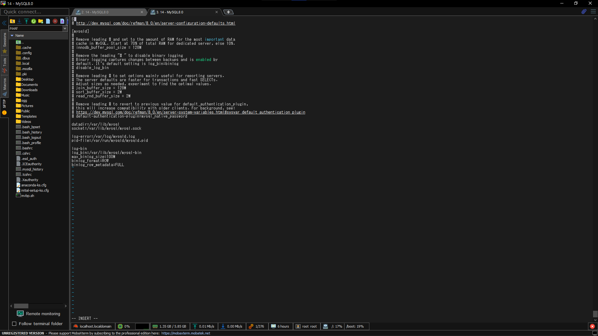

# MySQL용 Oracle GoldenGate


📌 Oracle GoldenGate 21.3c 기준으로 작성된 문서


📖 **MySQL용 Oracle GoldenGate** 

# MySQL용 Oracle GoldenGate

- 지원되는 MySQL DB 버전에 대한 초기 Load 및 Transaction Data의 캡처 및 전달을 지원

# 지원 사항

## Character Set

- MySQL은 User가 다른 Level에서 다른 Character Set을 지정 가능

| Level | Example |
| --- | --- |
| Database | CREATE DATABASE <db name> CHARSET <character set> |
| Table | CREATE TABLE <table name>(<col1> <type>, …) CHARSET <character set> |
| Column | CREATE TABLE <table name>(<col1> <type> CHARSET <character set> …) |

### 지원하지 않는 Character Set

- Multi Byte Character Set에는 Binary Data 정렬이 지원되지 않음

- `armscii8`
- `keybcs2`
- `geostd8`

- `utf8mb3`
- `utf16le`

## Data Type

### 지원하는 Data Type

- `BLOB`
- `BINARY`
- `CHAR`
- `DATETIME`
- `DOUBLE`
- `FLOAT`
- `JSON`
- `LONGTEXT`
- `MEDIUMINT`
- `SMALLINT`
- `TIME`
- `TINYBLOB`
- `TINYTEXT`
- `VARCHAR`

- `BIGINT`
- `BIT(M)`
- `DATE`
- `DECIMAL`
- `ENUM`
- `INT`
- `LONGBLOB`
- `MEDIUMBLOB`
- `MEDIUMTEXT`
- `TEXT`
- `TIMESTAMP`
- `TINYINT`
- `VARBINARY`
- `YEAR`

### Data Type의 지원 한계

- Capture 또는 Delivery에는 Functional Index가 지원되지 않음
- `BLOB`나 `TEXT`가 PK로 사용되는 경우 지원하지 않음
- `TIME`은 00:00:00 ~ 23:59:59까지 지원
- `TIMESTAMP`는 0001/01/03:00:00:00 ~ 9999/12/31:23:59:59까지 지원
- 음수 날짜 지원하지 않음
- 부동 소수점의 경우 Host System에 따라 다름
- non-strict sql_mode에서 `ENUM`을 사용하는 경우에도 잘못된 ENUM값을 입력할 수 없으며 오류가 반환됨
    - sql_mode를 `STRICT`로 사용하고 Extract를 재시작
    Data Type에 잘못된 값을 입력할 수 없게 되며 유효한 값만 입력 가능
    - non-strict sql_mode를 사용하나 `ENUM`을 사용하지 않음
    - non-strict sql_mode를 사용하나 유효한 `ENUM`만 사용
        - 잘못된 `ENUM`값을 지정하면 DB가 수락하여 Extract가 abend됨
- 단일 Row가 있는 Table은 `JSON`이 지원되지 않음
- `JSON`은 CDR을 지원하지 않음

### 지원하지 않는 Data Type

- `XML`
- Spatial Type(ex: `Geometry`)

- `SET`

## Object & Operation

- DDL 작업의 Extract 및 Replication을 지원
- MySQL 및 사용중인 DB Storage Engine에서 지원하는 전체 Row, Attribute 수까지 Transaction Table을 지원(InnoDB의 max = 1017 Rows)
- 생성된 Row가 지원되고 Capture됨
- `AUTO_INCREMENT` 지원
    - Increment된 값은 Extract에 의해 Binary Log에서 Capture된 뒤 Replicat `INSERT` 적용
- MySQL 기본 복제와 동시에 작동 가능
- `DYNSQL` 기능 지원

<aside>
📌 XA Transaction은 Capture에 지원되지 않으며 로그인 된 모든 XA Transaction으로 인해 Extract가 종료됨

</aside>

### 지원되는 Operation

- `INSERT`
- `UPDATE`(압축 포함)
- `DELETE`(압축 포함)
- `TRUNCATE`

### MySQL DDL의 Object와 Operation 지원 세부 정보

- MySQL용 DDL 복제는 Source와 Target으로 MySQL DB 간에만 지원
- DDL 작업의 기본 Extract 및 Replicat은 MySQL 5.7.10 이상만 지원
    - MySQL 5.7.10의 경우 Local DDL Capture만 지원
    - MySQL 8.0의 경우 Local 및 Remote DDL Capture 지원
- `CREATE TABLE`, `ALTER TABLE`, `DROP TABLE` 지원
- `TRUNCATE`의 경우 Exctract와 Replicat의 매개변수로 `GETTRUNCATES`를 설정해 DML로 지원
- DDL 복제의 경우 양방향 구성에서 지원되지 않음

### 지원되지 않는 Object와 Operation

- OGG `BATCHSQL`
- 초기 Load 중 배열 가져오기
- `FETCHMOCOLS`나 `FETCHMODCOLEXCEPT`(Table Option)가 활성화된 경우 NLS LOB Data Capture
- Table 이름 바꾸기
- Procedure내의 DDL
- OGG Server와 DB Server의 시간대가 일치하지 않는 경우 `TIMESTAMP`
- View에 의한 Extract 및 Replicat
- Slave가 적용한 Transaction은 Slave의 binlog가 아닌 Relay Log에 기록되어 Slave가 Master로 부터 받은 binlog를 Transaction에 쓰도록 하기 위해 my.cnf에서 log slave-update Option을 1로 변경해 Replication Slave를 시잘해야 적용가능
    - 다른 Binary Logging 매개 변수에 추가됨
    - Master의 Transaction이 Slave의 binlog에 있으면 Slave에 대한 Regular Capture를 설정해 Slave의 binlog를 Capture하고 처리할 수 있음

## System Schema

- Wild Card없이 명시적으로 지정하지 않는 한 OGG에 의해 자동으로 복제되지 않음
    - `information_schema`
    - `performance_schema`
    - `mysql`

# OGG용 System 준비 및 구성

## MySQL용 OGG Process용 DB USER

- OGG 전용 DB USER를 생성해야 함
- DDL 복제를 지원하기 위해 MySQL USER에게 DB Plugin을 설치할 수 있는 권한이 있어야 함
    - MySQL 5.7에서만 필요
    - `mysql.plugin`
    - System Table에 `INSERT` 권한 필요
- `USERID` 매개변수로 OGG Parameter File에 지정해야 함
- `information_schema`에 대한 읽기 권한이 필요

| 권한 | Ectract Source | Replicat Target | 목적 |
| --- | --- | --- | --- |
| SELECT | X | X | DB에 연결하고 Object 선택 |
| REPLICATION SLAVE | NA | NA | Replication Master의 Binary Log에서 UPDATE 연결 및 수신 |
| REPLICATION CLIENT | X | NA | Master, Slave의 Binary Log 정보를 표시 |
| CREATE
CREATE VIEW
EVENT
INSERT
UPDATE
DELETE | X | X | Source & Target DB Heart Beat & Checkpoint Table 생성,
Data Record 생성 및 삭제 |
| DROP | X | X | Drop Replicat Checkpoint Table & Heart Beat Table |
| EXECUTE | X | X | Procedure 실행 |
| INSERT, UPDATE, DELETE
on Target Table | NA | X | 복제된 DML을 Target에 적용 |
| DDL privileges on
Target Objects
(if using DDL support) | NA | X | Target에서 복제된 DDL 발행 |
- Binary Log Event를 Capture하기 위해 Admin이 Extract USER에게 권한 부여
    - MySQL 구성 파일(my.cnf)이 있는 Directory의 읽기, 실행 권한
    - MySQL 구성 파일에 대한 읽기 권한
    - Binary Log가 있는 Directory에 대한 읽기, 실행 권한
    - tmp Directory에 대한 읽기 및 실행 권한(`/tmp`)
        - MySQL DB를 연결하기 위해 `/tmp/mysql.sock` File에 Access해야 함
        (ver 8.0 이전)

## Data Availability 보장

- Extract를 중지하거나 비정상 중단이 되는 경우 Extract가 Checkpoint에서부터 다시 시작할 수 있도록 충분한 Binary Log Data를 유지
- Extract는 Commit되지 않은 가장 오래된 Operation 단위의 시작이 포함된 Binary Log와 그 이후 모든 Binary Log에 Access할 수 있어야 함
- 처리 중 추출이 필요한 Data가 활성화되거나 Backup Log에 보존되지 않는 경우 수정 조치
    - Binary Log Data를 사용할 수 있는 뒷 시점에서 Capture하도록 수정하고 Target에서 가능한 Data 손실 허용
    - Source & Target Table을 다시 동기화한 후 OGG 재실행
- `INFO EXTRACT`를 실행하면 Extract Checkpoint를 확인 가능

## Logging Parameter 설정

- MySQL Transaction Log에서 Capture하기 위해 OGG Extract Process가 모든 Binary Log File의 경로를 포함하는 Index File을 찾을 수 있어야 함
- Extract는 모든 Table 열이 Binary Log에 있다는 가정하에 동작
    - `binlog_row_image`가 `full`로 설정되어야만 함(default)
        - 다른 값은 지원하지 않음
    - MySQL 5.7에서 `server_id` Option이 `log-bin`과 함께 지정되어야 함
        - 그렇지 않은 경우 Server가 시작되지 않음
    - MySQL 8.0은 `server_id`가 기본적으로 사용되도록 설정되어 있음
- Extract는 Index File 경로를 가져오기 위해 매개변수 설정을 확인함
    1. `ALTLOGDEST` Option을 사용해 `TRANLOGOPTIONS` Parameter 추출
       이 Parameter가 Log Index File의 위치를 지정하는 경우 Extract는 MySQL Server 구성 파일에 지정된 기본값을 허용
       `ALTLOGDEST`를 사용하는 경우 Binary Log Index File도 지정된 Directory에 저장해야 함
       MySQL 구성 파일이 전체 Index File 경로 이름을 지정하지 않거나 잘못된 위치를 지정하거나 같은 시스템에 MySQL이 여러개 설치되어 있는 경우 이 Parameter를 사용해야 함
       OGG 21c 이상에서는 Local Extract의 경우 `ALTLOGDEST` Parameter가 선택이지만 Remote Extract의 경우 필수
       `ALTLOGDEST`를 지정하지 않을 경우 Binary Log Index와 Binary Log File 경로를 DB에서 가져옴(위와 동일하게 접근성 검사를 받음)
       
        ```bash
        
        TRANLOGOPTIONS ALTLOGDEST "/mnt/rdbms/mysql/data/logs/binlog.index"
        ```
       
        Remote Server에서 Capture일 경우 Remote Server의 Index File 경로대신 `REMOTE` Option을 선택하면 동작함
       
        ```bash
        TRANLOGOPTIONS ALTLOGDEST REMOTE
        ```
       
    2. MySQL Server 구성 파일에 Server와 Client에 대한 Default 시작 Option이 저장됨
       `TRANLOGOPTIONS` 없이 `ALTLOGDEST`를 사용하는 경우 Extract는 구성 파일에서 Log File의 위치에 대한 정보를 가져옴
       `ALTLOGDEST`를 사용하는 경우에 다음 Extact Parameter를 올비르게 설정해야 함
        - `binlog-ignore-db=oggddl`
            - DDL Logging History Table이 Binary Log에 기록되지 않음
        - `log-bin`
            - 이 Parameter는 Binary Log를 활성화하는데 사용
            - Binary Log Index File의 위치를 지정
            - `ALTLOGDEST`를 사용하는 경우 OGG에 필요한 Parameter
            - 미지정시 Binary Log가 비활성화되고 Extract에서 오류 반환
        - `log-bin-index`
            - 이 Parameter는 Binary Log Index의 위치를 지정
            - 미사용시 Extract는 Index File이 Log File과 동일한 위치에 있다고 가정
            - 이 Parameter를 사용한 후 Binary Log가 있는 Directory와 다른 Directory를 지정하는 경우 Extract 이후 Binary Log를 이동시키면 안됨
        - `max_binlog_size`
            - 이 Parameter는 Binary Log File의 크기를 지정(Byte)
        - `binlog_format`
            - 이 Parameter는 Log의 형식을 설정
            - DML을 Binary 형식으로 기록하도록 `ROW`로 지정
            - Extract는 `ROW`가 아닌 `binlog_format`을 검색할 때 비정상 종료 대신 무시
        - `mysql.rds_set_configuration`
            - MySQL Amazon RDS Instance에서 Capture할 때 MySQL을 호출해야 함
            - `rds_set_configuration` MySQL Command Line에 저장된 Procedure에서 특정 기간 동안 Binary Log를 유지함
            - Default = NULL이며 Binary Log가 유지되지 않음을 의미
            
            ```sql
            call mysql.rds_set_configuration('binlog retention hours', 24);
            ```
            
       
        구성 파일을 찾기 위해 Extract는 `MYSQL_HOME` Environment Variable을 확인
        `MYSQL_HOME`이 설정된 경우 Extract는 지정된 Directory의 구성 파일을 사용
        `MYSQL_HOME` 미설정시 Extract는 `infomation_schema.global_variables` Table을 Query하여 MySQL 설치 Directory를 확인
        해당 Directory에 구성 파일이 있을 시 Extract는 해당 파일을 사용
       
    3. MariaDB Ver 10.2 이상의 OGG는 MySQL과 동일하게 동작하나 구성 파일에서 새 변수를 구성해야 함
    `binlog-annotate-row-events=OFF`를 추가한 후 MariaDB를 재시작한 후 Extract 재실행

## DB 연결

- `SOURCEDB` Parameter에서 연결할 DB의 이름을 가져옴

```sql
SOURCEDB <dbname>@<hostname>:<port>, USERID <userid>, PASSWORD <passwd>
```

## Session Character Set 설정

- Extract와 Replicat은 DB에 연결할 때 Session Character Set을 사용
- MySQL의 경우 Session Character Set은 `SOURCDDB`와 `TARGETDB`의 `SESSIONCHARSET` Option에서 가져옴

## Processing을 위한 Table 준비

### Table의 식별자 확인

- 복제된 `UPDATE`와 `DELETE`를 위한 올바른 대상 Row를 찾기 위해 고유한 Row 식별자가 필요
- `TABLEMAP`이나 `KEYCOLS`가 사용되지 않을 시 아래 우선순위에 맞게 식별자를 찾음
    1. PK
    2. `TIMESTAMP` 또는 구체화되지 않은 계산 열을 포함하지 않는 (영문자 순) 첫 번째 UK
    3. 앞 유형이 존재하지 않는 경우 지원되는 열들을 DB가 UK로 사용할 수 있도록 하는 모든 열의 의사 키를 구성
    4. Table에 적절한 키가 없거나 기존 키를 사용하지 않으려 할 때 고유한 값을 포함하는 열이 있을 경우 대체 키를 정의할 수 있음
    이 대체 키는 Extract의 `TABLE`과 Replicat의 `MAP` Parameter 내에 `KEYCOLS`절 포함해 정의

### UK에서 파생된 PK가 있는 Table

- MySQL에서 Table에 PK가 없는 경우 Indexing 된 열이 `NOT NULL`인 경우 PK로 파생
    - `NOT NULL`인 Index가 두 개 이상 있을 경우 첫 Index가 PK로 파생
    - Replicat Error를 방지하기 위해 Source와 Target Table에서 동일한 순서로 인덱스를 생성

## 키가 없는 Table에서 Row 변경 제한

- 대상 Table에 PK 혹은 UK가 없을 경우 중복 행이 존재할 수 있음
    - 이 경우 OGG에서는 너무 많은 수의 Row를 `UPDATE`하거나 `DELETE`하여 USER에게 경고하는 Error 메세지 없이 Source와 Target을 동기화 하지 않도록 설정 가능
    - `UPDATE`되는 Row 수를 제한하기 위해 Replicat의 `DBOPTIONS`와 함께 `LIMITROWS`를 사용

## Triggers & Cascade Constraints Considerations

### Trigger

- Target Table에서 Trigger를 비활성화 하거나 OGG DB USER가 변경한 사항을 무시하도록 변경
- OGG는 Trigger에서 발생하는 DML을 복제
- 동일한 Trigger가 Target Table에서 활성화되면 복제된 버전으로 인해 중복되고 DB Error 반환

### Cascade Constraint Consideration

- Capture한 Cascade `UPDATE` 및 `DELETE`는 Binary Log에 기록되지 않음 → Capture되지 않음
    - MySQL과 MariaDB 둘 다 공통적
    - ex) 상위 관계의 Table에서 `DELETE` 문을 실행할 시 하위 Table에 대해 Cascade `DELETE` 실행되나 Binary Log엔 기록되지 않음
- Cascade Operation의 Replication을 처리하기 위해서 Source에서 Cascade `DELETE` & `UPDATE` 비활성화
- 부모 Record 살제 전 자식 Record를 명시적으로 `DELETE`하거나 `UPDATE` 하도록 준비

# `log-bin` 위치 변경

- MySQL 구성 파일의 `log-bin` 변수를 사용해 Binary Log 위치를 수정하면 Index File 내에 두 다른 경로 항목이 생성되어 오류가 발생할 수 있어 아래를 수행해 `log-bin` 저장소 위치 변경 필수
1. 새로운 DML 중지
2. Extract가 모든 기존 Binary Log 처리를 완료하도록 함
    - Checkpoint 위치가 마지막 Log의 Offset에 도달하면 Binary Log 처리가 완료된 것
3. Extract가 Data 처리를 완료하면 Extract Group을 중지하고 필요한 Binary Log를 Backup
4. MySQL DB `SHUTDOWN`
5. `log-bin`의 새 위치로 경로를 수정
6. MySQL DB `STARTUP`
7. Index File에서 이전 Log 이름 항목을 정리하기 위해서 `flush master`(`reset master`)를 사용
8. Restart Extract

# 양방향 Replication 구성

- 양방향 Replication 구성에는 각 System의 Transaction 변경 사항을 다른 System으로 Replication할 수 있도록 Source System과 Target System 모두에게 Extract & Replicat Process가 있음
- 양방향 Replication을 구성하기 위해 Local Replicat에서 적용한 Transaction을 필터링해야함
    - 무한 루프해서 다시 Source로 들어가지 않기 위함
- `AUTO_INCREMENT`의 값이 각 System끼리 충돌하지 않도록 설정해야 함
1. 동기화를 유지하기 위해 한 System에서 수행되는 DDL을 다른 System으로 복제해야 함
두 System의 Extract의 `DDLOPTIONS`문에 `GETAPPLOPS` Option을 포함
Replicat에서 한 System에 적용하는 DDL은 Local Extract에서 Capture해 다른 System으로 전송
2. 적용된 Operation이 Capture되지 않고 Source로 다시 Loopback되지 않도록 양방향 구성에서 Replicat Operation을 필터링하기 위해 다음 작업을 수행
    1. Checkpoint Table을 사용하도록 각 Replicat Process를 구성
    Replicat은 각 Transaction이 끝날 때마다 이 Table에 Checkpoint를 기록
    하나의 Global Checkpoint Table을 사용하거나 Replicat Process 당 하나씩 사용 가능
    2. Extract의 Parameter인 `TRANLOGOPTIONS`의 `FILTERTABLE` Option으로 Checkpoint Table을 지정해 Checkpoint Table의 Transaction을 무시
3. 양방향 작업으로 인해 발생할 수 있는 불일치를 방지하기 위해 MySQL Server 구성 파일을 편집해 `auto_increment_increment`와 `auto_increment_offset` Parameter를 설정
   
    ```bash
    auto-increment-increment = 2
    auto-increment-offset = 1
    ```
    
    ```bash
    auto-increment-increment = 2
    auto-increment-offset = 2
    ```
    

# Remote Capture를 위한 MySQL 구성

## DB Server 구성

1. Oracle GoldenGate Remote Capture USER에게 Access 권한 부여
   
    ```sql
    CREATE USER '<username>'@'<host>' IDENTIFIED BY '<password>'; 
    GRANT ALL PRIVILEGES ON *.* TO '<username>'@'<host>' WITH GRANT OPTION; 
    FLUSH PRIVILEGES;
    ```
    
2. MySQL Remote Server의 `server_id` 값이 0보다 커야함
   
    ```sql
    show variables like ‘server_id’;
    ```
    
    값이 0일 경우 `my.cnf`의 `server_id`를 수정해 0보다 큰 값으로 변경
    

## Oracle GoldenGate 구성

1. Extract의 Parameter File에 Remote Database의 연결 정보 제공
   
    ```sql
    SOURCEDB <db>@<server>:<port>, USERID <user>, PASSWORD <password>
    ```
    
2. Extract의 Parameter File에서 연결 정보 뒤 다음 Parameter 추가
   
    ```sql
    TRANLOGOPTIONS ALTLOGDEST REMOTE
    ```
    

## MySQL용 OGG Remote Capture의 제한 사항

- 기본 Replication Slave에서는 현재 실행중인 Slave와 다른 `server_id`가 할당되어야 함
  
    ```sql
    show slave hosts;
    ```
    
    - OGG Capture가 Error와 함께 비정상 종료가 되면 Capture의 이름을 변경하고 다시 실행
    - 기본 Replication Slave가 Error와 함께 비정상 종료되면 `server_id`를 변경하고 다시 실행
- Remote Capture는 Linux에서 실행되는 OGG에 대해 지원되며 Linux 또는 Windows에서 실행되는 DB 지원 가능

# MySQL Capture와 Delivery에서 양방향 SSL 연결

- 양방향 SSL을 사용하기 위해 `ca.pem`, `client-cert.pem`, `client-key.pem` File의 전체 경로를 제공해야 함
    - [인증서 파일에 대한 내용](https://dev.mysql.com/doc/refman/5.7/en/creating-ssl-rsa-files-using-mysql.html)
- `SETENV` Parameter를 사용해 Extract, Replication의 Parameter File에 경로 제공
    - `OGG_MYSQL_OPT_SSL_CA`: `ca.pem`의 전체 경로
    - `OGG_MYSQL_OPT_SSL_CERT`: `client-cert.pem`의 전체 경로
    - `OGG_MYSQL_OPT_SSL_KEY`: `client-key.pem`의 전체 경로
    
    ```sql
    SETENV (OGG_MYSQL_OPT_SSL_CA='/var/lib/mysql.pem') 
    SETENV (OGG_MYSQL_OPT_SSL_CERT='/var/lib/mysql/client-cert.pem') 
    SETENV (OGG_MYSQL_OPT_SSL_KEY='/var/lib/mysql/client-key.pem')
    ```
    

# MySQL Replication Slave를 사용한 Capture

- Slave에서 Master의 Binary Log Event를 Capture하도록 MySQL Replication Slvae 구성 가능
- 일반적으로 Slave가 적용한 Transaction은 Slave의 `binlog`가 아닌 Relay Log에 기록됨
- Slave가 Master로부터 받은 Transaction을 기록하기 위해 OGG에 대한 다른 Binary Logging Parameter와 함께`my.cnf`의 `log-slave-updates`를 1로 Replication Slave를 시작해야 함
- Master의 Transaction이 Slave의 binlog에 저장된 후 Capture하고 처리하기 위해 Slave에서 일반 OGG Capture를 설정할 수 있음

# MySQL용 기타 OGG Parameter

| Parameter | 설명 |
| --- | --- |
| DBOPTIONS CONNECTIONPORT <port> | 기본 포트번호가 아닐 때 사용 |
| DBOPTIONS HOST <host> | DNS name이나 IP Address 기입 |
| DBOPTIONS ALLOWLOBDATATRUNCATE | 복제된 LOB Data가 너무 클 경우 Replicat의 비정상 종료를 방지 |
| SOURCEDB USERID <user> PASSWORD <pass> | 연결 정보 |
| SQLEXEC | SQL문 실행(?) |
| sql_mode | Global Variable인 sql_mode |

# 특정 시작점에서 Extract 위치 지정

- `ADD` / `ALTER` `EXTRACT` 명령을 사용해 Extract를 Transaction Log의 특정 시작점에 배치 가능
- { `ADD` | `ALTER` `EXTRACT` } `<group>`, `LOGNUM` `<log_num>`, `LOGPOS` `<log_pos>`
    - `<group>`: 특정 시작점이 필요한 OGG Extract Group명
    - `<log_num>`: Log File 번호
        - ex) test.000034의 경우 `LOGNUM 34`
    - `<log_pos>`: 특정 Transaction Record를 식별하는 Log File 내의 Event Offset 값
- MySQL Log에서 Event Offset 값은 주어진 Binary File 내에서만 고유함

# Transaction Log-based DDL 구성

- OGG 21c 이상에서 MySQL 8.0으로 Upgrade한 후 전체 Metadata Logging이 필수
    1. Linux 및 Windows의 경우 MySQL 구성 파일 내 MySQL Server의 변수 `binlog_row_metadata` `FULL`로 설정(Linux = `my.cnf`, Windows = `my.ini`)
    2. 구성파일 변경 후 DB Server를 재시작
- 양방향 구성에서는 DDL Loop를 방지할 필터링 방법이 없으므로 DDL Replication이 미지원
- Remote Capture를 위한 DDL Replication은 MySQL 8.0에서 지원
Transaction 기반 DDL Replication은 Remote 또는 Local Capture와 함께 작동
OGG 19c에서는 Remote Capture는 DDL Replication을 지원하지 않음
- Transaction Log 기반 DDL Replication은 Stored Procedure 내에서 발급된 DDL을 처리할 수 있음
Plugin-based DDL Replication에선 지원하지 않음
- Heart Beat Table DDL은 Capture에서 무시되므로 Target에서 Heart Beat Table을 직접 생성

# Plugin-based DDL 구성

- MySQL 5.7에서 지원
- DDL Loop을 방지하기 위한 필터링 방법이 없으므로 OGG 양방향 구성에서 지원 불가
- MySQL 5.7에서 Remote Capture는 DDL Replication을 지원하지 않음
- OGG DDL Replication은 `ddl_rewriter`와 `ddl_metadata`란 두 Plugin을 공유 라이브러리로 사용
Replication 전 MySQL Server에 설치해야 함
- DDL Metadata를 Capture하기 위해 OGG `metadata_server`가 실행 중이여야 함
- 새 oggddl Database의 하위인 History Table(oggddl.history)은 Metadata 기록 Table
    - DDL Metedata를 기록하고 저장하는데 사용
    - History Table Record가 Binary Log에 기록되지 않도록 무시해야 하므로 `my.cnf` File에 `binlog-ignore-db = oggddl`처럼 지정해야 함
- 실행되는 모든 DDL문이 손실되므로 oggddl Database 또는 History Table을 삭제해서 안됨
- DDL Capture 중에 metadata_server를 중지하면 안됨
- DDL Capture 중에 `ddl_rewriter`와 `ddl_metadata` plugin등을 제거하면 안됨
- Stored Procedure에서 실행되는 DDL은 지원되지 않음
- Heart Beat Table DDL은 Capture에서 무시되므로 Target에서 Heart Beat Table을 직접 생성

## DDL Replication 설치

- DDL Replication 설치를 위해 Replication USER로 OGG와 함께 제공되는 설치 스크립트를 실행
- USER는 `CREATE`, `INSERT`, `DELETE`, `DROP`, `TRUNCATE` 권한이 있어야 하며 MySQL Plugin Directory에 OGG Plugin을 복사할 수 있는 쓰기 권한이 있어야 함
  
    ```bash
    ./ddl_install.sh install <user> <password> <port>
    ```
    
- DDL Replication 설치 스크립트는 다음 작업을 수행
    1. 지원되는 MySQL Server Version이 설치되어 있는지 확인(Ver 5.7.10 이상)
    2. MySQL Plugin Directory 찾음
    3. `ddl_rewriter`, `ddl_metadata` Plugin `metadata_server` File이 존재하는 지 확인
    4. Plugin이 이미 설치되어 있는 지 확인
    5. `metadata_server`가 실행중인 경우 중지
    6. `oggddl.history` Table이 있을 시 삭제
    7. `metadata_server` Daemon Process 시작
    8. `ddl_rewriter` & `ddl_metadata` Plugin 설치
- 각 MySQL Server에 대한 단일 History Table과 Metadata Server가 있음
- 동일한 DB Server에 있는 Extract Process의 여러 Instance에서 동시에 DDL을 발행하고 Capture하려는 경우 Metadata History Table Access와 채우기 사이에 충돌할 수 있음

## Plugin-based DDL Replication 문제 해결

- Plugin-based DDL Replication은 Metadata History Table과 Metadata Plugin, Server에 의존함
- DDL Replication이 활성화 된 경우 문제 해결을 위해 History Table의 내용과 Metadata Plugin Server Log가 필요
- `mysqldump` 명령을 통해 History Table Dump를 생성할 수 있음
  
    ```bash
    mysqldump [options] database [tables]
    mysqldump [options] --databases [options] DB1 [DB2 DB3...]
    mysqldump [options] --all-databases [options]
    ```
    

## Plugin-based → Transaction Log-based DDL Replication

- MySQL 5.7에서 Plugin-based Solution을 사용 중이고 Transaction Log-based DDL Replication을 사용하는 MySQL 8.0으로 Upgrade하는 경우 다음을 수행해야 함
    1. Plugin-based DDL Replication 제거
    2. DB Upgrade
    3. Transaction Log-based DDL 구성

## Plugin-based DDL Replication 제거

- DDL Event를 Capture하지 않기 위해 `unisntall` 스크립트를 실행
  
    ```bash
    ./ddl_install.sh uninstall <user> <password> <port>
    ```
    
- DDL Replication 제거 스크립트는 다음 작업을 수행
    1. `ddl_rewriter`와 `ddl_metadata` Plugin 제거
    2. `oggddl.history` Table이 있을 경우 삭제
    3. MySQL Plugin Directory에서 Plugin 제거
    4. `metadata_server`가 실행 중인 경우 중지

# Replication에 DDL 필터링 사용

| Option | 설명 |
| --- | --- |
| DDL INCLUDE OPTYPE CREATE OBJTYPE TABLE; | Table 생성을 포함 |
| DDL INCLUDE OBJNAME ggvam.* | DB ggvam 아래 모든 Table 포함 |
| DDL EXCLUDE OBJNAME ggvam.emp*; | DB ggvam 아래 emp로 시작하는 모든 Table 제외 |
| DDL INCLUDE INSTR ‘XYZ’ | ‘XYZ’를 포함하는 DDL 포함 |
| DDL EXCLUDE INSTR ‘WHY’ | ‘WHY’를 포함하는 DDL 제외 |
| DDL INCLUDE MAPPED | MySQL DDL은 이 Option을 사용해 OGG MySQL DDL Replication의 기본값으로 사용해야 함 |
| DDL EXCLUDE ALL | 기본 |

[Using Oracle GoldenGate for Heterogeneous Databases](https://docs.oracle.com/en/middleware/goldengate/core/21.3/gghdb/using-oracle-goldengate-mysql.html)




```
Logdump 24 >n
TokenID x47 'G' Record Header    Info x01  Length  175
TokenID x48 'H' GHDR             Info x00  Length   36
 450c 0041 2500 05ff c0ab 5600 9a16 f302 0400 0000 | E..A%.....V.........
 0000 0000 2804 0000 0352 0000 0001 0000           | ....(....R......
TokenID x44 'D' Data             Info x00  Length   37
TokenID x54 'T' GGS Tokens       Info x00  Length   82
TokenID x5a 'Z' Record Trailer   Info x01  Length  175
___________________________________________________________________
Hdr-Ind    :     E  (x45)     Partition  :     .  (x0c)
UndoFlag   :     .  (x00)     BeforeAfter:     A  (x41)
RecLength  :    37  (x0025)   IO Time    : 2022/12/22 17:35:03.000.000
IOType     :     5  (x05)     OrigNode   :   255  (xff)
TransInd   :     .  (x03)     FormatType :     R  (x52)
SyskeyLen  :     0  (x00)     Incomplete :     .  (x00)
AuditRBA   :       1064       AuditPos   : 4
Continued  :     N  (x00)     RecCount   :     1  (x01)

2022/12/22 17:35:03.000.000 Insert               Len    37 RBA 1924
Name: mysql.test  (TDR Index: 1)
After  Image:                                             Partition x0c   G  s
 0000 0600 0000 0000 000a 0100 0700 0000 0300 6161 | ..................aa
 6102 000c 0000 0032 3032 322d 3132 2d32 32        | a......2022-12-22
Column 0 (0x0000), Length 6 (0x0006).
 0000 0000 000a                                    | ......
Column 1 (0x0001), Length 7 (0x0007).
 0000 0300 6161 61                                 | ....aaa
Column 2 (0x0002), Length 12 (0x000c).
 0000 3230 3232 2d31 322d 3232                     | ..2022-12-22

GGS tokens:
TokenID x4c 'L' LOGCSN           Info x00  Length   37
 3030 3030 3030 3030 3030 3030 3030 3030 3030 3030 | 00000000000000000000
 343a 3030 3030 3030 3030 3030 3031 3039 35        | 4:000000000001095
TokenID x36 '6' TRANID           Info x00  Length   37
 3030 3030 3030 3030 3030 3030 3030 3030 3030 3030 | 00000000000000000000
 343a 3030 3030 3030 3030 3030 3030 3934 30        | 4:000000000000940
```

```
Logdump 25 >n
TokenID x47 'G' Record Header    Info x01  Length  159
TokenID x48 'H' GHDR             Info x00  Length   36
 450c 0041 1500 0fff 00cf 5b06 9a16 f302 0400 0000 | E..A......[.........
 0000 0000 7405 0000 0352 0000 0001 0000           | ....t....R......
TokenID x44 'D' Data             Info x00  Length   21
TokenID x54 'T' GGS Tokens       Info x00  Length   82
TokenID x5a 'Z' Record Trailer   Info x01  Length  159
___________________________________________________________________
Hdr-Ind    :     E  (x45)     Partition  :     .  (x0c)
UndoFlag   :     .  (x00)     BeforeAfter:     A  (x41)
RecLength  :    21  (x0015)   IO Time    : 2022/12/22 17:36:44.000.000
IOType     :    15  (x0f)     OrigNode   :   255  (xff)
TransInd   :     .  (x03)     FormatType :     R  (x52)
SyskeyLen  :     0  (x00)     Incomplete :     .  (x00)
AuditRBA   :       1396       AuditPos   : 4
Continued  :     N  (x00)     RecCount   :     1  (x01)

2022/12/22 17:36:44.000.000 FieldComp            Len    21 RBA 2099
Name: mysql.test  (TDR Index: 1)
After  Image:                                             Partition x0c   G  s
 0000 0600 0000 0000 000a 0100 0700 0000 0300 6262 | ..................bb
 62                                                | b
Column 0 (0x0000), Length 6 (0x0006).
 0000 0000 000a                                    | ......
Column 1 (0x0001), Length 7 (0x0007).
 0000 0300 6262 62                                 | ....bbb

GGS tokens:
TokenID x4c 'L' LOGCSN           Info x00  Length   37
 3030 3030 3030 3030 3030 3030 3030 3030 3030 3030 | 00000000000000000000
 343a 3030 3030 3030 3030 3030 3031 3432 37        | 4:000000000001427
TokenID x36 '6' TRANID           Info x00  Length   37
 3030 3030 3030 3030 3030 3030 3030 3030 3030 3030 | 00000000000000000000
 343a 3030 3030 3030 3030 3030 3031 3235 39        | 4:000000000001259
```

```
Logdump 27 >n
TokenID x47 'G' Record Header    Info x01  Length  160
TokenID x48 'H' GHDR             Info x00  Length   36
 450c 0041 1600 73ff 4086 8409 9a16 f302 0400 0000 | E..A..s.@...........
 0000 0000 c006 0000 0352 0000 0001 0000           | .........R......
TokenID x44 'D' Data             Info x00  Length   22
TokenID x54 'T' GGS Tokens       Info x00  Length   82
TokenID x5a 'Z' Record Trailer   Info x01  Length  160
___________________________________________________________________
Hdr-Ind    :     E  (x45)     Partition  :     .  (x0c)
UndoFlag   :     .  (x00)     BeforeAfter:     A  (x41)
RecLength  :    22  (x0016)   IO Time    : 2022/12/22 17:37:37.000.000
IOType     :   115  (x73)     OrigNode   :   255  (xff)
TransInd   :     .  (x03)     FormatType :     R  (x52)
SyskeyLen  :     0  (x00)     Incomplete :     .  (x00)
AuditRBA   :       1728       AuditPos   : 4
Continued  :     N  (x00)     RecCount   :     1  (x01)

2022/12/22 17:37:37.000.000 GGSPKUpdate          Len    22 RBA 2258
Name: mysql.test  (TDR Index: 1)
After  Image:                                             Partition x0c   G  s
 0a00 0000 0600 0000 0000 000a 0000 0600 0000 0000 | ....................
 0009                                              | ..
Before Image          Len    12 (x0000000c)
KeyLen    10 (x0000000a)
KeyCol     0 (x0000), Len     6 (x0006)
 0000 0000 000a                                    | ......

After Image           Len    10 (x0000000a)
Column     0 (x0000), Len     6 (x0006)
 0000 0000 0009                                    | ......

GGS tokens:
TokenID x4c 'L' LOGCSN           Info x00  Length   37
 3030 3030 3030 3030 3030 3030 3030 3030 3030 3030 | 00000000000000000000
 343a 3030 3030 3030 3030 3030 3031 3735 39        | 4:000000000001759
TokenID x36 '6' TRANID           Info x00  Length   37
 3030 3030 3030 3030 3030 3030 3030 3030 3030 3030 | 00000000000000000000
 343a 3030 3030 3030 3030 3030 3031 3539 31        | 4:000000000001591
```

```
Logdump 28 >n
TokenID x47 'G' Record Header    Info x01  Length  148
TokenID x48 'H' GHDR             Info x00  Length   36
 450c 0042 0a00 03ff 400d 180d 9a16 f302 0400 0000 | E..B....@...........
 0000 0000 f607 0000 0352 0000 0001 0000           | .........R......
TokenID x44 'D' Data             Info x00  Length   10
TokenID x54 'T' GGS Tokens       Info x00  Length   82
TokenID x5a 'Z' Record Trailer   Info x01  Length  148
___________________________________________________________________
Hdr-Ind    :     E  (x45)     Partition  :     .  (x0c)
UndoFlag   :     .  (x00)     BeforeAfter:     B  (x42)
RecLength  :    10  (x000a)   IO Time    : 2022/12/22 17:38:37.000.000
IOType     :     3  (x03)     OrigNode   :   255  (xff)
TransInd   :     .  (x03)     FormatType :     R  (x52)
SyskeyLen  :     0  (x00)     Incomplete :     .  (x00)
AuditRBA   :       2038       AuditPos   : 4
Continued  :     N  (x00)     RecCount   :     1  (x01)

2022/12/22 17:38:37.000.000 Delete               Len    10 RBA 2418
Name: mysql.test  (TDR Index: 1)
Before Image:                                             Partition x0c   G  s
 0000 0600 0000 0000 0009                          | ..........
Column 0 (0x0000), Length 6 (0x0006).
 0000 0000 0009                                    | ......

GGS tokens:
TokenID x4c 'L' LOGCSN           Info x00  Length   37
 3030 3030 3030 3030 3030 3030 3030 3030 3030 3030 | 00000000000000000000
 343a 3030 3030 3030 3030 3030 3032 3036 39        | 4:000000000002069
TokenID x36 '6' TRANID           Info x00  Length   37
 3030 3030 3030 3030 3030 3030 3030 3030 3030 3030 | 00000000000000000000
 343a 3030 3030 3030 3030 3030 3031 3931 34        | 4:000000000001914
```

DDL은 아직 찾지 못함

<aside>
📖 버그?

DDL 추출 시 ALL 쓸 경우 DML이 추출이 되질 않아 명시해서 사용해야 함

문서에는 언급이 없는것으로 보아 오류인 거 같음(21.3c)

</aside>
