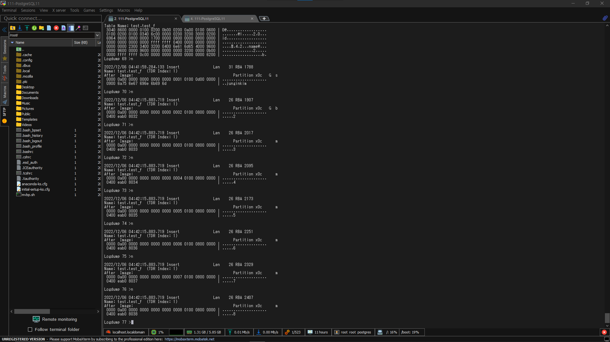

# PostgreSQL용 Oracle GoldenGate

<aside>
📌 Oracle GoldenGate 21.3c 기준으로 작성된 문서

</aside>

<aside>
📖 **목차**

</aside>

# PostgreSQL용 Oracle GoldenGate

- 지원되는 PostgreSQL Database 버전에 대한 초기 로드 및 Tx Data 캡처 및 전달을 지원
- 별도 언급이 없는 한 Source Data의 Mapping, Filtering, 및 변환을 지원
- OGG에서 지원하는 다른 Source Database에서 파생된 Data를 PostgreSQL로 복제 가능

# 지원 사항

## 지원하는 DB

- 캡처 및 전달에는 사용자 DB만 지원
- Oracle GoldenGate는 Archive Log에서 캡처를 지원하지 않음
- 복제본, Standby DB는 캡처 및 전달을 지원하지 않음
- Oracle GoldenGate Extract는 PostgreSQL HA 구성을 사용하는 기본 추출에서 보조 추출로 원활한 전환을 지원하지 않음

## 지원하는 PostgreSQL의 Data Type

- `bigint`
- `bit(n)`
- `boolean`
- `char (n)`
- `date`
- `double precision`
- `integer`
- `json`
- `macaddr`
- `money`
- `real`
- `smallint`
- `text`
- `timestamp` 시간대 포함/제외
- `varchar(n)`
- `xml`

- `bigserial`
- `bit varying(n)`
- `bytea`
- `cidr`
- `decimal`
- `inet`
- `interval`
- `jsonb`
- `macaddr8`
- `numeric`
- `serial`
- `smallserial`
- `time` 시간대 포함/제외
- `uuid`
- `varbit`

### 지원 제한 사항

- `char`, `varchar`, `text`또는 Data Type의 열이 `bytea` PK 또는 UK의 일부인 경우 이러한 열의 최대 개별 길이는 8191Byte를 초과 불가
- `real`, `double`, `numeric`, `decimal`은 `NaN` 입력 값 지원 불가
- `bit`/ `varbit` 제한 사항
    - 길이 최대 4k, 4k보다 클 경우 하위 4k 비트 캡처
    - 소스 `bit(n)` 열은 Non-PostgreSQL 대상의 문자 유형 열만 적용가능
    - PostgreSQL 대상의 `char`유형 또는 `bit/varbit` 열에 적용 가능
- `timestamp` 제한 사항
    - `timestamp`데이터에 BC 또는 AD 태그가 포함된 데이터 지원 불가
    - 1883-11-18 12:00:00 이전 데이터 지원 불가
    - `timestamp` YEAR 구성요소가 4자리 이상인 데이터 지원 불가
    - `Infinity/-Infinity`열에 대한 입력 문자열 `timestamp` 지원 불가
- `date` 제한 사항
    - `date`데이터에 BC 또는 AD 태그가 포함된 데이터 지원 불가
    - `Infinity`/ `Infinity` 열에 대한 입력 문자열 `date` 지원 불가
- `text`, `json`, `xml`, `bytea`, `char (>8191)`의 열은 `varchar(>8191)` LOB 열로 취급
    - `GETUPDATEBEFORES` LOB 열의 이전 이미지 기록 불가
    - `NOCOMPRESSUPDATES`하면 `LOB` 열이 수정된 경우만 사후 이미지에 열 기록 가능
- 부동 소수점 숫자에 대한 범위 및 정밀도 지원은 호스트 시스템에 따라 다름
- 일반적으로 정밀도는 유효 숫자 16자리까지 정확
- Oracle GoldenGate는 지원되는 정밀도를 초과하는 값을 반올림하거나 자름

## 지원하지 않는 PostgreSQL Data Type

- `Arrays`
- `circle`
- `Domain Types`
- `line`
- `Object Identifiers Types`
- `pg_lsn`
- `point`
- `Pseudo-Types`
- `tsquery`

- `box`
- `Composite Types`
- `Enumerated Types`
- `lseq`
- `path`
- `pg_snapshot`
- `polygon`
- `Range Types`
- `tsvector`

<aside>
⚠️ 지원하지 않는 Data Type이 있는 Table이 포함될 시 Error MSG와 함께 추출 중지

복제 하기 위해 Table을 지우거나 지원하지 않는 Data Type을 제거해야 함

</aside>

## 지원하는 PostgreSQL Object와 Operation

- DML 작업(`INSERT`/`UPDATE`/`DELETE`)만 지원(DDL 복제 지원 불가)
- PostgreSQL 11 이상부터 `TRUNCATE` 작업 복제를 지원
    - `GETTRUNCATES` Extract 및 Replicat에 매개변수 필요
- 대소문자 구별
    - 인용 부호가 없으면 대소문자 구분하지 않음
        - 암시적으로 소문자
        - ex) `CREATE TABLE MixedCaseTable`, `SELECT * FROM mixedcasetable`
    - 인용부호와 OGG 명령이 올바르게 사용될 시 대소문자 구분
        - ex) `TABLE appschema.”MixedCaseTable”`, `ADD TRANDATA appschema.”MixedCaseTable”`

### Table & View

- 사용자 생성 Table에서 Transaction DML 캡처 및 사용자 Table로 전달 지원
- 분할된 Table의 명시적 분할 캡처 지원, 분할된 Table로의 전달 지원
    - 분할된 Table 이름은 Extract에 나열됨
        - `TRANDATA`로 활성화
- Object 이름(Table, Schema, Database, Column 이름)과 Column Data 전역화 지원
- 제한 사항
    - View에 대한 캡처 및 전달 지원 불가
    - Extract에 기본 Table만 있을 경우 분할된 Table에서 캡처 지원하지 않음

### Sequence & Identify Column

- Sequence는 단방향, 양방향, 다방향 구현을 위해 Source Table과 Target Table에서 지원
- `GENERATED BY DEFAULT AS IDENTITY`절을 사용해 생성된 Identify Column 지원
- `GENERATED ALWAYS AS IDENTITY`절을 사용해 생성된 Identify Column은 Target Database Table에서 지원 불가, Identify Property를 Target Database Table에서 제거하거나 `GENERATED BY DEFAULT AS IDENTITY`로 변경해야 지원 가능
- 양방향, 다방향 구현의 `INCREMENT BY`의 경우 Server 수와 동일한 값으로 Identify Column 및 Sequence를 정의해야 함
    - ex1) 양방향, Database 2개 구성
      
        ```sql
        Database1, set the MINVALUE at 1 with an INCREMENT BY of 2.
        ```
        
        ```sql
        Database2, set the MINVALUE at 2 with an INCREMENT BY of 2.
        ```
        
    - ex2) 다방향, Database 3개 구성
      
        ```sql
        Database1, set the MINVALUE at 1 with an INCREMENT BY of 3.
        ```
        
        ```sql
        Database2, set the MINVALUE at 2 with an INCREMENT BY of 3.
        ```
        
        ```sql
        Database3, set the MINVALUE at 3 with an INCREMENT BY of 3.
        ```
        

# DB 준비

## DB 구성

- `$PGDATA/postgresql.conf`의 매개 변수를 구성해야 함
    - Extract, Replicat의 원격 연결을 위해 `listen_addresses`를 설정
        - ex) `$PGDATA/postgresql.conf` `listen_addresses = <remotehost_ip_addr>`
        `[$PGDATA/hba.conf](https://www.postgresql.org/docs/13/auth-pg-hba-conf.html)`에 OGG 연결 추가
- WAL 관련 구성
    - `wal_level`을 `logical`로 지정
    - `max_replication_slots`는 Extract 수와 똑같이 지정
        - PostgreSQL 기본 복제 수행 값 + Extract 수
    - `max_wal_senders`는 `max_replication_slots`와 동일하게 지정
    - 선택적으로 WAL에서 `COMMIT` Timestamp 활성화 가능
    - ex)
      
        ```bash
        wal_level = logical            # set to logical for Capture
        
        max_replication_slots = 1      # max number of replication slots,
                                       # one slot per Extract/client
        
        max_wal_senders = 1            # one sender per max repl slot
        
        track_commit_timestamp = on    # optional, correlates tx commit time
                                       # with begin tx log record (useful for      
                                       # timestamp-based positioning)
        ```
        
    - 변경 후 DB 재시작

## OGG Credential

- OGG Process는 DB User가 Data를 캡처해 PostgreSQL DB로 전달해야 함
    - OGG용 User를 생성하는 것이 좋음
- OGG가 PostgreSQL DB에서 캡처하고 적용하기 위해 아래 표와 같은 사용자 권한이 필요

| Privilege | Extract | Replicat | Purpose |
| --- | --- | --- | --- |
| CONNECT | Yes | Yes | DB 연결 필요
GRANT CONNECT ON DATABASE dbname TO gguser; |
| WITH REPLICATION | Yes | NA | 사용자가 Extract를 replication slot에 등록하는데 필요
ALTER USER gguser WITH REPLICATION; |
| WITH SUPERUSER | Yes | NA | table level supplemental logging (ADD TRANDATA)을
활성화 할 때 필요, TRANDATA를 활성화 한 후 취소 가능
ALTER USER gguser WITH SUPERUSER;

Azure Database는 Admin만 SU 권한이 있으며 유일하게 TRANDATA를 활성화 할 수 있는 유저 |
| USAGE ON SCHEMA | Yes | Yes | 복제할 Schema의 Table에 대한 Data Access용
GRANT USAGE ON SCHEMA tableschema TO gguser; |
| SELECT ON TABLES | Yes | Yes | Grant select access on tables to be replicated.GRANT SELECT ON ALL TABLES IN SCHEMA tableschema TO gguser; |
| target table: INSERT, UPDATE, DELETE,TRUNCATE

모든 Table:  GRANT INSERT, UPDATE, DELETE, TRUNCATE ON ALL TABLES IN SCHEMA TO... 로 권한 부여하거나
Replicat User에게 INSERT, UPDATE, DELETE권한 부여 | NA | Yes | Apply replicated DML to target objects.GRANT INSERT, UPDATE, DELETE, TRUNCATE ON TABLE tablename TO gguser; |
| Heartbeat and Checkpoint Table Privileges |  |  |   |
| CREATE ON DATABASE | Yes | Yes | Required by the Extract and Replicat user to add an Oracle GoldenGate schema for heartbeat and checkpoint table creation.GRANT CREATE ON DATABASE dbname TO gguser;
Alternatively, if GGSCHEMA is the same as the user, then the objects can be created under the user by issuing CREATE SCHEMA AUTHORIZATION ggsuser; |
| CREATE, USAGE ON SCHEMA | Yes | Yes | For heartbeat and checkpoint table creation/deletion if the Extract or Replicat user does not own the objects.
GRANT CREATE, USAGE ON SCHEMA ggschema TO gguser; |
| EXECUTE ON ALL FUNCTIONS | Yes | Yes | For heartbeat update and purge function execution if the user calling the functions does not own the objects.GRANT EXECUTE ON ALL FUNCTIONS IN SCHEMA ggschema TO gguser; |
| SELECT, INSERT, UPDATE, DELETE | Yes | Yes | For heartbeat and checkpoint table inserts, updates and deletes if the user does not own the objects.GRANT SELECT, INSERT, UPDATE, DELETE, ON ALL TABLES IN SCHEMA ggschema TO gguser; |

## DB 연결 구성

### Linux에서 DB 연결 구성

- `/etc/odbc.ini`에 DSN 설정
    - root로 `vi /etc/odbc.ini`
    
    ```bash
    #Sample DSN entries
    [ODBC Data Sources]
    PG_src=DataDirect 7.1 PostgreSQL Wire Protocol # DNS
    PG_tgt=DataDirect 7.1 PostgreSQL Wire Protocol # DNS
    
    [ODBC]
    IANAAppCodePage=4 # 기본값, [DB 문자 집합이 Unicode가 아닌 경우 수정](https://docs.progress.com/bundle/datadirect-connect-odbc-71/page/IANAAppCodePage_9.html#IANAAppCodePage_9)
    InstallDir=/u01/app/ogg # OGG 설치 directory 위치
    
    [PG_src]
    Driver=/u01/app/ogg/lib/GGpsql25.so # $OGG_HOME/lib.GGpsq125.so 파일 위치
    Description=DataDirect 7.1 PostgreSQL Wire Protocol
    Database=sourcedb # Source, Target의 DB 이름
    HostName=remotehost # DB Host IP Address 또는 Host 이름
    PortNumber=5432 # DB의 수신 Port
    
    [PG_tgt]
    Driver=/u01/app/ogg/lib/GGpsql25.so # $OGG_HOME/lib.GGpsq125.so 파일 위치
    Description=DataDirect 7.1 PostgreSQL Wire Protocol
    Database=targetdb # Source, Target의 DB 이름
    HostName=remotehost # DB Host IP Address 또는 Host 이름
    PortNumber=5432 # DB의 수신 Port
    ```
    

### PostgreSQL에 대한 SSL 지원 구성

- `$PGDATA/postgresql.conf`에서 구성 매개변수를 `SSL`로 설정해 SSL 활성화 가능
- SSL이 활성화 된 경우 `pg_hba.conf`에 `hostssl`이 파일에 있거나 추가되어야 함
- SSL이 활성화되면 Root Certificate, Root CRL(Certification Revocation List), Server Client Certificate와 Key가 존재해야함
  
    ```bash
    ~/.postgresql/root.crt
    ~/.postgresql/root.crl
    ~/.postgresql/postgresql.crt
    ~/.postgresql/postgresql.key
    ```
    
- 기본 경로가 아닌 경로를 사용할 때 Enviornment Variable을 수정해야 함
    - `PGSSLROOTCERT`
    - `PGSSLCRL`
    - `PGSSLCERT`
    - `PGSSLKEY`
- `$ODBCINI`파일은 `EncryptionMethod DSN` 속성을 설정해 SSL 지원 가능
    - `0`(No Encryption): 암호화 하지 않음
    - `1`(SSL): 암호화 프로토콜 버전 연결 옵션에 지정된 SSL Protocol을 사용해 암호화
        - 지정된 암호화 방식이 DB Server에서 지원되지 않는 경우 연결 실패(오류 반환)
    - `6`(RequestSSL): 로그인 요청과 Data가 SSL로 암호화
        - Server가 SSL에 대해 구성되지 않은 경우 암호화 하지 않음
    
    ```bash
    KeyStore=<path to .p12 keystore file>
    KeyStorePassword=<keystore-passwd>
    TrustStore=<path to root certificate>
    ValidateServerCertificate=1
    ```
    

## Table 준비

### Target의 Trigger와 Constraint 비활성화

- Trigger와 Constraint를 비활성화 하지 않으면 동일하게 복제되어 데이터가 중복됨
    - ex) Source Table: `emp_src`, `salary_src` Target Table: `emp_tgt`, `salary_tgt`
        1. `DELETE emp_src`
        2. cascade `DELETE salary_src`
        3. OGG가 두 `DELETE`를 Target으로 보냄
        4. 위 `DELETE`가 먼저 실행된 후 `emp_tgt`에 적용
        5. 위 `DELETE`가 `salary_tgt` 삭제
        6. cascaded `DELETE`가 `salary_src`를 지우며 `salary_tgt`도 함께 지움
        7. 5에서 `salary_tgt`을 찾을 수 없음

### Table의 Row Uniqueness 확인

- OGG로 복제된 `UPDATE` 및 `DELETE` 대상을 찾기 위한 고유한 행 식별자가 필요
- `TABLEMAP`이나 `KEYCOLS`절이 사용되지 않으면 우선순위에 따라 행 식별자 선택
    1. PK
    2. Timstamp 또는 계산 열을 포함하지 않는 (영문자 순 첫 번째) UK
    3. 지원하지 않는 열을 제외하고 DB에서 UK로 사용할 수 있는 모든 열의 pseudo key 생성
    4. Table에 적절한 Key가 없거나 기존 Key를 사용하지 않으려는 경우 Table에 항상 고유한 값을 포함하는 열을 대체 키로 정의 가능
        1. Extract의 `TABLE` 매개변수에 `KEYCOLS`절 포함
        2. Replicat의 `MAP` 매개변수에 `KEYCOLS`절 포함

### Table Level Supplemental Logging 활성화

- Supplemental Logging 활성화는 OGG가 Source DML 작업의 CDC를 지원
- Logging Level에 따라 이중 데이터와 같은 경우 필요할 수 있는 변경되지 않은 추가 열을 포함하도록 Source Database Table Level Supplemental Logging을 설정하는 작업
- PostgreSQL이 지원하는 Table Level Supplemental Log(`REPLICA IDENTITY`와 동일)
    1. `NOTHING`: OGG에서 지원하지 않음
    2. `USING INDEX`: OGG에서 지원하지 않음
    3. `DEFAULT`: PK, 고유 Index가 있거나 전체 Before Image 또는 압축 안한 기록이 필요한 경우
       
        ```bash
        ADD TRANDATA <schema>.<table> KEYCOLS
        ```
        
    4. `FULL`: 전체 Before Image 또는 압축하지 않은 기록 필요한 경우
       
        ```bash
        ADD TRANDATA <schema>.<table> ALLCOLS
        ```
    
- Table의 Supplemental Logging Level을 확인하는 방법
  
    ```bash
    INFO TRANDATA <schema>.<table>
    ```
    

# Extract 구성

## Extract 정보

### Initial Load Extract

- Initial Load Extract는 Table에서 모든 Record를 읽고 `EXTFILE` 혹은 `RMTFILE`에 쓰는데 사용
- Initial Load Extract는 `ADD EXTRACT` 명령의 `SOURCEISTABLE` 옵션을 사용해 생성
    - 복구를 위한 Checkpoint를 유지하지 않음

### CDC Extract

- CDC Extract는 WAL에 생성되거나 배치된 시점에서 Transaction Data의 변경사항을 캡처
- PostgreSQL용 OGG Extract Process는 PostgreSQL `test_decoding` DB Plugin에서 Logical Record를 수신하고 Replicat이 Downstream에서 사용할 수 있도록 `COMMIT` 순서대로 Trail File에 기록

### Extract 배포 옵션

- Local Deployment
    - 원본 DB와 OGG가 동일한 Server에 설치
    - 추가 고려사항 없음
- Remote Deployment
    - 원본 DB와 OGG가 다른 Server에 설치(ex: Azure for PostgreSQL 등)
    - DB Server와 OGG Server의 Endian이 같아야 지원 가능
    - OGG Server의 Server 시간과 시간대가 DB Server와 동기화되어야 함
        - 불가능 할 시 Extract를 생성하거나 변경할 때 LSN으로 Extract 위치 지정
    - Remote CDC에서 Extract가 처리하는 각 Record의 작업이 순차적이여야하므로 SQLEXEC를 사용할 시 대기시간이 추가로 필요할 수 있음
    - Network 대기 시간이 낮은 것이 중요함(Oracle사 권장 1ms 미만)

## Extract 생성시 전제 조건

### PostgreSQL용 Extract 등록

- PostgreSQL용 Extract는 DB에 등록과 예약 된 Replication Slot이 할당되어야 함
- Replication Slot은 DB 구성 설정을 통해 할당되며 `max_replication_slots`로 설정
- Classic Architecture에서 Extract 등록
    1. GGSCI에서 `DBLOGIN`
       
        ```bash
        DBLOGIN SOURCEDB <DSN> USERID <userid> PASSWORD <userpw>
        ```
        
    2. `REGISTER EXTRACT`명령으로 Extract 등록
       
        ```bash
        REGISTER EXTRACT <extname>
        ```
        
        - Extract 이름은 영문자 8자를 초과할 수 없음
        - 내부적으로 Replication Slot이 생성됨

## CDC 생성

- Transaction Data를 캡처하도록 CDC Extract 구성
1. 위 명령으로 등록한 Extract 매개변수 파일 생성
   
    ```bash
    EDIT PARAMS <extname>
    ```
    
2. Extract의 매개변수 입력
   
    ```bash
    EXTRACT <extname>
    SOURCEDB <dsn> USERID <userid> PASSWORD <userpw>
    EXTTRAIL ./dirdat/<trail alias>
    GETTRUNCATES
    TABLE <schema>.<table>;
    ```
    
    | 매개변수 | 설명 |
    | --- | --- |
    | EXTRACT <extname> | 영문자 8자 이하 |
    | SOURCEDB <dsn> | DB연결 DSN 이름 지정 |
    | USERID <userid> PASSWORD <userpw> | 해당 USER로 로그인 |
    | EXTTRAIL ./dirdat/<trail alias> | Extract가 캡처한 Data를 기록하는 2글자의 Local Extarct Alias |
    | GETTRUNCATES | Truncate를 캡처하는데 필요 |
    | TABLE <schema>.<table>; | Data 캡처할 schema와 table
    ;으로 매개변수 명령 종료
    
    SCHEMAEXCLUDE, TABLEEXCLUDE, EXCLUDEWILDCARDOBJECTSONLY 매개변수로 *로 지정한 것 중 제외 |
3. Extract와 Trail 파일 추가
   
    ```bash
    ADD EXTRACT <extname>, TRANLOG, BEGIN NOW
    ADD EXTTRAIL ./dirdat/<trail alias>, EXTRACT <extname>
    ```
    
4. 추출 시작
   
    ```bash
    START EXTRACT <extname>
    ```
    

# Replicat 구성

## Replicat 정보

- PostgreSQL용 OGG Replicat은 Extract에서 Data를 읽고 대상 PostgreSQL DB에 전달
- Extract Data는 OGG 캡처가 지원하는 모든 DB에 전달 가능
- PostgreSQL에서 사용가능한 Replicat은 Classic, Coordinated, Parallel Replicat

### Replicat 배포 옵션

- Local Deployment
    - 원본 DB와 OGG가 동일한 Server에 설치
    - 추가 고려사항 없음
- Remote Deployment
    - 원본 DB와 OGG가 다른 Server에 설치(ex: Azure for PostgreSQL 등)
    - DB Server와 OGG Server의 Endian이 같아야 지원 가능
    - OGG Server의 Server 시간과 시간대가 DB Server와 동기화되어야 함
        - 불가능 할 시 Extract를 생성하거나 변경할 때 LSN으로 Extract 위치 지정
    - Remote CDC에서 Extract가 처리하는 각 Record의 작업이 순차적이여야하므로 SQLEXEC를 사용할 시 대기시간이 추가로 필요할 수 있음
    - Network 대기 시간이 낮은 것이 중요함(Oracle사 권장 1ms 미만)

## Replicat 생성시 전제 조건

## Checkpoint Table 생성

- Checkpoint Table은 Replicat을 재시작할 때 복구 포지셔닝을 위해 Target DB의 Replicat에서 사용
- Classic Replicat는 선택(권장) 사항이며 Coordinated 및 Parallel Replicat의 경우 필수 사항
- Parallel Replicat의 Checkpoint Table은 Replicat 추가 시 생성되어 미리 생성하지 않아도 됨
- Classic Replicat의 Checkpoint Table 생성
    1. GGSCI를 사용해 Target DB의 DSN에 연결
       
        ```bash
        DBLOGIN SOURCEDB <dsn> USERID <userid> PASSWORD <userpw>
        ```
        
    2. Checkpoint Table 추가
       
        ```bash
        ADD CHECKPOINTTABLE <ggadmin>.<oggcheck>
        ```
        

## Replicat 생성

- Target PostgreSQL Table에 Transaction Data를 전달하기 위해 Replicat 생성
1. Replicat 매개변수 파일 생성
   
    ```bash
    EDIT PARAM <repname>
    ```
    
    - Replicat의 이름은 Classic은 영문자 8자 이하 Coordinated와 Parallel은 영문자 5자 이하
2. Replicat 매개변수 입력
   
    ```bash
    REPLICAT <repname>
    TARGETDB <dsn> USERID <userid> PASSWORD <userpw>
    BATCHSQL
    GETTRUNCATES
    MAP <schema>.<object>, TARGET <schema>.<object>
    ```
    
    | 매개변수 | 설명 |
    | --- | --- |
    | REPLICAT <repname> | Classic의 경우 8자 이하, Coordinated와 Parallel 5자 이하 |
    | TARGETDB <dsn> | DB 연결 DSN 이름 |
    | USERID <userid> PASSWORD <userpw> | 해당 User로 로그인 |
    | BATCHSQL
    GETTRUNCATES | Transaction 일괄 처리 및 TRUNCATE 작업의 복제 지원 |
    | MAP <schema>.<object>, 
    TARGET <schema>.<object> | 원본 Table과 Target Table의 관계 지정 |
3. (선택)Parallel Replicat 추가
   
    ```bash
    ADD REPLICAT <repname>, PARALLEL, EXTTRAIL ./dirdat/<trail alias>, CHECKPOINTTABLE <ggadmin>.<oggcheck>
    ```
    

# 추가 고려 사항

## Heart Beat Table 추가

- PostgreSQL용 OGG는 Heart Beat Table 구성을 지원
    - `UPDATE`와 `DELETE`에 제한 사항이 있음
- DB Schema를 생성해야 함
    - `GLOBALS` 파일의 매개변수 `GGSCHEMA`와 이름이 일치해야 함
    - Extract나 Replicat User와 동일하지 않은 고유한 Schema이거나 OGG Object 전용으로 예약
    - Replicate 되지 않는 User Table Schema여야 함
- Classic 구성
    1. GGSCI를 사용해 Source 및 Target DB의 DSN에 연결
       
        ```bash
        DBLOGIN [SOURCEDB | TARGETDB] <dsn> USERID <userid> PASSWORD <userpw>
        ```
        
    2. `ADD HEARTBEATTABLE`
       
        ```bash
        ADD HEARTBEATTABLE
        ```
        
    3. (선택)단방향 Replicate에만 사용되는 Target DB의 Heart Beat Record `UPDATE` 기능을 생성하지 않는 `TARGETONLY`옵션 포함 가능
       
        ```bash
        ADD HEARTBEATTABLE TARGETONLY
        ```
        

### Heart Beat `UPDATE` & `DELETE`

- Heart Beat Table 및 관련 함수는 `ADD HEARTBEATTABLE`로 생성되나 PostgreSQL은 함수를 호출하는 자동 스케줄러가 없음
- Heart Beat Record `UPDATE`와 `DELETE`를 제어하는 함수가 있음
- 기본 Heart Beat Record 함수를 호출하려면 아래 쿼리를 실행해야 함
  
    ```sql
    SELECT <ggschema>.gg_hb_job_run();
    ```
    

## 양방향 Loop 감지 활성화

- Loop 감지로 OGG의 양방향 구현에서 다른 Source DB의 Replicat이 보낸 Transaction 캡처 방지
- Replicat에 의해 다시 적용된 캡처를 무시하기 위해 `TANLOGOPTIONS FILTERTABLE` 매개변수 사용
- 필터링 Table로 사용되는 Table은 Replicat에 대해 생성해야 하는 OGG Checkpoint Table이 됨
    - Classic과 Coordinated Replicat만 양방향 및 다방향 Replication 지원
- 필터링 Table을 생성하고 Supplemental Logging을 활성화 하는 방법
    1. 각 Source DB에서 Replicat이 사용하는 Checkpoint Table이 있는지 확인
       
        ```bash
        ADD CHECKPOINTTABLE <ggadmin>.<oggcheck>
        ```
        
        - GLOBALS 파일의 `GGSCHEMA` 매개변수와 동일한 Schema 이름을 사용하는 것을 권장
    2. Checkpoint Table에 대한 Supplemental Logging 활성화
       
        ```bash
        ADD TRANDATA <ggadmin>.<oggcheck> ALLCOLS
        ```
        
    3. Checkpoint Table 정보로 Replicat이 생성되었는지 확인
       
        ```bash
        ADD REPLICAT <repname>, EXTTRAIL ./dirdat/<trail alias> CHECKPOINTTABLE <ggadmin>.<oggcheck>
        ```
        
    4. 필터링 Table에 대해 Replicat의 Checkpoint Table을 사용해 `IGNOREREPLICATES`(Default)와 `FILTERTABLE` 매개변수로 각 Extract를 구성
       
        ```bash
        TRANLOGOPTIONS IGNOREREPLICATES
        TRANLOGOPTIONS FILTERTABLE ggadmin.oggcheck
        ```
        

## Extract 삭제

- Source PostgreSQL DB에 대한 개별 Extract를 제거하거나 OGG를 제거할 때 Replication slot 항목을 제거하려면 DB Replication Slot에 등록된 Extract를 등록 해제해야 함
    - 제거하지 않을 시 DB Log 크가가 증가해서 발생
- Classic Architecture
    1. GGSCI를 사용해 Source 및 Target DB의 DSN에 연결
       
        ```bash
        DBLOGIN [SOURCEDB | TARGETDB] <dsn> USERID <userid> PASSWORD <userpw>
        ```
        
    2. DELETE EXTRACT
       
        ```bash
        DELETE EXTRACT <extname>
        ```
        
    3. UNREGISTER EXTRACT
       
        ```bash
        UNREGISTER EXTRACT <extname>
        ```
        

## Table Level Supplemental Logging 제거

- OGG에서 더 이상 Table을 캡처할 필요가 없고 Table에 대한 매개변수 `TABLE`이 Extract 매개변수 파일에서 제거되었거나 제외된 경우 Table에서 Supplemental Logging을 제거 가능

```bash
DBLOGIN SOURCEDB <dsn> USERID <userid> PASSWORD <userpw>

DELETE TRANDATA <schema>.<table> # 제거

INFO TRANDATA <schema>.<table> # Supplemental Logging Level 확인
```

# OGG PostgreSQL Extract 실습

1. Yum install uinxODBC
   
    ```bash
    yum install unixODBC unixODBC-devel postgresql<ver>-odbc
    ```
    
2. Environment Variable 수정
   
    ```bash
    export LD_LIBRARY_PATH=$PG_HOME/lib:$OGG_HOME/lib:$LD_LIBRARY_PATH
    
    export ODBCINI=/<odbc.ini PATH>
    ```
    
3. odbc.ini 생성 및 수정
   
    ```bash
    [ODBC Data Sources]
    
    Postgres=DataDirect 11 PostgreSQL Wire Protocol
    
    [ODBC]
    
    IANAAppCodePage=106
    
    InstallDir=/home/ark053/ogg
    
    [Postgres]
    
    Driver=/home/ark053/ogg/lib/GGpsql25.so
    
    Description=DataDirect 11 PostgreSQL Wire Protocol
    
    Servername=localhost
    
    Servertype=postgres
    
    Database=test
    
    HostName=localhost
    
    PortNumber=5432
    
    LogonID=test
    
    Password=test
    ```
    
4. OGG 설치한 계정에서 isql 실행
   
    ```bash
    isql -v Postgres test test
    +---------------------------------------+
    | Connected!                            |
    |                                       |
    | sql-statement                         |
    | help [tablename]                      |
    | quit                                  |
    |                                       |
    +---------------------------------------+
    ```
    
5. ggsci 실행 및 Sub-Directory 만들기
   
    ```bash
    ./ggsci
    
    CREATE SUBDIRS
    ```
    
6. EDIT PARAM MGR PORT 7809
   
    ```bash
    EDIT PARAM MGR PORT 7809
    ```
    
7. Replication Slot 만들기
   
    ```bash
    REGISTER EXTRACT ext01
    ```
    
8. dblogin
   
    ```bash
    DBLOGIN SOURCEDB Postgres USERID test PASSWORD test
    ```
    
9. ADD TRANDATA
   
    ```bash
    ADD TRANDATA <schema>.<tablename> [ALLCOLS | <>]
    
    # ALLCOLS = REPLICA IDENTITY FULL
    add trandata test.test_f allcols
    
    Logging of supplemental log data is enabled for table test.test_f. REPLICA IDENTITY was DEFAULT and is changed to FULL
    
    # <>(공백) = REPLICA IDENTITY DEFAULT
    add trandata test.test_d
    
    Logging of supplemental log data is already enabled for table test.test_d with REPLICA IDENTITY set to DEFAULT
    ```
    
10. ADD EXTRACT & EXTTRAIL
    
    ```bash
    ADD EXTRACT <extname>, TRANLOG, BEGIN NOW
    
    ADD EXTTRAIL ./dirdat/<alias>, EXTRACT <extname>
    ```
    
11. Make Extract Parameter File
    
    ```bash
    EDIT PARAM ext01
    
    ###
    EXTRACT ext01
    
    SOURCEDB Postgres USERID test PASSWORD test
    
    EXTTRAIL ./dirdat/ea TABLE test.test_f;
    
    TABLE test.test_f;
    ###
    ```
    
12. START MGR & EXTRACT
    
    ```bash
    START MGR
    START EXTRACT ext01
    INFO ALL
    ```
    
13. Logdump에 확인 성공!!




[Using Oracle GoldenGate for Heterogeneous Databases](https://docs.oracle.com/en/middleware/goldengate/core/21.3/gghdb/using-oracle-goldengate-postgresql.html)