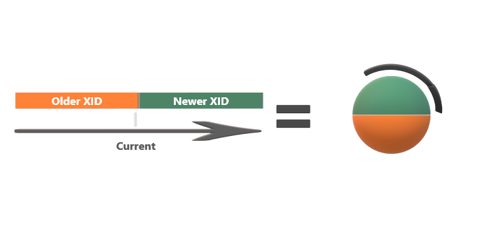

# PostgreSQL Vacuum

# MVCC 동작 방식

## Multi Version Concurrency Control

- 다중 저번 동시성 제어
- 과거~현재까지 다양한 버전 데이터들의 관리와 제공이 가능한지 나타내는 DBMS 필수 기능
- 변하는 데이터 중 사용자가 조회를 시작한 시점의 데이터를 제공받을 수 있는지 나타내는 것

## PostgreSQL의 MVCC

- Oracle은 Undo로 MVCC를 구현하였으나 PostgreSQL은 간단한 방법을 사용해 구현
    1. Table 내부에 변경 이전 버전(들)과 현재 버전의 데이터를 모두 위치시킴
    2. 각 Row(Record) 별로 4Byte의 버전 정보(XID)를 두어 시점 식별
    3. 수행 시점의 Transaction ID와 Row의 XID(XMIN) 비교를 통해 MVCC 구현

## XMIN / XMAX

- MVCC 동작 방식에서 XMIN과 XMAX는 XID를 기록하기 위한 용도로 사용됨
    - XMIN은 `INSERT` / `UPDATE`를 수행한 XID를 기록
    - XMAX는 `DELETE` / `UPDATE`를 수행한 XID를 기록
        - ex1) `INSERT` 발생 시 해당 시점 XID를 XMIN에 설정
        - ex2) `DELETE` 발생 시 해당 시점 XID를 삭제 대상 Row의 XMAX에 설정
        - ex3) `UPDATE` 발생 시 변경 전 Row의 XMAX에 수행 시점의 XID를 설정,
        변경 후 Row는 새로 입력하며 XMIN에 `UPDATE` 시점의 XID 설정
- XMAX값이 `NULL`일 경우 최신 버전의 Row를 뜻함
- XMAX값이 설정된 Row는 해당 시점에 삭제 및 변경되었음을 의미

## PostgreSQL MVCC Example

### Page 내부의 변화

1. XID = 999: (A, 10) `INSERT`, (XMIN, XMAX) = (999, Null)
2. XID = 1000: (B, 20) `INSERT`, (XMIN, XMAX) = (1000, Null)
3. XID = 2001: (A, 10) `UPDATE` (A, 20), (XMIN, XMAX) = Before(999, 2001) After(2001, Null)

<aside>
☝🏻 PostgreSQL의 Row의 `UPDATE`는 내부적으로 `DELETE` → `INSERT`의 동작

</aside>

### 조회 시점에 따른 추출 Data의 변화

- XMIN, XMAX를 관리 이유로 해당 값 조회 시점의 XID와 비교해 그 시점의 데이터 추출을 위함
- XID가 2000인 SELECT는 XID가 2001인 `UPDATE`를 무시

## MVCC 문제점

- XID 비교로 쉽게 구현할 수 있으나 공간 사용 비효율, 부족한 XID
- 문제 해결을 위해 VM, DataFreezing, Age 등의 개념을 만들어 Vacuum을 이용해 해결하려 함

<aside>
☝🏻 Table 내부에 변경 이전 버전들과 현재 버전의 데이터를 모두 위치 시킴
각 Row 별 4Byte XID를 두어 시점 식별 가능하게 함

</aside>

### 공간 사용의 비효율

- `UPDATE`, `DELETE`가 빈번한 Table에서는 각 Data의 이전 버전을 모두 저장해야 하므로 공간 비효율이 커지고 Scan 범위가 늘어나는 부작용 발생
- Block 단위가 아닌 Row 단위의 XID 저장 방식은 Page 내부에 대한 공간 비효율 야기

### XID 부족 현상

- Row 별 XID가 4Byte, → 약 43억개의 XID밖에 표현할 수 없음(0 ~ 4,294,967,295)
- Newer / Older 구조로 XID를 순환식으로 나눠 사용해 Older XID의 경우 주기적으로 Frozen XID 세팅으로 항상 가장 오래된 Data임을 표시

# XID

## Transaction ID(XID)

- DB의 상태를 변화시키는 작업의 단위: Transaction
- XID: Transaction을 고유하게 구분하는 구분자
- XID는 Transaction이 발생할 때 마다 1씩 증가해 MVCC Model의 구현, 읽기 일관성을 위해 활용

## XID 사용 용도

- `relfrozenxid`: Object 생성 시점 XID를 Object에 할당(+Vacuum 수행 시 시점 갱신)
- `XMIN`, `XMAX`: Row가 입력되거나 변경된 시점의 XID를 Row 단위로 할당
- 너무 오래된 XID를 갖는 Object는 Vacuum의 대상이 됨

## 한계

- XID로 시점을 특정할 수 있는 기능이 내포되어 있음을 의미

## 보완 대책

### 순환 구조

- XID의 개수가 부족해 PostgreSQL은 순환 구조로 사용함
  
    
    
- Newer, Older 영역에 포함되는 XID는 고정되어 있지 않음

### Data Freezing & Anti-Wraparound

- 0, 1, 2는 예약된 특수한 XID 값이기에 XID = 2 = Frozen XID는 항상 일반 XID보다 오래됨이 보장
- 3 ~ 4,294,967,295 중 순환하다가 과거의 Data인지 미래의 Data인지 알 수 없는 환경을 회피하고자 `Current XID - 생성 시점 XID`가 한 Cycle의 절반인 약 21억(Older 영역에 위치한 기간)을 벗어나기 전 해당 자료들의 XID 값을 2로 변경함(Frozen XID)
    - 절반만 실제 사용 가능한 XID라는 뜻
- XID Wraparound를 회파하는 작업을 DataFreezing, XID 값을 Frozen XID라는 특수한 값으로 표시해 영구적인 과거 데이터임을 표시하는 작업 수행

# Age

## Age = Current XID - 생성 시점 XID

- Data Freezing 대상을 선정하기 위해 Age를 측정해야 함
    - Age 측정 대상: DB / Table / Row
    - Object 생성 시점 Age: 1
    - Row 입력 시점 Age: 1
    - Transaction 발생 시 각 Age 증가
    - Object Age ≥ Row Age
    - Age가 큰 Object 및 Row는 Vacuum의 대상이 됨
    - Vacuum 수행 후 Age가 낮아짐

[DB 인사이드 | PostgreSQL Vacuum - 3. Age](https://blog.ex-em.com/1665)