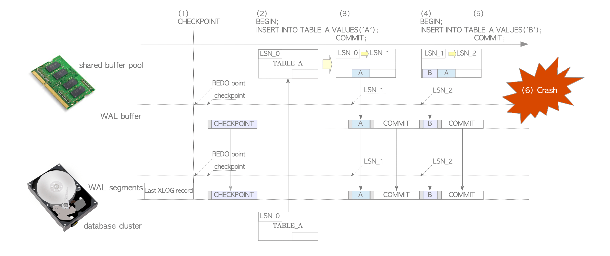

# PostgreSQL WAL

[New Page](./PostgreSQL WAL/New Page.md)

위

[fig-9-02-150919105641-lva1-app6891.pdf](./PostgreSQL WAL/fig-9-02-150919105641-lva1-app6891.pdf)

# WAL



# Transaction Log는 8Byte길이의 가상 파일


# WAL Segment의 내부 레이아웃


16MB, 내부적으로 8KB의 Page로 나뉨

[000000010000000000000002](./PostgreSQL WAL/000000010000000000000002.txt)

```c
typedef XLogPageHeaderData *XLogPageHeader;

/*
 * When the XLP_LONG_HEADER flag is set, we store additional fields in the
 * page header.  (This is ordinarily done just in the first page of an
 * XLOG file.)  The additional fields serve to identify the file accurately.
 */
typedef struct XLogLongPageHeaderData
{
  XLogPageHeaderData std;            /* standard header fields */
  uint64             xlp_sysid;      /* system identifier from pg_control */
  uint32             xlp_seg_size;   /* just as a cross-check */
  uint32             xlp_xlog_blcksz;/* just as a cross-check */
} XLogLongPageHeaderData;
```

```c
/*
 * Each page of XLOG file has a header like this:
 */
#define XLOG_PAGE_MAGIC 0xD07E  /* can be used as WAL version indicator */

typedef struct XLogPageHeaderData
{
 uint16		xlp_magic;	/* magic value for correctness checks */
 uint16		xlp_info; 	/* flag bits, see below */
 TimeLineID	xlp_tli; 	/* TimeLineID of first record on page */
 XLogRecPtr	xlp_pageaddr; 	/* XLOG address of this page */

 /*
  * When there is not enough space on current page for whole record, we
  * continue on the next page. xlp_rem_len is the number of bytes
  * remaining from a previous page.
  *
  * Note that xl_rem_len includes backup-block data; that is, it tracks
  * xl_tot_len not xl_len in the initial header. Also note that the
  * continuation data isn't necessarily aligned.
  */
 uint32		xlp_rem_len;	/* total len of remaining data for record */
} XLogPageHeaderData;
```

```c
typedef struct XLogRecord
{
        uint32          xl_tot_len;             /* total len of entire record */
        TransactionId 	xl_xid;           	/* xact id */
        XLogRecPtr      xl_prev;                /* ptr to previous record in log */
        uint8           xl_info;                /* flag bits, see below */
        RmgrId          xl_rmid;                /* resource manager for this record */
        /* 2 bytes of padding here, initialize to zero */
        pg_crc32c       xl_crc;                 /* CRC for this record */
        /* XLogRecordBlockHeaders and XLogRecordDataHeader follow, no padding */
} XLogRecord;
```

```c
typedef struct XLogRecordBlockHeader
{
	uint8		id;		/* block reference ID */
	uint8		fork_flags;	/* fork within the relation, and flags */
	uint16		data_length;	/* number of payload bytes (not including page
					 * image) */

	/* If BKPBLOCK_HAS_IMAGE, an XLogRecordBlockImageHeader struct follows */
	/* If BKPBLOCK_SAME_REL is not set, a RelFileNode follows */
	/* BlockNumber follows */
} XLogRecordBlockHeader;

/*
 * The fork number fits in the lower 4 bits in the fork_flags field. The upper
 * bits are used for flags.
 */
#define BKPBLOCK_FORK_MASK      0x0F
#define BKPBLOCK_FLAG_MASK      0xF0
#define BKPBLOCK_HAS_IMAGE      0x10    /* block data is an XLogRecordBlockImage */
#define BKPBLOCK_HAS_DATA       0x20
#define BKPBLOCK_WILL_INIT      0x40    /* redo will re-init the page */
#define BKPBLOCK_SAME_REL       0x80    /* RelFileNode omitted, same as previous */
```

```c
typedef struct XLogRecordBlockImageHeader
{
	uint16		length;		/* number of page image bytes */
	uint16		hole_offset;	/* number of bytes before "hole" */
	uint8		bimg_info;	/* flag bits, see below */

	/*
	 * If BKPIMAGE_HAS_HOLE and BKPIMAGE_IS_COMPRESSED, an
	 * XLogRecordBlockCompressHeader struct follows.
	 */
} XLogRecordBlockImageHeader;

/* Information stored in bimg_info */
#define BKPIMAGE_HAS_HOLE               0x01    /* page image has "hole" */
#define BKPIMAGE_IS_COMPRESSED          0x02    /* page image is compressed */
```

```c
typedef struct XLogRecordBlockCompressHeader
{
	uint16		hole_length;	/* number of bytes in "hole" */
} XLogRecordBlockCompressHeader;
```

```c
typedef struct XLogRecordDataHeaderShort
{
	uint8		id;		/* XLR_BLOCK_ID_DATA_SHORT */
	uint8		data_length;	/* number of payload bytes */
} XLogRecordDataHeaderShort;

#define SizeOfXLogRecordDataHeaderShort (sizeof(uint8) * 2)

typedef struct XLogRecordDataHeaderLong
{
	uint8		id;		/* XLR_BLOCK_ID_DATA_LONG */
	/* followed by uint32 data_length, unaligned */
} XLogRecordDataHeaderLong;

#define SizeOfXLogRecordDataHeaderLong (sizeof(uint8) + sizeof(uint32))
```

```c
typedef struct xl_heap_insert
{
        OffsetNumber	offnum;            /* inserted tuple's offset */
        uint8           flags; // 가시성플래그

        /* xl_heap_header & TUPLE DATA in backup block 0 */
} xl_heap_insert;
```

```c
typedef struct CheckPoint
{
	XLogRecPtr	redo;			/* next RecPtr available when we began to
								 * create CheckPoint (i.e. REDO start point) */
	TimeLineID	ThisTimeLineID; /* current TLI */
	TimeLineID	PrevTimeLineID; /* previous TLI, if this record begins a new
								 * timeline (equals ThisTimeLineID otherwise) */
	bool		fullPageWrites; /* current full_page_writes */
	FullTransactionId nextXid;	/* next free transaction ID */
	Oid			nextOid;		/* next free OID */
	MultiXactId nextMulti;		/* next free MultiXactId */
	MultiXactOffset nextMultiOffset;	/* next free MultiXact offset */
	TransactionId oldestXid;	/* cluster-wide minimum datfrozenxid */
	Oid			oldestXidDB;	/* database with minimum datfrozenxid */
	MultiXactId oldestMulti;	/* cluster-wide minimum datminmxid */
	Oid			oldestMultiDB;	/* database with minimum datminmxid */
	pg_time_t	time;			/* time stamp of checkpoint */
	TransactionId oldestCommitTsXid;	/* oldest Xid with valid commit
										 * timestamp */
	TransactionId newestCommitTsXid;	/* newest Xid with valid commit
										 * timestamp */

	/*
	 * Oldest XID still running. This is only needed to initialize hot standby
	 * mode from an online checkpoint, so we only bother calculating this for
	 * online checkpoints and only when wal_level is replica. Otherwise it's
	 * set to InvalidTransactionId.
	 */
	TransactionId oldestActiveXid;
} CheckPoint;
```

```c
typedef struct HeapTupleData
{
	uint32		t_len;			/* length of *t_data */
	ItemPointerData t_self;		/* SelfItemPointer */
	Oid			t_tableOid;		/* table the tuple came from */
#define FIELDNO_HEAPTUPLEDATA_DATA 3
	HeapTupleHeader t_data;		/* -> tuple header and data */
} HeapTupleData;
```

# Backupblock

```c
typedef struct XLogRecord
{
        uint32          xl_tot_len;             /* total len of entire record */
        TransactionId 	xl_xid;           	/* xact id */
        XLogRecPtr      xl_prev;                /* ptr to previous record in log */
        uint8           xl_info;                /* flag bits, see below */
        RmgrId          xl_rmid;                /* resource manager for this record */
        /* 2 bytes of padding here, initialize to zero */
        pg_crc32c       xl_crc;                 /* CRC for this record */
        /* XLogRecordBlockHeaders and XLogRecordDataHeader follow, no padding */
} XLogRecord;
```

```c
typedef struct XLogRecordBlockHeader
{
	uint8		id;		/* block reference ID */
	uint8		fork_flags;	/* fork within the relation, and flags */
	uint16		data_length;	/* number of payload bytes (not including page
					 * image) */

	/* If BKPBLOCK_HAS_IMAGE, an XLogRecordBlockImageHeader struct follows */
	/* If BKPBLOCK_SAME_REL is not set, a RelFileNode follows */
	/* BlockNumber follows */
} XLogRecordBlockHeader;

/*
 * The fork number fits in the lower 4 bits in the fork_flags field. The upper
 * bits are used for flags.
 */
#define BKPBLOCK_FORK_MASK      0x0F
#define BKPBLOCK_FLAG_MASK      0xF0
#define BKPBLOCK_HAS_IMAGE      0x10    /* block data is an XLogRecordBlockImage */
#define BKPBLOCK_HAS_DATA       0x20
#define BKPBLOCK_WILL_INIT      0x40    /* redo will re-init the page */
#define BKPBLOCK_SAME_REL       0x80    /* RelFileNode omitted, same as previous */
```

```c
typedef struct XLogRecordBlockImageHeader
{
	uint16		length;		/* number of page image bytes */
	uint16		hole_offset;	/* number of bytes before "hole" */
	uint8		bimg_info;	/* flag bits, see below */

	/*
	 * If BKPIMAGE_HAS_HOLE and BKPIMAGE_IS_COMPRESSED, an
	 * XLogRecordBlockCompressHeader struct follows.
	 */
} XLogRecordBlockImageHeader;

/* Information stored in bimg_info */
#define BKPIMAGE_HAS_HOLE               0x01    /* page image has "hole" */
#define BKPIMAGE_IS_COMPRESSED          0x02    /* page image is compressed */
```

```c
typedef struct XLogRecordDataHeaderShort
{
	uint8		id;		/* XLR_BLOCK_ID_DATA_SHORT */
	uint8		data_length;	/* number of payload bytes */
} XLogRecordDataHeaderShort;

#define SizeOfXLogRecordDataHeaderShort (sizeof(uint8) * 2)
```

```

```

- XLogLongPageHeaderData
    - pd_lsn:  98 D0 06 00 01 00 00 00
    - pd_checksum: 00 A0
    - pd_flag: 00 00
    - pd_lower: 00 00
    - pd_upper: 00 00
    - pd_special:  00 00
    - pd_pagesize_version:00 00
    - pd_prune_xid: 00 00 00 00
- XLogLongPageHeaderData
    - XLogPageHeaderData
        - xlp_magic: 98 D0 05 00
        - xlp_info: 01 00 00 00
- XLogRecord
  
    ```c
    /*
     * Each page of XLOG file has a header like this:
     */
    #define XLOG_PAGE_MAGIC 0xD07E  /* can be used as WAL version indicator */
    
    typedef struct XLogPageHeaderData
    {
     uint16		xlp_magic;	/* magic value for correctness checks */
     uint16		xlp_info; 	/* flag bits, see below */
     TimeLineID	xlp_tli; 	/* TimeLineID of first record on page */
     XLogRecPtr	xlp_pageaddr; 	/* XLOG address of this page */
    
     /*
      * When there is not enough space on current page for whole record, we
      * continue on the next page. xlp_rem_len is the number of bytes
      * remaining from a previous page.
      *
      * Note that xl_rem_len includes backup-block data; that is, it tracks
      * xl_tot_len not xl_len in the initial header. Also note that the
      * continuation data isn't necessarily aligned.
      */
     uint32		xlp_rem_len;	/* total len of remaining data for record */
    } XLogPageHeaderData;
    ```
    
    ```c
    typedef XLogPageHeaderData *XLogPageHeader;
    
    /*
     * When the XLP_LONG_HEADER flag is set, we store additional fields in the
     * page header.  (This is ordinarily done just in the first page of an
     * XLOG file.)  The additional fields serve to identify the file accurately.
     */
    typedef struct XLogLongPageHeaderData
    {
      XLogPageHeaderData std;            /* standard header fields */
      uint64             xlp_sysid;      /* system identifier from pg_control */
      uint32             xlp_seg_size;   /* just as a cross-check */
      uint32             xlp_xlog_blcksz;/* just as a cross-check */
    } XLogLongPageHeaderData;
    ```
    
    sw: 00000050
    
    cr: 00019210
    
    in: 00019360
    
    co: 00019360 = in
    
    
    
    32 00 00 00(sl_tot_len) 00 00 00 00(xl_xid) 98 2C 01 0B(xl_prev) 00 00 00 00
    10 08 00 00 FB F1 09 7B FF 18 00 00 00 00 00 00
    00 00 00 B6 73 00 4E 02 00 00 4E 02 00 00 4D 02
    00 00(nextxid/oldestxid/lastcompletedxid)
    
    
    
    47 00 00 00(sl_tot_len) 4E 02 00 00(xl_xid) 28 00 00 0C(xl_prev) 00 00 00 00
    80 0A 00 00 80 BD 7E B5 00 60 16 00 7F 06 00 00(spcNode(TS Oid))
    39 36 00 00(dbNode(DB Oid)) 28 40 00 00(relNode(Relation Oid)) 00 00 00 00(blkid hi/lo) FF 03(posid) 03 00
    02 08 18 00 01 00 00 00(1) 0D 61 61 61 61 61 00 00
    1E(aaaaa) FF FF FF 01 00 08
    
    : 4e 02 00 00
    
    : 28 00 00 0c
    
    xl_info: 00
    
    xl_rmid:?? + 2 byte padding
    
    xl_crc: FB F1 09 7B
    
    nextxid:4e 02 00 00
    
    oldestxid:4e 02 00 00
    
    last completedxid: 4d 02 00 00
    
    ```
    typedef struct BlockIdData
    {
       uint16          bi_hi;
       uint16          bi_lo;
    } BlockIdData;
    
    typedef uint16 OffsetNumber;
    
    typedef struct ItemPointerData
    {
       BlockIdData     ip_blkid;
       OffsetNumber    ip_posid;
    }
    
    typedef struct RelFileNode
    {
       Oid             spcNode;             /* tablespace */
       Oid             dbNode;              /* database */
       Oid             relNode;             /* relation */
    } RelFileNode;
    
    typedef struct xl_heaptid
    {
       RelFileNode     node;
       ItemPointerData tid;                 /* changed tuple id */
    } xl_heaptid;
    
    typedef struct xl_heap_insert
    {
       xl_heaptid      target;              /* inserted tuple id */
       bool            all_visible_cleared; /* PD_ALL_VISIBLE was cleared */
    } xl_heap_insert;
    ```
    
    
    
    
    
    
    
    
    
    
    
    
    
    [00000001000000000000000D 분석자료](./PostgreSQL WAL/00000001000000000000000D_%25EB%25B6%2584%25EC%2584%259D%25EC%259E%2590%25EB%25A3%258C.txt)
    
    
    
    # PageHeaderData
    
    98 d0 06 00(magic) 01 00 00 00(info) 00 00 00 0d(timeline) 00 00 00 00
    
    00 00 00 00(pageaddr) 00 00 00 00(rem_len) 3d 25 b1 bd  78 4d 74 63(sysid)
    
     00 00 00 01(seg_size) 00 20 00 00(blck_size)
    
    - info
      
        ```c
        /* When record crosses page boundary, set this flag in new page's header */
        #define XLP_FIRST_IS_CONTRECORD		        0x0001
        /* This flag indicates a "long" page header */
        #define XLP_LONG_HEADER				            0x0002
        /* This flag indicates backup blocks starting in this page are optional */
        #define XLP_BKP_REMOVABLE			            0x0004
        /* Replaces a missing contrecord; see CreateOverwriteContrecordRecord */
        #define XLP_FIRST_IS_OVERWRITE_CONTRECORD 0x0008
        /* All defined flag bits in xlp_info (used for validity checking of header) */
        #define XLP_ALL_FLAGS                     0x000F
        ```
        
    
    ```c
    #define BKPBLOCK_FORK_MASK	0x0F
    #define BKPBLOCK_FLAG_MASK	0xF0
    #define BKPBLOCK_HAS_IMAGE	0x10	/* block data is an XLogRecordBlockImage */
    #define BKPBLOCK_HAS_DATA	  0x20
    #define BKPBLOCK_WILL_INIT	0x40	/* redo will re-init the page */
    #define BKPBLOCK_SAME_REL	  0x80
    ```
    
    # 1
    
    ```c
    // xlog_info Value
    #define XLOG_HEAP_INSERT		0x00
    #define XLOG_HEAP_DELETE		0x10
    #define XLOG_HEAP_UPDATE		0x20
    #define XLOG_HEAP_TRUNCATE		0x30
    #define XLOG_HEAP_HOT_UPDATE	0x40
    #define XLOG_HEAP_CONFIRM		0x50
    #define XLOG_HEAP_LOCK			0x60
    #define XLOG_HEAP_INPLACE		0x70
    
    #define XLOG_HEAP_OPMASK		0x70
    /*
     * When we insert 1st item on new page in INSERT, UPDATE, HOT_UPDATE,
     * or MULTI_INSERT, we can (and we do) restore entire page in redo
     */
    #define XLOG_HEAP_INIT_PAGE		0x80
    ```
    
    ```c
    #define BKPBLOCK_FORK_MASK	0x0F
    #define BKPBLOCK_FLAG_MASK	0xF0
    #define BKPBLOCK_HAS_IMAGE	0x10	/* block data is an XLogRecordBlockImage */
    #define BKPBLOCK_HAS_DATA	  0x20
    #define BKPBLOCK_WILL_INIT	0x40	/* redo will re-init the page */
    #define BKPBLOCK_SAME_REL	  0x80	/* RelFileLocator omitted, same as previous */
    ```
    
    32 00 00 00(tot_len) 00 00 00 00(xid) 40 75 01 0c 00 00 00 00(prev)
    
    10(info) 08(rmid) 00 00(padding) 57 c6 27 65(crc) ff 18 00 00 00 00 00 00  — fork: init, same-rel
    
    00 00 00 b6 73 00 51 02 00 00 51 02 00 00 50 02
    
    00 00 [xid list[3]]
    
    # 2
    
    3d 00 00 00(tot_len) 51 02 00 00(xid) 82 00 00 0d 00 00 00 00(prev)
    
    80(info) 0a(rmid) 00 00(padding) 8e 18 fb 18(crc) 00 60(fork_flags) 0c 00(data_len) 7f 06 00 00(spcOid)
    
    39 36 00 00 (dbOid) 2b 40 00 00 (relNumber) 00 00 00 00 ff 03 02 00
    
    02 08 18 00 |ff 00 00 00(int)| 05 76(varchar)| 01 00(OffsetNum) 08(Flag)
    
    OffsetNum=1 → FirstOffsetNumber
    
    # 3
    
    2e 00 00 00(tot_len) 51 02 00 00(xid) 60 00 00 0d 00 00 00 00(prev)
    
    80(info) 01(rmid) 00 00(padding) | e4 6b 31 07(crc) ff 14 9f cf 1c d3 92 90  — fork: has data, init
    
    02 00 01 00 00 00 39 36 00 00 7f 06 00 00
    
    # 4
    
    32 00 00 00(tot_len) 00 00 00 00(xid) a0 00 00 0d 00 00 00 00(prev)
    
    10(info) 08(rmid) 00 00(padding) ff a2 f2 8e(crc) ff 18 00 00 00 00 00 00 — fork: has data, same-rel
    
    00 00 00 b6 73 00 52 02 00 00 52 02 00 00 51 02 
    
    00 00
    
    # 5
    
    32 00 00 00(tot_len) 00 00 00 00(xid) d0 00 00 0d 00 00 00 00(prev)
    
    10(info) 08(rmid) 00 00(padding) 0f c5 3b 53(crc) | ff 18 00 00 00 00 00 00 —  fork: init, same-rel
    
    00 00 00 c5 91 ae 52 02 00 00 52 02 00 00 51 02
    
    00 00
    
    # 6
    
    6a 00 00 00(tot_len) 00 00 00 00(xid) 08 01 00 0d 00 00 00 00(prev)
    
    10(info) 00(rmid) 00 00(padding) | 80 6f 11 00(crc) | ff 50 08 01 00 0d 00 00 —fork: has data, init
    
    00 00 01 00 00 00 01 00 00 00 01 00 00 00 00 00
    
    00 00 52 02 00 00 23 60 00 00 01 00 00 00 00 00
    
    00 00 31 02 00 00 01 00 00 00 01 00 00 00 01 00
    
    00 00 81 bd 74 63 00 00 00 00 00 00 00 00 00 00
    
    00 00 52 02 00 00 00 00 00 00
    
    # 7
    
    32 00 00 00(tot_len) 00 00 00 00(xid) 40 01 00 0d 00 00 00 00(prev)
    
    10 08 00 00(crc) | cc(block_id) 45(fork_flags) 39 86(data_len) | ff 18 00 00 00 00 00 00 — fork: will init
    
    00 00 00 b6 73 00 52 02 00 00 52 02 00 00 51 02
    
    00 00