# wal2extract

# 입출력 설계

22 / 58

## 시작

```bash
wal2extract start [<file_path>]
wal2extract mkconf
wal2extract help
```

- `wal2extract`: 실행 파일 이름이나 잘못된 명령어 입력, help 시 help 출력
- `start`: 동작
    - `<wal_file>`: 읽어올 wal file name, /에서 부터 시작하거나 conf파일의 기입한 디렉터리에서 부터 시작
        - `conf/` 없을 시 `conf/` directory 생성하라고 말해줌
          
            ```bash
            Fail: Directory "conf" does not exist.
            
            Make "conf" directory or Execute pg2extract mkconf.
            ```
        
    - `<wal_file>`없을 시 에러 출력
    
    ```bash
    No input: Please enter your WAL file
    ```
    
    - 유효하지 않은 이름 입력 시 file이 없음을 출력
    
    ```bash
    Fail: wal2extract can't run because <wal_file> is invalid.
    ```
    
- `mkconf`: 실행한 위치에 `conf/`, `conf/default.conf` 생성

```bash
Create a config directory & default.conf.
```

- `help`: `pg2extract`의 명령어들을 나열

```bash
start   : run pg2extract with setting.conf
				+ <file_path> : run pg2extract with wal_file

-h    : command help for pg2extract
```

## `<wal_file>` 가져오기

- `<wal_file>`을 읽어 Extract문법으로 변환할 작업을 준비
- 내장 파일에 해당 파일 맨 마지막 읽은 tid를 저장해 그 이후부터 읽기

## `<wal_file>` SQL문으로 변경하기
변경한 후 파일로 남김

```
 txid  |                         sql                        | type | LSN | TIME
------------------------------------------------------------------ 
 0001 | INSERT INTO test(column1, column2, column3) VALUES (1, 'aaaaa', '1999-05-20') |  I
```

