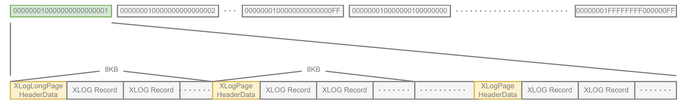
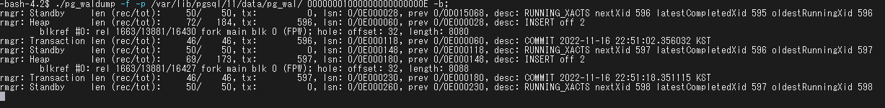

# WAL Segment의 내부 레이아웃

- WAL Segment는 기본적으로 16MB이며 내부적으로 8KB의 Page로 나뉨
- 첫 Page에는 XLogLongPageHeaderData 구조에 의해 정의된 Header Data가 있음
- 다른 모든 Page에는 XLogPageHeaderData 구조에 의해 정의된 Page 정보가 있음
- Page Header 다음에 XLogRecord가 처음부터 내림차순으로 각 페이지에 기록됨



WAL Segment File의 내부 레이아웃

```c
typedef struct XLogPageHeaderData
{
	uint16		xlp_magic;		/* magic value for correctness checks */
	uint16		xlp_info;		/* flag bits, see below */
	TimeLineID	xlp_tli;		/* TimeLineID of first record on page */
	XLogRecPtr	xlp_pageaddr;	/* XLOG address of this page */

	/*
	 * When there is not enough space on current page for whole record, we
	 * continue on the next page.  xlp_rem_len is the number of bytes
	 * remaining from a previous page; it tracks xl_tot_len in the initial
	 * header.  Note that the continuation data isn't necessarily aligned.
	 */
	uint32		xlp_rem_len;	/* total len of remaining data for record */
} XLogPageHeaderData;
```

```c
/* When record crosses page boundary, set this flag in new page's header */
#define XLP_FIRST_IS_CONTRECORD		        0x0001
/* This flag indicates a "long" page header */
#define XLP_LONG_HEADER				            0x0002
/* This flag indicates backup blocks starting in this page are optional */
#define XLP_BKP_REMOVABLE			            0x0004
/* Replaces a missing contrecord; see CreateOverwriteContrecordRecord */
#define XLP_FIRST_IS_OVERWRITE_CONTRECORD 0x0008
/* All defined flag bits in xlp_info (used for validity checking of header) */
#define XLP_ALL_FLAGS                     0x000F
```

```c
typedef struct XLogLongPageHeaderData
{
	XLogPageHeaderData std;		/* standard header fields */
	uint64		xlp_sysid;		/* system identifier from pg_control */
	uint32		xlp_seg_size;	/* just as a cross-check */
	uint32		xlp_xlog_blcksz;	/* just as a cross-check */
} XLogLongPageHeaderData;
```

<aside>
💡 WAL



### XLogLongPageHeaderData

98 D0 06 00(magic) 01 00 00 00(info) 00 00 00 0E(timeline) 00 00 00 00 00 00 00 00(pageaddr) 00 00 00 00 (rem_len) 3D 25 B1 BD 78 4D 74 63(sysid) 00 00 00 01(seg_size) 00 20 00 00 (blck_size)

</aside>