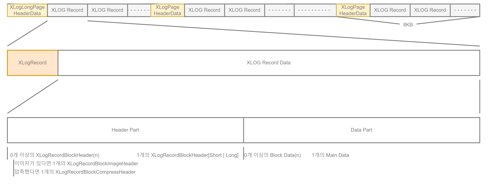
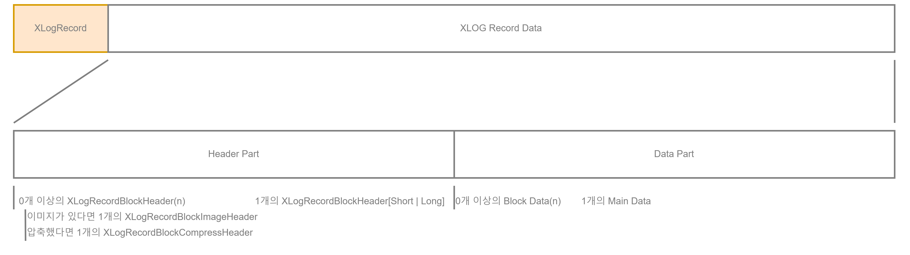
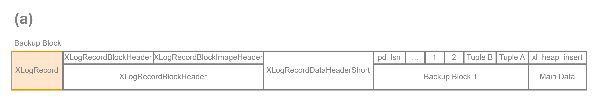
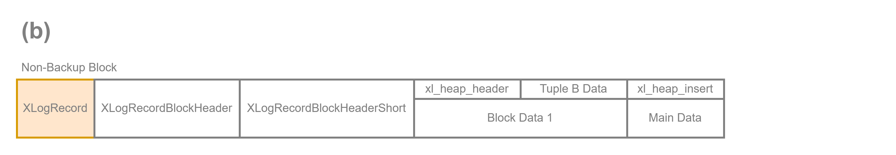

# XLOG Record의 내부 레이아웃

- XLOG Record는 일반 Header 부분과 각 관련 Data 부분으로 구성



XLOG Record의 내부 레이아웃

## XLOG Record의 Header 부분

- 모든 XLOG Record에는 XLogRecord 구조로 정의된 일반 Header부분이 있음

```c
typedef struct XLogRecord {
	uint32        xl_tot_len; // total length of entire record
	TransactionId xl_xid;     // xact id
	XLogRecPtr.   xl_prev;    // ptr to previous record in log
	uint8         xl_info;    // flag bits, see below
	RmgrId        xl_rmid;    // resource manager for this record
	// 2 Bytes of Padding Here, Initiallize to zero
	pg_crc32      xl_crc;     // CRC for this record
	// XLogRecordBlockHeaders & XLogRecordDataHeader Follow, No Padding 
} XLogRecord;
```

- xl_rmid와 xl_info는 WAL 기능과 관련된 작업 모음인 Resource Manager와 관련된 변수로 값의 조합으로 구분할 수 있음

| Operation | Resource Manager |
| --- | --- |
| Heap Tuple Operations | RM_HEAP, RM_HEAP2 |
| Index Operations | RM_BTREE, RM_HASH, RM_GIN, RM_GIST, RM_SPGIST, RM_BRIN |
| Sequence Operations | RM_SEQ |
| Transaction Operations | RM_XACT, RM_MULTIXACT, RM_CLOG, RM_XLOG, RM_COMMIT_TS |
| Tablespace Operations | RM_SMGR, RM_DBASE, RMTBLSPC, RM_RELMAP |
| Replication & Hot Standby Operations | RM_STANDBY, RM_REPLORIGIN, RM_GENERIC_ID, RM_LOGICALMSG_ID |

<aside>
💡 WAL


### 1. XLogRecord - Standby(0x08): Running_XACTS(0x10)

32 00 00 00(tot_len) 00 00 00 00(xid) 68 50 01 0D 00 00 00 00(prev) 10(info) 08(rmid) 00 00(padding) 3F 20 FD 76(crc)

## XLogRecordDataHeaderShort

FF(id) 18(data_len:xl_running_xacts length)

### xl_running_xacts

00 00 00 00(xcnt) 00 00 00 00(subxcnt) 00 B6 73 00(bool:subxid_overflow) 54 02 00 00(nextxid) 54 02 00 00(oldestXid) 53 02 00 00(latestXid)

### 2. XLogRecord - Heap(0x0A): INSERT(0x00)

B8 00 00 00(tot_len) 54 02 00 00(xid) 28 00 00 0E 00 00 00 00(prev) 00(info) 0A(rmid) 00 00(padding) 8A E6 F0 8F(crc)

### XLogRecordBlockHeader

00(id) 30(fork_flag) 12 00(data_len)← page image를 포함하지 않음

### XLogRecordBlockImageHeader

70 00(len) 20 00(hole_offset) 05(bimg_info)

### Data

7F 06 00 00(spc) 39 36 00 00(db) 2E 40 00 00(rel) 00 00 00 00 FF 03 00 00 00 00 20 4F 01 0D 00 00 00 00 20 00 B0 1F 00 20 04 20 00 00 00 00 D8 9F 48 00 B0 9F 48 00 54 02 00 00(txid) 00 00 00 00 00 00 00 00 00 00 00 00 02 00 02 00 02 08 18 00 0B 74 65 73 74 00 00 00(”test”) 01 00 00 00(1) 00 00 00 00 53 02 00 00(prev_txid) 00 00 00 00 00 00 00 00 00 00 00 00 01 00 02 00 02 08 18 00 0B 74 65 73 74 00 00 00(”test”) 10 00 00 00(1) 00 00 00 00 02 00 02 08 18 00 0B 74 65 73 74 00 00 00(”test”) 01 00 00 00(1) 02 00(Offset) 08(Flag)

### 3. XLogRecord - XACT(0x01): COMMIT(0x00) | HAS_INFO(0x80)

2E 00 00 00(tot_len) 54 02 00 00(xid) 60 00 00 0E 00 00 00 00(prev) 80(info) 01(rmid) 00 00(padding) FB 0B 62 71(crc)

## XLogRecordDataShort

FF(id) 14(data_len)

### Data

40 4C 29 88 95 90 02 00(timestamptz) 01 00 00 00(xinfo) 39 36 00 00(db) 7F 06 00 00(spc)

### 4. XLogRecord - Standby(0x08): Running_XACTS(0x10)

32 00 00 00(tot_len) 00 00 00 00(xid) 18 01 00 0E 00 00 00 00(prev) 10(info) 08(rmid) 00 00(padding) 71 1B FE E4(crc)

## XLogRecordDataHeaderShort

FF(id) 18(data_len)

### xl_running_xacts

00 00 00 00(xcnt) 00 00 00 00(subxcnt) 00 B6 73 00(bool:subxid_overflow) 55 02 00 00(nextXid) 55 02 00 00(oldestXid) 54 02 00 00(latestXid)

### 5. XLogRecord - Heap(0x0A): INSERT(0x00)

AD 00 00 00(tot_len) 55 02 00 00(xid) 48 01 00 0E 00 00 00 00(prev) 00(info) 0A(rmid) 00 00(padding) BB A8 DC AF(crc)

### XLogRecordBlockHeader

00(id) 30(fork_flag) 0F 00(data_len)

### XLogRecordBlockImageHeader

68 00(len) 20 00(hole_offset) 05(bimg_info) 

### DATA

7F 06 00 00(spc) 39 36 00 00(db) 2B 40 00 00(rel) 00 00 00 00 FF 03 00 00 00 00 A0 00 00 0D 00 00 00 00 20 00 B8 1F 00 20 04 20 00 00 00 00 E0 9F 3C 00 B8 9F 42 00 55 02 00 00 00 00 00 00 00 00 00 00 00 00 00 00 02 00 02 00 02 08 18 00 01 00 00 00(1) 0B 74 65 73 74(”test”) 00 00 00 00 00 00 00 51 02 00 00 00 00 00 00 00 00 00 00 00 00 00 00 01 00 02 00 02 08 18 00 FF 00 00 00 05 76 00 00 02 00 02 08 18 00 01 00 00 00(1) 0B 74 65 73 74(”test”) 02 00(Offset) 08(Flag)

### 6. XLogRecord - XACT(0x01): COMMIT(0x00) | HAS_INFO(0x80)

2E 00 00 00(tot_len) 55 02 00 00(xid) 80 01 00 0E 00 00 00 00(prev) 80(info) 01(rmid) 00 00(padding) 00 9A 04 31(crc) 

## XLogRecordDataHeaderShort

FF 14

### Data

0B 5D 1D 89 95 90 02 00(timestamptz) 01 00 00 00(xinfo) 39 36 00 00(db) 7F 06 00 00(spc)

### 7. XLogRecord - Standby(0x08): Running_XACTS(0x10)

32 00 00 00(tot_len) 00 00 00 00(xid) 30 02 00 0E 00 00 00 00(prev) 10(info) 08(rmid) 00 00(padding) EA 4A C7 FB(crc) 

## XLogRecordDataHeaderShort

FF 18 

### xl_running_xacts

00 00 00 00(xcnt) 00 00 00 00(subxcnt) 00 B6 73 00(bool:subxid_overflow) 56 02 00 00(nextXid) 56 02 00 00(oldestXid) 55 02 00 00(latestXid)

- xl_running_xacts
  
    ```c
    typedef struct xl_running_xacts
    {
    	int			xcnt;			/* # of xact ids in xids[] */
    	int			subxcnt;		/* # of subxact ids in xids[] */
    	bool		subxid_overflow;	/* snapshot overflowed, subxids missing */
    	TransactionId nextXid;		/* copy of ShmemVariableCache->nextXid */
    	TransactionId oldestRunningXid; /* *not* oldestXmin */
    	TransactionId latestCompletedXid;	/* so we can set xmax */
    
    	TransactionId xids[FLEXIBLE_ARRAY_MEMBER];
    } xl_running_xacts;
    ```
    
- xl_xact_commit
  
    ```c
    typedef struct xl_xact_commit
    {
    	TimestampTz xact_time;		/* time of commit */
    
    	/* xl_xact_xinfo follows if XLOG_XACT_HAS_INFO */
    	/* xl_xact_dbinfo follows if XINFO_HAS_DBINFO */
    	/* xl_xact_subxacts follows if XINFO_HAS_SUBXACT */
    	/* xl_xact_relfilenodes follows if XINFO_HAS_RELFILENODES */
    	/* xl_xact_invals follows if XINFO_HAS_INVALS */
    	/* xl_xact_twophase follows if XINFO_HAS_TWOPHASE */
    	/* twophase_gid follows if XINFO_HAS_GID. As a null-terminated string. */
    	/* xl_xact_origin follows if XINFO_HAS_ORIGIN, stored unaligned! */
    } xl_xact_commit;
    ```
    
- xl_xact_xinfo
  
    ```c
    typedef struct xl_xact_xinfo
    {
    	/*
    	 * Even though we right now only require 1 byte of space in xinfo we use
    	 * four so following records don't have to care about alignment. Commit
    	 * records can be large, so copying large portions isn't attractive.
    	 */
    	uint32		xinfo;
    } xl_xact_xinfo
    ```
    
- xl_xact_dbinfo
  
    ```c
    typedef struct xl_xact_dbinfo
    {
    	Oid			dbId;			/* MyDatabaseId */
    	Oid			tsId;			/* MyDatabaseTableSpace */
    } xl_xact_dbinfo;
    ```
    
- XLogRecordBlockHeader: fork_flag
  
    ```c
    #define BKPBLOCK_FORK_MASK	0x0F
    #define BKPBLOCK_FLAG_MASK	0xF0
    #define BKPBLOCK_HAS_IMAGE	0x10	/* block data is an XLogRecordBlockImage */
    #define BKPBLOCK_HAS_DATA	0x20
    #define BKPBLOCK_WILL_INIT	0x40	/* redo will re-init the page */
    #define BKPBLOCK_SAME_REL	0x80	/* RelFileLocator omitted, same as previous */
    ```
    
- XLogRecordBlockImageHeader: bimg_info
  
    ```c
    #define BKPIMAGE_HAS_HOLE		0x01	/* page image has "hole" */
    #define BKPIMAGE_APPLY			0x02	/* page image should be restored
    										 * during replay */
    /* compression methods supported */
    #define BKPIMAGE_COMPRESS_PGLZ	0x04
    #define BKPIMAGE_COMPRESS_LZ4	0x08
    #define BKPIMAGE_COMPRESS_ZSTD	0x10
    ```
    

</aside>

## XLOG Record의 Data 부분

- XLOG Record의 Data 부분은 Header와 Data로 나뉨



XLOG Record의 Data 부분

- Header 부분에 0개 이상의 XLogRecordBlockHeaders와 0~1개의 XLogRecordDataHeaderShort(또는 XLogRecordDataHeaderLong)이 포함됨
    - XLogRecordDataHeaderShort 또는 XLogRecordDataHeaderLong중 하나를 포함되어야 함
    - Row가 전체 Page Image(Backup Block)를 저장할 때 XLogRecordBlockHeader는 XLogRecordBlockImageHeader를 포함하고 Block이 압축된 경우 XLogRecordBlockCompressHeader도 포함함
- Data 부분은 각각 XLogRecordBlockHeader(s) 및 XLogRecordDataHeader에 해당하는 0개 이상의 Block Data와 0~1개의 Main Data로 구성됨

### Backup Block



- 그림 (a)는 INSERT문에 의해 생성된 Backup Block
- 4개의 Data 구조와 1개의 Data 객체로 구성
    1. XLogRecord(Header 부분) 구조
    2. 1개의 XLogRecordBlockImageHeader를 포함하는 XLogRecordBlockHeader 구조
    3. XLogRecordDataHeaderShort 구조
    4. Backup Block(Block Data)
    5. xl_heap_insert 구조(Main Data)
- XLogRecordDataHeaderShort는 Row의 Main Data인 xl_heap_insert 구조의 길이를 저장

### Non-Backup Block



- 그림 (b)는 INSERT문에 의해 생성된 Non-Backup Block
- 4개의 Data 구조와 1개의 Data 객체로 구성
    1. XLogRecord(Header 부분) 구조
    2. XLogRecordBlockHeader 구조
        - relfilenode, Fork Number, Block Number 포함
    3. XLogRecordDataHeaderShort 구조
        - xl_heap_insert(Main Data)의 길이 포함
    4. INSERT된 Row(xl_heap_header 구조 및 삽입된 Data 전체)
    5. xl_heap_insert 구조(Main Data)
        - Block 내 이 Row의 Offset Number와 Visibility Flag만 포함
- XLogRecordBlockHeader가 이전 Data에 포함된 대부분의 Data를 저장하기에 간단해짐

### Checkpoint Action


- 그림 (c), 3가지 Data 구조로 구성되어 있음
    1. XLogRecord(Header 부분) 구조
    2. 기본 Data 길이가 포함된 XLogRecordDataHeaderShort 구조
    3. Checkpoint(Main Data) 구조