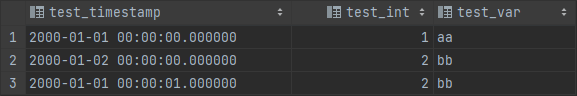

# 알아낸 점

# REPLICATION 방식

# log shipping


- file-based 복제로 master의 WAL file이 생성되면 이 파일을 scp를 통해 Standby서버로 전달하여 반영함
- wal file이 생길 때 까지 replication gap 이 발생할 수 있음

# logical replication


- pub / sub 구조로 양방향 replication 가능
- 특정 테이블만 복제하는 partial replication 가능
- DDL 복제 불가로 각각 직접 수행해야 함

# streaming replication


- Master는 Standby 에게 transaction log entires 를 전달하고 standby 는 WAL file을 기다리지 않고 record 단위로 복제 수행
- 일반적으로 가장 많이 사용되는 복제 방식

# pg_waldump로 추출한 dump 분석

<aside>
💡 WAL



### XLogLongPageHeaderData

98 D0 06 00(magic) 01 00 00 00(info) 00 00 00 0E(timeline) 00 00 00 00 00 00 00 00(pageaddr) 00 00 00 00 (rem_len) 3D 25 B1 BD 78 4D 74 63(sysid) 00 00 00 01(seg_size) 00 20 00 00 (blck_size)

### 1. XLogRecord - Standby(0x08): Running_XACTS(0x10)

32 00 00 00(tot_len) 00 00 00 00(xid) 68 50 01 0D 00 00 00 00(prev) 10(info) 08(rmid) 00 00(padding) 3F 20 FD 76(crc)

## XLogRecordDataHeaderShort

FF(id) 18(data_len:xl_running_xacts length)

### xl_running_xacts

00 00 00 00(xcnt) 00 00 00 00(subxcnt) 00 B6 73 00(bool:subxid_overflow) 54 02 00 00(nextxid) 54 02 00 00(oldestXid) 53 02 00 00(latestXid)

### 2. XLogRecord - Heap(0x0A): INSERT(0x00)

B8 00 00 00(tot_len) 54 02 00 00(xid) 28 00 00 0E 00 00 00 00(prev) 00(info) 0A(rmid) 00 00(padding) 8A E6 F0 8F(crc)

### XLogRecordBlockHeader

00(id) 30(fork_flag) 12 00(data_len)← page image를 포함하지 않음

### XLogRecordBlockImageHeader

70 00(len) 20 00(hole_offset) 05(bimg_info)

### Data

7F 06 00 00(spc) 39 36 00 00(db) 2E 40 00 00(rel) 00 00 00 00 FF 03 00 00 00 00 20 4F 01 0D 00 00 00 00 20 00 B0 1F 00 20 04 20 00 00 00 00 D8 9F 48 00 B0 9F 48 00 54 02 00 00(txid) 00 00 00 00 00 00 00 00 00 00 00 00 02 00 02 00 02 08 18 00 0B 74 65 73 74 00 00 00(”test”) 01 00 00 00(1) 00 00 00 00 53 02 00 00(prev_txid) 00 00 00 00 00 00 00 00 00 00 00 00 01 00 02 00 02 08 18 00 0B 74 65 73 74 00 00 00(”test”) 10 00 00 00(1) 00 00 00 00 02 00 02 08 18 00 0B 74 65 73 74 00 00 00(”test”) 01 00 00 00(1) 02 00(Offset) 08(Flag)

### 3. XLogRecord - XACT(0x01): COMMIT(0x00) | HAS_INFO(0x80)

2E 00 00 00(tot_len) 54 02 00 00(xid) 60 00 00 0E 00 00 00 00(prev) 80(info) 01(rmid) 00 00(padding) FB 0B 62 71(crc)

## XLogRecordDataShort

FF(id) 14(data_len)

### Data

40 4C 29 88 95 90 02 00(timestamptz) 01 00 00 00(xinfo) 39 36 00 00(db) 7F 06 00 00(spc)

### 4. XLogRecord - Standby(0x08): Running_XACTS(0x10)

32 00 00 00(tot_len) 00 00 00 00(xid) 18 01 00 0E 00 00 00 00(prev) 10(info) 08(rmid) 00 00(padding) 71 1B FE E4(crc)

## XLogRecordDataHeaderShort

FF(id) 18(data_len)

### xl_running_xacts

00 00 00 00(xcnt) 00 00 00 00(subxcnt) 00 B6 73 00(bool:subxid_overflow) 55 02 00 00(nextXid) 55 02 00 00(oldestXid) 54 02 00 00(latestXid)

### 5. XLogRecord - Heap(0x0A): INSERT(0x00)

AD 00 00 00(tot_len) 55 02 00 00(xid) 48 01 00 0E 00 00 00 00(prev) 00(info) 0A(rmid) 00 00(padding) BB A8 DC AF(crc)

### XLogRecordBlockHeader

00(id) 30(fork_flag) 0F 00(data_len)

### XLogRecordBlockImageHeader

68 00(len) 20 00(hole_offset) 05(bimg_info) 

### DATA

7F 06 00 00(spc) 39 36 00 00(db) 2B 40 00 00(rel) 00 00 00 00 FF 03 00 00 00 00 A0 00 00 0D 00 00 00 00 20 00 B8 1F 00 20 04 20 00 00 00 00 E0 9F 3C 00 B8 9F 42 00 55 02 00 00 00 00 00 00 00 00 00 00 00 00 00 00 02 00 02 00 02 08 18 00 01 00 00 00(1) 0B 74 65 73 74(”test”) 00 00 00 00 00 00 00 51 02 00 00 00 00 00 00 00 00 00 00 00 00 00 00 01 00 02 00 02 08 18 00 FF 00 00 00 05 76 00 00 02 00 02 08 18 00 01 00 00 00(1) 0B 74 65 73 74(”test”) 02 00(Offset) 08(Flag)

### 6. XLogRecord - XACT(0x01): COMMIT(0x00) | HAS_INFO(0x80)

2E 00 00 00(tot_len) 55 02 00 00(xid) 80 01 00 0E 00 00 00 00(prev) 80(info) 01(rmid) 00 00(padding) 00 9A 04 31(crc) 

## XLogRecordDataHeaderShort

FF 14

### Data

0B 5D 1D 89 95 90 02 00(timestamptz) 01 00 00 00(xinfo) 39 36 00 00(db) 7F 06 00 00(spc)

### 7. XLogRecord - Standby(0x08): Running_XACTS(0x10)

32 00 00 00(tot_len) 00 00 00 00(xid) 30 02 00 0E 00 00 00 00(prev) 10(info) 08(rmid) 00 00(padding) EA 4A C7 FB(crc) 

## XLogRecordDataHeaderShort

FF 18 

### xl_running_xacts

00 00 00 00(xcnt) 00 00 00 00(subxcnt) 00 B6 73 00(bool:subxid_overflow) 56 02 00 00(nextXid) 56 02 00 00(oldestXid) 55 02 00 00(latestXid)

- xl_running_xacts
  
    ```c
    typedef struct xl_running_xacts
    {
    	int			xcnt;			/* # of xact ids in xids[] */
    	int			subxcnt;		/* # of subxact ids in xids[] */
    	bool		subxid_overflow;	/* snapshot overflowed, subxids missing */
    	TransactionId nextXid;		/* copy of ShmemVariableCache->nextXid */
    	TransactionId oldestRunningXid; /* *not* oldestXmin */
    	TransactionId latestCompletedXid;	/* so we can set xmax */
    
    	TransactionId xids[FLEXIBLE_ARRAY_MEMBER];
    } xl_running_xacts;
    ```
    
- xl_xact_commit
  
    ```c
    typedef struct xl_xact_commit
    {
    	TimestampTz xact_time;		/* time of commit */
    
    	/* xl_xact_xinfo follows if XLOG_XACT_HAS_INFO */
    	/* xl_xact_dbinfo follows if XINFO_HAS_DBINFO */
    	/* xl_xact_subxacts follows if XINFO_HAS_SUBXACT */
    	/* xl_xact_relfilenodes follows if XINFO_HAS_RELFILENODES */
    	/* xl_xact_invals follows if XINFO_HAS_INVALS */
    	/* xl_xact_twophase follows if XINFO_HAS_TWOPHASE */
    	/* twophase_gid follows if XINFO_HAS_GID. As a null-terminated string. */
    	/* xl_xact_origin follows if XINFO_HAS_ORIGIN, stored unaligned! */
    } xl_xact_commit;
    ```
    
- xl_xact_xinfo
  
    ```c
    typedef struct xl_xact_xinfo
    {
    	/*
    	 * Even though we right now only require 1 byte of space in xinfo we use
    	 * four so following records don't have to care about alignment. Commit
    	 * records can be large, so copying large portions isn't attractive.
    	 */
    	uint32		xinfo;
    } xl_xact_xinfo
    ```
    
- xl_xact_dbinfo
  
    ```c
    typedef struct xl_xact_dbinfo
    {
    	Oid			dbId;			/* MyDatabaseId */
    	Oid			tsId;			/* MyDatabaseTableSpace */
    } xl_xact_dbinfo;
    ```
    
- XLogRecordBlockHeader: fork_flag
  
    ```c
    #define BKPBLOCK_FORK_MASK	0x0F
    #define BKPBLOCK_FLAG_MASK	0xF0
    #define BKPBLOCK_HAS_IMAGE	0x10	/* block data is an XLogRecordBlockImage */
    #define BKPBLOCK_HAS_DATA	0x20
    #define BKPBLOCK_WILL_INIT	0x40	/* redo will re-init the page */
    #define BKPBLOCK_SAME_REL	0x80	/* RelFileLocator omitted, same as previous */
    ```
    
- XLogRecordBlockImageHeader: bimg_info
  
    ```c
    #define BKPIMAGE_HAS_HOLE		0x01	/* page image has "hole" */
    #define BKPIMAGE_APPLY			0x02	/* page image should be restored
    										 * during replay */
    /* compression methods supported */
    #define BKPIMAGE_COMPRESS_PGLZ	0x04
    #define BKPIMAGE_COMPRESS_LZ4	0x08
    #define BKPIMAGE_COMPRESS_ZSTD	0x10
    ```
    

</aside>

### resource manager

| xl_rmid | 0x01 | 0x08 | 0x09 | 0x0A | 0x00 | 0x02 | 0x03 | 0x04 | 0x05 | 0x06 | 0x07 | 0x0B | 0x0C | 0x0D | 0x0E | 0x0F | 0x10 | 0x11 | 0x13 | 0x14 | 0x15 |
| --- | --- | --- | --- | --- | --- | --- | --- | --- | --- | --- | --- | --- | --- | --- | --- | --- | --- | --- | --- | --- | --- |
| resource manager | XACT | STANDBY | HEAP2 | HEAP | XLOG | SMGR | CLOG | DBASE | TABLESPACE | MULTIXACT | RELMAP | BTREE | HASH | GIN | GIST | SEQ | SPGIST | BRIN | REPORIGIN | RENERIC | LOGICALMSG |

### xl_rmid = XACT

- XLOG_XACT_OPMASK = 0x07

| xl_info & XLOG_XACT_OPMASK | 역할 |
| --- | --- |
| 0x00 | COMMIT |
| 0x10 | PREPARE |
| 0x20 | ABORT |
| 0x30 | COMMIT_PREPARED |
| 0x40 | ABORT_PREPARED |
| 0x50 | ASSIGNMENT |
| 0x80 | HAS_INFO |

### xl_rmid = HEAP2

- XLR_INFO_MASK = 0x0F

| xl_info & ~XLR_INFO_MASK | 역할 |
| --- | --- |
| 0x00 | REWRITE |
| 0x10 | CLEAN |
| 0x20 | FREEZE_PAGE |
| 0x30 | CLEANUP_INFO |
| 0x40 | VISIBLE |
| 0x50 | MULTI_INSERT |
| 0x50 | 0x80 | MULTI_INSERT + INIT_PAGE |
| 0x60 | LOCK_UPDATE |
| 0x70 | NEW_CID |
| 0xB0 | FPI |

### xl_rmid = STANDBY

| xl_info | 역할 | 비고 |
| --- | --- | --- |
| 0x00 | STANDBY_LOCK |  |
| 0x10 | Running_XACTS | Tx 시작으로 추정 |
| 0x20 | INVALIDATIONS |  |

### xl_rmid = HEAP

- XLR_INFO_MASK = 0x0F

| xl_info & ~XLR_INFO_MASK | 역할 |
| --- | --- |
| 0x00 | INSERT |
| 0x00 | 0x80 | INSERT + INIT_PAGE |
| 0x10 | DELETE |
| 0x20 | UPDATE |
| 0x20 | 0x80 | UPDATE + INIT_PAGE |
| 0x30 | TRUNCATE |
| 0x40 | HOT_UPDATE |
| 0x40 | 0x80 | HOT_UPDATE + INIT_PAGE |
| 0x50 | CONFIRM |
| 0x60 | LOCK |
| 0x70 | INPLACE |

# Block이 Data가 있을 때 Data의 의미

## Date(4Byte)

- 2000-01-01 = 00 00 00 00
- 1999-12-31 = FF FF FF FF
- 단위 1d(ex: 2000-01-02 = 01 00 00 00)

## Timestamp(8Byte)

- 2000-01-01 = 00 00 00 00 00 00 00 00
- 단위 1μs(1s = 1000000μs)
- 단위 구분 없이 단순값

## Int(4Byte)

- 4byte 단순 int

## Varchar(가변길이)

- 맨 처음 byte가 길이를 나타냄(3+2(Byte 길이))
    - ‘’ = 03
    - ‘a’ = 05
    - ‘aa’ = 07
    - ‘가’ = 09
    - ‘가가’ = 0F
    - ‘가a’ = 0B
- 이후 길이만큼 UTF-8의 Byte가 나옴

## 예제


### 위 사진 첫 Tuple 해석

03 00 02 08 18 00(Unknown)

00 00 00 00 00 00 00 00(Timestamp): 2000년 1월 1일

01 00 00 00(Int): 4Byte 정수 1

07 61 61(Varchar): 가변길이 문자열 ‘aa’

### 위 사진 두번째 Tuple 해석

03 00 02 08 18 00(Unknown)

- 00 60 D7 1D 14 00 00 00(Timestamp): 2000년 1월 2일
  
    
    

02 00 00 00(Int): 4Byte 정수 2

07 62 62(Varchar): 가변길이 문자열 ‘bb’

### 위 사진 세번째 Tuple 해석

03 00 02 08 18 00(Unknown)

- 40 42 0F 00 00 00 00 00(Timestamp): 2000년 1월 1일 1초
  
    
    

02 00 00 00(Int): 4Byte 정수 2

07 62 62(Varchar): 가변길이 문자열 ‘bb’