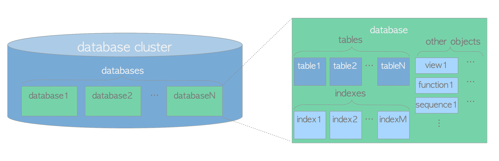

# 1. Database Cluster의 논리적 구조

# Database Cluster의 논리적 구조

- DB Cluster는 PostgreSQL Server에서 관리하는 DB 모음
    - PostgreSQL에서 DB Cluster ≠ Database Server Group
    - PostgreSQL Server는 단일 Host에서 실행되고 단일 DB Cluster를 관리
- Database는 Database Objects의 모음
    - RDBMS 이론에서 DB Object는 Data를 저장하거나 참조하는 데 사용되는 Data 구조
    - (Heap)Table, Index, Sequence, View, Function 등
    - PostgreSQL에서 DB 자체도 Database Object이며 논리적으로 서로 분리되어 있음
    - 다른 모든 DB Object도 해당 DB에 속함



DB Cluster의 Logical Structure

- PostgreSQL의 모든 DB Object는 unsigned int인 OID에 의해 내부적으로 관리됨
- DB Object와 각 OID의 관계는 Object 유형에 따라 적절한 System Catalog에 저장됨
    - ex) DB OID와 Heap Table의 OID는 각각 `pg_database`와 `pg_class`에 저장되어 있음

```sql
SELECT datname, oid FROM pg_database WHERE datname = 'sampledb';

datname  |  oid  
---------+-------
sampledb | 16384
(1 row)

SELECT relname, oid FROM pg_class WHERE relname = 'sampletbl';

relname   |  oid  
----------+-------
sampletbl | 18740 
(1 row)
```