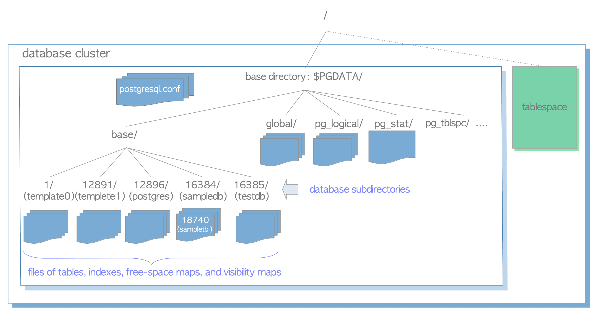

# 1. Database Cluster의 물리적 구조

# DB Cluster의 물리적 구조

- DB Cluster는 기본적으로 기본 디렉터리라고 하는 하나의 디렉터리이며 일부 하위 많은 디렉터리와 파일을 포함함
- `initdb` 유틸리티를 실행해 새 DB Cluster를 초기화하면 지정된 디렉터리 아래 기본 디렉터리가 생성됨
- 필수는 아니나 기본 디렉터리의 경로는 일반적으로 환경 변수 `PGDATA`로 설정됨
- DB는 기본 서브 디렉터리 아래의 서브 디렉터리이고 각 Table과 Index는 속한 DB의 서브 디렉터리 아래에 저장된 하나의 File
- 특정 Data 및 구성 File을 포함하는 여러 하위 디렉터리가 있음
- PostgreSQL은 Tablespace를 지원하나 다른 RDBMS와 의미가 다름
- PostgreSQL의 Tablespace는 기본 디렉터리 외부의 일부 Data를 포함하는 하나의 디렉터리



DB Cluster의 예

## DB Cluster의 레이아웃

- DB Cluster의 레이아웃은 [공식 문서](https://www.postgresql.org/docs/current/storage-file-layout.html)에 설명되어 있음

| files | description |
| --- | --- |
| PG_VERSION | PostgreSQL의 주 버전 번호가 포함된 파일 |
| pg_hba.conf | PosgreSQL의 클라이언트 인증을 제어하는 파일 |
| pg_ident.conf | PostgreSQL의 사용자 이름 매핑을 제어하는 파일 |
| postgresql.conf | 구성 매개변수를 설정하는 파일 |
| postgresql.auto.conf | ALTER SYSTEM(Ver 9.4 이상)에 설정된 구성 매개변수를 저장하는 데 사용되는 파일 |
| postmaster.opts | 서버가 마지막으로 시작된 명령줄 옵션을 기록하는 파일 |

| subdirectories | description |
| --- | --- |
| base/ | DB별 하위 디렉터리를 포함하는 하위 디렉터리 |
| global/ | pg_database 및 pg_control과 같은 Cluster 전체 Table을 포함하는 하위 디렉터리 |
| pg_commit_ts/ | Tx commit timestamp data를 포함하는 하위 디렉터리(Ver 9.5 이상) |
| pg_clog/ (Ver 9.6 이하) | Tx commit state data를 포함하는 하위 디렉터리(Ver 10에서 pg_xact로 이름이 변경) |
| pg_dynshmem/ | Dynamic Shared Memory하위 System에서 사용하는 File을 포함하는 하위 디렉터리(Ver 9.4 이상) |
| pg_logical/ | Logical Decoding을 위한 state data를 포함하는 하위 디렉터리(Ver 9.4 이상) |
| pg_multixact/ | 다중 Tx state data를 포함하는 하위 디렉터리(Shared Row Lock에 사용됨) |
| pg_notify/ | LISTEN/NOTIFY state data를 포함하는 하위 디렉터리 |
| pg_repslot/ | Replication Slot Data를 포함하는 하위 디렉터리(Ver 9.4 이상) |
| pg_serial/ | committed Serializable(직렬화) Tx에 대한 정보를 포함하는 하위 디렉터리(Ver 9.1 이상) |
| pg_snapshots/ | 내보낸 Snapshot을 포함하는 하위 디렉터리(버전 9.2 이상)
PostgreSQL의 pg_export_snapshot() 는 이 하위 디렉터리에 Snapshot 정보 File을 생성 |
| pg_stat/ | 통계 하위 System에 대한 영구 파일을 포함하는 하위 디렉터리 |
| pg_stat_tmp/ | 통계 하위 System에 대한 임시 파일을 포함하는 하위 디렉터리 |
| pg_subtrans/ | 하위 Tx status data를 포함하는 하위 디렉터리 |
| pg_tblspc/ | Tablespace에 대한 Symbolic Link를 포함하는 하위 디렉터리 |
| pg_twophase/ | 준비된 Tx에 대한 State File을 포함하는 하위 디렉터리 |
| pg_wal/ (Ver 10 이상) | WAL(Write Ahead Logging) Segment File을 포함하는 하위 디렉터리(Ver 10 의 pg_xlog 에서 이름 변경) |
| pg_xact/ (Ver 10 이상) | Tx Commit State Data를 포함하는 하위 디렉터리(Ver 10에서 pg_clog 에서 이름 변경) |
| pg_xlog/ (Ver 9.6 이하) | WAL(Write Ahead Logging) Segment File을 포함하는 하위 디렉터리(Ver 10에서 pg_wal로 이름 변경) |

## DB 레이아웃

- DB는 기본 하위 디렉터리 아래의 하위 디렉터리
- DB 디렉터리 이름은 각 OID와 동일
    - ex) `sampledb` DB의 OID가 16384인 경우 하위 디렉터리 이름은 `16384`
    
    ```bash
    cd $PGDATA
    ls - ld base / 16384
    
    # drwx ------ 213 postgres postgres   7242 11 14 16 : 33 16384
    ```
    

## Table & Index와 관련된 File 레이아웃

- 크기가 1GB 미만인 각 Table 또는 Index는 속해있는 DB 디렉터리에 저장된 단일 File
- DB Object로서의 Table과 Index는 개별 OID에 의해 내부적으로 관리되나 이러한 Data File은 변수 `relfilenode`에 의해 관리됨
- Table 및 Index의 `relfilenode` 값은 기본적으로 각 OID와 일치하나 항상 그렇지는 않음

```sql
SELECT relname, oid, relfilenode FROM pg_class WHERE relname = 'sampletbl';

  relname  |  oid  | relfilenode
-----------+-------+-------------
 sampletbl | 18740 |       18740 
(1 row)
```

- 위 결과에서 OID 값과 `relfilenode` 값이 동일함

```bash
cd $PGDATA
ls -la base/16384/18740

# -rw------- 1 postgres postgres 8192 Apr 21 10:21 base/16384/18740
```

```sql
TRUNCATE sampletbl;

TRUNCATE TABLE

SELECT relname, oid, relfilenode FROM pg_class WHERE relname = 'sampletbl';

  relname  |  oid  | relfilenode
-----------+-------+-------------
 sampletbl | 18740 |       18812 
(1 row)
```

<aside>
ℹ️ Ver 9.0 이상에서 내장 함수 `pg_relation_filepath`로 지정된 OID 또는 File Path를 반환함

```sql
SELECT pg_relation_filepath('sampletbl');

 pg_relation_filepath 
----------------------
 base/16384/18812
(1 row)
```

</aside>

- Table 및 Index의 File 크기가 1GB를 초과하면 PostgreSQL은 `relfilenode.1`과 같은 이름의 새 File을 생성해 사용
- 새 File이 채워지면 `relfilenode.2`와 같이 새 File이 생성되는 식

```bash
cd $PGDATA
ls -la -h base/16384/19427*

# -rw------- 1 postgres postgres 1.0G  Apr  21 11:16 data/base/16384/19427
# -rw------- 1 postgres postgres  45M  Apr  21 11:20 data/base/16384/19427.1
# ...
```

<aside>
ℹ️ PostgreSQL을 Build할 때 `--with-segsize` 옵션을 사용해 Table과 Index의 최대 File 크기를 변경할 수 있음

</aside>

- DB 하위 디렉터리들 중 `_fsm`, `_vm` 접미사가 붙은 두 개의 관련 File이 있음
    - `free space map` & `visibility map`이라고 부름
    - 각 Table File 내의 각 Page에 대한 빈 공간과 Visibility 정보를 각각 저장함
    - Index에는 개별 `free space map`만 있고 `visibility map`은 없음
    
    ```bash
    cd $PGDATA
    ls -la base/16384/18751*
    
    # -rw------- 1 postgres postgres  8192 Apr 21 10:21 base/16384/18751
    # -rw------- 1 postgres postgres 24576 Apr 21 10:18 base/16384/18751_fsm
    # -rw------- 1 postgres postgres  8192 Apr 21 10:18 base/16384/18751_vm
    ```
    
- 내부적으로 각 관계를 Fork라고도 함
    - `free space map`은 Table / Index Data File의 첫 Fork(Fork Number = 1)
    - `visibility map`은 Table Data File의 두 번째 fork(Fork Number = 2)
    - Data File의 Fork Number = 0

## Tablespace

- PostgreSQL의 Tablespace는 기본 디렉터리 외부의 추가 Data 영역(Ver 8.0에서 구현)


DB Cluster 의 Tablespace

- `CREATE TABLESPACE`문으로 지정한 디렉터리 아래에 Tablespace가 생성됨
- 해당 디렉터리 아래에 버전 별 하위 디렉터리가 생성됨
    - 버전 별 이름 지정 방법 `PG_MajorVersion_CatalogVersionNumber`
        - ex) `PG_14_202011044`
    - ex) `/home/postgres/tblspc`에 OID가 16386인 `new_tblspc` Tablespace를 생성
    
    ```bash
    ls -l /home/postgres/tblspc/
    
    # total 4
    # drwx------ 2 postgres postgres 4096 Apr 21 10:08 PG_14_202011044
    ```
    
    ```bash
    ls -l $PGDATA/pg_tblspc/
    
    # total 0
    # lrwxrwxrwx 1 postgres postgres 21 Apr 21 10:08 16386 -> /home/postgres/tblspc
    ```
    
    ```bash
    ls -l /home/postgres/tblspc/PG_14_202011044/
    
    # total 4
    # drwx------ 2 postgres postgres 4096 Apr 21 10:10 16387
    ```
    
    ```sql
    CREATE TABLE newtbl (.....) TABLESPACE new_tblspc;
    
    SELECT pg_relation_filepath('newtbl');
    
                pg_relation_filepath             
    ---------------------------------------------
     pg_tblspc/16386/PG_14_202011044/16384/18894
    ```