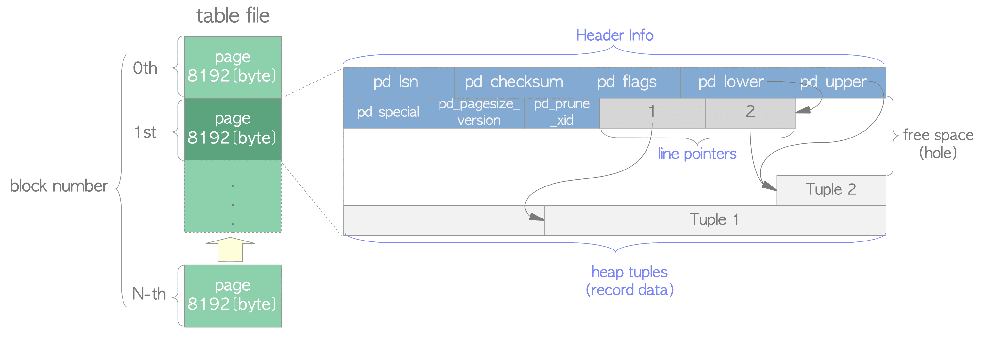

# 1. Heap Table File의 내부 레이아웃

# Heap Table File의 내부 레이아웃

- Data File(Heap Table 및 Index, `free space map` 및 `visibility map`) 내에서 고정 길이의 Page(또는 Block)로 분할(Default: 8K)
- 각 File 내의 해당 Page는 0부터 순차적으로 번호가 지정되며 이런 번호를 Block Number라고 함
- File이 가득차면 PostgreSQL은 File 크기를 늘리기 위해 File 끝에 빈 Page를 새로 추가함

Heap Table File의 Page 레이아웃

- Table 내의 Page에는 세 가지 종류의 Data가 포함됨
    1. Heap Tuple: Heap Tuple은 Record Data 자체, Page 하단부터 순서대로 쌓임
    2. Line Pointer: Line Pointer는 4Byte이며 각 Heap Tuple에 대한 Pointer를 보유
    Item Pointer라고도 함
    Line Pointer는 Row에 대한 Index 역할을 하는 단순한 배열을 생성
    각 Index는 1부터 순차적으로 지정되며 Offset Number라고 함
    새 Row가 Page에 추가되면 새 Line Pointer도 새 Row를 가리키도록 배열에 Push됨
    3. Header Data: PageHeaderData 구조에 의해 정의된 Header Data는 Page 시작 부분에 할당됨
       24Byte이며 Page의 일반 정보를 포함함
        - `pd_lsn`: 이 Page 마지막에 변경에 의해 작성된 XLOG Record의 LSN을 저장
        WAL 메커니즘과 관련된 8Byte Unsigned Long
        - `pd_checksum`: checksum 값을 저장(Ver 9.3 이상에서 지원, 이전에는 Page의 TLI 저장)
        - `pd_lower`, `pd_upper`: `pd_lower`는 Line Pointer의 끝, `pd_upper`는 최신 Heap Tuple의 시작을 가리킴
        - `pd_special`: Index용 변수, Table 내의 Page에서 Page 끝을 가리킴
        (Index 내 Page에서 Index만이 보유하고 있는 Data 영역인 특수공간의 시작공간 가리킴
         `B-tree`, `GiST`, `GiN` 등과 같은 Index 종류에 따른 특정 Data를 포함)
- Line Pointer의 끝과 최신 Row의 시작 사이의 빈 공간을 `free space` 또는 `hole`이라고 부름
- Table내에서 Row를 식별하기 위해 내부적으로 TID(Tuple Identifier)를 사용
- TID는 Row를 포함하는 Page의 Block Number와 Row를 가리키는 Line Pointer의 Offset Number의 한 쌍으로 구성됨(사용의 예: Index)
- Link
  
    [PageHeaderData 구조](https://github.com/postgres/postgres/blob/master/src/include/storage/bufpage.h)
    

<aside>
ℹ️ 컴퓨터 과학 분야에서 이러한 유형의 Page를 Slot Page라고 함
Line Pointer는 Slot Array에 해당함

</aside>

- 크기가 약 2KB 이상인 Heap Tuple은 TOAST(The Oversized-Attribute Storage Technique)라는 방법을 사용해 저장 및 관리됨