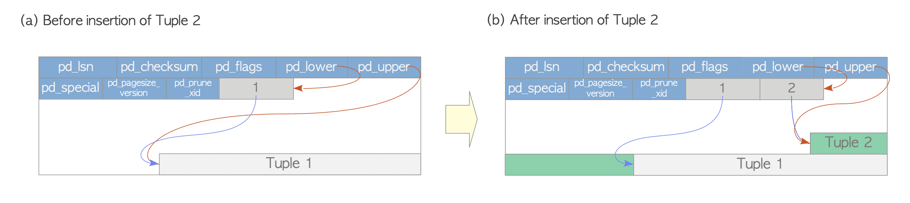

# 1. Tuple Reading & Writing 방법

# Tuple(Row)를 작성하고 읽는 방법

## Heap Tuple 작성



Heap Tuple 작성

- 그림 (a): 하나의 Heap Tuple만 포함하는 하나의 Page로 구성된 Table을 가정했을 때 이 Page는 `pd_lower`는 첫 번째 Line Pointer를 가리킴
Line Pointer와 `pd_upper`는 첫 번째 Heap Tuple을 가리킴
- 그림 (b): 두 번째 Tuple이 `INSERT`되며 첫 Tuple 다음에 배치됨 두 번째 LinePointer는 첫 Tuple 위로 Push되고 두 번째 Tuple을 가리킴
`pd_lower`는 두 번째 Line Pointer를 가리키도록 변경되고 `pd_upper`는 두 번째 Heap Tuple을 가리킴
이 Page 내의 다른 Header Data(`pd_lsn`, `pg_checksum`, `pg_flag`)도 적절한 값으로 다시 작성

## Heap Tuple 읽기

- Access 방법은 `Sequential Scan`과 `B-tree Index Scan`이 있음
    - `Sequential Scan`: 각 Page의 모든 Line Pointer를 스캔
    모든 Page의 모든 Row를 순차적으로 읽음
    - `B-tree Index Scan`: Index File에는 Index Tuple이 포함되어 있으며 각 Index Tuple은 대상 Heap Tuple을 가리키는 Key와 TID로 구성됨
    찾고 있는 Key가 있는 Index Tuple이 발견되면 PostgreSQL은 찾은 TID값을 이용해 원하는 Heap Tuple을 읽음


- 그림 (a): 순차적으로 모든 Row를 읽음
- 그림 (b): Index에서 획득한 TID값은 (Block=7, Offset=2)이므로 대상 Heap Tuple의 Table 내 7번째 Page의 2번째 Row임을 알 수 있음(불필요한 Scan 없이 원하는 Heap Tuple을 읽음)
- Link
  
    [PostgreSQL의 Index: 1](https://postgrespro.com/blog/pgsql/3994098)
    
    [PostgreSQL의 Index: 2](https://postgrespro.com/blog/pgsql/4161264)
    
    [PostgreSQL의 Index: 3(Hash)](https://postgrespro.com/blog/pgsql/4161321)
    
    [PostgreSQL의 Index: 4(B-tree)](https://postgrespro.com/blog/pgsql/4161516)
    
    [PostgreSQL의 Index: 5(GiST)](https://postgrespro.com/blog/pgsql/4175817)
    
    [PostgreSQL의 Index: 6(SP-GiST)](https://habr.com/en/company/postgrespro/blog/446624/)
    
    [PostgreSQL의 Index: 7(GiN)](https://habr.com/en/company/postgrespro/blog/448746/)
    
    [PostgreSQL의 Index: 9(BRIN)](https://habr.com/en/company/postgrespro/blog/452900/)

ℹ️ PostgreSQL은 TID-Scan, Bitmap-Scan 및 Index-Only-Scan 지원


TID-Scan은 원하는 Tuple의 TID를 이용해 Tuple에 직접 접근하는 방식

```sql
SELECT ctid, data FRO< sampletbl WHERE ctid = '(0,1)';

 ctid  |   data    
-------+-----------
 (0,1) | AAAAAAAAA
(1 row)
```
