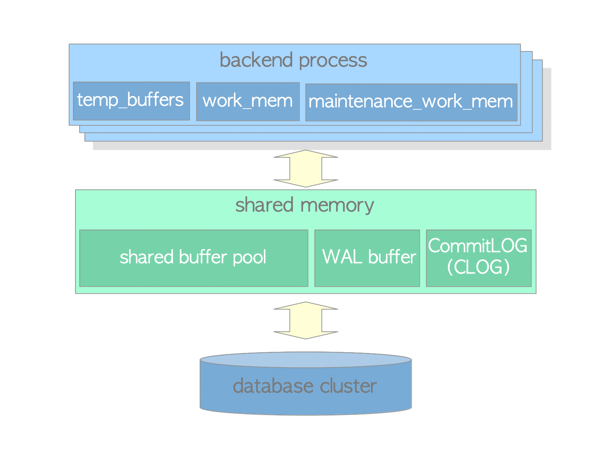

# 2. Memory Architecture

# Memory Architecture

- PostreSQL의 Memory Architecture는 Local Memory 영역와 Shared Memory 영역으로 나뉨
    - Local Memory 영역: 각 Backend Process가 자체 사용을 위해 할당
    - Shared Memory 영역: PostgreSQL Server의 모든 Process에서 사용

PostgreSQL의 Memory Architecture

## Local Memory Area

- 각 Backend Process는 Query 처리를 위해 Local Memory 영역을 할당함
- 각 영역은 고정 / 가변 크기인 여러 하위 영역으로 나뉨

| sub-area | description | reference |
| --- | --- | --- |
| work_mem | Executor가 ORDER BY 및 DISTINCT작업으로 Row을 정렬하고 MERGE JOIN 및 HASH JOIN작업으로 Table Join하기 위해 사용 | https://www.interdb.jp/pg/pgsql03.html |
| maintenance_work_mem | 일부 유지보수 작업(예: VACUUM, REINDEX)이 사용 | https://www.interdb.jp/pg/pgsql06.html#_6.1. |
| temp_buffers | Executor가 Temporary Table을 저장하기 위해 사용 |  |

## Shared Memory Area

- PostgreSQL Server가 시작될 때 할당
- 각 영역은 고정 / 가변 크기인 여러 하위 영역으로 나뉨

| sub-area | description | reference |
| --- | --- | --- |
| shared buffer pool | PostgreSQL가 저장소에서 Table 및 Index 내 Page를 로드할 때 사용 | https://www.interdb.jp/pg/pgsql08.html |
| WAL buffer | WAL Buffer는 저장소에 쓰기 전에 WAL Data의 Buffering 영역 | https://www.interdb.jp/pg/pgsql09.html |
| commit log
(CLOG) | 동시성 제어(CC) 메커니즘을 위해 모든 Tx State
(예: in_progress, committed, aborted)를 유지 | https://www.interdb.jp/pg/pgsql05.html#_5.4. |
- 이외에도 PostgreSQL은 여러 영역을 할당
    - 다양한 Access 제어 메커니즘에 대한 하위 영역
    (`semaphores`, `lightweight locks`, `shared and exclusive locks`, 등)
    - Checkpointer 및 Autovacuum과 같은 다양한 Background Process를 위한 하위 영역
    - 저장 Point 및 2단계 `COMMIT`과 같은 Tx 처리를 위한 하위 영역
    - 등등