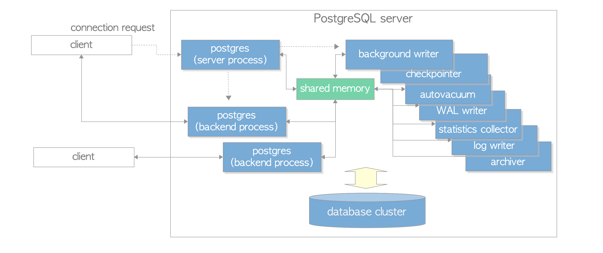

# 2. Process Architecture

# Process Architecture

- PostgreSQL은 다중 Process Architecture를 사용하는 Client / Server 유형의 RDBMS로 단일 Host에서 실행됨
- 하나의 DB Cluster를 협럭적으로 관리하는 여러 Process의 모음을 일반적으로 PostgreSQL Server라고 함
    - Postgres Server Process: DB Cluster 관리와 관련된 모든 Process의 상위
    - Backend Process: 연결된 Client에서 발행된 모든 Query와 Command 처리
    - Background Processes: DB 관리를 위해 각 기능의 Process를 수행
        - ex) `VACUUM` 및 Checkpoint Process
    - replication associated processes: Streaming Replication 수행
    - Background Worker Process: 사용자가 구현한 모든 처리 수행(Ver 9.3 이상)

PostgreSQL의 Process Architecture

## Postgres Server Process

- PostgreSQL Server에 포함된 모든 Process의 부모
- 이전 버전에서는 `postmaster`라 부름
- `start up`과 함께 `pg_ctl`유틸리티를 실행하면 Postgres Server Process가 시작됨
Memory에 Shared Memory 영역을 할당하고 다양한 Background Process를 시작
필요에 따라 Replication 관련 Process 및 Background Worker Process를 시작
Client의 연결 요청을 기다림
- Client로부터 연결 요청을 받을 때마다 Backend Process를 시작
(그 이후 시작된 Backend Process는 연결된 Client에서 발행한 모든 Query를 처리함)
- Postgres Server Process는 하나의 Network Port를 수신함(Default: 5432)
- 동일한 Host에서 둘 이상의 PostgreSQL 서버를 실행할 수 있음

## Backend Processes

- `postgres`라고도 하는 Backend Process는 Postgres Server Process에 의해 시작됨
연결된 하나의 Client에서 발행한 모든 Query를 처리
- 단일 TCP 연결로 Client와 통신, Client 연결이 끊어지면 종료
- 하나의 DB만 운영할 수 있으므로 PostgreSQL Server에 연결할 때 명시적으로 사용 DB를 지정
- PostgreSQL을 사용하면 여러 Client가 동시에 연결할 수 있음
- `max_connections`라는 구성 매개변수로 최대 Client 수를 제어함(Default: 100)
- Web Application과 같이 많은 Client가 PostgreSQL Server와의 연결 / 연결 해제를 자주 반복하면 PostgreSQL이 기본 연결 Pooling 기능을 구현하지 않아 연결 설정 및 Backend Process 생성 비용이 증가함
    - 위 상황을 막기 위해 Pooling Middleware를 사용(pgbouncer 또는 pgpool-II)

## Background Processes

| process | description | reference |
| --- | --- | --- |
| background writer | Shared Buffer Pool의 Dirty Page를 점진적으로 저장소에 정기적으로 작성
(Ver 9.1 이하에서는 Checkpoint 처리도 담당했음) | https://www.interdb.jp/pg/pgsql08.html#_8.6. |
| checkpointer | 버전 9.2 이상에서 Checkpoint Process를 수행 | https://www.interdb.jp/pg/pgsql08.html#_8.6.https://www.interdb.jp/pg/pgsql09.html#_9.7. |
| autovacuum launcher | vacuum Process를 주기적으로 호출(Postgres Server에 autovacuum worker 생성 요청) | https://www.interdb.jp/pg/pgsql06.html#_6.5. |
| WAL writer | WAL 버퍼의 WAL 데이터를 영구 저장소에 주기적으로 쓰고 FLUSH | https://www.interdb.jp/pg/pgsql09.html#_9.9. |
| statistics collector | pg_stat_activity 및 pg_stat_database 등에 대한 통계 정보 수집 |  |
| logging collector 
(logger) | Error MSG를 Log File에 기록 |  |
| archiver | Archiving Logging 실행 | https://www.interdb.jp/pg/pgsql09.html#_9.10. |