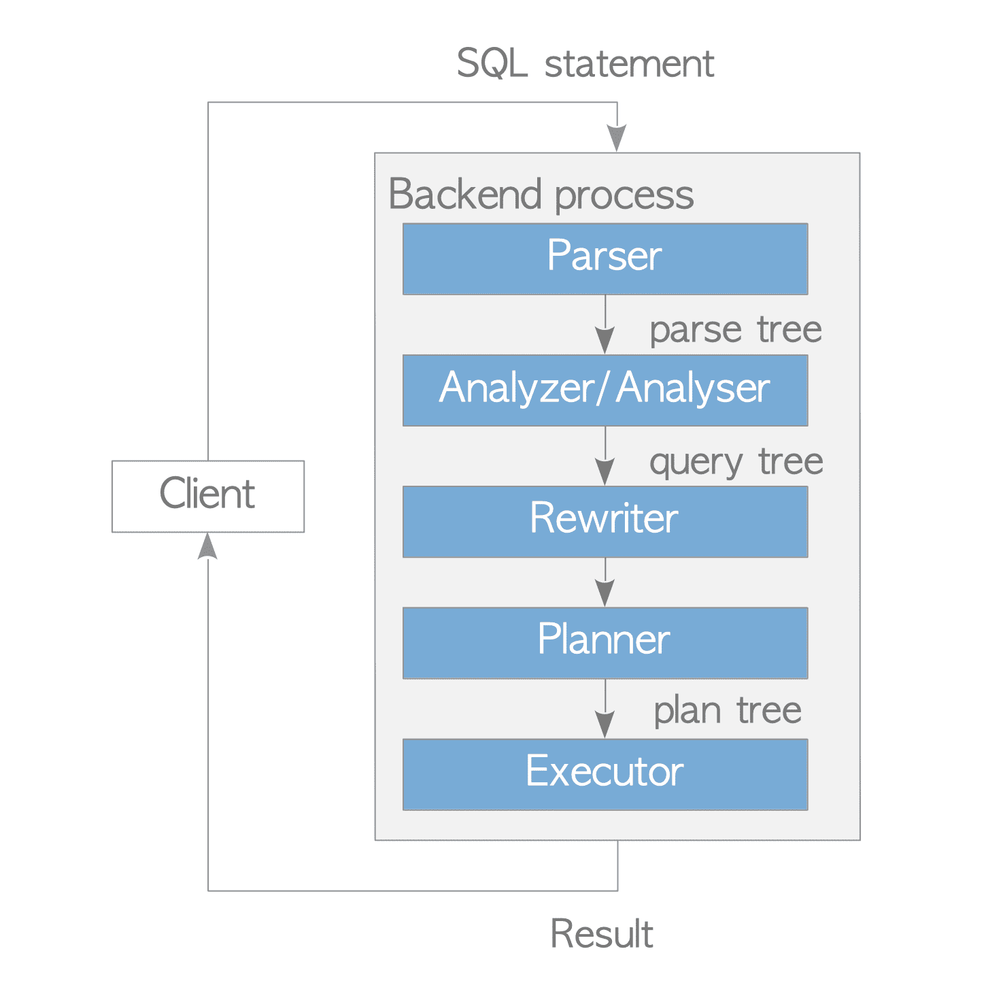

# 3. Query Processing 개요

# Query Processing 개요



Query Processing

- PostgreSQL에서 Ver 9.6에 구현된 Parallel Query가 여러 Background Worker Process를 사용하나 Backend Process는 기본적으로 연결된 Client에서 실행되는 모든 Query를 처리함
    1. Parser: 일반 Text의 SQL문에서 Parse Tree(구문 분석 트리)를 생성
    2. Analyzer / Analyser: Parse Tree의 의미론적 분석을 수행하고 Query Tree를 생성
    3. Rewriter: Rule이 있는 경우 Rule System에 저장된 Rule을 사용해 Query Tree를 변환
    4. Planner: Query Tree에서 효율적으로 실행할 수 있는 Plan Tree를 생성
    5. Executor: Plan Tree에서 생성된 순서대로 Table과 Index에 Access해 Query 실행

## Parser

- 일반 Text인 SQL문에서 후속 하위 System이 읽을 수 있는 Parse Tree 생성

```sql
SELECT id , data FROM tbl_a WHERE id < 300 ORDER BY data;
```

- Parse Tree는 Root Node가 [parsenodes.h](https://github.com/postgres/postgres/blob/master/src/include/nodes/parsenodes.h)에 정의된 SelectStmt 구조인 Tree
  
    ```c
    typedef struct SelectStmt {
    	NodeTag         type;
    
    	/*
    	 * These fields are used only in "leaf" SelectStmts.
    	 */
    	List       *distinctClause;     /* NULL, list of DISTINCT ON exprs, or
    																	 * lcons(NIL,NIL) for all (SELECT DISTINCT) */
    	IntoClause *intoClause;         /* target for SELECT INTO */
    	List       *targetList;         /* the target list (of ResTarget) */
    	List       *fromClause;         /* the FROM clause */
    	Node       *whereClause;        /* WHERE qualification */
    	List       *groupClause;        /* GROUP BY clauses */
    	Node       *havingClause;       /* HAVING conditional-expression */
    	List       *windowClause;       /* WINDOW window_name AS (...), ... */
    
    	/*
    	 * In a "leaf" node representing a VALUES list, the above fields are all
    	 * null, and instead this field is set.  Note that the elements of the
    	 * sublists are just expressions, without ResTarget decoration. Also note
    	 * that a list element can be DEFAULT (represented as a SetToDefault
    	 * node), regardless of the context of the VALUES list. It's up to parse
    	 * analysis to reject that where not valid.
    	 */
    	List       *valuesLists;        /* untransformed list of expression lists */
    	
    	/*
    	 * These fields are used in both "leaf" SelectStmts and upper-level
    	 * SelectStmts.
    	 */
    	List       *sortClause;         /* sort clause (a list of SortBy's) */
    	Node       *limitOffset;        /* # of result tuples to skip */
    	Node       *limitCount;         /* # of result tuples to return */
    	List       *lockingClause;      /* FOR UPDATE (list of LockingClause's) */
    	WithClause *withClause;         /* WITH clause */
    	/*
    	 * These fields are used only in upper-level SelectStmts.
    	 */
    	SetOperation op;                /* type of set op */
    	bool            all;            /* ALL specified? */
    	struct SelectStmt *larg;        /* left child */
    	struct SelectStmt *rarg;        /* right child */
    	/* Eventually add fields for CORRESPONDING spec here */
    } SelectStmt;
    ```
    


Parse Tree의 예

- `SELECT` Query의 요소와 Parse Tree의 해당 요소에 동일한 번호가 지정됨
    - ex) (1)은 첫 대상 목록의 항목 Table의 `id`열, (4)는 `WHERE`절 등
- Parser는 Parse Tree를 생성할 때 입력의 구분만 확인하기에 Query에 Syntax Error가 있는 경우만 Error 반환
- Parser는 입력 Query의 의미를 확인하지 않음
    - 의미 검사는 Analyzer가 수행

## Analyzer / Analyser

- Parser에 의해 생성된 Parse Tree를 의미론적으로 분석 실행하고 Query Tree를 생성
- Query Tree의 Root는 parsenodes.h에 정의된 Query 구조
  
    ```c
    /*
     * Query -
     *	  Parse analysis turns all statements into a Query tree
     *	  for further processing by the rewriter and planner.
     *
     *	  Utility statements (i.e. non-optimizable statements) have the
     *	  utilityStmt field set, and the Query itself is mostly dummy.
     *	  DECLARE CURSOR is a special case: it is represented like a SELECT,
     *	  but the original DeclareCursorStmt is stored in utilityStmt.
     *
     *	  Planning converts a Query tree into a Plan tree headed by a PlannedStmt
     *	  node --- the Query structure is not used by the executor.
     */
    typedef struct Query
    {
    	NodeTag		type;
    	CmdType		commandType;		/* select|insert|update|delete|utility */
    	QuerySource 	querySource;		/* where did I come from? */
    	uint32		queryId;		/* query identifier (can be set by plugins) */
    
    	bool		canSetTag;		/* do I set the command result tag? */
    	Node	   	*utilityStmt;		/* non-null if this is DECLARE CURSOR or a non-optimizable statement */
    	int		resultRelation; 	/* rtable index of target relation for INSERT/UPDATE/DELETE; 0 for SELECT */
    	bool		hasAggs;		/* has aggregates in tlist or havingQual */
    	bool		hasWindowFuncs; 	/* has window functions in tlist */
    	bool		hasSubLinks;		/* has subquery SubLink */
    	bool		hasDistinctOn;		/* distinctClause is from DISTINCT ON */
    	bool		hasRecursive;		/* WITH RECURSIVE was specified */
    	bool		hasModifyingCTE;	/* has INSERT/UPDATE/DELETE in WITH */
    	bool		hasForUpdate;		/* FOR [KEY] UPDATE/SHARE was specified */
    	bool		hasRowSecurity; 	/* row security applied? */
    	List	   	*cteList;		/* WITH list (of CommonTableExpr's) */
    	List	   	*rtable;		/* list of range table entries */
    	FromExpr   	*jointree;		/* table join tree (FROM and WHERE clauses) */
    	List	   	*targetList;		/* target list (of TargetEntry) */
    	List	   	*withCheckOptions;	/* a list of WithCheckOption's */
    	OnConflictExpr 	*onConflict; 		/* ON CONFLICT DO [NOTHING | UPDATE] */
    	List	   	*returningList;		/* return-values list (of TargetEntry) */
    	List	   	*groupClause;		/* a list of SortGroupClause's */
    	List	   	*groupingSets;		/* a list of GroupingSet's if present */
    	Node	   	*havingQual;		/* qualifications applied to groups */
    	List	   	*windowClause;		/* a list of WindowClause's */
    	List	   	*distinctClause; 	/* a list of SortGroupClause's */
    	List	   	*sortClause;		/* a list of SortGroupClause's */
    	Node	   	*limitOffset;		/* # of result tuples to skip (int8 expr) */
    	Node	   	*limitCount;		/* # of result tuples to return (int8 expr) */
    	List	   	*rowMarks;		/* a list of RowMarkClause's */
    	Node	   	*setOperations;		/* set-operation tree if this is top level of a UNION/INTERSECT/EXCEPT query */
    	List	   	*constraintDeps; 	/* a list of pg_constraint OIDs that the query
     depends on to be semantically valid */
    } Query;
    ```
    
- 이 구조는 명령의 유형(`SELECT`, `INSERT` 등) 및 여러 Leaf가 같은 해당 Query의 Metadata를 포함
- 각 Leaf는 목록 또는 Tree를 형성하고 개별 특정 절의 Data를 보유


Query Tree의 예

- TargetList: 이 Query의 결과인 Column 목록
    - 예에서 Targetlist는 `id`, `data`로 구성
    - 입력 Query Tree가 `*`인 경우 Analyzer는 명시적으로 모든 열로 대체
- RangeTable: 이 Query에 사용되는 Relation 목록
    - 예에서 이 Table은 Table의 OID 및 Table의 이름과 같은 Table `tbl_a`의 정보를 가짐
- JoinTree: `FROM`절과 `WHERE`절을 저장
- SortClause: SortGroupClause의 목록

## Rewriter

- Rule System을 구현하는 System
- [필요에 따라](https://www.postgresql.org/docs/current/rules.html) `[pg_rules](https://www.postgresql.org/docs/current/view-pg-rules.html)` System Catalog에 저장된 Rule에 따라 Query Tree를 변환


Rewriter 단계의 예

- PostgreSQL의 View는 Rule System을 사용해 구현됨
- `CREATE VIEW` Command로 View를 정의하면 해당 Rule이 자동으로 생성되어 Catalog에 저장됨
- ex)
  
    ```sql
    CREATE VIEW employees_list
    	AS SELECT e.id, e.name, d.name AS department
    		FROM employees AS e, departments AS d WHERE e.department_id = d.id;
    ```
    
    ```sql
    SELECT * FROM employees_list;
    ```
    

## Planner & Executor

- Planner는 Rewriter에게 Query Tree를 받아 Executor가 효율적으로 처리할 수 있는 (Query)Plan Tree를 생성
- PostgreSQL의 Planner는 비용 최적화를 기반으로 동작
    - Rule 기반 최적화 및 Hint를 지원하지 않음(PPAS 지원)

```sql
EXPLAIN SELECT * FROM tbl_a WHERE id < 300 ORDER BY data;

                          QUERY PLAN                           
---------------------------------------------------------------
 Sort  (cost=182.34..183.09 rows=300 width=8)
   Sort Key: data
   ->  Seq Scan on tbl_a  (cost=0.00..170.00 rows=300 width=8)
         Filter: (id < 300)
(4 rows)
```


Simple Plan Tree & Plan Tree와 `EXPLAIN` Command 결과와의 관계

- Plan Tree는 Plan Node라는 요소로 구성되며 `[PlannedStmt](https://github.com/postgres/postgres/blob/master/src/include/nodes/plannodes.h)` 구조의 Plan Tree 목록과 연결
- 각 Plan Node에는 Executor가 처리에 필요한 정보가 있음
- Executor는 단일 Table Query의 경우 Plan Tree 끝에서 Root까지 처리
- 위 사진에서 표시된 Plan Tree는 Sort Node와 Sequential Scan Node의 목록
    - Executor는 `tbl_a` Table을 Sequential Scan으로 Scan한 후 결과를 정렬
- Executor는 Buffer Manager를 통해 DB Cluster의 Table과 Index를 읽고 씀
- Executor는 Query를 처리할 때 미리 할당된 `temp_buffers`와 `work_mem`같은 일부 Memory 영역을 사용하고 필요한 경우 Temporary File을 생성
- Row에 Access할 때 PostgreSQL은 CC 매커니즘을 사용해 실행중인 Tx의 일관성과 독립성을 유지


Executor, Buffer Manager, Temporary File 간 관계

<aside>
😮‍💨 나머지 Query Processing에 관해서는 여유가 있을 때 정리할 예정

[The Internals of PostgreSQL : Chapter 3 Query Processing](https://www.interdb.jp/pg/pgsql03.html)

</aside>