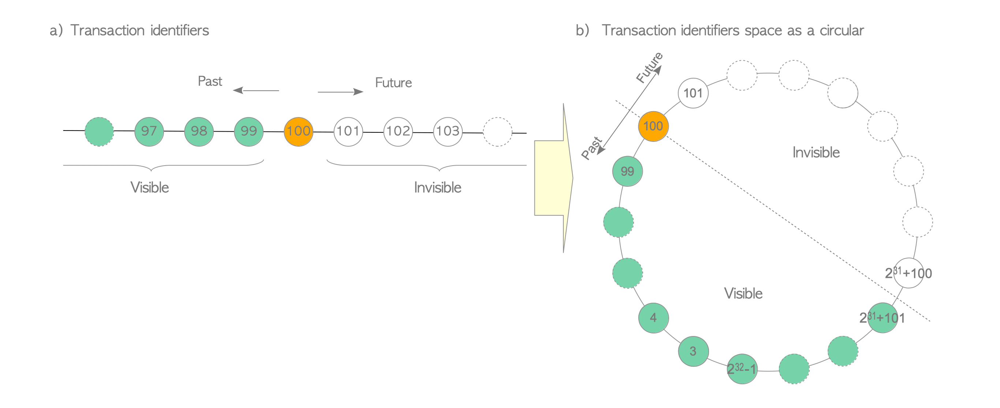

# 5. Transaction ID

# txid

- Tx이 시작될 때마다 Tx Manager는 txid라 하는 고유 식별자를 할당
- PostgreSQL의 txid는 unsigned int(4Byte)로 약 42억개
- Tx이 시작된 후 내장 함수 `txid_current()`를 실행해 현재 txid 반환 가능

```sql
BEGIN;

BEGIN

SELECT txid_current();

txid_current 
--------------
          100
(1 row)
```

- PostgreSQL의 세 가지 특수 txid
    - `0`: 잘못된 txid
    - `1`: Bootstrap txid, DB Cluster의 초기화에만 사용
    - `2`: Frozen txid
- Txid는 서로 비교할 수 있음



PostgreSQL의 txid

- 실제 System에서는 PostgreSQL의 txid 공간이 부족해 순환형으로 사용
- 이전의 약 21억개는 과거, 이후 약 21억개는 미래

<aside>
ℹ️ `BEGIN` Command에는 txid가 할당되지 않음

PostgreSQL에서 `BEGIN` Command가 실행된 후 첫 Command가 실행될 때 Tx Manager가 txid를 할당하고 해당 Tx이 시작

</aside>