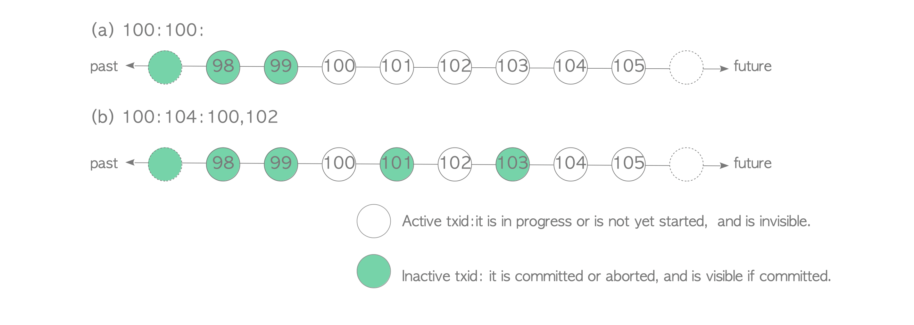

# 5. Transaction Snapshot

# Tx Snapshot

- 개별 Tx의 특정 시점에 모든 Tx이 활성 상태인지 여부에 대한 정보를 저장한 Data Set
- 활성 Tx는 `IN_PROGRESS`이거나 아직 시작되지 않은 Tx를 의미
- PostgreSQL은 내부적으로 Tx Snapshot의 Text 표현 형식을 `100:100:`으로 정의
    - ex) `100:100:`: 99보다 작은 txid는 활성화되지 않고 100보다 크거나 같은 txid를 활성화

ℹ️ 내장 함수 [txid_current_snapshot()](https://www.postgresql.org/docs/current/functions-info.html#FUNCTIONS-TXID-SNAPSHOT) & 해당 Text 표현 형식


`txid_current_snapshot()`은 현재 Tx의 Snapshot을 보여줌

```sql
SELECT txid_current_snapshot();

 txid_current_snapshot 
-----------------------
 100:104:100,102
(1 row)
```

Text 표현은 `xmin:xmax:xip_list`

- `xmin`
    - 활성 상태의 Tx 중 가장 이전의 txid
    - 이전의 모든 Tx는 `COMMIT`되어 표시되거나 `ROLLBACK`되어 `ABORT`됨
- `xmax`
    - 아직 할당되지 않은 첫 txid
    - `xmax`보다 크거나 같은 txid는 Snapshot 시점에 시작되지 않아 안보임
- `xip_list`
    - Snapshot 시점의 활성 txid 목록
    - `xmin`과 `xmax` 사이의 활성 txid만 포함



그림 (a)

- 99보다 작거나 같은 txid는 `xmin`이 100이기 때문에 활성화되지 않음
- 100보다 크거나 같은 txid는 `xmax`가 100이기 때문에 활성화 됨

그림 (b)

- 99보다 작거나 같은 txid는 `xmin`이 100이기 때문에 활성화되지 않음
- 104보다 크거나 같은 txid는 `xmax`가 100이기 때문에 활성화 됨
- txid가 100, 102sms `xip_list`에 있으므로 활성화


- Tx Snapshot은 Tx Manager가 제공
- `READ COMMITTED` 독립성 수준에서 Tx는 SQL Command가 실행될 때마다 Snapshot을 얻음
    - `REPEATABLE READ`, `SERIALIZABLE`일 시 Tx는 첫 SQL Command가 실행될 때만 Snapshot 얻음
    - 획득한 Snapshot은 Visibility Check에 사용됨
- Visibility Check를 위해 획득한 Snapshot을 사용할 때 활성 Tx은 실제로 `COMMIT`되거나 `ABORT`된 경우에도 `IN_PROGRESS`로 처리되어야 함
    - 이 Rule은 READ COMMITTED와 REPEATABLE READ(또는 SERIALIZABLE)간 동작 차이를 유발


Tx Manager & Tx

- Tx Manager는 항상 `IN_PROGRESS`인 Tx에 대한 정보를 보유
- 모든 Tx가 차례로 시작되고 `Tx_A`, `Tx_B`의 독립성이 `READ COMMITTED`, `Tx_C`가 `REPEATABLE READ` 라고 가정
    - `T1`: `Tx_A`는 첫 `SELECT` Command를 시작하고 실행
    - 실행 될 때 `Tx_A`는 지금의 txid와 Snapshot 요청
        - txid=200, Tx Snapshot=`200:200:`
    - `T2`: `Tx_B`는 첫 `SELECT` Command를 시작하고 실행
      `Tx_A`가 진행중이여서 Tx Manager는 txid 201을 할당하고 Tx Snapshot `200:200:` 반환
        - `Tx_A`는 `Tx_B`에서 볼 수 없음
    - `T3`: `Tx_C`는 첫 `SELECT` Command를 시작하고 실행
      Tx Manager는 txid 202를 할당하고 Snapshot `200:200:`을 반환
        - `Tx_A`와 `Tx_B`는 `Tx_C`에서 볼 수 없음
    - `T4`: `Tx_A`가 `COMMIT`되어 Tx Manager는 이 Tx에 대한 정보를 제거
    - `T5`: `Tx_B` 및 `Tx_C`는 각각의 `SELECT` Command 실행
        - `Tx_B`는 `READ COMMITTED` Level이기에 Tx Snapshot이 필요
          위에서 Tx_A가 `COMMIT`되어 `Tx_B`는 새 Snapshot인 `201:201:`을 얻음
            - `Tx_A`는 `Tx_B`에서 더이상 보이지 않음
        - `Tx_C`는 `REPEATABLE READ` Level이기에 Tx Snapshot이 필요하지 않음
            - `Tx_A`는 `Tx_C`에서 보이지 않음