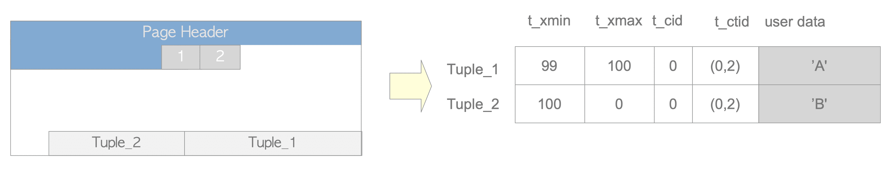

# 5. Tuple INSERT, DELETE, UPDATE

# Tuple `INSERT`, `DELETE`, `UPDATE`



Tuple에 초점을 맞추기 위해 Page Header와 Line Pointer를 표시하지 않은 Tuple의 표현

## `INSERT`

- `INSERT`문을 통해 새 Tuple이 대상 Table의 Page에 직접 `INSERT`


Tuple `INSERT`

- txid가 99인 Tx에 의해 Page에 Tuple이 `INSERT`된 상황 가정시 `INSERT`된 Tuple의 Header Field
    - `Tuple_1`
        - 이 Tuple은 txid 99에 의해 `INSERT`되어 `t_xmin`=99
        - 이 Tuple이 `DELETE`, `UPDATE`되지 않아 `t_xmax`=0
        - 이 Tuple이 txid 99에 의해 `INSERT`된 첫번째 Tuple이라서 `t_cid`=0
        - 이 Tuple이 최신 Tuple이기 때문에 `t_ctid`=(0,1)(자신을 가리킴)

<aside>
ℹ️ PostgreSQL은 DB Page의 내용을 보여주는 모듈인 pageinspect 확장을 제공

```sql
CREATE EXTENSION pageinspect;

CREATE EXTENSION

CREATE TABLE tbl (data text);

CREATE TABLE

INSERT INTO tbl VALUES('A');

INSERT 0 1

SELECT lp as tuple, t_xmin, t_xmax, t_field3 as t_cid, t_ctid
FROM heap_page_items(get_raw_page('tbl', 0));

 tuple | t_xmin | t_xmax | t_cid | t_ctid 
-------+--------+--------+-------+--------
     1 |     99 |      0 |     0 | (0,1)
(1 row)
```

</aside>

## `DELETE`

- `DELETE` 작업에서 대상 Tuple은 논리적으로 삭제됨
- `DELETE` Command를 실행하는 txid의 값은 Tuple의 `t_xmax`로 설정됨


Tuple `DELETE`

- `Tuple_1`이 txid 111에 의해 삭제됨을 가정할 경우 `Tuple_1`의 Header Field
    - `Tuple_1`
        - 이 Tuple의 `t_xmax`=111
    - txid 111이 `COMMIT`되면 Tuple_1은 필요하지 않음
        - 필요하지 않은 Tuple을 Dead Tuple이라고 함
    - Dead Tuple은 Page에서 제거되어야 함
    - Dead Tuple을 제거하는 것을 `VACUUM` 처리라고 함

## `UPDATE`

- `UPDATE` 작업에서 PostgreSQL은 논리적으로 최신 Tuple을 `DELETE` 후 새 Tuple `INSERT`


Tuple을 2번 `UPDATE`

- txid 99에 의해 `INSERT`된 Tuple이 txid 100d에 의해 2번 `UPDATE`되었다고 가정
- 첫 `UPDATE` Command가 실행될 시 txid 100을 t_max로 설정해 `Tuple_1`을 논리적으로 `DELETE`
  한 후 `Tuple_2` `INSERT`, `Tuple_1`의 `t_ctid`가 `Tuple_2`를 가리키도록 재작성
    - `Tuple_1`
        - `t_xmax`=100
        - `t_ctid`=(0,1) → (0,2)로 재작성
    - `Tuple_2`
        - `t_xmin`=100
        - `t_xmax`=0
        - `t_cid`=0
        - `t_ctid`=(0,2)
- 두 번째 `UPDATE` Command가 실행될 때 첫 `UPDATE`와 마찬가지로 동작
    - `Tuple_2`
        - `t_xmax`=100
        - `t_ctid`=(0,2) → (0,3)로 재작성
    - `Tuple_3`
        - `t_xmin`=100
        - `t_xmax`=0
        - `t_cid`=1
        - `t_ctid`=(0,3)
- `DELETE`와 마찬가지로 txid 100이 `COMMIT`되면 `Tuple_1`, `Tuple_2`는 Dead Tuple이 됨
- txid 100이 `ABORT`되면 `Tuple_2`, `Tuple_3`가 Dead Tuple이 됨

## `Free Space Map`(FSM)

- Heap 또는 Index Tuple을 `INSERT`할 때 PostgreSQL은 해당 Table 또는 Index의 FSM을 사용해 `INSERT` 가능한 Page를 선택
- 모든 Table과 Index에는 각각의 FSM 존재
- 각 FSM은 해당 Table 또는 Index File 내에서 각 Page의 Free Space에 대한 정보를 저장
- 모든 FSM은 `_fsm`이 접미사로 저장되어 필요한 경우 Shared Memory에 로드

<aside>
ℹ️ 확장 `pg_freespacemape`은 지정된 Table / Index의 Free Space를 제공

```sql
CREATE EXTENSION pg_freespacemap;

CREATE EXTENSION

SELECT *, round(100 * avail/8192 ,2) as "freespace ratio"
FROM pg_freespace('accounts');

 blkno | avail | freespace ratio 
-------+-------+-----------------
     0 |  7904 |           96.00
     1 |  7520 |           91.00
     2 |  7136 |           87.00
     3 |  7136 |           87.00
     4 |  7136 |           87.00
     5 |  7136 |           87.00
....
```

</aside>