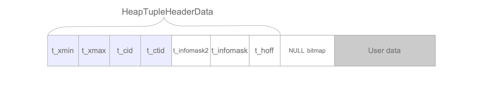

# 5. Tuple Sturcture

# Tuple Structure

- Data Page의 Heap Tuple은 일반 Data Tuple과 TOAST Tuple로 분류됨
- Heap Tuple은 [HeapTupleHeaderData 구조](https://github.com/postgres/postgres/blob/ee943004466418595363d567f18c053bae407792/src/include/access/htup_details.h), NULL Bitmap 및 User Data로 구성

Heap Tuple 중 일반 Data Tuple

- `t_xmin`: 이 Tuple을 삽입한 Tx의 txid를 보유
- `t_xmax`: 이 Tuple을 `DELETE`, `UPDATE`한 Tx의 txid 보유
`DELETE`, `UPDATE`되지 않은 경우 `t_xmax` = 0(`INVALID`)
- `t_cid`: 현재 Tx 내에서 이 Command가 실행되기 전 몇 개의 SQL Command가 실행된 수를 표시
  0 에서부터 증가
    - ex) `BEGIN; INSERT; INSERT; INSERT; COMMIT;` 시 cid는 0에서 3이 아닌 1로 증가
- `t_ctid`: 자신 또는 새 Tuple을 가리키는 tid 보유
이 Tuple이 `UPDATE`되면 `t_ctid`가 새 Tuple을 가리킴(그렇지 않을 경우 자신을 가리킴)