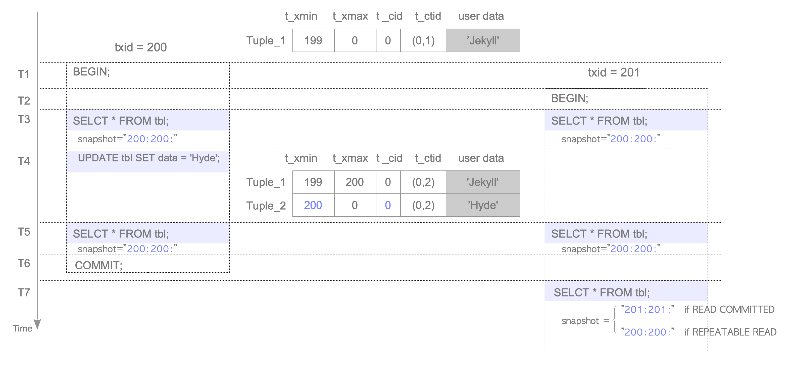

# 5. Visibility Check

# Visibility Check



Visibility Check를 설명하는 Scenario

- `T1`: Tx 시작(txid 200)
- `T2`: Tx 시작(txid 201)
- `T3`: txid 200, 201의 `SELECT` Command 실행
    - `T3`의 `SELECT` Command
        - `T3`에는 Table `tbl`에 `Tuple_1`만 있고 Rule 6에 의해 보임
        
        ```sql
        -- txid 200, 201
        SELECT * FROM tbl;
        
          name  
        --------
         Jekyll
        (1 row)
        ```
    
- `T4`: txid 200의 `UPDATE` Command 실행
- `T5`: txid 200, 201 `SELECT` Command 실행
    - `T5`의 `SELECT` Command
        - txid 200의 `Tuple_1`은 Rule 7에 의해 보이지 않고 `Tuple_2`는 Rule 2에 의해 보임
        - txid 201의 `Tuple_1`은 Rule 8에 의해 보이고 `Tuple_2`는 Rule 4에 의해 보이지 않음
        
        ```sql
        -- txid 200
        SELECT * FROM tbl;
        
         name 
        ------
         Hyde
        (1 row)
        
        -- txid 201
        SELECT * FROM tbl;
        
          name 
        --------
         Jekyll
        (1 row)
        ```
        
        - `UPDATE`된 Tuple이 `COMMIT`되기 전 보이는 경우를 Dirty Reads라고 함
            - PostgreSQL에서는 발생하지 않음
- `T6`: txid 200 `COMMIT`
- `T7`: txid 201의 `SELECT` Command 실행
    - `T7`의 `SELECT` Command
        - txid 201은 `READ COMMITTED` Level일 때 `SELECT`
        Tx Snapshot이 `201:201:`이므로 txid 200은 `COMMIT`처리
        `Tuple_1`은 Rule 10에 의해 보이지 않고 `Tuple_2`는 Rule 6에 의해 보임
        - txid 201이 `REPEATABLE READ` Level일 때 `SELECT`
        Tx SnapShot이 `200:200:`이므로 txid 200은 `IN_PROGRESS`로 처리
        `Tuple_1`은 Rule 9에 의해 보이고 `Tuple_2`는 Rule 5에 의해 보이지 않음
        
        ```sql
        -- txid 201 (READ COMMITTED)
        SELECT * FROM tbl;
        
         name 
        ------
         Hyde
        (1 row)
        
        -- txid 201 (REPEATABLE READ)
        SELECT * FROM tbl;
        
          name 
        --------
         Jekyll
        (1 row)
        ```
        

<aside>
ℹ️ Tx Status를 얻기 위해 PostgreSQL은 내부적으로 `TransactionIdIsInProgress`, `TransactionIdDidCommit`, `TransactionIdDidAbort`의 세 기능을 제공

clog에 대한 빈번한 Access를 줄여주기 위해 구현되었으나 각 Tuple을 확인할 때마다 실행할 시 병목현상 발생

위 문제를 해결하기 위해 PostgreSQL은 Hint Bits를 사용함

```c
#define HEAP_XMIN_COMMITTED       0x0100   /* t_xmin committed */
#define HEAP_XMIN_INVALID         0x0200   /* t_xmin invalid/aborted */
#define HEAP_XMAX_COMMITTED       0x0400   /* t_xmax committed */
#define HEAP_XMAX_INVALID         0x0800   /* t_xmax invalid/aborted */
```

Tuple을 Read / Write할 때 PostgreSQL은 가능하면 Hint Bits를 Tuple의 t_informask로 설정

위 Hint Bits를 활용해 PostgreSQL은 각 Tuple의 `t_xmin`, `t_xmax` Status를 효율적 확인 가능

</aside>

## PostgreSQL의 `REPEATABLE READ` Level에서 Phantom 읽기

- ANSI SQL-92 표준에 정의된 `REPEATABLE READ`는 Phantom 읽기를 허용
    - PostgreSQL은 허용하지 않음
        - SI는 Phantom 읽기 허용하지 않음
- ex) 두 Tx `Tx_A`, `Tx_B`가 동시에 실행,
  독립성 Level은 각각 `READ COMMITTED`, `REPEATABLE READ`,
  txid는 각각 100, 101로 가정
    - `Tx_A`는 Tuple을 `INSERT` 그 다음 `COMMIT`
        - `INSERT`된 Tuple의 `t_xmin`=100
    - `Tx_B`는 `SELECT` Command 실행
        - `Tx_A`가 `INSERT`한 Tuple은 Rule 5에 의해 보이지 않음
            - Phantom 읽기가 발생하지 않음

```sql
-- Tx_A : txid 100
START TRANSACTION
	ISOLATION LEVEL READ COMMITTED;

START TRANSACTION

INSERT tbl ( id , data )
	VALUES ( 1 , 'phantom' );

INSERT 1

COMMIT;

COMMIT
```

```sql
-- Tx_B: txid 101
START TRANSACTION
	ISOLATION LEVEL REPEATABLE READ;

START TRANSACTION

SELECT txid_current();

 txid_current
--------------
          101
(1 row)

SELECT * FROM tbl WHERE id=1;

 id | data 
----+------
(0 rows)
```