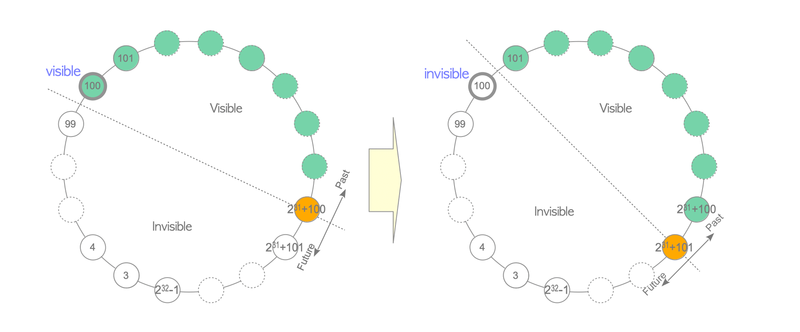

# 5. 필수 유지 보수 Processes

# **Required Maintenance Processes**

- PostgreSQL의 CC 메커니즘에는 유지 보수 Process가 필요
    1. Dead Tuple과 해당 Dead Tuple을 가리키는 Index Tuple 제거
    2. clog의 불필요한 부분 제거
    3. Freeze Old Txid
    4. FSM, VM, 통계 업데이트

# Freeze Processing

Wraparound 문제

- `Tuple_1`이 txid 100에 `INSERT`(`Tuple_1`의 t_xmin = 100)
- 현재 txid가 총 가능 Tx량의 절반을 넘기면(약 21억 + 100) `Tuple_1`이 Invisible이 되므로 발생
    - 이러한 문제를 Wraparound라 함
- Wraparound를 해결하기 위해 Frozen txid라는 개념을 도입해 Freeze Process를 구현
    - txid = 2인 경우 Frozen txid로 설정하고 이 txid는 다른 txid보다 항상 값이 낮음
    - Frozen txid의 경우 항상 비활성이나 Visible함
- Freeze Process는 VACUUM Process에 의해 호출
    - Freeze Process는 모든 Table File을 Scan해 t_xmin 값이 현재 txid에서 vacuum_freeze_min_age를 뺀 값보다 오래된 경우 Tuple의 t_xmin을 Frozen txid로 변경

Freeze Process