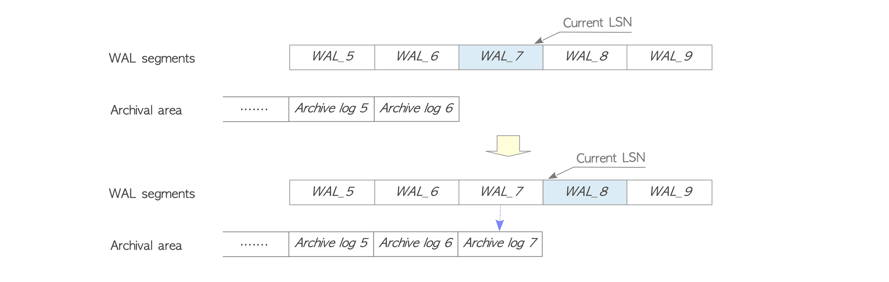

# 9. Continuos Archiving & Archive Logs

# Continuos Archiving & Archive Logs

- WAL Segment가 Switch될 때 WAL Segment File을 Archive 영역에 Replication하는 기능
- Background Process인 Archiver에 의해 수행됨
- Replicate된 File을 Archive Log라고 부름
- Archive 영역의 경로는 매개변수 `archive_command`로 설정됨
  
    ```bash
    archive_command = 'cp %p /home/postgres/archives/%f'
    ```
    
    - `%p`: Replicate된 WAL Segment File
    - `%f`: Archive Log



Continuos Archiving

- `archive_command`는 모든 Unix 명령 및 도구를 설정할 수 있어 일반적인 `cp`대신 다른 File Backup Tool을 설정해 Archive Log를 다른 Host로 전송할 수 있음

<aside>
ℹ️ Archive_Library

Ver 14 이전 버전에서는 Continuos Archiving은 Shell Command만 가능

Ver 15에서부터 PostgreSQL은 Log를 얻기 위해 로드 가능한 Library 기능 지원

</aside>

<aside>
⚠️ PostgreSQL은 생성된 Archive Log를 정리하지 않음

따라서 직접 관리해야 함

`pg_archivecleanup` 유틸리티 등으로 관리하거나 Unix `find`명령어로 Archive Log를 삭제 할 수 있음

```bash
find / home / postgres / archives - mtime + 3d - exec rm - f {} \;
```

</aside>