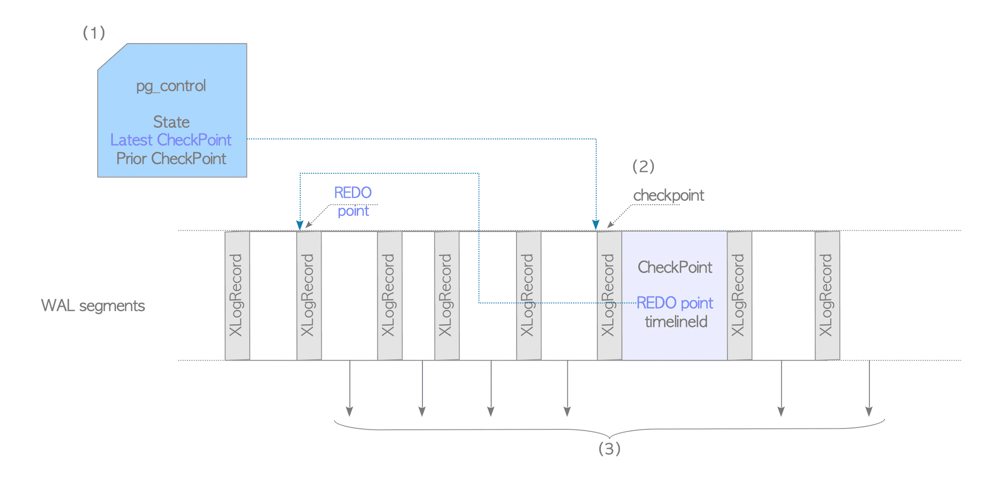

# 9. PostgreSQL DB Recovery

# PostgreSQL에서 DB Recovery

- PostgreSQL은 Redo Log 기반 Recovery 기능을 구현
- DB Server가 충돌할 시 PostgreSQL은 REDO Point에서 WAL Segment File의 XLOG Record를 순차적으로 재생해 DB Cluster를 복원함

## PostgreSQL이 Recovery Process를 시작하는 방법

Recovery Process의 세부 정보

1. PostgreSQL은 시작할 때 pg_control file의 모든 항목을 읽음
State가 `in production`인 경우 PostgreSQL은 DB가 정상적으로 중지되지 않았음을 의미해 Recover Mode로 전환(`shut down`일 경우 일반 시작 모드로 들어감)
2. PostgreSQL은 해당 WAL Segment File에서 pg_control file에 위치가 기록된 최신 Checkpoint Record를 읽고 Row에서 REDO Point를 가져옴
최신 Checkpoint Record가 유효하지 않은 경우 PostgreSQL은 이전 Checkpoint Record를 읽음
두 Row를 읽을 수 없으면 자체 Recovery를 포기
3. Resource Manager는 적절한 REDO Point부터 최신 WAL Segment의 마지막 지점에 도달할 때 까지 XLOG Record를 순서대로 읽고 재생함
XLOG Record를 재생할 때 Backup Block인 경우 LSN에 관계없이 해당 Table의 Page에 덮어 씀
Non-Backup Block인 경우 XLOG Record는 이 Row의 LSN이 해당 Page의 `pd_lsn`보다 큰 경우에만 재생

## LSN 비교

- Non-Backup Block의 LSN과 해당 Page의 `pd_lsn`을 비교해야 하는 이유
- 설명 단순화를 위해 WAL Buffer 생략

Background Writer 작동 중 `INSERT` 작업

1. PostgreSQL은 TABLE_A에 Row를 삽입하고 LSN_1에 XLOG Record를 작성
2. Background Writer Process는 TABLE_A의 Page를 Storage에 작성
이때 이 Page의 pd_lsn은 LSN_1
3. PostgreSQL은 TABLE_A에 새로운 Row를 `INSERT`하고 LSN_2에 XLOG Record를 작성
수정된 Page는 아직 Storage에 저장되지 않음
- 여기서 `shutdown immediate`로 종료한 후 `start`

DB Recorvery

1. PostgreSQL은 첫 번째 XLOG Record와 TABLE_A의 Page를 로드하나 LSN이 TABLE_A의 LSN보다 크지 않아 재생하지 않음(두 값 모두 LSN_1)
2. 다음 Row의 LSN(LSN_2)이 현재 TABLE_A의 LSN(LSN_1)보다 크기에 PostgreSQL은 두 번째 XLOG Record를 재생
- 위 예제에서 알 수 있든 Non-Backup Block의 재생 순서가 올바르지 않거나 Non-Backup Block이 두 번 이상 재생되면 DB Cluster는 더 이상 일관성을 유지하지 못함
- Non-Backup Block의 REDO(replay) 동작은 **여러 번 적용해도 결과가 달라지지 않는 성질이 아님**
- 올바른 재생 순서를 유지하기 위해 LSN이 해당 Page의 `pd_lsn`보다 큰 경우에만 Non-Backup Block Record를 재생해야 함
- 반면 Backup Block의 REDO 작업은 멱등성이므로(여러번 적용해도 결과가 달라지지 않음) Backup Block은 LSN에 관계 없이 여러 번 재생 가능