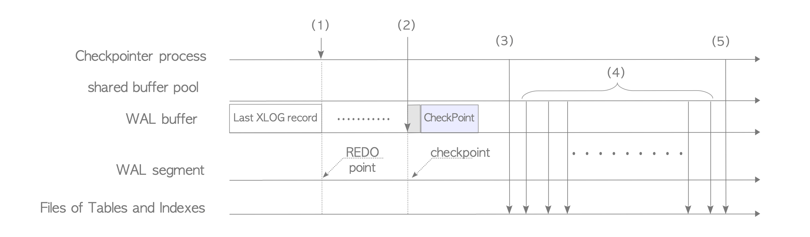

# 9. PostgreSQL의 Checkpoint 처리

# PostgreSQL의 Checkpoint 처리

- Background Process인 Checkpointer는 아래의 예시중 하나가 발생할 때 동작함
    1. 이전 Checkpoint에서 `checkpoint_timeout`에 설정된 시간 초과(Default: 300s)
    2. Ver 9.4 이하에서 이전 Checkpoint에서 `checkpoint_segments`에 설정된 WAL Segment File 수가 소모됨(Default: 3)
    3. Ver 9.5 dltkddptj `pg_xlog`(Ver 10이상에서 `pg_wal`)에 있는 WAL Segment File의 전체 크기가 `max_wal_size`(Default: 1GB(64개 File)) 값을 초과
    4. PostgreSQL Server는 Smart mode, Fast mode에서 종료될 때
- Superuser가 수동으로 `CHECKPOINT` Command를 실행할 때도 해당 Process 수행

## Checkpoint 처리 개요

- DB Recovery 준비와 Shared Buffer Pool의 Dirty Page 정리를 위해 동작



PostgreSQL Checkpoint의 내부 처리

1. Checkpoint Process가 시작된 후 REDO Point는 Memory에 저장됨
REDO Point는 마지막 Checkpoint가 시작된 시점에 XLOG Reocrd를 쓰는 위치이며 DB Recovery시작점
2. 이 Checkpoint의 XLOG Record(Checkpoint Record)는 WAL Buffer에 기록됨
   Row의 Data부분은 1단계에서 저장된 REDO Point와 같은 여러 변수를 포함하는 Checkpoint 구조에 의해 정의됨, Checkpoint Record를 작성하는 위치 = Checkpoint
   
    ```c
    typedef struct CheckPoint
    {
      XLogRecPtr      redo;           // Checkpoint를 만들기 시작했을 때 사용가능한 다음 RecPtr(REDO Start Point)
      TimeLineID      ThisTimeLineID; // 현재 TimeLine ID(TLI)
      TimeLineID      PrevTimeLineID; // 이전 TLI, 새 Timeline을 시작하는 경우 새 Timeline(현재 TLI)
      bool            fullPageWrites; // 현재 Full-Page 쓰기
      uint32          nextXidEpoch;   // 다음 Xid를 위한 higher-order bits
      TransactionId   nextXid;        // next free XID
      Oid             nextOid;        // next free OID
      MultiXactId     nextMulti;      // next free MultiXactId
      MultiXactOffset nextMultiOffset;// next free MultiXact offset
      TransactionId   oldestXid;      // Cluster의 최소 datfrozenxid
      Oid             oldestXidDB;    // DB의 최소 datfrozenxid
      MultiXactId     oldestMulti;    // Cluster의 최소 datminmxid
      Oid             oldestMultiDB;  // DB의 최소 minimum datminmxid
      pg_time_t       time;           // time stamp of checkpoint
    
     /*
      * 가장 오래된 XID 실행중
      * Online Checkpoint에서 Hot Standby Mode일 때만 필요
      * wal_level이 hot_interest일 때만 Online Checkpoint에 대해 계산함
      * wal_level이 hot_interest가 아닐 때 InvalidTransactionId로 설정됨
      */
      TransactionId oldestActiveXid;
    } CheckPoint;
    ```
   
3. Shared Memory의 모든 Data(ex: clog 의 내용)는 저장소로 `FLUSH`
4. Shared Buffer Pool의 모든 Dirty Page가 기록되고 Storage에 점차적으로 `FLUSH`
5. pg_control file `UPDATE` 이 File에는 Checkpoint 위치와 같은 기본 정보가 포함됨
- DB Recovery 관점에서 요약할 때 Checkpoint는 REDO Point를 포함하는 Checkpoint Record를 생성하고 Checkpoint 위치 등을 pg_control file에 저장
- PostgreSQL은 pg_control file에서 제공하는 REDO Point(Checkpoint Record에서 가져옴)에서 WAL Data를 재생해 자체 복구할 수 있음

## pg_control file

- pg_control file은 Checkpoint의 기본 정보를 담고 있어 DB Recovery에 필수적
- 깨지거나 읽을 수 없으면 시작점을 얻지 못해 Recovery Process를 시작할 수 없음
- pg_control file은 40개 이상의 항목을 저장
    - State: 최근 Checkpoint가 시작된 시점의 DB Server의 상태
        - `start up`: System이 시작되는 상태
        - `shut down`: System이 종료 Command에 의해 정상적으로 Down된 상태
        - `in production`: System이 실행중인 상태
    - Latest Checkpoint Location: 최신 LSN Checkpoint Record의 위치
    - Prior Checkpoint Location: 이전 LSN Checkpoint Record의 위치(Ver 11부터 사용하지 않음)
    
    <aside>
    ☝🏻 PostgreSQL 11에서 이전 Checkpoint 제거
    
    PostgreSQL 11 이상은 최신 Checkpoint 이상을 포함하는 WAL Segment만 저장
    
    이전 Checkpoint를 포함하는 이전 Segment File은 `pg_xlog`(`pg_wal`) 하위 디렉터리에 WAL Segment File을 저장하기 위한 디스크 공간을 줄이기 위해 저장하지 않음
    
    </aside>
    
- pg_control file은 기본 디렉터리 아래 전역 하위 디렉터리에 저장됨
- `pg_controldata` 유틸리티를 이용해 표시 가능

```bash
postgres> pg_controldata  /usr/local/pgsql/data
pg_control version number:            937
Catalog version number:               201405111
Database system identifier:           6035535450242021944
Database cluster state:               in production
pg_control last modified:             Mon Nov 14 15:16:38 2022
Latest checkpoint location:           0/C000F48
Prior checkpoint location:            0/C000E70

... 생략 ...
```