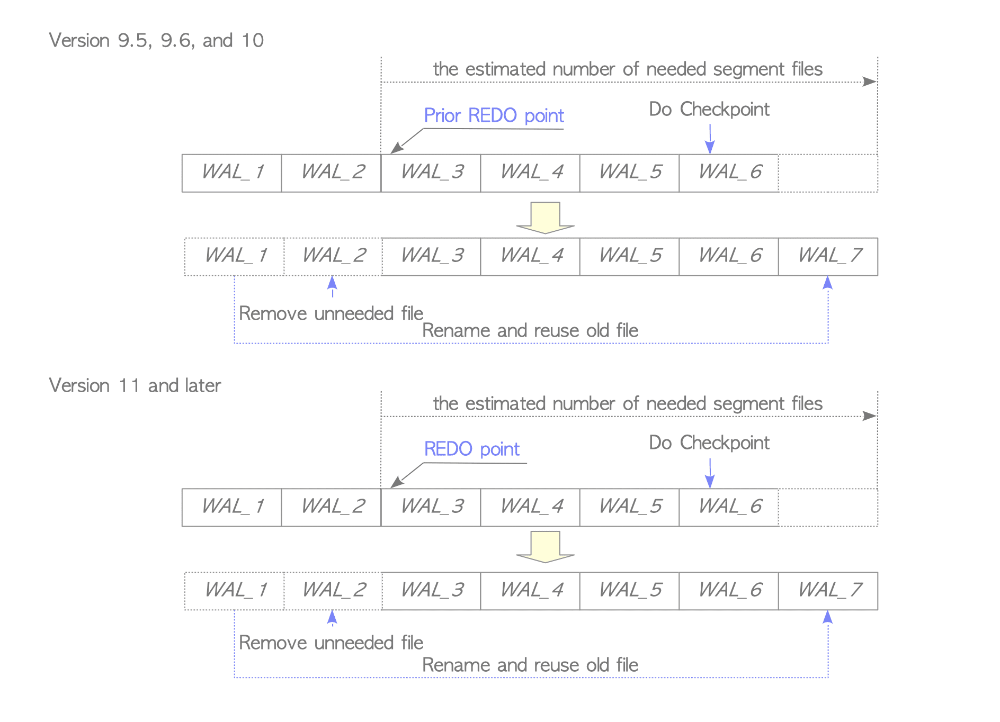

# 9. WAL Segment File 관리

# WAL Segment File 관리

- PosgreSQL은 `pg_xlog` 서브 디렉터리(Ver 10 이상에서는 `pg_wal` 서브 디렉터리)에 저장된 WAL Segment File 중 하나에 XLOG Record를 기록하고 이전 WAL Segment File이 채워지면 새 WAL Segment File로 전환함
- WAL File의 수는 여러 구성 매개변수와 서버 활동에 따라 달라짐

## WAL Segment Switch

- WAL Segment Switch는 아래의 예중 하나가 발생할 때 작동
    1. WAL Segment가 채워졌을 때
    2. `pg_switch_xlog` 기능이 발행되었을 때
    3. `archive_mode`가 활성화되고 `archive_timeout`으로 설정한 시간이 초과되었을 때
- Switch 된 File은 일반적으로 재사용되지만 필요하지 않은 경우 나중에 삭제 가능

## Ver 9.5 이상에서 WAL Segment 관리

- Checkpoint가 시작될 때마다 PostgreSQL은 다음 Checkpoint 주기에 필요한 WAL Segment File의 수를 추정하고 준비함
- 이전 Checkpoint 주기에서 사용된 File 수와 관련해 이뤄짐
- 이전 REDO Point를 포함하는 Segment에서 계산되며 값은 `min_wal_size`(Default: 80M(5개 File))와 `max_wal_size`(Default: 1GB(64개 File)) 사이여야 함
- Checkpoint가 시작될 때 필요한 File은 보류되거나 재사용하고 필요 없는 File은 제거됨

Checkpoint에서 WAL Segment File을 재사용하고 제거

- WAL 동작의 급증으로 인해 더 많은 File이 필요할 때 WAL File의 총 크기가 `max_wal_size`미만인 동안 새 File이 생성됨

WAL Segment File 생성

- WAL File의 수는 Server 활동에 따라 적응형으로 변경됨
- WAL Data 쓰기량이 지속적으로 증가하면 WAL Segment File의 예상 개수와 WAL File 전체 크기도 점차 증가, 반대의 경우 감소
- WAL File의 전체 크기가 `max_wal_size`를 초과하면 Checkpoint가 시작됨
- Checkpont를 통해 새로운 REDO Point가 생성되고 마지막 REDO Point가 이전 Point가 됨
그 다음 필요 없는 오래된 File이 재사용됨
(PostgreSQL은 DB Recovery에 필요한 WAL Segment File만 보유함)

WAL Segment File을 검사 후 재사용

- 매개 변수 `wal_keep_segments` 및 Replication Slot 기능도 WAL Segment File 수에 영향을 줌

## Ver 9.4 이하의 WAL Segment 관리

- WAL Segment File의 수는 주로 `checkpoint_segment`, `checkpoint_completion_target`, `wal_keep_segments`의 세 매개변수에 의해 제어됨
- 일반적으로

$((2+CPCT)×CPS+1)((2+CPCT)×CPS+1) or (CPS+WKS+1)$개의 File
- WAL Segment File의 수는 Server 활동에 따라 일시적으로 최대 $(3×CPS+1)$까지 증가
- Replication Slot도 영향을 줌