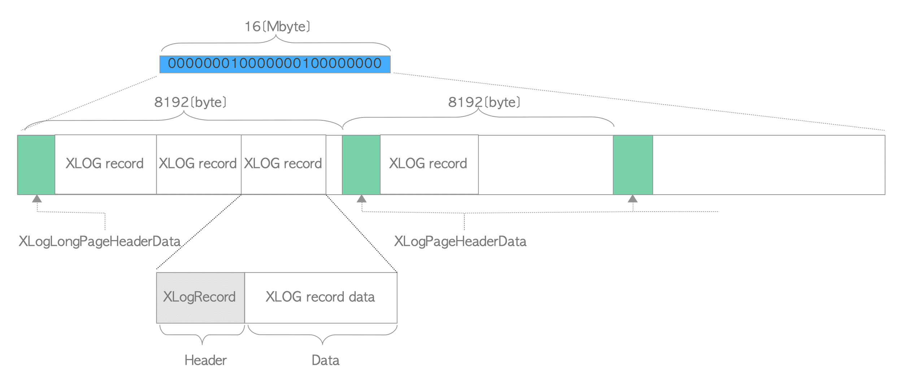

# 9. WAL Segment의 내부 레이아웃

# WAL Segment의 내부 레이아웃

- WAL Segment는 기본적으로 16MB File이며 내부적으로 8KB의 Page로 나뉨
- 첫 Page에는 XLogLongPageHeaderData 구조에 의해 정의된 Header Data가 있음
- 다른 모든 Page에는 XLogPageHeaderData 구조에 의해 정의된 Page 정보가 있음
- Page Header 다음에 XLOG Record가 처음부터 내림차순으로 각 페이지에 기록됨

WAL Segment File의 내부 레이아웃

- XLongLongPageHeaderData 구조와 XLogPageHeaderData 구조는 [src/include/access/xlog_internal.h](https://github.com/postgres/postgres/blob/master/src/include/access/xlog_internal.h)에 정의되어 있음