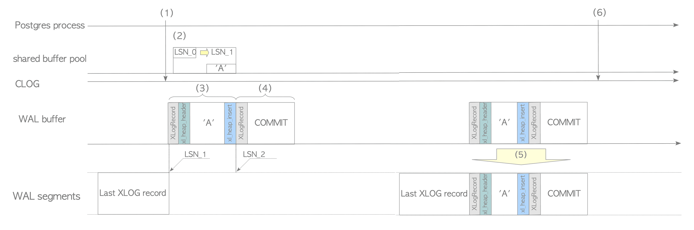

# 9. XLOG Record 쓰기

# XLOG Record 쓰기

```sql
INSERT INTO tbl values ('A');
```

```c
exec_simple_query() @postgres.c

(1) ExtendCLOG() @clog.c // 이 Tx의 상태를 CLOG에 "IN_PROGRESS"로 작성

(2) heap_insert() @heapam.c // Row를 INSERT하고 XLOG Record를 생성하고, XLogInsert 함수 호출

(3)   XLogInsert() @xlog.c (Ver 9.5 이상: xloginsert.c) // INSERT된 Row 의 XLOG Record를 WAL Buffer에 작성하고 Page의 pd_lsn을 UPDATE

(4) finish_xact_command() @postgres.c // COMMIT 작업 호출
			XLogInsert() @xlog.c (Ver 9.5 이상: xloginsert.c) // COMMIT 동작의 XLOG Record를 WAL Buffer에 작성

(5)   XLogWrite() @xlog.c // WAL Buffer에 있는 모든 XLOG Record를 WAL Segment에 쓰고 Flush함

(6) TransactionIdCommitTree() @transam.c // 이 Tx의 상태를 CLOG에서 "IN_PROGRESS"에서 "COMMITTED"로 변경
```



XLOG Record의 쓰기 순서

1. `ExtendCLOG()`는 이 Tx `IN_PROGRESS`(in-memory)의 상태를 CLOG에 기록
2. `heap_insert()`는 Shared Buffer Pool의 대상 Page에 heap tuple을 `INSERT`하고 이 Page의 XLOG Record를 생성하고 함수 `XLogInsert()`를 호출
3. `XLogInsert()`는 `heap_insert()`에 의해 생성된 XLOG Record를 LSN_1의 WAL Buffer에 쓴 다음 수정된 Page의 pd_lsn을 LSN_0에서 LSN_1로 `UPDATE`함
4. 이 Tx을 `COMMIT`하기 위해 호출한 `finish_xact_command()`는 이 `COMMIT` 동작의  XLOG Record를 생성하고 `XLogInsert()`는 이 Row를 LSN_2의 WAL Buffer에 씀
5. `XLogWrite()`는 WAL Buffer의 모든 XLOG Record를 WAL Segment File에 쓰고 `Flush`함
만약 매개변수가 `open_sync` 또는 `open_datasync`로 설정되면 `O_SYNC` 또는 `O_DSYNC` Flag를 지정한 `open()` System Call로 모든 Row를 쓰기 때문에 Record가 동기적으로 작성됨
매개변수가 `fsync`, `fsync_writethrough` 또는 `fdatasync`로 설정된 경우 각각 `fsync()`, `F_FULFSYNC` 옵션이 있는 `fcntl()` 또는 `fdatasync()` System Call로 실행됨
어떠한 경우에서도 모든 XLOG Record는 저장소에 기록되도록 보장됨
6. `TransactionIdCommitTree()`는 이 Tx의 상태를 CLOG에서 `IN_PROGRESS`에서 `COMMITTED`로 변경
- 위 예에서 `COMMIT` 동작으로 인해 WAL Segment에 XLOG Record가 기록
- 아래 예시 중 하나가 발생할 때 XLOG Record가 WAL Segment에 기록될 수 있음
    1. 실행중인 Tx 중 하나가 `COMMIT`되었거나 중단됨
    2. 많은 Row가 작성되어 WAL Buffer가 채워졌을 때(WAL Buffer 크기는 `wal_buffers` 매개변수로 설정 가능)
    3. 주기적인 WAL Writer Process 작성
    - 위 경우 중 하나가 발생할 시 Tx가 `COMMIT`된 여부와 관계없이 WAL Buffer의 모든 WAL Record가 WAL Segment File에 작성됨
- DML 작업이 XLOG Record를 작성하는 것은 당연하나 Non-DML도 XLOG Record를 작성함
    - `COMMIT` 동작은 `COMMIT` 된 Tx의 ID를 포함하는 XLOG Record를 작성함
    - Checkpoint의 일반 정보를 포함하는 XLOG Record를 작성하는 `CHECKPOINT` 동작
    - `SELECT`문 중 특별한 경우 XLOG Record를 생성
        - SELECT문 처리 중 Heap Only Tuple에 의해 불필요한 Row 삭제나 Page에서 필요한 Row 조각 모음이 발생할 시 수정된 Page의 XLOG Record가 WAL Buffer에 작성