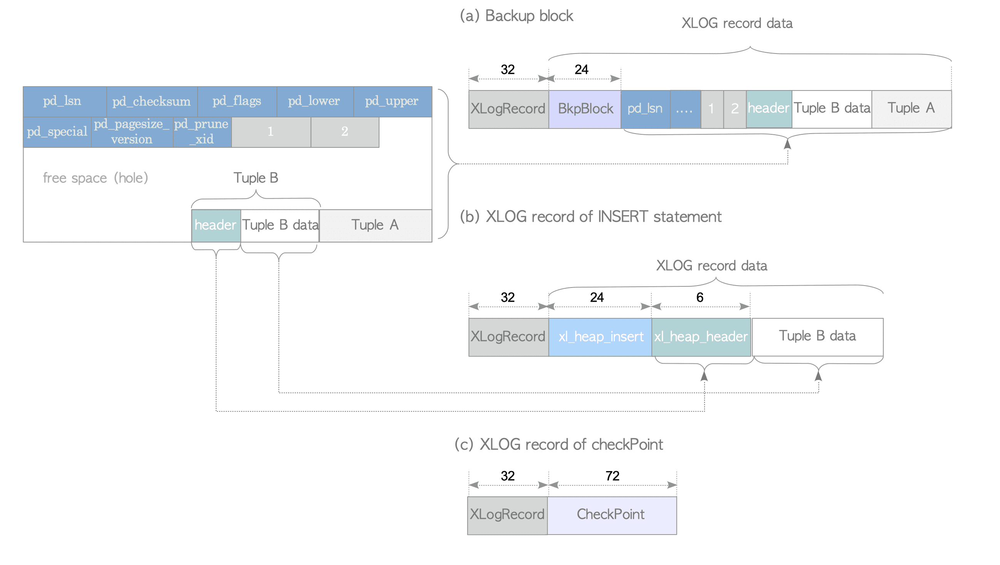

# 9. XLOG Record의 내부 레이아웃

# XLOG Record의 내부 레이아웃

- XLOG Record는 일반 Header 부분과 각 관련 Data 부분으로 구성

## XLOG Record의 Header 부분

- 모든 XLOG Recorddpsms XLogRecord 구조로 정의된 일반 Header부분이 있음

```c
typedef struct XLogRecord {
	uint32        xl_tot_len; // total length of entire record
	TransactionId xl_xid;     // xact id
	uint32        xl_len;     // total len for rmgr data
	uint8         xl_info;    // flag bits, see below
	RmgrId        xl_rmid;    // resource manager for this record
	// 2 Bytes of Padding Here, Initiallize to zero
	XLogRecPtr    xl_prev;    // ptr to previous record in log
	pg_crc32      xl_crc;     // CRC for this record
} XLogRecord;
```

- `xl_rmid`와 `xl_info`는 모두 XLOG Record의 쓰기 및 재생과 같은 WAL 기능과 관련된 작업 모음인 Resource Manager와 관련된 변수
- Resource Manager의 수는 PostgreSQL 버전마다 증가하는 경향이 있음

| Operation | Resource Manager |
| --- | --- |
| Heap Tuple Operations | RM_HEAP, RM_HEAP2 |
| Index Operations | RM_BTREE, RM_HASH, RM_GIN, RM_GIST, RM_SPGIST, RM_BRIN |
| Sequence Operations | RM_SEQ |
| Transaction Operations | RM_XACT, RM_MULTIXACT, RM_CLOG, RM_XLOG, RM_COMMIT_TS |
| Tablespace Operations | RM_SMGR, RM_DBASE, RMTBLSPC, RM_RELMAP |
| Replication & Hot Standby Operations | RM_STANDBY, RM_REPLORIGIN, RM_GENERIC_ID, RM_LOGICALMSG_ID |
- 예시
    - `INSERT`문이 실행되면 해당 XLOG Record의 Header 변수 `xl_rmid`와 `xl_info`는 각각 `RM_HEAP`과 `XLOG_HEAP_INSERT`로 설정됨
    DB Cluster를 Recovery할 때 `xl_info`에 따라 선택된 `RM_HEAP`의 함수 `heap_xlog_insert()`가 이 XLOG Record를 재생
    - `UPDATE`문은 XLOG Record의 Header 변수 `xl_info`는 `XLOG_HEAP_UPDATE`로 설정되어 `RM_HEAP`의 `heap_xlog_update()`함수는 DB가 Recovery 될 때 해당 XLOG Record 재생
    - Tx가 `COMMIT`되면 해당 XLOG Record의 Header 변수 `xl_rmid` 및 `xl_info`가 각각 `RM_XACT` 및 `XLOG_XACT_COMMIT`으로 설정
    DB Cluster Recovery시 `xact_redo_commit()` 함수는 이 Row를 재생
- Ver 9.5 이상에서 XLOG Record 형식을 개선하기 위해 XLogRecord 구조에서 `xl_len`이 제거됨

```c
typedef struct XLogRecord {
	uint32        xl_tot_len; // total length of entire record
	TransactionId xl_xid;     // xact id
	XLogRecPtr.   xl_prev;    // ptr to previous record in log
	uint8         xl_info;    // flag bits, see below
	RmgrId        xl_rmid;    // resource manager for this record
	// 2 Bytes of Padding Here, Initiallize to zero
	pg_crc32      xl_crc;     // CRC for this record
	// XLogRecordBlockHeaders & XLogRecordDataHeader Follow, No Padding 
} XLogRecord;
```

- Link
    - [Ver 9.4 이전 XLogRecord 구조](https://github.com/postgres/postgres/blob/REL9_4_STABLE/src/include/access/xlog.h)
    - [Ver 9.5 이상 XLogRecord 구조](https://github.com/postgres/postgres/blob/master/src/include/access/xlogrecord.h)
    - [heap_xlog_insert & heap_xlog_update](https://github.com/postgres/postgres/blob/master/src/backend/access/heap/heapam.c)
    - [xact_redo_commit 함수](https://github.com/postgres/postgres/blob/master/src/backend/access/transam/xact.c)

## Ver 9.4 이하 XLOG Record의 Data 부분

- XLOG Record의 Data 부분은 Backup Block(Full-Page)와 Non-Backup Block(작업 별 다른 Data)로 구분



Ver 9.4 이하 XLOG Record의 예

### Backup Block

- 그림의 (a)가 Backup Block, 두 개의 Data 구조와 하나의 Data 개체로 구성
    1. XLogRecord(Header 부분) 구조
    2. BkpBlock 구조
    3. 여유공간을 제외한 전체 Page
- BkpBlock에는 DB Cluster에서 이 Page를 식별하는 변수(relfilenode 및 fork number, 이 Page의 Block Number), 시작 위치 및 이 Page의 여유 공간 길이가 포함

### Non-Backup Block

- Non-Backup Block에서 Data 부분의 레이아웃은 작업마다 다름
- 그림의 (b)는 `INSERT`문의 XLOG Record를 예로 설명
    1. XLogRecord(Header 부분) 구조
    2. xl_heap_insert 구조
    3. `INSERT`된 Row(몇 Byte가 제거된 Row)
        - `INSERT`된 Row에서 몇 Byte가 제거된 이유는 `INSERT`나 `UPDATE`된 Row의 HeapTupleHeaderData를 WAL에 저장하지 않기 때문
- xl_heap_insert 구조는 DB Cluster에 `INSERT`된 Row를 식별하기 위한 변수(이 Row를 포함한 Table의 relfilenode 및 이 Row의 tid(Tuple ID))와 이 Row의 Visibility Flag를 포함

### Checkpoint

- 그림의 (c)는 Checkpoint Record의 XLOG Record 두 가지 Data 구조로 구성
1. XLogRecord(Header 부분) 구조
2. Checkpoint 정보를 포함하는 Checkpoint 구조
- Link
  
    [xl_heap_header 구조](https://github.com/postgres/postgres/blob/master/src/include/access/htup.h)
    
    [Checkpoint 구조](https://github.com/postgres/postgres/blob/master/src/include/catalog/pg_control.h)
    

## Ver 9.5 이상 XLOG Record의 Data 부분

- Ver 9.4 이하는 XLOG Record의 공통 형식이 없어 각 Resource Manager가 고유한 형식을 지정해야 했으나 Ver 9.5에서는 Resource Manager에 의존하지 않는 공통 구조화된 형식이 도입
- XLOG Record의 Data 부분은 Header와 Data로 나뉨


XLOG Record의 일반적인 형식

- Header 부분에 0개 이상의 XLogRecordBlockHeaders와 0~1개의 XLogRecordDataHeaderShort(또는 XLogRecordDataHeaderLong)이 포함됨
    - XLogRecordDataHeaderShort 또는 XLogRecordDataHeaderLong중 하나를 포함되어야 함
    - Row가 전체 Page Image(Backup Block)를 저장할 때 XLogRecordBlockHeader는 XLogRecordBlockImageHeader를 포함하고 Block이 압축된 경우 XLogRecordBlockCompressHeader도 포함함
- Data 부분은 각각 XLogRecordBlockHeader(s) 및 XLogRecordDataHeader에 해당하는 0개 이상의 Block Data와 0~1rodml Main Data로 구성됨

<aside>
☝🏻 Ver 9.5 이상에서는 매개변수 `wal_compression = enable`를 설정해 LZ 압축 방법을 사용해 XLOG Record 내의 Full-Page Image를 압축할 수 있음

위 경우 XLogRecordBlockCompressHeader 구조가 추가됨

**장점**

- I/O 비용 감소
- WAL Segment File 소비 억제

**단점**

- 압축에 많은 CPU Resource 소비
</aside>


Ver 9.5 이상 XLOG Record의 예

### Backup Block

- 그림 (a)는 `INSERT`문에 의해 생성된 Backup Block
- 4개의 Data 구조와 1개의 Data 객체로 구성
    1. XLogRecord(Header 부분) 구조
    2. 1개의 LogRecordBlockImageHeader를 포함하는 XLogRecordBlockHeader 구조
    3. XLogRecordDataHeaderShort 구조
    4. Backup Block(Block Data)
    5. xl_heap_insert 구조(Main Data)
- XLogRecordDataHeaderShort는 Row의 Main Data인 xl_heap_insert 구조의 길이를 저장

<aside>
☝🏻 Full-Page Image를 포함하는 XLOG Record의 Main Data는 특별한 경우에만 사용
(Logical Decoding 및 Speculative Insertions)

중복 Data인 이 Row가 재생될 때 무시됨

Backup Block Record의 Main Data는 Command에 따라 달라짐

ex) `UPDATE`문: xl_heap_lock 또는 xl_heap_update 추가

</aside>

### Non-Backup Block

- 그림 (b)는 `INSERT`문에 의해 생성된 Non-Backup Block
- 4개의 Data 구조와 1개의 Data 객체로 구성
    1. XLogRecord(Header 부분) 구조
    2. XLogRecordBlockHeader 구조
    3. XLogRecordDataHeaderShort 구조
    4. `INSERT`된 Row(xl_heap_header 구조 및 삽입된 Data 전체)
    5. xl_headp_insert 구조(Main Data)
- XLogRecordBlockHeader에는 Row가 `INSERT`된 Block과 `INSERT`된 Row의 Data 부분 길이를 지정하는 세 가지 값(relfilenode, Fork Number, Block Number)이 포함됨
- XLogRecordDataHeaderShort에는 이 Row의 Main Data인 xl_heap_insert 구조의 길이가 포함됨
- 새로운 xl_heap_insert에는 Block 내 이 Row의 Offset Number와 Visibility Flag만 포함
- XLogRecordBlockHeader가 이전 Data에 포함된 대부분의 Data를 저장하기에 간단해짐

### Checkpoint

- 그림 (c), 3가지 Data 구조로 구성되어 있음
    1. XLogRecord(Header 부분) 구조
    2. 기본 Data 길이가 포함된 XLogRecordDataHeaderShort 구조
    3. Checkpoint(Main Data) 구조
- Link
  
    [xl_heap_data 구조](https://github.com/postgres/postgres/blob/master/src/include/access/htup.h)
    
    [Checkpoint 구조](https://github.com/postgres/postgres/blob/master/src/include/catalog/pg_control.h)